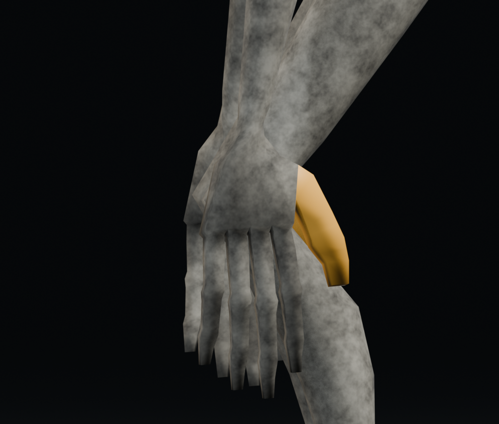
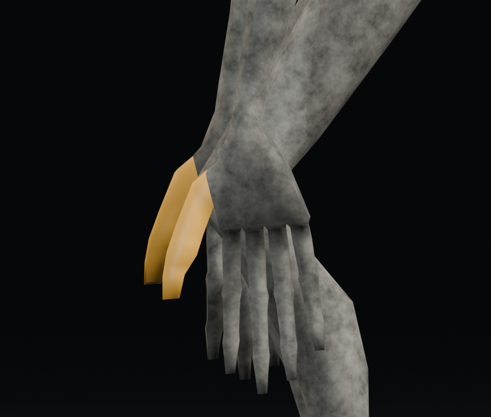
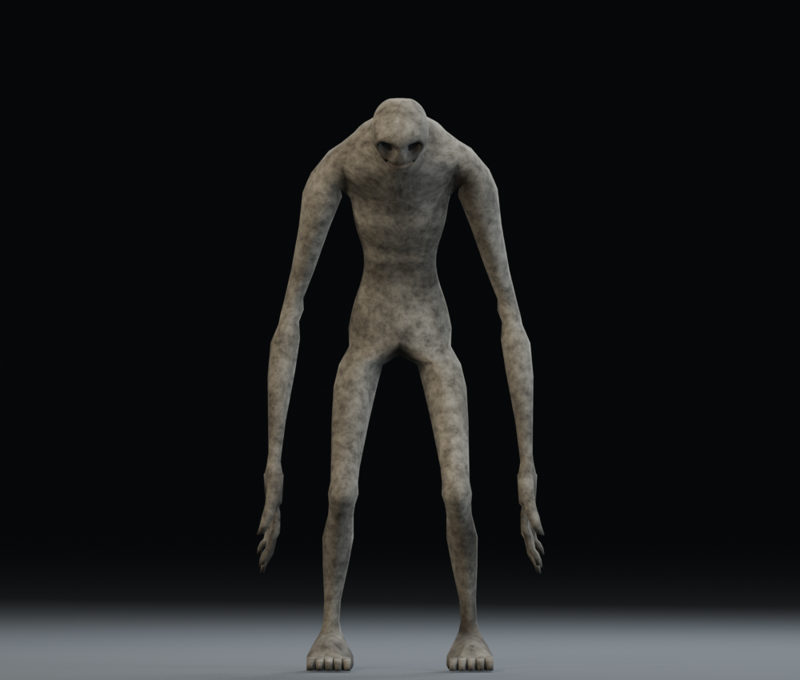

# Raker v019：Blender 來源手掌方向修正

v018 的 idle／walk／chase／sprint 使用錯誤方向的手部扭轉，左右拇指都朝身後、掌心朝外；先前執行期抓握修正未處理來源步態。v019 保留 v018 網格、材質、2.18 m 身高、46 骨與 41 段動畫，將正確掌向烘焙至來源。

- 場景 `MONSTER_REFINED_V019`；`Refined019_Rig`／`Refined019_Mesh`。
- 待機、走路、奔跑、狂奔、低姿態待機／走路：拇指朝前，掌心朝身體內側。
- 落地、受傷、死亡及其低姿態版本：保留原有手指主方向，將拇指校正至朝前投影。
- 三組抓咬共 18 段：拇指朝玩家頸部，掌心朝下，手指前伸後末節向下彎；伸手／放開保留混合過渡。
- 前臂扭轉依 bind pose 的實際拇指方向量測，與手腕分攤，不把舊版已錯轉的手腕當基準。其餘攀爬／結構攻擊片段保留。
- 不更改 rest pose 綁定、網格左右手幾何、骨長、根骨、頭頸、口腔或嘴巴動畫。來源 rest pose 是綁定姿勢；打開檔案預設顯示已修正 idle。

## 重建與檢查

```powershell
blender --background art_source/monster_refined_v018/monster_refined_v018.blend --python art_source/monster_refined_v019/build.py
blender --background art_source/monster_refined_v019/monster_refined_v019.blend --python art_source/monster_refined_v019/finish.py
blender --background art_source/monster_refined_v019/monster_refined_v019.blend --python art_source/monster_refined_v019/audit.py
blender --background art_source/monster_refined_v019/monster_refined_v019.blend --python art_source/monster_refined_v019/render_review.py
blender --background art_source/monster_refined_v019/monster_refined_v019.blend --python art_source/monster_refined_v019/review_workspace.py
```

`finish.py` 匯出所有 41 個 NLA tracks，保持正式節點名；將 `raker_refined_v019.glb` 複製到 `assets/models/raker/raker.glb`。`hand_orientation.json` 保存各修正片段的開頭／中間／結尾方向取樣；`validation.json` 保存全動畫逐幀穿插、根骨、口腔檢查。

`render_review.py` 的側面拇指近照以金色暫時標出拇指皮膚，不保存到 `.blend` 或 GLB。相機固定，左側為怪物前方：

| 舊來源：拇指朝後 | v019：拇指朝前 |
| --- | --- |
|  |  |



正式 Godot 驗證為 `tests/test_raker_source_hands.gd`，特別關閉執行期姿勢修正器，檢查匯入動畫本身的拇指和掌面方向。[本次驗收](../../docs/validation/2026-09-23-raker-v019.md)。
