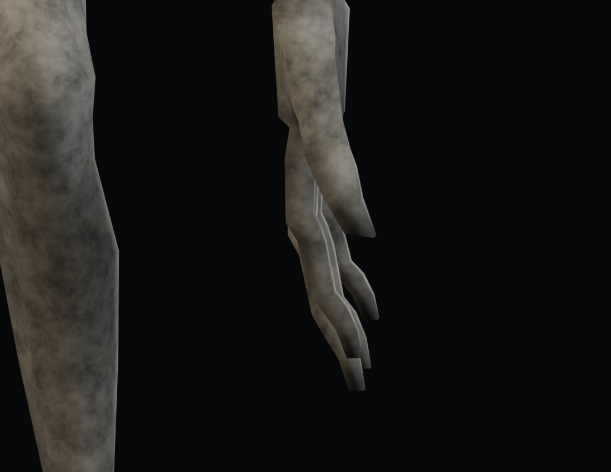
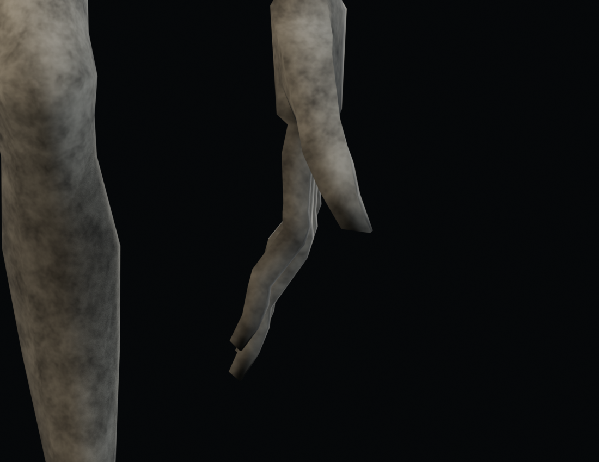

# Raker v020：四指關節向掌心彎曲

保留 v019 已確認的拇指與掌向。修正食指、中指、無名指、小指在 Blender 綁定姿勢、網格及全 41 段動畫中的反折。

- 場景 `MONSTER_REFINED_V020`；`Refined020_Rig`／`Refined020_Mesh`。開啟預設顯示 idle。
- 以 wrist／middle／thumb 的實際位置建立左右手掌面，不用全域 Euler 軸判斷屈指。
- v019 REST 的第二節屈曲角為 −20.22° 至 −23.59°，向手背反折。v020 同步重設兩節指骨的 bind pose 與蒙皮頂點，普通垂手時為掌側 +20.22° 至 +23.59°；指根最少 +3°。
- 全 41 段動畫重新取樣、重定向四指；第二節限制掌側 12–70°，保留原有屈曲幅度及手指展開方向。抓握來源第二節約 47.5–50°。
- `hand`、`thumb_01`、`thumb_02` 的世界變換與 v019 逐幀比較，誤差小於 1e-5。手腕、拇指、頭頸、口腔、材質及中立身高 2.18 m 保留。
- 9,129 頂點／18,182 三角面／4 材質／46 骨／41 動畫，數量不變。

## 重建

```powershell
blender --background art_source/monster_refined_v019/monster_refined_v019.blend --python art_source/monster_refined_v020/build.py
blender --background art_source/monster_refined_v020/monster_refined_v020.blend --python art_source/monster_refined_v020/finish.py
blender --background art_source/monster_refined_v020/monster_refined_v020.blend --python art_source/monster_refined_v020/audit_fingers.py
blender --background art_source/monster_refined_v020/monster_refined_v020.blend --python art_source/monster_refined_v020/audit.py
blender --background art_source/monster_refined_v020/monster_refined_v020.blend --python art_source/monster_refined_v020/render_review.py
blender --background art_source/monster_refined_v020/monster_refined_v020.blend --python art_source/monster_refined_v020/review_workspace.py
```

將 `raker_refined_v020.glb` 複製至 `assets/models/raker/raker.glb`，`validation.json` 複製至同目錄 `animation_audit.json`，重新匯入 Godot。

`finger_validation.json` 記錄 REST 與逐幀四指屈曲角、拇指／手掌保存誤差。`validation.json` 記錄逐幀非相鄰身體面穿插、牙齒、固定 root 與閉嘴藏齒掃描；嘴縫、口腔及牙根接觸區依既有規則排除。

| v019：向手背反折 | v020：向掌心彎曲 |
| --- | --- |
|  |  |

`render_runtime.gd` 以正式 Godot 模型及啟用的姿勢修正器渲染固定抓握姿勢，四張 `runtime-grip-*.png` 是 Forward+ GPU 輸出，並非人工操作回放。可用 `godot --path . --log-file .godot/grip-v020-runtime.log --script art_source/monster_refined_v020/render_runtime.gd` 重現。

[本次驗證與限制](../../docs/validation/2026-09-23-raker-v020.md)。
