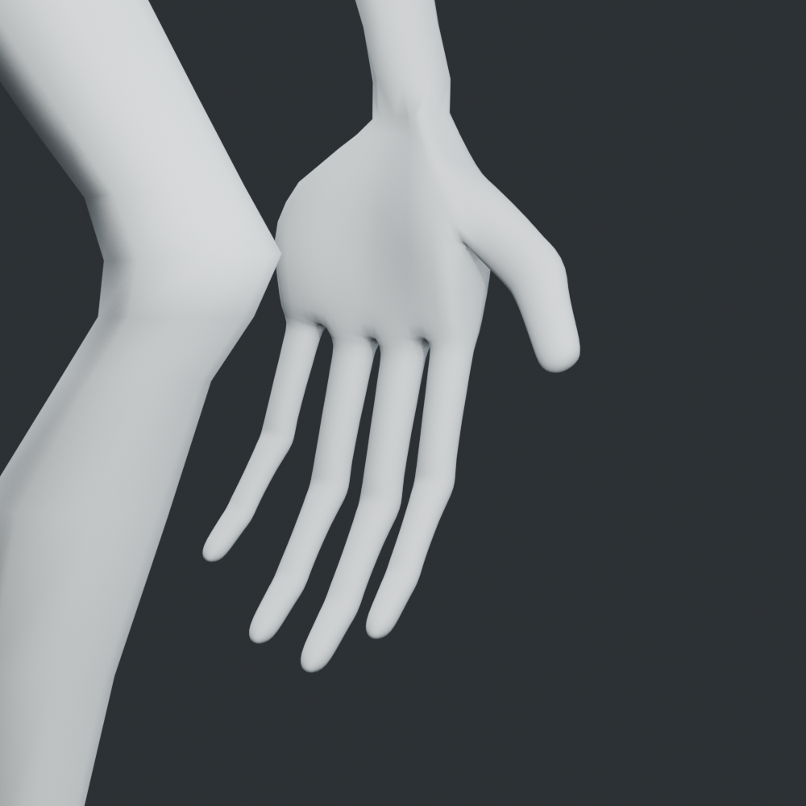
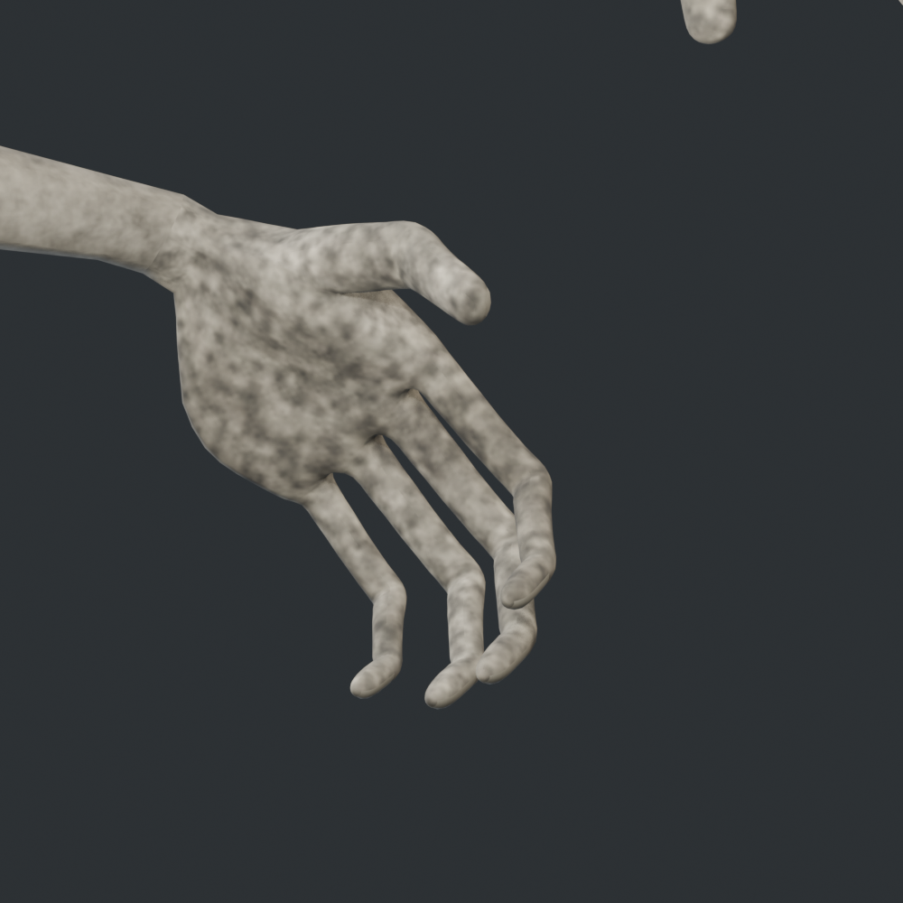

# Raker v021：左右手完整重建

從 v020 檔案建立獨立 `MONSTER_REFINED_V021` 場景。移除手腕以下原有掌部、拇指及四指共 392 個頂點，重新建立雙手；不是對舊手指網格做旋轉或增面。

- 新掌心／手背厚度、拇指球與掌側隆起、拇指根部鞍形過渡、四個獨立指縫、指節支撐環、圓潤指腹及嵌入網格的指甲面。
- 四指各三節骨（近節／中節／末節），拇指兩節。增加 `index/middle/ring/pinky_03_L/R`，共 54 根匯出變形骨；Blender 另保留 10 根既有控制骨。
- 新手權重由骨節及支撐環重建；腕部漸變連接原有前臂。每手 3,211 新頂點，`RebuiltHand_L/R` 非骨骼頂點組標記其範圍，供稽核。
- 重新展開手部 UV，1024² 手部污垢貼圖及磨損指甲材質；手腕接縫有獨立 UV 帶，沒有跨舊 UV 島插值的黑條。
- 全部 41 段動畫重新製作三節手指屈曲與拇指收合，按待機、走跑、攀爬與抓取階段安排張合。自然垂手與三組抓咬均向掌心彎。
- 保留 2.18 m 身高。全身現在為 15,159 頂點、30,242 三角面、6 材質。手外的 8,737 個來源頂點位置完全保留。

## 重建順序

```powershell
blender --background art_source/monster_refined_v020/monster_refined_v020.blend --python art_source/monster_refined_v021/build.py
blender --background art_source/monster_refined_v021/monster_refined_v021.blend --python art_source/monster_refined_v021/audit_hands.py
blender --background art_source/monster_refined_v021/monster_refined_v021.blend --python art_source/monster_refined_v021/audit.py
blender --background art_source/monster_refined_v021/monster_refined_v021.blend --python art_source/monster_refined_v021/finish.py
blender --background art_source/monster_refined_v021/monster_refined_v021.blend --python art_source/monster_refined_v021/render_review.py
blender --background art_source/monster_refined_v021/monster_refined_v021.blend --python art_source/monster_refined_v021/review_workspace.py
```

將 `raker_refined_v021.glb` 複製至 `assets/models/raker/raker.glb`，`validation.json` 複製至同目錄 `animation_audit.json`，再匯入 Godot。Godot 會抽出 `raker_hand_albedo.png` 供正式資產引用。

`audit_hands.py` 驗證實際刪除／替換頂點、身體頂點保存、手部無非流形邊、權重總和、三節骨連續性及 41 段逐幀屈曲。`audit.py` 沿用身體／牙齒自交、root 及閉嘴藏齒檢查；改用材質與連通分量找牙齒，不再假設牙齒位於頂點陣列最後。

`render_review.py` 提供 REST、idle、grab_stand_hold 的掌面／背面／側面／斜面素模與有材質近照。`render_runtime.gd` 使用正式遊戲模型和 SkeletonModifier3D；`render_playground.gd` 自動觸發正式地面抓取並擷取正常第一人稱畫面。兩者為 GPU 渲染及自動流程，非人工操作回放。

| 新掌部與指縫素模 | 新材質及三節握指 |
| --- | --- |
|  |  |

[遊戲近照](runtime-grip-hinges.png) · [模型與權重稽核](hand_validation.json) · [本次驗證](../../docs/validation/2026-09-23-raker-v021.md)
