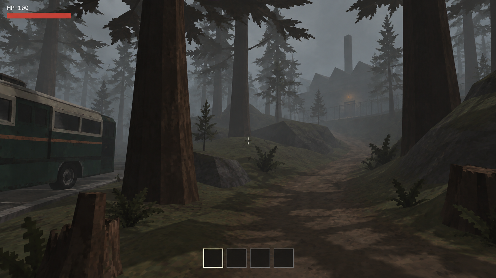

# D：低模與低解析度修正版

**AI 目標示意，非實機截圖。** 日期：2026-09-17。使用內建 imagegen 編修，本次沒有修改遊戲。



## 修正方向

使用者指出：上一批的 C 過度像素化，偏離「類比恐怖感＋低解析度＋低多邊形」的目標。A、B 的表面細節也過於精緻。因此這張沿用 B 的大致構圖與冷霧，重新簡化場景本身，而非套用大像素濾鏡。

- 樹幹、樹樁與岩塊改為明顯的簡單稜面，樹枝以較大片的輪廓表現。
- 大幅減少碎石、落葉及苔蘚的微小細節；地形使用大面積起伏、簡單貼圖及粗略色塊。
- 保留近景暗樹幹、可讀步道、遠景冷霧及小面積入口暖燈。
- 移除刻意的整齊大像素塊、固定抖色與強烈色階後製；以邊緣粗糙與細節流失表達低解析度感。
- 保留原創 RV 配色、步道轉折、工廠方向及簡潔 HUD；模型簡化造成局部輪廓改變，並非逐像素構圖複製。

## 檢查與限制

已目視確認：比 A／B 更簡單的樹幹、坡地和岩塊；比 C 少了刻意像素方塊；近景通行路面與遠方建築仍可辨識。這是風格修正版，尚待使用者確認，不代表與參考遊戲完全一致。

圖中低解析度和低多邊形是生成的視覺示意，不能據此認定實際 framebuffer、polygon count、shader 或遊戲效能。仍不以本圖推導正式物資點距離或修改遊戲配置。

## 來源與提示

工具：內建 imagegen。輸入依序為上一批 B、使用者提供的 image1、image4。B 只提供大致構圖／車輛識別，後兩張提供粗糙 3D 畫面風格。生成原檔已保留，交付副本 SHA-256 相符。

完整實際提示：

```text
Use case: style-transfer. Create one corrected original ApocalypseRV outdoor first-person GAMEPLAY target, landscape 16:9.
INPUT ROLES: Image 1 is our previous B mockup, use ONLY its overall camera/composition, road/RV identity, path and factory placement. Its rendering is TOO DETAILED and overgrown and must change fundamentally. Images 2 and 3 are user-provided Lethal Company screenshots: use their actual crude low-poly real-time game rendering, simple shaded geometry, low-fidelity textured ground and forest lighting as the PRIMARY STYLE references. Do not copy their characters, visor, held tools or UI.
Correction brief: low-resolution 3D + low-polygon models + unsettling analog-horror atmosphere, NOT pixel art and NOT an image covered in large pixel blocks. The previous output had detailed forest illustration surfaces with a pixel filter. Rebuild the depicted objects to look actually primitively modeled instead. Match the reference screenshots' level of geometric and material simplicity closely.
Composition retained: eye level walking camera; cropped boxy dark forest-green / cream-roof bus-like RV with thin muted orange stripe at far left roadside. Thick trunk left of center and thick trunk right; dirt walking path curves right then toward foggy sawtooth-roof maintenance factory/chimney upper right. Same broad layout as image 1. Simple HUD same 'HP 100', muted red narrow health bar top left, tiny crosshair, four small inventory outlines bottom center. No other text.
Actual visual redesign: trunks are angular 5-7 sided tapering cylinders with a few crude vertical bark streaks, no individually sculpted bark. Branches are sparse jagged low-poly limbs with a few broad cutout pine-bough planes, not thousands of tiny realistic needles. Ground is visibly low-poly irregular rolling soil slopes with large planar transitions, muted olive sparse grass patches and broad rough stains, not a carpet of individual leaves. Reduce the tiny repeated stones and leaf litter by 90 percent. Replace busy foreground clutter with a handful of chunky flat-faced rocks, simplified broken stumps and sparse fern silhouettes. Keep enclosing banks and overhanging branches so the view remains restricted. Factory and RV use simple meshes, roughly drawn panel seams, broad stains and crude texture mapping, not physically realistic rich materials. Avoid adorable clean minimalist low-poly art: materials should be crudely textured and grimy, with dark dirty edges.
Lighting: brighter grey overcast sky and cool pale grey-green distance fog, near-black brown trunk shadow sides, broad harsh angular tree shadows crossing the midtone path and olive ground. Low ambient fill so the near tree masses contrast with the fog, but the walking ground stays navigable. Forest depth fades by layers, factory fades into fog but chimney and jagged roof remain identifiable; one dim amber entrance lamp. Plain limited real-time lighting, no realistic global illumination or cinematic grading. Uncomfortable, mundane, bleak industrial forest.
Resolution: simulate an approximately 540p 3D game image mildly enlarged, naturally imperfect edge aliasing and slightly soft small details, ordinary low-resolution rasterized triangles. NO decorative mosaic, NO visible uniform grid of large squares, NO nearest-neighbor giant pixel blocks, NO ordered dithering, NO pixel-art texture clusters, NO posterization filter. Coarse geometry must remain obvious independently of screen resolution. HUD stays clean. Analog-horror feel through murky colors, crude shading, soft loss of fine detail and oppressive composition; no VHS effects are needed.
STRICT AVOID: photorealism, high-poly rock sculpting, moss microdetail, individually detailed leaves, painted concept art, cinematic depth of field, fog beams, bloom, thick visor, film grain, CRT frame, VHS scanlines, chromatic aberration, monsters or people. This should look like an unpolished but visually intentional low-budget 3D horror GAME SCREENSHOT, not an expensive image treated with a retro filter.
```

