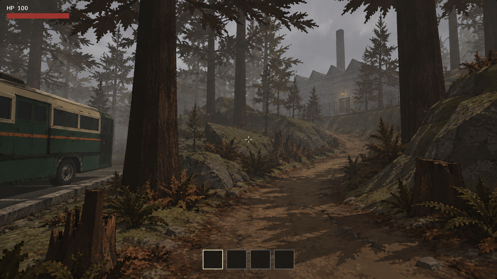
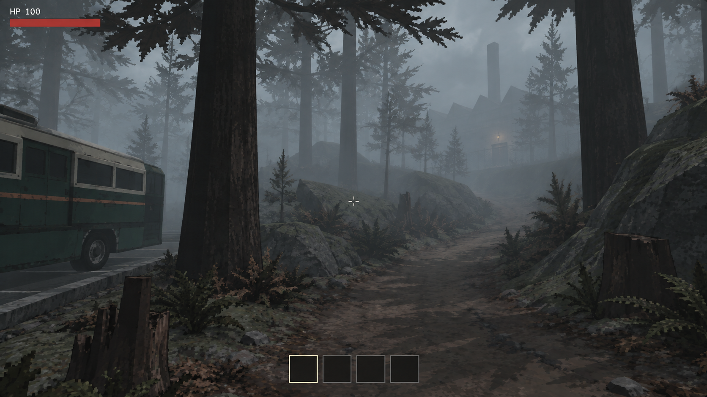
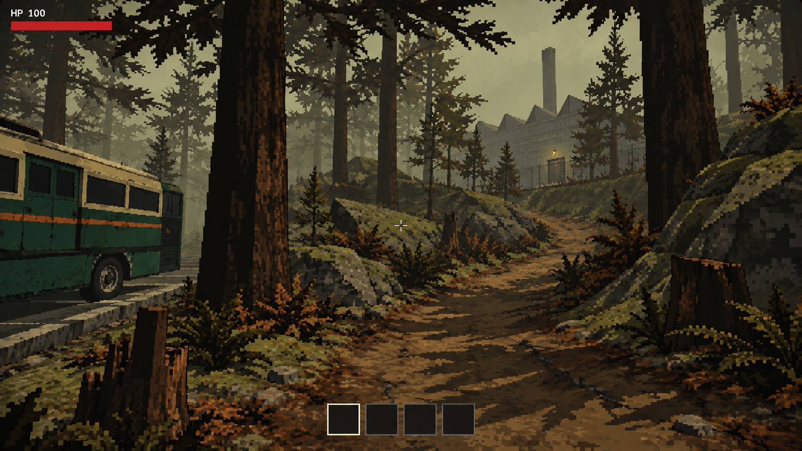

# 戶外 gameplay 美術目標圖

## 最新修正：D

使用者指出 C 過度像素化；目前改以「簡化幾何與材質＋自然低解析度感」製作 [D 修正版](2026-09-17-d-revision.md)。下方 A／B／C 保留為第一輪歷史比較，原先混合 B＋C 的建議已由這次修正取代。所有圖片仍為 AI 示意，尚未套用遊戲。

日期：2026-09-17。**AI 目標示意，非實機截圖。** 使用內建 imagegen 生成；尚未選定實作方向，本次沒有修改遊戲程式、模型、場景或顯示設定。

## 三版比較

三張保留相同主要構圖：左側深綠／奶油白 RV、近景粗樹幹與土坡、中間彎曲通道、右上方維修廠輪廓。生成編修有少量細節差異，並非像素對齊的引擎 A/B 擷取。

| 版本 | 圖片 | 主要比較點 |
|---|---|---|
| A 灰褐工業森林 | [原圖](2026-09-17-a-grey-brown.png) | 暖灰天空、土褐／橄欖綠、大塊近景陰影，作為構圖及光照基準 |
| B 冷霧壓迫森林 | [原圖](2026-09-17-b-cold-fog.png) | 冷灰青霧、逐層消退的樹群、較弱的建築細節與小面積暖燈 |
| C 復古類比恐怖 | [原圖](2026-09-17-c-retro-analog.png) | 黃綠偏色、更明顯像素輪廓、深暗色塊與粗糙色階 |

### A：灰褐工業森林

### B：冷霧壓迫森林

### C：復古類比恐怖

## 檢查與判讀

- 已逐張目視檢查：主要樹幹、RV、彎路、坡地、樹樁及建築的位置保持可比較，沒有大幅換鏡頭；近處通行路面均可辨認。
- B 的中遠景遮蔽最明顯，仍保留屋頂、煙囪與入口暖燈；C 的像素與暗部斷層最強，也最容易讓地表細節搶走注意力。
- HUD 保留 HP、準星與四格物品欄，用於可讀性示意；不是遊戲介面重設決定。
- 低解析度是 AI 模擬的視覺觀感，沒有證實圖片經過真正 540p 渲染或固定抖色 shader。最終三張檔案皆為 1672 × 941，約 16:9，未額外縮放或裁切。
- 構圖是風格測試，不能據圖推導正式地圖距離、坡度、碰撞、建築大小或效能。尤其同框 RV 與工廠不表示縮短現有探索路程。
- 初步建議：B 的霧與深度層次，加上較輕的 C 像素／色階效果；等使用者選擇後再制定實作規格。

## 來源與製作方式

- 風格參考：使用者提供的 [image1](../../ref_picture/image1.png)、[image2](../../ref_picture/image2.png)、[image3](../../ref_picture/image3.png)、[image4](../../ref_picture/image4.png)。僅作光影、幾何、材質與造景參考，不作遊戲貼圖或模型素材。
- RV 識別參考：[現有 RV 截圖](../../validation/images/2026-09-17-style-rv.jpg)。
- A 由上述五張參考圖生成原創場景；B 使用 A 作編修目標、image3 作冷霧參考；C 使用 A 作編修目標。
- 工具：內建 imagegen，沒有使用 CLI/API fallback；原始生成檔保留於工具輸出位置，交付檔已逐一核對 SHA-256，複製未改動。
- 完整實際提示：[生成提示](2026-09-17-prompts.md)。

## 下一步

使用者選 A、B、C 或指定混合方向後，再拆解光照、霧、地形、模型、材質與後製工作，先做可比較的實機樣板。這些圖不代表上述效果已在 Godot 中實現。
