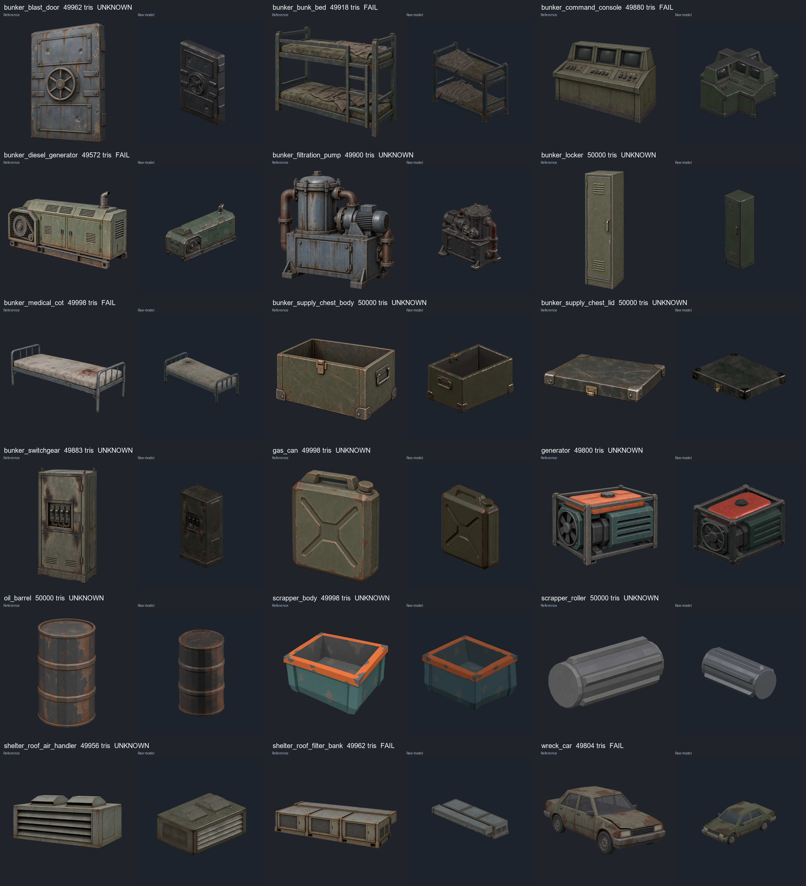

# 2026-10-07 TRELLIS.2 50k 全批生成與分析

16 份 request 已逐件完成一次生成，共 18 個獨立原始模型。全程由主 agent 處理，沒有 subagent、重畫參考圖、換 seed 或後期降面。這是全批候選產出與分析：**6 件已見缺陷（FAIL），12 件仍有必要未驗項（UNKNOWN）；不是 16 份正式場景交付全部合格。**

## 主要結論

這組固定參數能穩定產出約 50k 的帶貼圖 GLB，但仍會出現局部彎曲、比例偏差、複製結構與零件分離。問題在本輪保存的原始輸出已存在，沒有經過後期化簡；不能把它們歸因於後期降面。

- **較穩定的外觀候選**：置物櫃、汽油罐、油桶、獨立滾輪。這些物件輪廓簡單、主要零件容易辨識，仍需尺寸、原點與必要朝向校正。這是本批觀察，沒有同圖不同模型／面數的對照，不能推論普遍成功率。
- **優先處理的結構缺陷**：控制台生成四向重複面板；濾網組後管與前箱組分離。旋轉整個模型無法消除這兩種錯誤。
- **床類仍需修整**：雙層床和醫療床有橫桿／床框起伏，雙層床另有明顯比例偏差。增加面數沒有自動加上平直、平行或共面的約束。
- **細節與接口要另驗**：柴油機防護網格變成封閉浮雕；廢車雖可辨識，卻只有一個材質，無法直接按需求獨立換車漆。

對固定工作流的判斷是：這個 profile 可保留為候選生成入口；接入前仍需要按資產類別執行已定義的檢查。例如床檢查比例、桿件與腳底；設備檢查孔洞與必要件；拆件檢查轉軸、配合與連通；車體檢查車漆材質分離。失敗件應帶證據交回決定下一步。本輪全批比較沒有自行換圖、換參數或修形；依使用者本輪指示，持續保存全批候選供分析。這是當時的實驗紀錄，日常製作方式以目前的 image-to-3D skill 為準。

## 床的量測

[雙層床原始模型](../../art_source/bunker_bunk_bed/trellis_50k_20261007/raw.glb)為 49,918 三角面，來源 POSITION 包圍盒 X/Y/Z 為 **0.961356 / 0.728599 / 0.494150** source units。這些值不是公尺。長軸 X、up Y 在五視角可確認，使用比例可排除整體等比縮放的影響：

| 比例 | 原始模型 | request 設計值 | 相對差異 |
|---|---:|---:|---:|
| 高度／長度 | 0.758 | 1.85 / 2.00 = 0.925 | 約 −18.1% |
| 深度／長度 | 0.514 | 0.90 / 2.00 = 0.450 | 約 +14.2% |

包圍盒包含床被、帽蓋與腳座，不是各構件的製造尺寸；這是比例診斷，不是自訂公差。等比縮放無法同時把這兩個比例變成需求值，本輪沒有分軸拉伸。

四角主柱的**可見中段**另作有界診斷：取包圍盒外側 X 10%、外側 Z 18%、高度 Y 35%–62% 的頂點，分十個等高區間，以各區間頂點包圍盒中心擬合 X/Z 對 Y 的斜率。對來源 up 的估計角度約 **0.32°、0.50°、0.56°、0.21°**。因此這次柱中段大致直立，主要問題仍包括橫桿／接頭起伏與比例。

這個估計使用表面取樣，不是原建模中心線；排除了柱頂、床腳、梯子與橫桿，也包含整體姿態的影響。不能用四個角度宣稱整張床完全筆直或四腳共面；也沒有與舊研究使用同一量測方法作比較。完整區間、頂點數、擬合點與限制見 [post_diagnostic.json](../../art_source/bunker_bunk_bed/trellis_50k_20261007/post_diagnostic.json)，五視角見 [檢查圖](../../art_source/bunker_bunk_bed/trellis_50k_20261007/qa_detail/contact-sheet.png)。

## 濾網組的分離證據

原模型按完全相同的 POSITION 焊接後有 13 個連通片。單看連通片數不能判斷脫離，因為接觸但未焊接的零件也可能分片。這件進一步量測發現：全部連通片能分成前方 9 片與後管 4 片，前方組件 Z 最大值 **0.048209**，後管 Z 最小值 **0.074475**，兩者間有 **0.026266 source-unit** 的空區間（總 X 長度約 2.6%），沒有任何連通片跨越它。這證實後管與前組件有實際空隙。見 [connected_components.json](../../art_source/shelter_roof_filter_bank/trellis_50k_20261007/connected_components.json) 與 [頂／側視檢查](../../art_source/shelter_roof_filter_bank/trellis_50k_20261007/qa_detail/contact-sheet.png)。

## 設定與可重現證據

- ComfyUI 原生固定 graph；由 `127.0.0.1:8000/health` 發現 `127.0.0.1:8188`，向 8188 提交指定的 TRELLIS.2 checkpoint 與 graph。
- 模型 `trellis_2_int8_convrot.safetensors`；單張既有透明 PNG、物件 alpha 裁切、1024、seed 42。
- Profile SHA-256：`094ba479c7a9b5e78c0f71231c4e26a89c063305efe0e0733c158c50e23ad3d2`。[固定 graph](../../.agents/skills/comfyui-image-to-3d/assets/trellis-single-1024-50k.json)。
- **50,000 是生成 graph 內 DecimateMesh 的目標**；生成階段仍執行固定 RemeshMesh（192、smooth 2）。輸出的 GLB 原樣交付，未在生成後使用 meshoptimizer／Blender／其他化簡器，也沒有 20k 成果。
- 實際 49572–50000 三角面，18 件合計 898631。一個獨立模型各以約 50k 生成；補給箱組合與碎料機雙滾輪組裝的總面數會高於 50k。
- 每件保存原圖／conditioning、job／完整 graph／history、raw GLB、SHA、面數與 5 textured + 5 clay 視角；另補 10 張低亮度、有光照的幾何檢查圖。交付副本與 raw byte-identical。

## 逐件結果

| 候選／來源 | 三角面 | 檢查 | 主要觀察 |
|---|---:|---|---|
| [bunker_blast_door](../../art_source/bunker_blast_door/trellis_50k_20261007/README.md) · [GLB](../../assets/models/bunker_blast_door/trellis_50k_20261007/bunker_blast_door.glb) · [圖](../../art_source/bunker_blast_door/trellis_50k_20261007/qa_detail/contact-sheet.png) | 49962 | UNKNOWN | 主輪廓與手輪可辨識，五視角沒有明顯整體側傾；裝甲、鏽蝕配色保留，細節更圓滑。 背面自行補出圓盤與裝甲；不等於參考圖證實的背面。 |
| [bunker_bunk_bed](../../art_source/bunker_bunk_bed/trellis_50k_20261007/README.md) · [GLB](../../assets/models/bunker_bunk_bed/trellis_50k_20261007/bunker_bunk_bed.glb) · [圖](../../art_source/bunker_bunk_bed/trellis_50k_20261007/qa_detail/contact-sheet.png) | 49918 | FAIL | 兩層床、四角主柱、梯子與床被保留，沒有塌成單層；材質配色接近原圖。 橫桿與接點局部起伏、圓化；五視角仍可見框架非完全筆直。 |
| [bunker_command_console](../../art_source/bunker_command_console/trellis_50k_20261007/README.md) · [GLB](../../assets/models/bunker_command_console/trellis_50k_20261007/bunker_command_console.glb) · [圖](../../art_source/bunker_command_console/trellis_50k_20261007/qa_detail/contact-sheet.png) | 49880 | FAIL | 色系與按鈕風格接近原圖，但整體結構錯誤。 生成四向重複控制台，頂視十字形；原圖要求單台三螢幕控制台。 |
| [bunker_diesel_generator](../../art_source/bunker_diesel_generator/trellis_50k_20261007/README.md) · [GLB](../../assets/models/bunker_diesel_generator/trellis_50k_20261007/bunker_diesel_generator.glb) · [圖](../../art_source/bunker_diesel_generator/trellis_50k_20261007/qa_detail/contact-sheet.png) | 49572 | FAIL | 長條機殼、排氣管、皮帶輪與底座保留，整體外形比控制台穩定，色系符合原圖。 皮帶防護網格被壓成封閉浮雕／薄板，原圖的網孔沒有保留。 |
| [bunker_filtration_pump](../../art_source/bunker_filtration_pump/trellis_50k_20261007/README.md) · [GLB](../../assets/models/bunker_filtration_pump/trellis_50k_20261007/bunker_filtration_pump.glb) · [圖](../../art_source/bunker_filtration_pump/trellis_50k_20261007/qa_detail/contact-sheet.png) | 49900 | UNKNOWN | 濾筒、馬達、兩侧管線、底箱與腳座均可辨識，五視角沒有像控制台的四向複製。 筒前自行生成兩個圓形端口；原圖未提供這個設計。 |
| [bunker_locker](../../art_source/bunker_locker/trellis_50k_20261007/README.md) · [GLB](../../assets/models/bunker_locker/trellis_50k_20261007/bunker_locker.glb) · [圖](../../art_source/bunker_locker/trellis_50k_20261007/qa_detail/contact-sheet.png) | 50000 | UNKNOWN | 這批較穩定的候選：窄高輪廓、單門、把手、上下通風口保留，正側頂視沒有明顯整體歪斜。 板件邊緣與通風口較原圖圓滑，缺少需求中的數字模板。 |
| [bunker_medical_cot](../../art_source/bunker_medical_cot/trellis_50k_20261007/README.md) · [GLB](../../assets/models/bunker_medical_cot/trellis_50k_20261007/bunker_medical_cot.glb) · [圖](../../art_source/bunker_medical_cot/trellis_50k_20261007/qa_detail/contact-sheet.png) | 49998 | FAIL | 單床、兩端欄杆、四腳與髒白床墊／血污保留；整體比雙層床簡單且穩定。 正／背視可見長邊床框有弧形起伏，腳柱略外撇。 |
| [bunker_supply_chest_body](../../art_source/bunker_supply_chest/trellis_50k_20261007/body/README.md) · [GLB](../../assets/models/bunker_supply_chest/trellis_50k_20261007/body.glb) · [圖](../../art_source/bunker_supply_chest/trellis_50k_20261007/body/qa_detail/contact-sheet.png) | 50000 | UNKNOWN | 箱體有開口與內腔，角鐵、把手、扣件和橄欖色舊金屬保留，沒有與箱蓋融合。 來源長軸為 Z，前扣件在側向；需與箱蓋共同確認剛體朝向。 |
| [bunker_supply_chest_lid](../../art_source/bunker_supply_chest/trellis_50k_20261007/lid/README.md) · [GLB](../../assets/models/bunker_supply_chest/trellis_50k_20261007/lid.glb) · [圖](../../art_source/bunker_supply_chest/trellis_50k_20261007/lid/qa_detail/contact-sheet.png) | 50000 | UNKNOWN | 獨立薄蓋、四角護角、扣件保留，正侧視大致平直；材質配色符合箱體。 蓋面與四邊略圓滑／起伏。 |
| [bunker_switchgear](../../art_source/bunker_switchgear/trellis_50k_20261007/README.md) · [GLB](../../assets/models/bunker_switchgear/trellis_50k_20261007/bunker_switchgear.glb) · [圖](../../art_source/bunker_switchgear/trellis_50k_20261007/qa_detail/contact-sheet.png) | 49883 | UNKNOWN | 高櫃輪廓、操作區、底部通風與頂部吊環保留，板面整体較穩定。 小型開關與線材被融合／圓化；背面自行補出相似的斷路器區。 |
| [gas_can](../../art_source/gas_can/trellis_50k_20261007/README.md) · [GLB](../../assets/models/gas_can/trellis_50k_20261007/gas_can.glb) · [圖](../../art_source/gas_can/trellis_50k_20261007/qa_detail/contact-sheet.png) | 49998 | UNKNOWN | 較穩定的候選：封閉罐身、通透把手孔、獨立可辨識蓋子與凹槽保留，橄欖色與鏽蝕風格接近原圖。 邊角與蓋子較圓滑，罐頂、背面細節為推測補全。 |
| [generator](../../art_source/generator/trellis_50k_20261007/README.md) · [GLB](../../assets/models/generator/trellis_50k_20261007/generator.glb) · [圖](../../art_source/generator/trellis_50k_20261007/qa_detail/contact-sheet.png) | 49800 | UNKNOWN | 機架、橙色油箱、蓋子、風扇與通風柵都可辨識；維持原圖青綠／橙色風格，沒有控制台那類重複結構。 風扇葉片與機架接點圓化，部分框桿、背面格柵有起伏。 |
| [oil_barrel](../../art_source/oil_barrel/trellis_50k_20261007/README.md) · [GLB](../../assets/models/oil_barrel/trellis_50k_20261007/oil_barrel.glb) · [圖](../../art_source/oil_barrel/trellis_50k_20261007/qa_detail/contact-sheet.png) | 50000 | UNKNOWN | 桶身、兩圈桶箍與封閉桶蓋保留；直立轮廓穩定，低多邊形圓周與原圖相近，維持暗漆鏽蝕風格。 桶箍與蓋緣略不規則，色澤受不同原圖／渲染光照影響，未做色度量測。 |
| [scrapper_body](../../art_source/scrapper/trellis_50k_20261007/body/README.md) · [GLB](../../assets/models/scrapper/trellis_50k_20261007/body.glb) · [圖](../../art_source/scrapper/trellis_50k_20261007/body/qa_detail/contact-sheet.png) | 49998 | UNKNOWN | 敞口盆體、內壁、底板、橙色厚邊與暗青綠外殼保留，仍維持原圖較平面／多邊形的風格，沒有添加滾輪到盆體。 正側視的上沿有輕微斜度／起伏；尚未分離整體姿態與局部變形量測。 |
| [scrapper_roller](../../art_source/scrapper/trellis_50k_20261007/roller/README.md) · [GLB](../../assets/models/scrapper/trellis_50k_20261007/roller.glb) · [圖](../../art_source/scrapper/trellis_50k_20261007/roller/qa_detail/contact-sheet.png) | 50000 | UNKNOWN | 較穩定的簡單候選：柱體、端面與縱向凸肋保留，五視角未見斷裂或與盆體融合，維持原圖灰色多邊形風格。 端面與凸肋略不規則／圓滑；來源長軸 X，需求滾輪長軸本地 Y，需剛體轉向。 |
| [shelter_roof_air_handler](../../art_source/shelter_roof_air_handler/trellis_50k_20261007/README.md) · [GLB](../../assets/models/shelter_roof_air_handler/trellis_50k_20261007/shelter_roof_air_handler.glb) · [圖](../../art_source/shelter_roof_air_handler/trellis_50k_20261007/qa_detail/contact-sheet.png) | 49956 | UNKNOWN | 封閉機殼、雙頂罩與主要進風柵保留，板面較穩定，灰綠色舊金屬風格接近原圖。 柵片與罩口邊緣圓化，局部間隙與內部遮擋沒有驗證。 |
| [shelter_roof_filter_bank](../../art_source/shelter_roof_filter_bank/trellis_50k_20261007/README.md) · [GLB](../../assets/models/shelter_roof_filter_bank/trellis_50k_20261007/shelter_roof_filter_bank.glb) · [圖](../../art_source/shelter_roof_filter_bank/trellis_50k_20261007/qa_detail/contact-sheet.png) | 49962 | FAIL | 三個前箱、同一前方底座與一條長風管都生成了，但風管脫離前方組件。 頂／側視風管與前箱組分離；exact POSITION welding 後有 13 個連通片，所有片可分成前方 9 片與後管 4 片。两组 Z 包圍盒之間存在 0.026266 source-unit 空隙（總長約 2.6%），沒有任何片跨越，因此不是僅貼圖假象。 |
| [wreck_car](../../art_source/wreck_car/trellis_50k_20261007/README.md) · [GLB](../../assets/models/wreck_car/trellis_50k_20261007/wreck_car.glb) · [圖](../../art_source/wreck_car/trellis_50k_20261007/qa_detail/contact-sheet.png) | 49804 | FAIL | 轎車輪廓、四輪、車窗、燈組與鏽蝕磨損保留，未見明顯車體塌陷，整體外觀比控制台穩定。 GLB 一個 mesh／primitive／material，沒有 request 要求的獨立車漆接口；直接 material_override 會同時改輪胎、玻璃與金屬。 |

## 判讀與限制

FAIL 為已確認的幾何、缺件或必要材質接口問題。UNKNOWN 通常已能辨識原圖物件，但米制尺寸、原點、腳底共面、必要接口或功能仍未驗收；不以渲染成功改成 PASS。所有來源以原 up 檢查，没有分軸拉伸、自动修直或重新構圖掩蓋形變。五視角的 front 指顯示座標 +Z，不自動等於 request 的正面。

原圖全部沿用，實際 conditioning 已核對；其中保留的色系與鏽蝕／磨損風格是人工外觀觀察。不同原圖／3D 光照不能用來宣稱精確色度一致。原圖未顯示的背面由生成器推測，有多件補出重複的面板與細節。

所有原 GLB 尚為 normalized 尺寸，沒有完成各 request 的米制對齊。箱體／箱蓋兩次生成的尺度不同，需分別確認尺寸、朝向與鉸鏈後組裝。碎料機必須保留既有 CSG 滾輪節點型別和局部 Y 軸接口；車體必須分離可換色漆面。相關未驗項詳見每件來源 README／review.json。

第一件 Godot 檢查曾受沙箱 shader cache／系統憑證存取限制報錯，已保留原日誌，使用正常執行權限重新渲染同一 raw GLB，未重複提交 GPU 生成。全批每個 prompt ID 只有一個 generation intent。

本輪驗證了 GLB 容器、有限座標、索引、實際面數、內嵌貼圖、Godot 匯入渲染及來源／交付 SHA；逐件看完五個貼圖與素色視角。沒有替換正式場景，也未執行遊戲行為或性能測試。結構缺陷與必要 UNKNOWN 保留供使用者決定後續，不自動重試或换圖。

生成與分析完成時的核對：18 個唯一 prompt ID；18 個 raw／交付 GLB SHA 相同；每件 3 張內嵌 1024 × 1024 貼圖；按三角形邊向量叉積長度 ≤ 1e−12 檢查，未發現近零面積三角形。51 份來源／交付 README、request 與分析文件的相對連結均可解析，`git diff --check` 通過。這些檢查不代替上列美術與接口驗收。

## 本次 PR 保存範圍與核對

[機器可讀清單](2026-10-07-trellis-50k-manifest.json)列出 18 個模型的檔案、SHA-256、三角面數、prompt ID、profile／prompt／參考圖／conditioning 雜湊及檢查狀態。每件保留原圖、實際 conditioning、完整生成 graph／history、raw GLB、分析與量測 JSON、原始 contact sheet，以及詳細檢查的五視角貼圖與素色圖。

`assets/models/` 的候選與 `art_source/` 的 raw 為同一份未修改輸出，保留兩個路徑方便查證及後續接入；Git 以相同 blob 保存，不會為這兩份相同內容增加第二份模型資料。過亮的 `qa_lit`、失敗渲染影像、重複的原始單張視圖、一般 stdout／stderr 與暫存檔留在本機，不納入本 PR。

這批原始 JSON 以 `.gitattributes` 停用換行正規化，保留 prompt 等檔案的原始位元組及記錄雜湊。

本次整理重新核對了 18 組 raw／候選 SHA、參考圖／conditioning／prompt 雜湊、唯一 prompt ID、面數彙總與 6 FAIL／12 UNKNOWN 記錄，以及所提交 Markdown 的相對連結、檢查 JSON 的詳細視圖路徑和 JSON 格式。這次沒有重新生成、重新渲染、修形或降面，沒有執行遊戲行為／性能測試；上文的 Godot 渲染與人工觀察是本輪生成當時的驗證結果。
