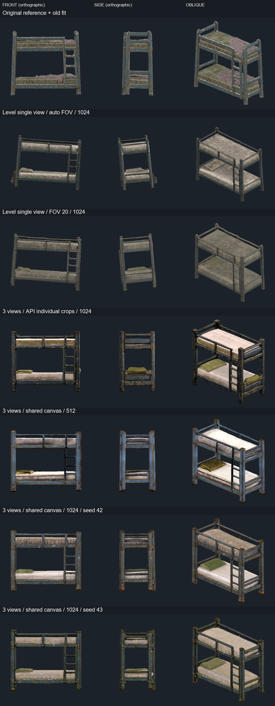
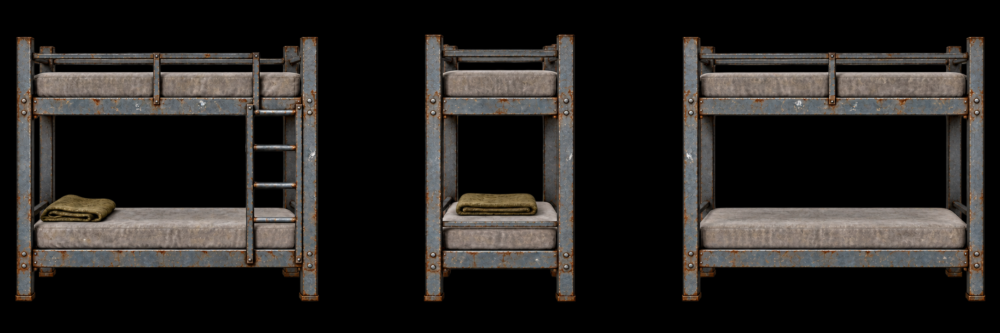

# Pixal3D 床模型平直度研究

此文件保存 API V2 實作前的研究與當時結果。後續已把共同畫布流程實作為新服務，見 [2026-10-05 API V2 與床測試](../validation/2026-10-05-pixal3d-api-v2.md)；原批次及下列研究數據維持原樣。

本輪只測試 [上下舖床 request](../modeling/requests/bunker-bunk-bed/bunker-bunk-bed.md)。先將 `origin/main` 合併到模型試作分支；使用本機 `127.0.0.1:8000` API 與同一個 `8188` ComfyUI 後端，保留每次原始 GLB、參考圖、prompt、seed、SHA256 與 Godot 預覽。正式場景仍使用既有 graybox。

## 結論與操作建議

這張床的有效方向是**平視、共同倍率的三視圖**。單圖換成平視圖、提高到 1024，或只把 FOV 固定成 20°，都沒有讓床架完全直立。多視圖明顯減少整體姿態歪斜；保留共同畫布符合相機假設，在兩個 seed 都減少整體傾斜，但不保證四柱彼此更平行。仍有局部彎曲、床腳高低差與尺寸比例誤差，尚未達到正式家具交付品質。

| 項目 | 建議 | 理由／本次證據 |
|---|---|---|
| 參考圖相機 | 三個平視視角：正面長邊、左端、背面長邊；每次只繞物件轉 90°，仰角 0°、roll 0° | 本機多視角節點的相機 rig 就是這個設定；不能把三張任意 3/4 圖當成三視圖 |
| 圖面比例 | 每格正方形，同相機距離、同物理像素倍率、同中心高度；端面應較窄，不能獨立放大 | API 目前逐格 `ImageCropToMask` 會破壞這個關係 |
| FOV | 多視圖採與 rig 相符的 20°；單圖照片保留 MoGe 估計，除非確實知道相機 FOV | 改 FOV 會影響深度；單圖固定 20° 後仍有傾斜，不能把 20° 當作通用矯正開關 |
| 背景與遮擋 | 透明原圖先合成黑底；不要二次去背或讓衣物蓋住床架。只留一張小毯子、薄平床墊 | 保留幾何輪廓和間隙；多視圖仍可能生成重複毯子 |
| 模式 | 先用 `threeview512` 檢查四柱／兩層／梯架，再用 `threeview1024` 做候選 | 512 與 1024 的主要結構相近；1024 不能自動修正錯誤姿態 |
| seed／取樣器 | 對照時固定 seed；本輪測 42、43。保留現有 Euler、sparse 12／shape 20／upsample 12／texture 12 steps 與既有 CFG | 本輪未做 CFG 或步數 sweep，不聲稱另有最佳取樣值 |
| 匯入整理 | 先看 raw；只做已知軸向的剛體旋轉、等比縮放，再量床腳與床架 | 舊流程按包圍盒估計方向、分軸拉伸，只能湊尺寸，不能驗證四柱垂直或床墊水平 |

## 實測對照



圖片由 Godot 4.7.2 實際載入原始 GLB 後渲染；正面與側面相機仰角為 0°。除第一列是既有 fitted 候選，其餘只用 yaw 旋轉辨識長邊，沒有修改頂點、沒有非等比拉伸。每張按最長邊等比例構圖，因此呈現的是比例與形狀，不是公尺尺寸比較。

| Case | 輸入／模式 | H/L | D/L | 觀察 |
|---|---|---:|---:|---|
| 原圖 raw，僅舊 OBB 旋轉 | 舊圖／standard1024／42 | 0.729 | 0.460 | 原始姿態及結構比例需另外整理 |
| 原圖 fitted | 同 raw，已按各軸縮放到尺寸 | 0.925 | 0.450 | 尺寸正確；床柱與床腳仍不保證平直 |
| `level_512` | 新平視單圖／preview512／42 | 0.796 | 0.566 | 床架仍有全局歪斜 |
| `level_1024` | 同圖／standard1024／42 | 0.785 | 0.558 | 細節增加，結構未明顯矯正 |
| `level_fov20_1024` | 同圖／固定 FOV 20°／1024／42 | 0.813 | 0.532 | 深度比例改變，床柱仍斜 |
| `mv_api_v2_1024` | 三視圖／API 各視圖去背裁切／1024／42 | 0.855 | 0.516 | 姿態改善；仍有歪柱與重複毯子 |
| `mv_fixed_512` | 同三視圖／保留共同黑底畫布／512／42 | 0.872 | 0.521 | 結構可讀，細節較粗 |
| `mv_fixed_1024` | 同三視圖／保留共同黑底畫布／1024／42 | 0.864 | 0.518 | 本輪較好的候選；仍需床腳、直柱、薄框及尺寸整理 |
| `mv_fixed_1024_seed43` | 同三視圖／保留共同黑底畫布／1024／43 | 0.863 | 0.508 | 直立姿態可重現；局部床腳與護欄形狀仍隨 seed 變化 |

設計目標 H/L = **0.925**、D/L = **0.450**。例如共同畫布 1024 候選若等比放大到 2 m 長，約為 1.73 m 高、1.04 m 深，仍不能直接交付 1.85 m 高、0.90 m 深的需求。把三個軸硬拉到尺寸不會修好歪柱。

`measure_trials.py` 另外以固定亂數、依三角形表面積取樣 20 萬點，在兩床墊間 40–65% 高度區域做四角床柱的分段中位數擬合。新單圖的平均柱向偏離 +Y 約 **6.1°**，API 三視圖約 **0.9°**，共同畫布 1024 的 seed 42／43 約 **0.4°／0.2°**。但四柱相對平均柱向的最大偏差，API 版本約 **0.7°**，共同畫布 seed 42／43 約 **1.8°／1.9°**；這證明整體擺正和四柱平行是不同指標，不能聲稱移除裁切能保證所有局部結構更直。舊 OBB 已對原 raw 做三軸旋轉，因此它的柱向和新圖只做 yaw 的數字不是原始相機姿態比較。

最初以原始頂點直接擬合會受 UV 接縫、三角化密度影響，產生不可靠的 3–12° 偏差；已改為面積取樣，不沿用那些數字。現在的量測仍只是該段 mesh 的近似診斷，會受粗糙網格、梯架及 ROI 影響；不是整根柱的精密量測，也不是驗收合格判定。完整數據見各 case 的 `measurements.json`。

參考圖與解析度比較不是純單因子試驗：新圖同時調整了相機、毯子和材質細節。API 與共同畫布比較則同時移除了二次去背和逐格縮放，因此不能把全部改善只歸因於裁切。參考圖由 imagegen 生成，雖已檢查視圖、輪廓與倍率，仍不是從一個精確 3D 模型渲染的完美一致資料。

## 為什麼會歪

Pixal3D 利用相機投影把影像特徵對齊 3D；單圖輸出以輸入視角為依據，沒有承諾自動把家具擺正。參考圖相機方向與 FOV 必須和 conditioning 相符。[ComfyUI 官方教程](https://docs.comfy.org/tutorials/3d/pixal3d)

官方多視圖流程要求圖面框取和 camera transforms 相符，而且不會替各張視圖重新裁切／放大；預設 orbit 是等距 90°、仰角 0°、FOV 20°。本機 `comfy_extras/nodes_trellis2.py` 的 `Pixal3DMultiViewConditioning` 確實固定這個 rig。[TencentARC 官方輸入格式](https://github.com/TencentARC/Pixal3D#multi-view-inference)、[ComfyUI 節點文件](https://github.com/Comfy-Org/embedded-docs/blob/main/comfyui_embedded_docs/docs/Pixal3DMultiViewConditioning/en.md)

本機 API 的 `threeview512.json`／`threeview1024.json` 雖使用原生 multi-view conditioning，卻在前面對 front、left、back 分別去背和 `ImageCropToMask(pad_factor=1.1)`。端面最長邊是高度，正背面最長邊是長度；各自放大後，相機距離假設就不再一致。本輪保存了實際 conditioning 圖：以 RGB > 20 的輪廓量測，正面高度 **813 px**，端面 **931 px**，端面比正面大 **14.5%**。這是可重現的輸入倍率錯誤，但不能據此認定它是所有歪柱的主因。測試中的共同畫布版本將三個 `ImageCrop` 直接接到 conditioning，不再逐格放大。

平視單圖經原生 MoGe 處理的 FOV 診斷為 **26.155°**；固定 20° 對照沒有消除約 6° 的全局傾斜。數據及原生節點輸出保存在 `single_fov_diagnostic/history.json`，裁切圖在 `api_preprocessing/`。

另外，舊床候選的整理倍率為 X=2.223、Y=2.819、Z=2.174，Y 相對 X 多伸長約 27%。這會改變局部角度和比例。OBB 方向主要依外包輪廓、面法線等估計，並沒有找床腳支撐平面或床柱中心線。舊 bounds／import 通過只代表能載入且包圍盒尺寸符合，不代表結構筆直。

## 參考圖怎麼畫



先確定一個完整、筆直的床架設計：四柱同高、四腳共平面、兩個矩形床架平行、所有接合為 90°、細床墊和清楚的梯架。正面、左端、背面保留同一柱距與床墊高度；左端只改看到的寬度，不能換一張長邊。對稱的床仍需要梯架、毯子等一致位置來辨識前後。

相機在物件中心高度，水平觀看；正面朝長邊，左端繞物件轉 90°，背面轉 180°。使用同一鏡頭和距離，物件最大寬度約占方格 90%，完整留出床腳和護欄。磨損畫在材質上；不要把柱子、直角床框畫彎，不用戲劇性廣角、俯視或大面積垂掛布料。

本輪 imagegen 的三視圖草稿沒有遵守等寬格線，第一次影像裁切還混入鄰圖的床柱。這個 `mv_api_1024` 輸出保留為**無效輸入對照**，不納入結論。後來以 ComfyUI 原生 crop／黑底 composite／stitch 節點分離視圖，保留同像素高度而不縮放，得到 2172×724 的三等方格圖。這是 camera conditioning 的輸入整理，沒有重畫床。

完整 imagegen prompts 見 [reference_prompts.json](../../art_source/bunker_bunk_bed/straightness_trials/reference_prompts.json) 與 [排版修正 prompt](../../art_source/bunker_bunk_bed/straightness_trials/reference_fix_prompt.txt)。透明原圖 alpha 被保留，供不同 conditioning 流程重現。

## 重現與驗證

來源入口：[straightness_trials](../../art_source/bunker_bunk_bed/straightness_trials/README.md)。每個成功 case 的 `raw.glb` 保留輸出原樣；API case 保存 job metadata，直接 Comfy case 保存確切 `prompt.json`／`history.json`。本輪不下載新權重，不修改 Apps 內 API 的預設 workflow。

```powershell
python art_source/bunker_bunk_bed/straightness_trials/run_trial.py my_api_case --image art_source/bunker_bunk_bed/straightness_trials/framed_v2/framed_reference.png --preset threeview1024 --seed 42
python art_source/bunker_bunk_bed/straightness_trials/run_trial.py my_api_case --collect

# 先等目前生成 queue 清空；共同畫布對照直接使用同一個 8188 後端。
python art_source/bunker_bunk_bed/straightness_trials/comfy_trial.py submit my_shared_case --image art_source/bunker_bunk_bed/straightness_trials/framed_v2/framed_reference.png --preset threeview1024 --fov 20 --seed 42
python art_source/bunker_bunk_bed/straightness_trials/comfy_trial.py collect my_shared_case
python art_source/bunker_bunk_bed/straightness_trials/measure_trials.py my_shared_case
godot --path . --log-file .godot/bed-straightness.log --script art_source/bunker_bunk_bed/straightness_trials/render_trials.gd -- art_source/bunker_bunk_bed/straightness_trials/my_shared_case
```

Python API helper 用標準函式庫；Comfy helper 和對照拼圖需 Pillow，姿態／量測需 NumPy。重現腳本讀取本機現有 workflows，未來 workflow 改版時應以保存的 prompt 核對差異。取樣器設 seed 時覆寫各階段 seed，與目前 API 一致。

本輪實際驗證 GLB SHA256、Godot 載入、正面／側面／背面／斜角／俯視渲染、比例與粗略柱向。8 個新輸出 checksum 相符（含排除案例），7 個有效新模型加 2 個原模型載入／45 張渲染完成，Godot exit code 0、無腳本錯誤；Python 語法、文件相對連結與 `git diff --check` 通過。[本輪驗證摘要](../../art_source/bunker_bunk_bed/straightness_trials/validation.json)

沒有完成 Blender 修形、碰撞／攀爬接口或正式遊戲場景驗收。計時包含不同快取狀態，不能用本次秒數當精準速度 benchmark。下一步若要交付家具，應以穩定的直柱／平床框作結構約束，生成結果再處理表面與床墊；最後用共同床腳平面、柱向、框面和接口尺寸驗收，而非只看外包盒。
