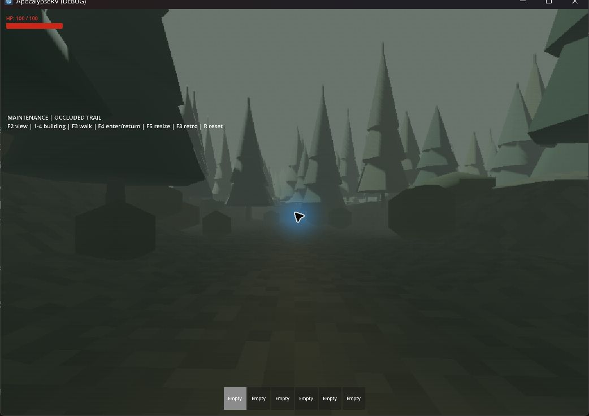
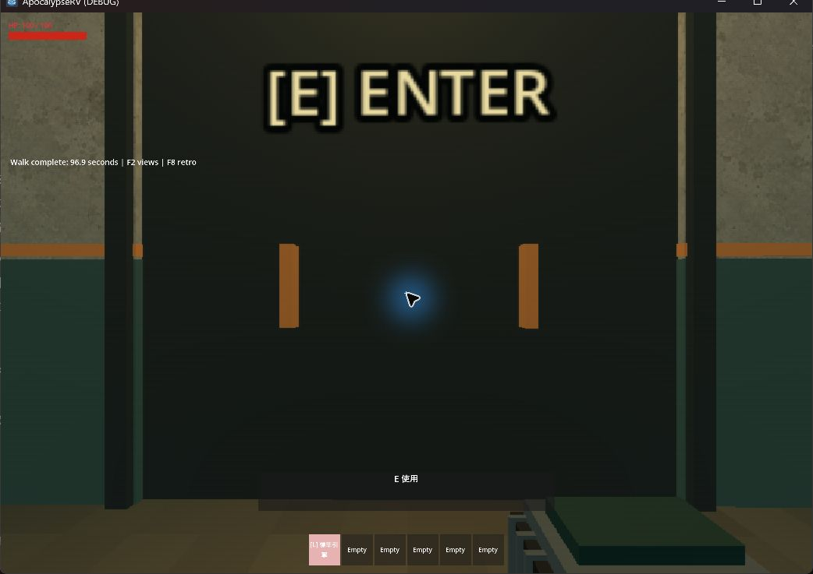

# 密林壓迫感與遠距入口：後續驗收

實作與驗收跨 2026-09-16–17。本文接續 [室外氛圍驗收](2026-09-16-outdoor-horror.md)。本輪依玩家回饋增加遮蔽並把主要入口拉遠；舊紀錄中的 135 m／38 秒是生成 v3 的結果。

## 變更

- 新世界生成 v4。起始入口由公路側向 135 m 改為 335.2 m，約 2.48 倍；停車位置仍在 33 m。步道約 488 m，以六道交錯窄口、反覆轉折及土堤切斷視線。
- 可碰撞地形與導航由 450 m 擴為 900 m 寬。v2／v3 的地形寬度、入口位置、路線和 POI ID 保留，載入不搬動既有世界。
- 每個 150×900 m 帶以抖動網格形成密林；seed 42 初始三帶分別有 1628／1441／1645 棵樹、4545／4097／4566 叢灌木。數字是整帶數量，不是同時在玩家視野內的數量。
- 樹高 12–21 m，灌木高 1.5–3 m；樹幹有簡化碰撞，枝葉與灌木不阻擋搬運。樹幹、三色樹冠、三色灌木使用七批 MultiMesh。地形土堤與實體圍牆仍提供真正的遮蔽及阻擋。
- 距離霧密度由 0.0075 改為 0.009，環境及日光稍降。保留原 FOV、UI 清晰度、F8 切換及室內顯示流程。
- 樹林位置規劃按列分幀，導航包含相鄰樹幹碰撞；場址所需缺失區塊會補載。補載後方區塊不再把粗糙遠景地形移到已載入道路上方。
- 怪物已到達路徑點水平範圍時，依實際落地高度推進路徑，避免導航簡化高度與土坡不一致造成繞圈；固定目標不再每 0.25 秒重設整條路徑。

## 自動驗證

`test_outdoor_horror.gd` 檢查 100 seed × 9 場址的重現性、入口距離、步道長度／坡度、地形邊界和建築支撐，另以正式 seed 42 檢查遮蔽、導航、跨區場址、顯示切換及遠景補載回歸。

`test_outdoor_traversal.gd` 使用正式玩家攜引擎走完整條步道，實際 E 進入副本、返回，再攜油桶沿原路走回。單程為 **97.08 秒**；無需跳躍。

`test_outdoor_encounter.gd` 使用正式怪物走過全部新增轉折、跨區追擊，並以正式輪驅 RV 驗證停車、窄口阻擋及煞車。測試將玩家生命和怪物感知距離調高以隔離路線行為，未修改正式感知數值。

2026-09-17 完整 `scripts/test.ps1`：匯入、30 組行為測試、主場景啟動全部 PASS，`git diff --check` 通過。最後針對目標垂直移動的路徑更新微調另補跑怪物導航及密林追擊回歸。長途室外測試使用 `--fixed-fps 60` 以正常 60 Hz 模擬步長加速無畫面執行；匯入明確加 `--quit`，避免 Godot 4.7 留在編輯器造成逾時。

## 實機觀察

使用正式世界的 `outdoor_horror_playground.tscn`，Godot 4.7.2／Compatibility、RTX 4060 Laptop GPU。

- 查看公路、停車處、林間轉折，密集樹冠／灌叢遮住兩側大片空地，近處路面仍可辨識。
- F3 實際連續輸入搬運引擎，約 **96.93 秒**到門前，互動提示正常。
- 最後再次開啟遊戲檢查修正遠景補載後的公路畫面，沒有原先的粗網格覆蓋路面。
- 下列兩張紀錄於遠景補載修正前拍攝；樹林、路線及搬運行為一致。最終公路畫面已查看，但額外保存截圖遇到工具自動審核服務容量錯誤，未補入檔案。

## 效能與限制

- 初次可見測試三帶建立約 1.77–1.90 秒／帶；初始同步建立有明顯等待，不能視為無停頓。
- 分幀後代表性串流 `max_slice_ms` 約 83–180 ms；同時跑其他測試時更高，仍須後續處理導航來源解析與批次提交尖峰。
- 約 97 秒可見搬運樣本：13706 個 render frame，median 6.06 ms、p95 8.50 ms。這是限幀環境的單機觀察，不是跨硬體效能保證；同時執行了其他測試。
- 100 seed 是場址資料及地形檢查，並非每個 seed 都完整實機步行；本輪實機為維修廠／seed 42，未重新拍攝四種建築全套視角。
- 實機使用 4.7.2；未本地重跑 4.6.1。霧與葉片仍沒有新增怪物潛行判定；沒有新增聲音、事件或動態天候。
- 新距離及密林地形需要新世界；既有生成 v3 存檔仍使用原距離與稀疏配置，避免破壞保存位置。
