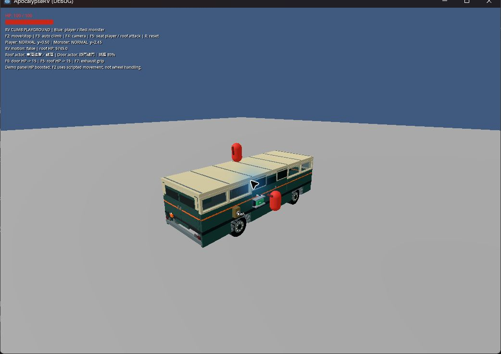
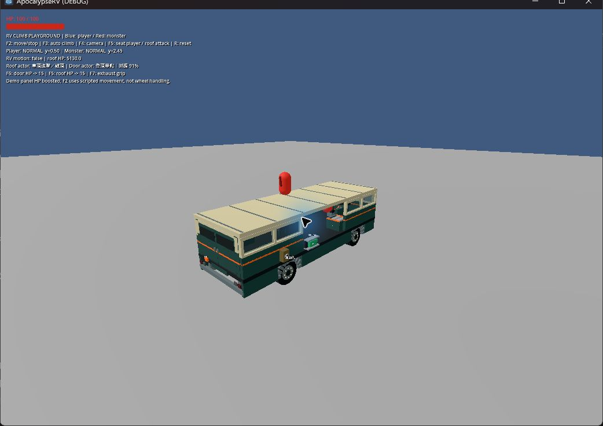
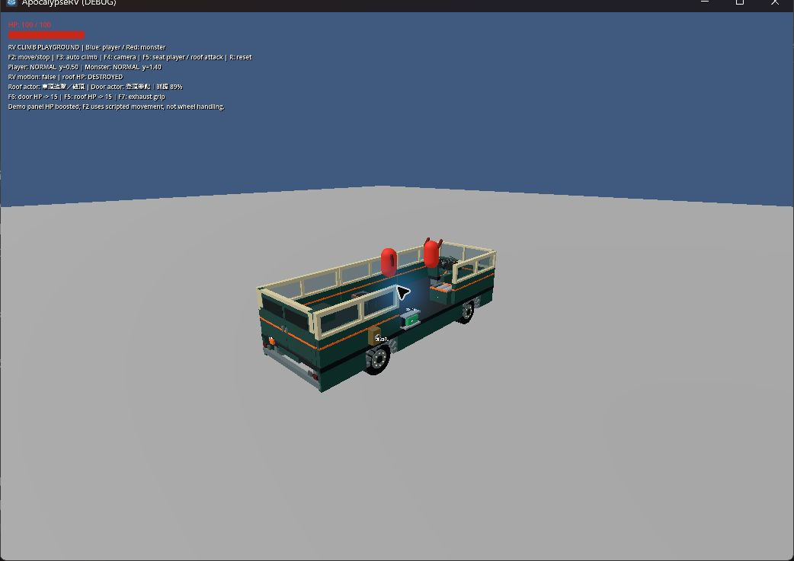
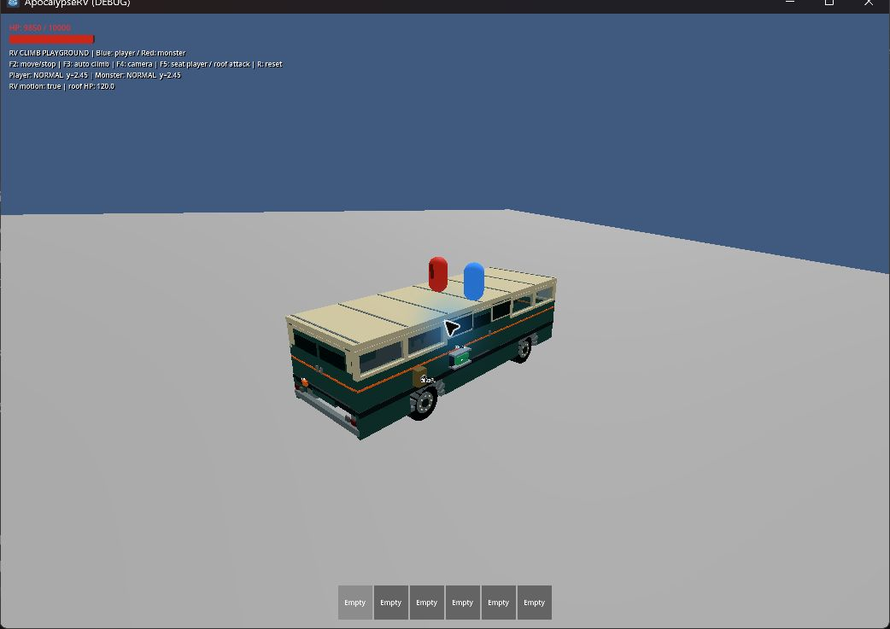
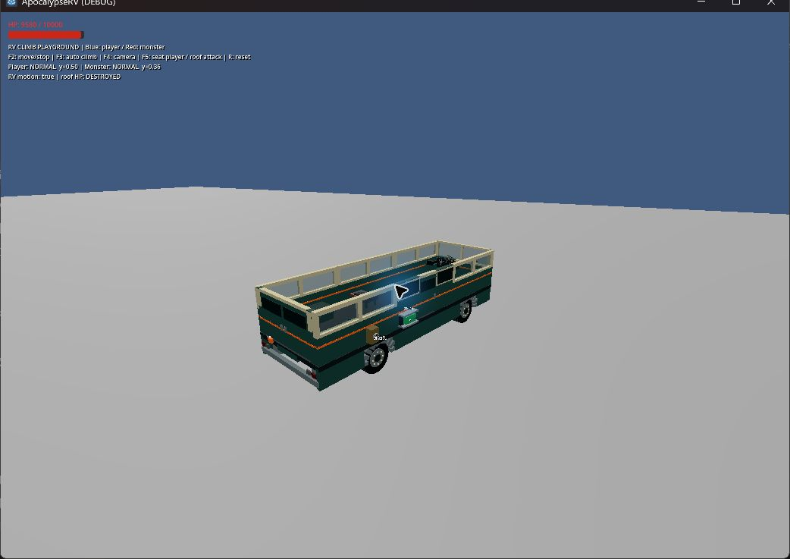

# 怪物相對速度攀車與兩種破壞模式（2026-09-16）

## 實作

- 普通怪物接近車上玩家時選擇同側附近門口；掛門破門、攀牆登頂破頂分開執行。高底盤先攀到實際門板再掛住；打開的入口與後坡板可通行。
- 抓握使用碰撞前怪物世界速度與接觸位置車速之差，包含車身轉動；抽樣失敗和受撞後有 1.2 秒恢復，不能每影格重抽。正常低相對速度可抓握，迎面撞擊優先受傷／擊退。
- 每扇門限制一名掛車怪物；同車相近攀爬點避免重疊。門扇實際碰撞判定與原門框設備耐久共用，沒有新增假門 HP。
- 掛車耐力隨時間、攻擊與實際車身加減速／轉動消耗；低耐力滑落、停止攻擊，歸零脫離。車頂失衡打斷攻擊並造成滑動，穩定直線高速不直接甩落。
- 保留玩家攀爬、屋頂碰撞與 RVSupport；處理短暫地板接觸缺失的連續速度取樣。RVSupport 增加角色已落地卻沒有滑動碰撞時的腳底短射線確認，修正怪物站在移動車頂仍漏掉隨車位移的問題。移除怪物原先單一角速度門檻立即掉落。
- 程序生成手臂抓握／敲擊姿勢與空間音效。PCM 波形由程式生成並共用，不依賴第三方音效或下載資產。

## 自動驗證

本機 Godot 4.7.2；CI 設定仍為 4.6.1。完整 scripts/test.ps1 通過 import、25 個 test_*.gd 及主場景啟動；日誌在 .godot/test-logs。APPDATA 指向 .godot/boarding-user，避免隔離環境寫入使用者的 Godot 編輯器設定；系統憑證庫診斷由既有 runner 精確排除。

新增 test_monster_boarding.gd 使用正式 RV／Zombie／玩家，驗證：

- 門板選擇、只傷門不傷頂、低抓握停止攻擊、開門與破壞解除附著、單葉占用。
- 牆面登頂、站穩後破頂、穩定高速不失衡、急煞打斷傷害並滑動。
- 相對速度曲線、迎面撞擊傷害與重抓冷卻；真實射線下高速追車抓握、快速擦過拒絕、失敗不逐影格重抽、耐力耗盡。
- 開放後門及正式坡板，怪物正常走入車內。

既有 test_moving_rv_climbing.gd 從牆片開始測登頂（原先門板位置現在應掛門），仍驗證玩家／怪物隨車平移轉動、車體物理驅動支撐、頂部阻擋、遮蔽與拆頂掉落；未放寬原斷言，另新增怪物登頂後持續隨車平移／轉向的漂移斷言。

## 實機觀察

使用 computer-use 技能操作自有測試視窗，沒有操作使用者的 Godot 編輯器。monster_boarding_playground.tscn 採正式場景與 AI；為便於觀察，門頂耐久及掛門耐力提高。F6／F5 將結構 HP 降到 15，只加速破壞，命中與掉落仍由正式流程執行。

1. 同時看到左側怪物登頂破頂、右側怪物掛在側門敲門。
2. F6 後門模組被最後一擊破壞，怪物解除附著並往下落。
3. F5 後屋頂 DESTROYED，怪物落到車內高度；後續恢復一般追擊。
4. 補測 rv_climb_playground 回放：兩者確實抓住後才開始腳本移動，玩家生命提高便於長時間觀察；藍色玩家與紅色怪物都登頂並持續隨車轉彎。F5 入座後仍由正常攻擊逐次拆頂，看到屋頂 DESTROYED、怪物高度降到原車頂以下。
5. 雙模式 .godot/boarding-desktop.log 無腳本錯誤。移動回放在怪物掉落、被車撞死後暴露測試 HUD 存取已釋放怪物的錯誤；已加入生命週期防護，並以 --replay --seat-after-climb 跑完整 40 秒模擬。最終 .godot/boarding-replay-lifecycle.log 完成破頂／掉落／撞死，無腳本錯誤（僅隔離環境憑證庫診斷）。測試視窗及背景測試程序已關閉。

## 範圍與限制

- 屋頂、門模組仍整片破壞；不做局部開洞或獨立玻璃／門扇耐久。
- 此次重做攀車意圖與接近入口的局部決策，保留原地面 NavigationAgent；未加入聽覺搜索、全新怪物種類或大規模群體路徑規劃。
- 模式／抓握／恢復為執行期狀態，讀檔重新判斷；沒有更改檢查點版本。
- 自動測試有車體物理速度、實際碰撞與舊輪驅回歸；本次雙模式畫面以停車驗證，F2 移動屬腳本運動。未將完整高速輪驅追車戰、翻車、怪物大群或聲音主觀混音視為實機驗收完成。
