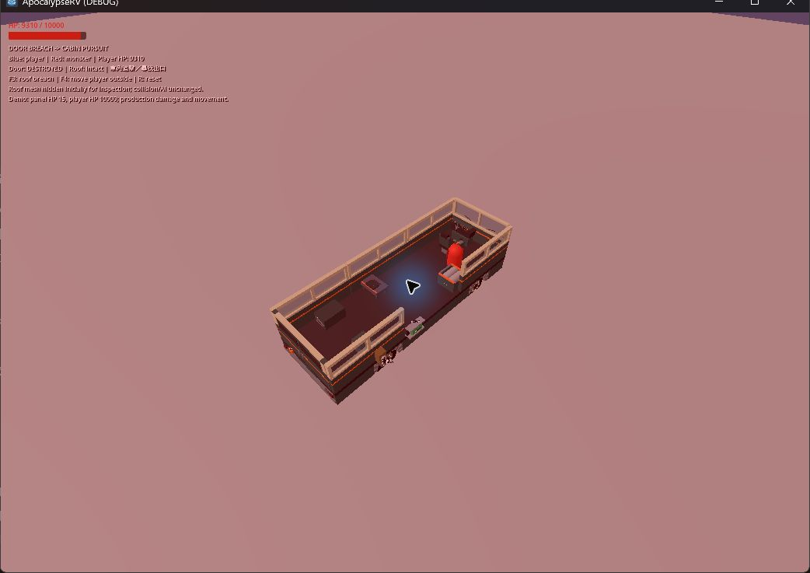
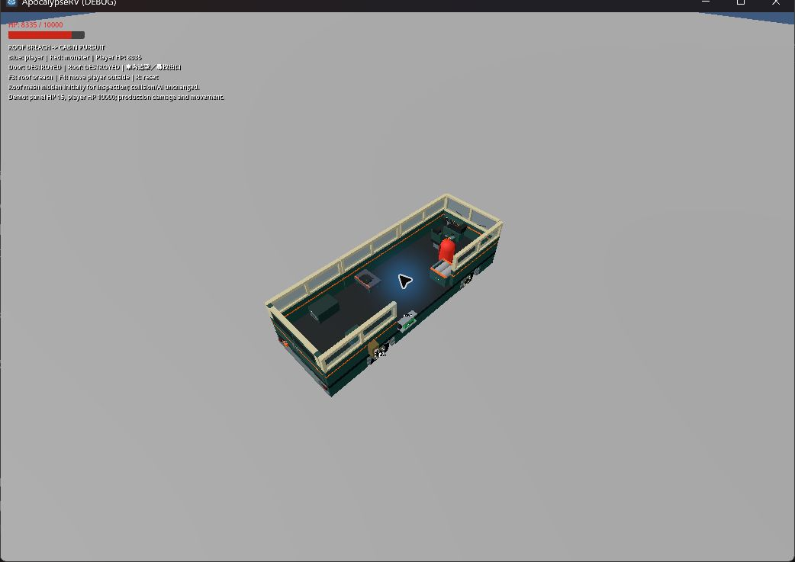
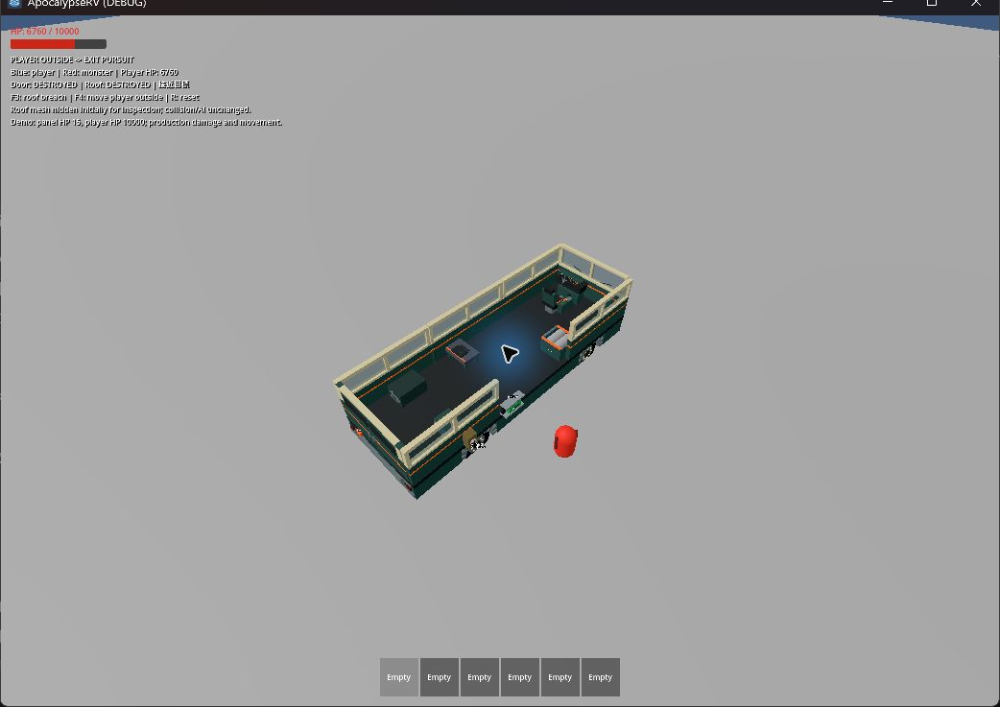

# 破口進出與車內追擊（2026-09-16）

## 完成行為

- 側門破壞後仍由底盤槽位辨識破口，進入車內並追擊玩家。
- 破頂後落地結束車頂模式；落在工作台上也能走下邊緣、回到走道。
- 車內使用 RV 本地座標的步行圖，以正式角色膠囊檢查設備與通行空間。路點隨車身平移、轉向；設備變動後定期重規劃。
- 尋找有近戰視線的攻擊位置，避免卡在駕駛座椅背。原座椅包住整名乘員的實心碰撞盒，改為座墊／底座與椅背。
- 車內追人不消耗冷卻拆附近設備，離車另有 2 秒過渡。玩家離車後，從已開啟且可通過的門或缺失車殼破口追出去。
- 走道封死或沒有可用出口時等待重規劃，不穿牆、不隨機跳過整道障礙。

## 自動化

新增 `tests/test_monster_cabin.gd`，使用正式 RV、Player、Zombie 與實體障礙，涵蓋：

1. 怪物實際打破側門、進車並傷害駕駛。
2. 實際打破屋頂、落入車內、結束車頂模式並傷害駕駛。
3. 落在工作台上後離開桌面；工作台不被攻擊。
4. 繞過狹窄走道障礙；整道堵死時停住，移除後重新追擊。
5. 車輛平移／旋轉期間路點跟車，怪物仍能接近駕駛。
6. 玩家離車後怪物從破口追出，恢復地面近戰。

本機 Godot 4.7.2；專案／CI 目標仍 4.6.1。完整 runner 通過資源匯入、27 個行為套件與主場景 120 幀啟動。之後補上的工作台落地情境及路徑更新介面另以最終 `test_monster_cabin.gd` 重跑通過。日誌位於 `.godot/test-logs/`、`.godot/cabin-final.log`。受限 Windows 環境的憑證庫診斷依既有 runner 規則單獨忽略。

## 可見實機

`tests/monster_cabin_playground.tscn`：正式角色與整車；初始隱藏屋頂渲染方便看車內，碰撞仍保留。目標門／屋頂各設為 15 HP，玩家 10000 HP，以縮短破壞等待並延長觀察；攻擊傷害與移動規則不變。

- 側門顯示 DESTROYED，怪物位於駕駛座右後側並持續扣玩家生命。
- F3 後屋頂顯示 DESTROYED，怪物由車廂中段走回駕駛座旁並恢復連續傷害。
- F4 將玩家移到車外，怪物朝側面破口離車後接近玩家並持續造成傷害。`.godot/cabin-visible.log` 未出現腳本／引擎錯誤。

## 限制

這是現有 RV 尺寸的局部步行圖，不是任意車體形狀或多樓層室內的通用導航。沒有開啟出口時不新增從車內破門行為。多怪協調、群體效能、輪驅高速／翻車下車內追擊尚未專項驗收；本輪移動車輛回歸使用腳本平移與旋轉。
