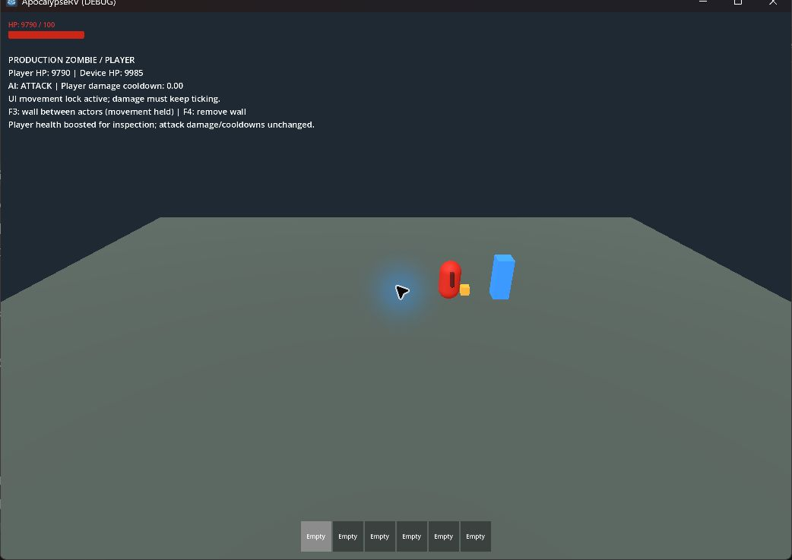
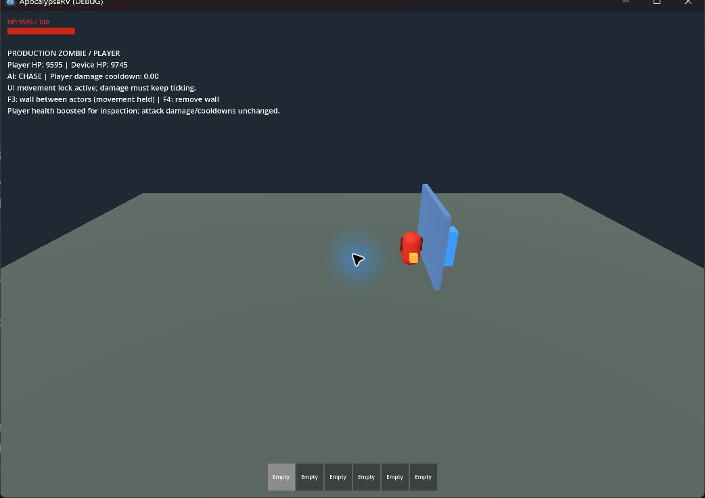
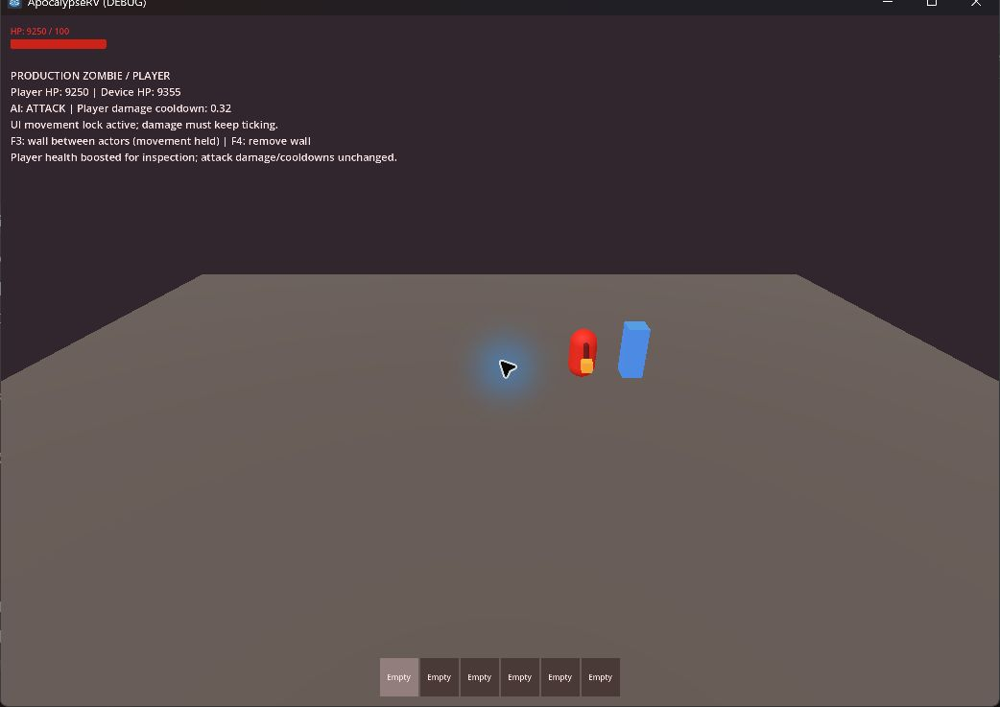

# 怪物追蹤與近戰修正（2026-09-16）

## 問題與修正

- 追蹤車上玩家時，更新攀車目標逐影格把 AI 改回 CHASE，使已進入 ATTACK 的怪物無法執行攻擊。目標更新不再覆寫狀態，近戰可及且視線通暢時直接進入 ATTACK。
- 接觸設備自動攻擊先消耗共用冷卻，玩家就在身旁也可能一直不受傷。一般移動時，近戰可及玩家優先於接觸設備／腳下屋頂；掛門、抓穩、攀爬等限制仍經 MonsterBoarding 最後檢查。
- 玩家在介面／座位鎖定時提前返回，受傷後 0.5 秒無敵沒有倒數。把受傷計時移到這兩個返回條件之前，保持正常連續受傷。
- 待機按偵測距離收集目標，追擊／攻擊按失去興趣距離收集，並驗證待機玩家偵測與持續接近。

## 自動化結果

本機 Godot 4.7.2，專案／CI 目標仍為 4.6.1。完整 `scripts/test.ps1` 通過：資源匯入、26 個 `test_*.gd` 及主場景 120 幀啟動。日誌位於 `.godot/test-logs/`；runner 僅忽略受限環境既有的 Windows 憑證庫讀取診斷，不忽略腳本錯誤。

新增 `test_monster_pursuit.gd` 使用正式 Player、Zombie、RV，實際物理地面／遮擋：

1. 處於 30 秒待機的怪物，在 8 m 發現玩家並追近、造成傷害。
2. 身旁有可受傷設備時，玩家持續受傷，設備不搶近戰冷卻。
3. 介面移動鎖期間仍正常連續受傷。
4. 實體牆阻止近戰；移除後無須重生便恢復攻擊。
5. 車輪旁近戰，以及玩家站在開放車廂、怪物站外部平台的情境；後者明確斷言攀車目標為正式 RV。
6. 車頂可見玩家略低於怪物時，攻擊玩家且不拆腳下屋頂。
7. 入座玩家受傷後，無敵計時到期可以再次受傷。

既有怪物導航、掛門／登頂、移動 RV 支撐與其他全部行為套件同時通過。

## 可見實機檢查

場景：`tests/monster_pursuit_playground.tscn`。正式角色／設備腳本，玩家生命提高到 10000 且啟用介面移動鎖，以延長觀察；攻擊傷害、冷卻與判定沿用正式數值。藍色方柱僅標記玩家，無額外碰撞。

- 追近後玩家生命持續下降，AI 為 ATTACK。設備接近階段可能先被打一下；玩家進入近戰範圍後，設備 HP 不再下降。
- F3 放入實體牆並把怪物移速設為 0，以隔離遮擋判定；玩家 HP 在兩次觀察間維持 9595，AI 為 CHASE。此時附近設備仍可能被接觸攻擊，符合玩家不可及時的原行為。
- F4 移除牆後，AI 恢復 ATTACK，玩家 HP 從 9595 繼續降至 9250；設備 HP 保持 9355。無須重啟角色。
- `.godot/pursuit-visible-marked.log` 無 SCRIPT ERROR、ERROR 或 FAIL。已關閉本次測試視窗。

## 範圍

本輪修正目標選擇、狀態切換及玩家受傷計時；沒有重寫導航網格或宣稱所有複雜地形／大型怪物群的追蹤問題已解決。車內開口、屋頂與入座情境本輪由自動化驗證，可見檢查專注地面追蹤、介面期間扣血及遮擋。
