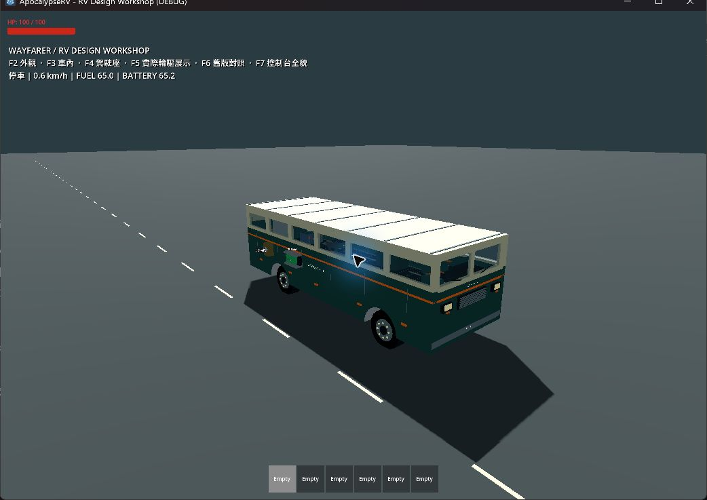
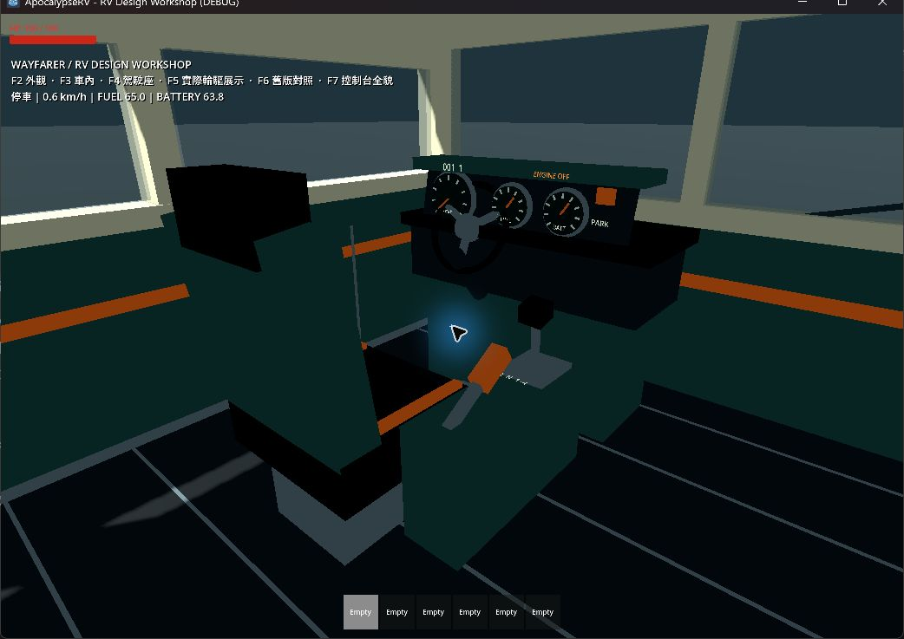

# WAYFARER 車體與駕駛室原型

日期：2026-09-16。沿用既有車輛／設備邏輯，重整外觀與駕駛控制台。

## 已完成

- 預設 RV 採深綠、奶油白、橘色工業露營車造型；新增窗框與玻璃、前後燈、保險桿、格柵、雨刷造型、輪圈、胎紋與地板。
- 原有底盤尺度、輪槽、懸吊與動力參數保留。車體視覺仍對應原牆／屋頂 Equipment；整片拆除時其外觀也消失。
- 後牆改為有實際通道的門框，兩側有碰撞。玻璃保留碰撞。尚無可開關門扇。
- DriverSeat 綁定座椅、控制台、方向盤、排檔桿、手煞車和踏板；使用一個設備 ID／生命週期／存檔條目。椅身、前台、側台碰撞共同決定放置大小。
- 方向盤跟隨實際 steering；排檔桿與手煞車跟隨 chassis 狀態；時速、油量、電量指針與讀數持續更新。沒有獨立點火物件或第二份資源狀態。
- 控制仍使用 B、Space、Z/X/C、R/T；模型上的控制件沒有新增滑鼠點按邏輯。
- 駕駛 HUD 改為底部摘要與故障提示；入座隱藏背包列，離座恢復。
- 修正離座候選位置貼入地板的誤判：膠囊檢查預留地板間距，並在檢查完成前保留駕駛參照供碰撞排除。預設離座落在中央走道。
- 加油孔移至車外維護側，電池插槽提升至側壁高度。生成器、分解機、製作台、平板、道具箱、加油孔統一材質及辨識細節。
- 舊版車殼／簡易座椅保留在 `rv/legacy/new_rv.tscn`。它仍沿用現在的動力、輪胎及資源設備系統，不是歷史程式快照。

## 自動驗證

Godot 4.7.2；專案目標仍為 4.6.1，本次未在 4.6.1 本機執行。

完整 `scripts/test.ps1`：匯入、**21 組 test_*.gd**、主場景啟動全數 PASS，退出碼 0。最後追加側控制台碰撞後，另重跑 `test_rv_cockpit.gd`，PASS、退出碼 0。

新增駕駛室測試覆蓋：

- 正式駕駛座入座、B 發動、排檔與手煞車控制。
- 方向盤、排檔桿、手煞車、速度／油電／缺電池讀數同步。
- 側台的射線互動歸屬同一個座椅設備。
- 整組放置範圍、巢狀模型預覽材質、取消還原。
- 預設走道離座、搬移後存讀檔重建完整控制台。
- 後入口可穿過，門框兩側維持碰撞。

互動測試改從車外瞄準新加油孔位置，仍走正式 RayCast3D／E 流程。既有車輛物理、能源、生產、倉庫、存檔與移動攀爬回歸保留。

首輪完整 runner 在世界生成斷言 PASS 後出現原生退出異常。獨立 verbose 檢查發現 RoadsideKit 靜態資源快取在結束時殘留；測試收尾增加明確快取持有／清理，並在區域變數釋放後退出。最終完整 runner 日誌乾淨、退出碼 0。受限環境下的獨立診斷仍曾報告該靜態腳本殘留，因此不宣稱已證明或修復原生崩潰的唯一成因。靜態快取的生命週期參考 [Godot GDScript 文件](https://docs.godotengine.org/en/4.4/tutorials/scripting/gdscript/gdscript_basics.html#static-unload-annotation)。

## 實機觀察

使用 computer-use／sky，只操作本次啟動的測試視窗；未操作使用者遊戲與 Godot 編輯器。

### 設計展示場景

`tests/rv_design_workshop.tscn`：

- F2 外觀：窗框、輪圈、車頭燈、車身配色與外側維護設備可見。
- F3 車內：中央通道可辨識；發電機、分解機、製作台、平板與道具箱採同一組美術語言。
- F4 駕駛：依第一輪畫面修正鏡頭、控制台距離與方向盤高度，最終前方視野、指針與方向盤同時可見。
- F5 輪驅：使用正式 VehicleBody3D／VehicleWheel3D，觀察到約 17.1 km/h、持續轉向、油量下降與電量充至 100；引擎標示、手煞車與方向盤同步。這是短程平地展示，不是長途平衡驗收。
- F6 舊版：可比較舊白盒車殼與新車。
- F7 控制台：從側後方看到座椅、排檔桿、手煞車、方向盤和儀表，均屬同一組設備。
- 最終模型展示日誌 `.godot/rv-design-assembly-final.log`、行駛日誌 `.godot/rv-design-visual-final.log` 無腳本錯誤。

### 攀爬回放

`tests/rv_climb_playground.tscn -- --replay`：

- 藍色玩家與紅色怪物都到車頂，轉彎時持續留在車上。
- F5 後屋頂 HP 到 DESTROYED；屋頂外觀消失，怪物落下，之後可繼續攻擊車內道具箱與後牆。
- `.godot/rv-design-climb.log` 無腳本錯誤。
- 此回放仍是腳本移車，與前述短程輪驅展示分開記錄。

## 範圍與限制

- 本版是 Godot 原生幾何模型原型，尚無最終 GLB、貼圖磨損、損壞外觀、車燈照明或雨刷動作。
- 車殼視覺接縫不代表獨立小板件。屋頂／側牆仍整片拆裝，沒有本次順便重寫支撐或大型外掛碰撞力矩。
- 載重、翻車、群體怪物、5 km 行駛與長局經濟本次未作專項驗收。
- 舊存檔保持原安裝位置；新控制台比較大，舊的緊密設備布置可能需要手動重新擺放。新開局使用新預設位置，保存版本仍為 2。
- 展示場預裝工作設備；正式測試主場景仍保留原先地面設備供安裝。
