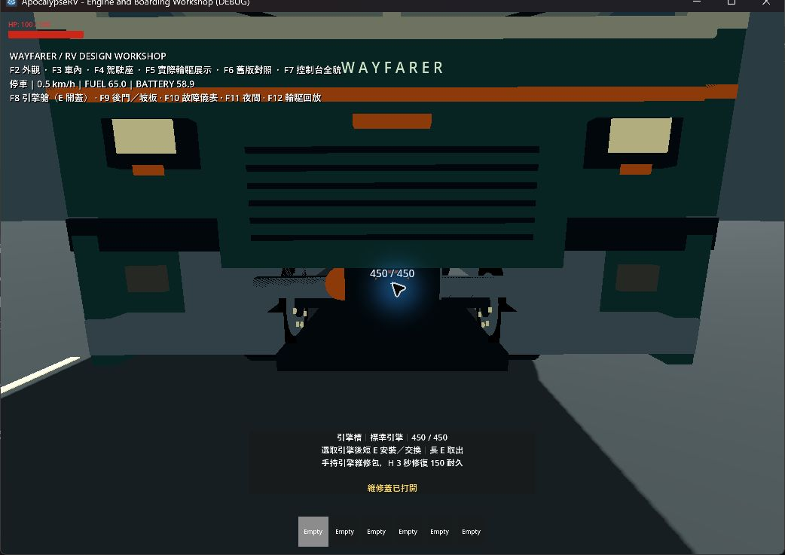
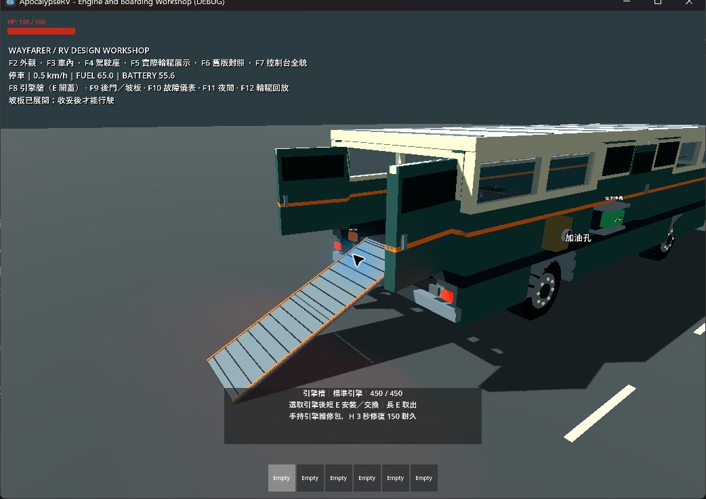
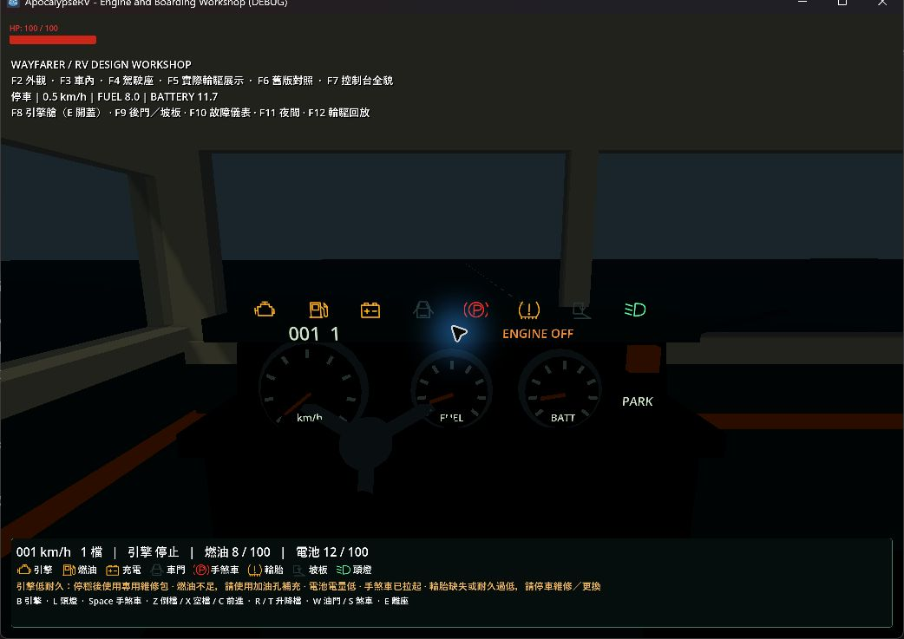
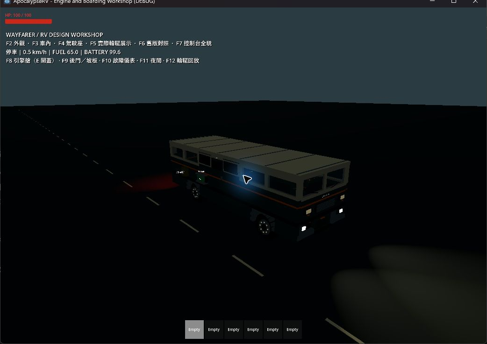
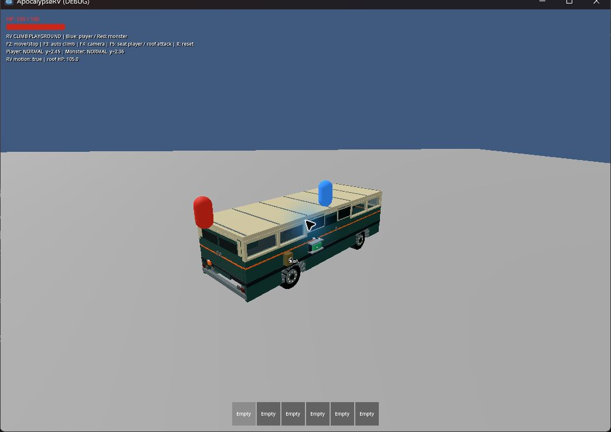
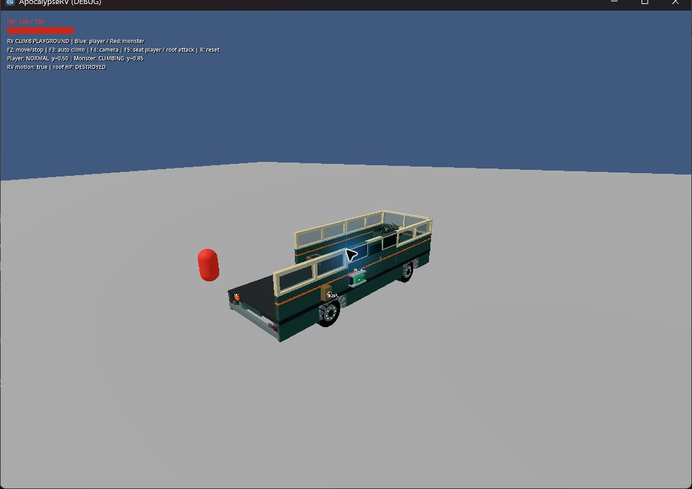

# RV 完整組裝、新底盤與可替換引擎驗收

日期：2026-09-16。環境：Windows、Godot 4.7.2、Jolt、GL Compatibility、RTX 4060 Laptop。
專案／CI 目標仍為 4.6.1；本輪未使用 4.6.1 驗證。

## 已交付

- 正式 new_rv 預裝車殼、四輪、駕駛室、引擎、電池／插槽、發電機、加油孔、道具箱、工作台、分解機和平板，倉庫兩包專用維修包。移除主世界／展示場的重複開局設備。
- 原生網格新底盤，保留既有 4 × 12 m、地板、輪胎接點與車殼槽位；外部固定引擎艙／可開維修蓋。
- 標準／強化大型引擎道具、原格交換、唯一狀態、專用維修包、三個配方。故障只停驅動，保留車體／服務／控制。
- 後門兩折坡板、地面／障礙／占用檢查與驅動互鎖；實際碰撞尺寸安全離座。
- 自由安裝 Q/E 15°、Shift 5°、方向鍵 5 cm、接觸箭頭；牆片／門框依附清單。
- 八種原創 SVG 汽車式燈號，實體儀表／HUD／平板共用真實車況；實際頭／尾／煞車／倒車燈與耗電，無電熄燈。
- 牆／門／玻璃三級受損材質，引擎低耐久／故障磨損。
- v3 檢查點與 v1／v2 記憶體遷移；不補發舊存檔設備或物品，不覆寫來源檔。

## 自動驗證

入口：powershell -NoProfile -ExecutionPolicy Bypass -File scripts/test.ps1 -Godot 'C:/Users/evan4/AppData/Local/Programs/Godot/Godot_console.exe'。

完整 runner 覆蓋資源匯入、全部 24 個 tests/test_*.gd、主場景 120 frames。輸出位於 .godot/test-logs/。最後支撐／測試時序修正後重新執行：匯入、24 個行為測試及主場景全部 PASS，runner 退出碼 0。git diff --check 亦通過。

| 測試 | 驗證結果 |
|---|---|
| test_rv_engine | 開局連線／兩包維修包；桌面平板依附工作台；標準引擎；更換條件；滿背包同格交換；大型物品鎖定；倉庫往返；故障保留座位與服務 |
| test_rv_engine | 中斷／滿血／關蓋不消耗維修包；完成一次 +150 並可重新發動；強化動力 1.25、引擎油耗 1.15；實際製作大型引擎出料 |
| test_rv_engine | 燃油／車門／手煞車／輪胎／坡板燈；真實倒車 Spotlight；全部燈無電熄滅；滿電和燃油保留暫停不誤報充電故障 |
| test_rv_engine | v3 引擎 ID／耐久、空槽、非有限值拒絕、v2 零血遷移、重複引擎 ID 拒絕 |
| test_rv_boarding | 正式玩家手持引擎由地面走上坡板、穿過後門、沿中央走道到駕駛室；大型道具身分保持 |
| test_rv_boarding | 後門未開／展開路徑障礙／40° 地面／過大高差拒絕；角色／貨物占用不能收起；展開能怠速、不能驅動；保存後坡板與門角保持 |
| test_rv_boarding | 正常受阻離座留在座位；清空後落到支撐地板；座位被毀強制釋放；自由放置旋轉與 5 cm 平移 |
| test_rv_checkpoint | 真實磁碟和完整主世界重建；安裝／背包／倉庫／地面引擎 ID、型號和耐久；零血儲存；維修蓋／頭燈保持；不重複發維修包；跨所有權重複引擎拒絕 |
| 既有 RV／玩家／世界測試 | 設備生命週期、互動射線與快速 E、材料維修、輪胎、儲存、油電、製作、結構槽／門、物理、攀爬、POI、公路與世界生成 |

舊測試更新為正式預裝設備路徑，材料維修改驗證設備而非已移除的底盤 HP。攀爬回歸曾出現拆頂不穩：測試手動呼叫角色物理時先等待渲染影格，move_and_slide 因而採用浮動影格時間；改為在 physics_frame 中推進，固定步長驗證，保留原本登頂、轉彎支撐、拆頂及掉落斷言。

## 實機觀察（與 headless 分開）

用 computer-use skill 操作本次新開的遊戲視窗；未控制使用者原有遊戲或 Godot 編輯器。完成後關閉本次測試視窗。

### 引擎艙、坡板與燈號

場景：tests/rv_rebuild_playground.tscn。

- F8 前方引擎艙視角，實際短 E 成功打開維修蓋，看到艙內引擎與耐久。
- F9 預開雙扇後門，經正式坡板互動展開／收起，看到兩半斜面、接縫與警示邊。
- F10 配置低引擎／低油／低電／輪胎磨耗，實體儀表與 HUD 顯示對應黃燈、手煞車紅 P。
- F11 夜間，看到實際白色頭燈光束落在路面、車後紅色尾／煞車光，電量持續下降。
- 狀態和測試鏡頭由展示快捷鍵設定；引擎更換／維修全部操作組合由自動測試驗證，沒有宣稱逐項手動遊玩。

### 真實輪驅

展示 F12 透過底盤正式控制輸入與 VehicleBody3D 輪胎物理，依次前進／轉向、腳煞、倒車、再煞停；未腳本搬移車身。

紀錄：前進位移 14.39 m、倒車位移 4.31 m、最高 4.37 m/s、煞停 0.14 m/s、航向改變 0.16 rad。低速殘量含車輛懸吊的垂直速度，車輛沒有持續向前起步。日誌：.godot/rv-rebuild-visual.log。

### 攀爬、轉彎支撐和拆頂

場景：tests/rv_climb_playground.tscn -- --replay。
觀察藍色玩家與紅色怪物先攀上車頂，並保持在連續前進／轉彎車上。F5 入座後，怪物持續攻擊屋頂；HUD 顯示 roof HP: DESTROYED，怪物失去屋頂支撐，落到低於原屋頂的位置，沒有浮留在已消失屋頂。

此 replay 使用腳本車身運動，和上述輪驅驗證分開。日誌：.godot/rv-rebuild-climb-visual.log；兩個視覺場景未出現 SCRIPT ERROR／ERROR。

## 實作界線

- 維修蓋和坡板即時切換姿態，坡板採完整路徑預檢＋連續斜面碰撞；沒有機械展開動畫。
- 緊急座位釋放優先找支撐位置；周圍全封閉時才往上找淨空。一般 E 離座不使用這條強制路徑。
- 沒有側門踏階、平板選取高亮、水溫、油壓或變速箱模擬。
- 外掛設備仍為獨立凍結碰撞體，撞擊力矩傳遞限制不在本輪解決範圍。極端翻車、怪物群、長途油電平衡及跨 Godot 版本仍需另外驗證。
