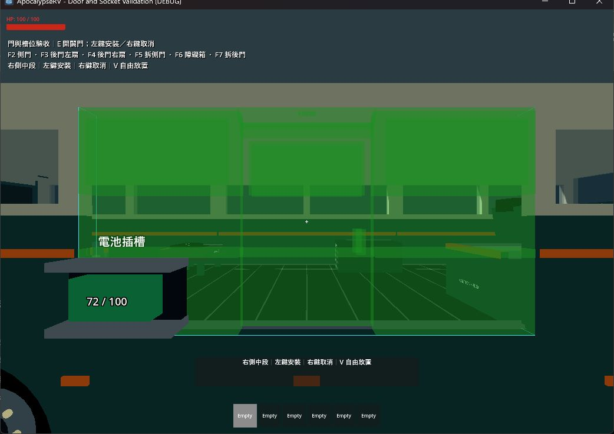
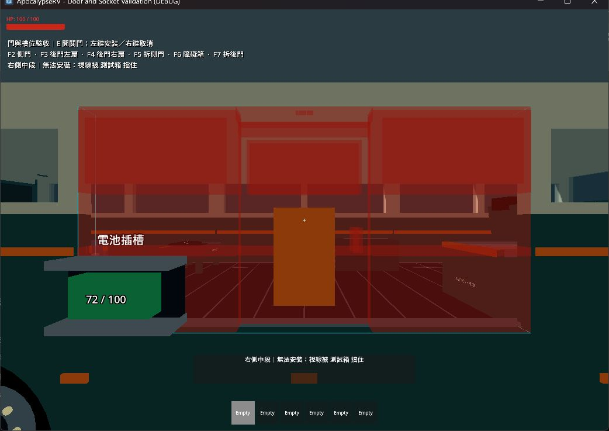
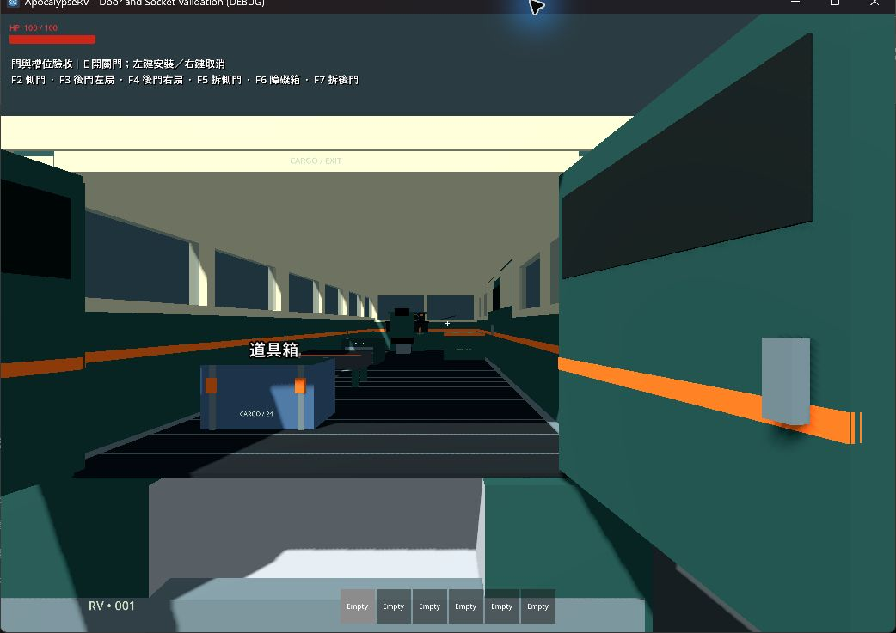
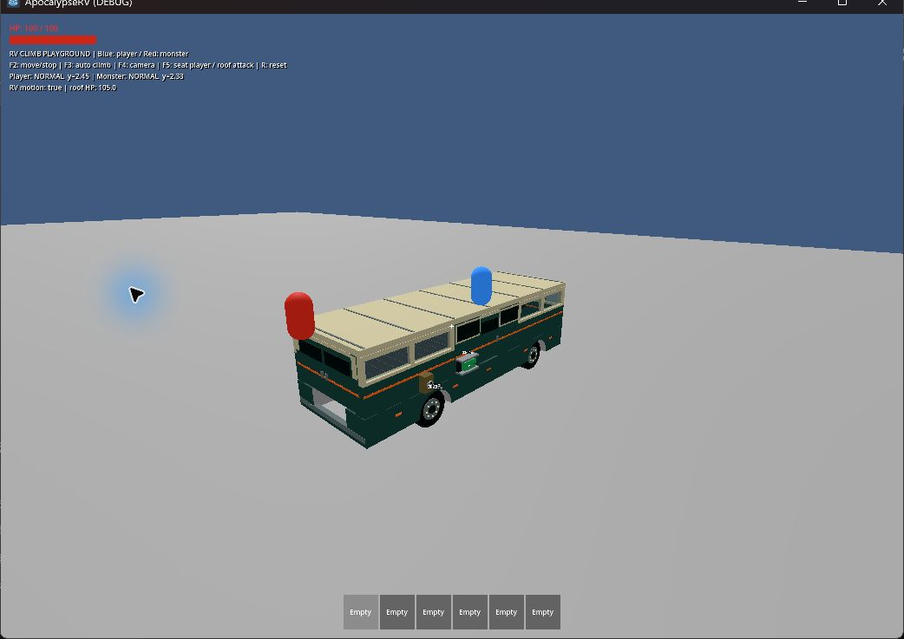
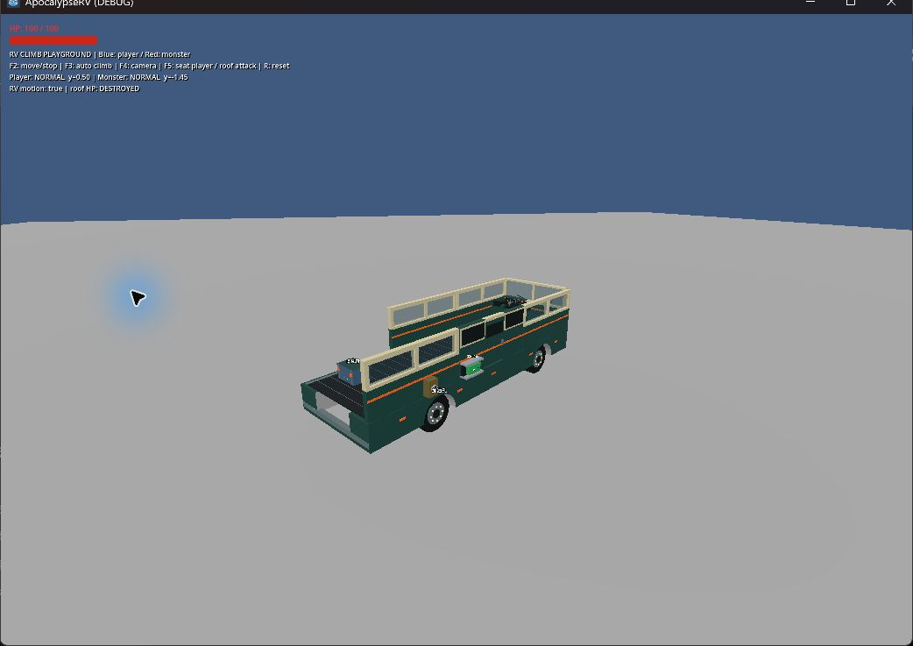

# RV 分片車殼、車門與安裝槽驗收（2026-09-16）

## 完成內容

面向車頭時，右側從前到後為牆／門／牆，左側為牆／牆／牆；後方為一組外開雙扇大門。側面分成六個獨立設備，後門整組另為一個設備；前窗與整片屋頂保留。

- E 操作瞄準的門扇；後門兩扇分別開關至 100°。固定框、門扇共用一組生命週期、HP、維修、搬移與存檔。
- 長 F 搬移整組，預覽先收攏門扇。取消恢復原角度，重新裝上則關閉。
- 底盤保存九個永久槽。拆除後仍能直接瞄準空槽，位置／朝向自動吻合；側牆、側門可交換六個側槽。左鍵安裝、右鍵取消，V 自由放置。
- 檢查占用、視線、實際碰撞與空間；紅色預覽提供阻擋原因和對象名稱，綠色表示可以安裝。
- 開關前檢查全段路徑，動畫中再檢查角色／物體進入；受阻停止，下一次 E 可反向。門扇不允許附掛設備，固定門框可用。
- 移動／破壞板件讓其附掛設備掉落，其他牆與屋頂各自支撐於底盤。取消不自動收回掉落設備或電池。
- 存檔保存槽位、實際門角度，拒絕重複槽、錯誤槽型／變換與非有限角度。v2 加入可選欄位，仍能讀取舊資料。
- 原廠位置的舊長側牆轉成三片，右中為側門；舊後牆轉後門，保留健康及設備依附。已移動的自訂舊牆不強制重排；不覆寫來源存檔。

## 自動檢查

本機 Godot 4.7.2；專案／CI 仍為 4.6.1，未在本機另做 4.6.1 驗證。

完整 scripts/test.ps1：資源匯入、全部 22 組 test_*.gd、主場景啟動通過，退出碼 0。日誌在 .godot/test-logs/。

新增 test_rv_structure_modules.gd 驗證正式 RV 的配置、九個槽占用、真實 E 射線選門、開啟後拆裝、取消還原、左鍵確認、傾斜底盤、占用與障礙提示、後門兩扇、掃掠阻擋、動畫動態阻擋、關門遇人後反向、門扇／門框安裝限制、存讀檔、舊長牆轉換及冪等性。最後新增的附掛設備掉落與關門反向案例另跑完整該測試，退出碼 0。

test_rv_cockpit 更新後門開口驗證；test_moving_rv_climbing 通過。曾抓到門扇比框薄造成攀爬撞上緣，現已讓門扇碰撞與框同厚 0.2 m，玩家和怪物都能登頂。

git diff --check 通過。

## 實機觀察

使用 computer-use skill 的 @oai/sky 操作測試遊戲視窗，未操作 Godot 編輯器。

1. 側門：E 開啟；進入搬移後原槽呈綠色；F6 放入測試箱後紅色，顯示「視線被 測試箱 擋住」；移除箱恢復綠色，滑鼠左鍵裝回。
2. 最新版後門：E 開左扇時右扇仍關閉；再瞄準右扇 E 打開，兩扇均向外。F7 測試捷徑搬移整組，立即收攏並對齊綠色原槽，實際左鍵安裝恢復完整關閉門組。
3. 最新版 rv_climb_playground -- --replay：觀察藍色玩家與紅色怪物攀上移動車頂，轉彎時維持在車上。F5 入座後怪物打壞屋頂，畫面顯示 DESTROYED，怪物高度從約 2.45 降至 1.45，落入車內。
4. 最新門片與攀爬可視回放日誌未見腳本錯誤，測試視窗已關閉。

測試場 F5／F7 直接呼叫正式搬移入口，方便重複操作；不代表人工長按 F 時長驗收。E／滑鼠使用正式互動管線。攀爬回放以腳本移動底盤，不能替代完整輪驅操控、翻車和怪物群驗收。

## 範圍限制

門片仍是 Equipment 凍結剛體的子碰撞；行駛中外開門撞到世界物件的力矩傳回底盤，沿用現有外掛設備物理限制，未視為已解決。未新增坡道／登車台階、門鎖或門片獨立 HP。屋頂仍一整片；可自由安裝不代表所有極端自訂造型都已驗收。
