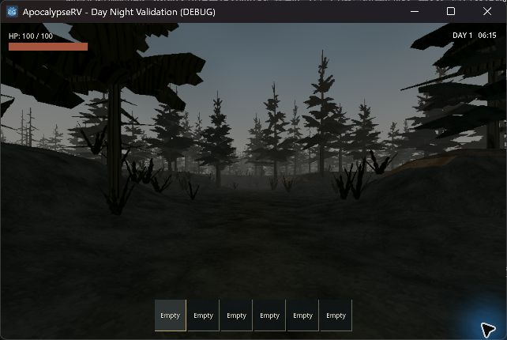
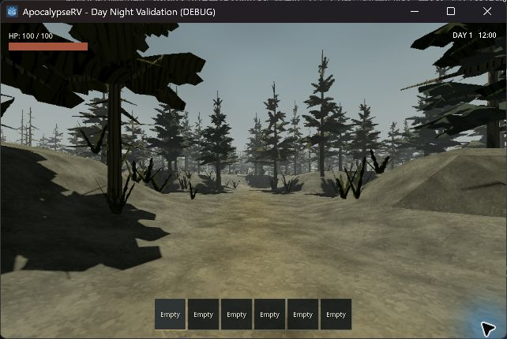
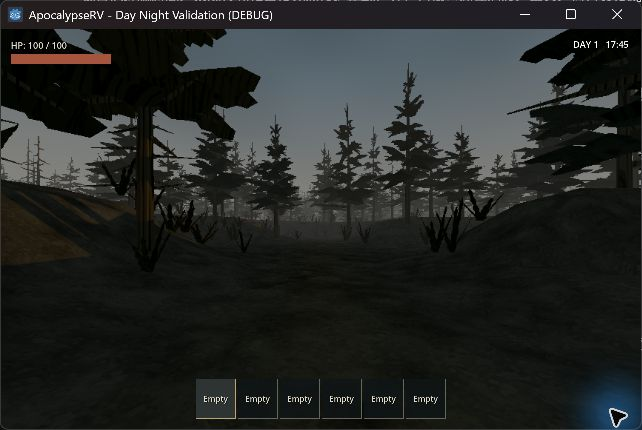
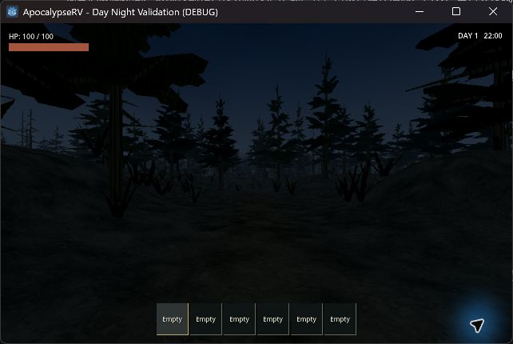
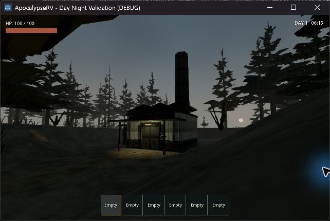
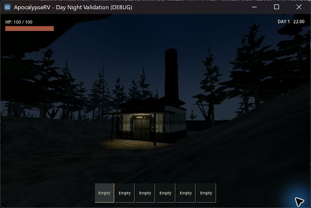
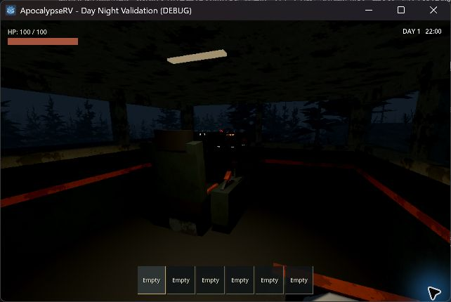
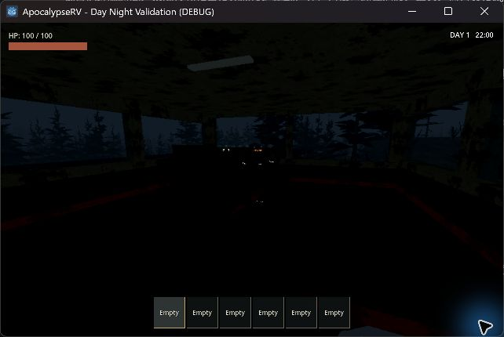
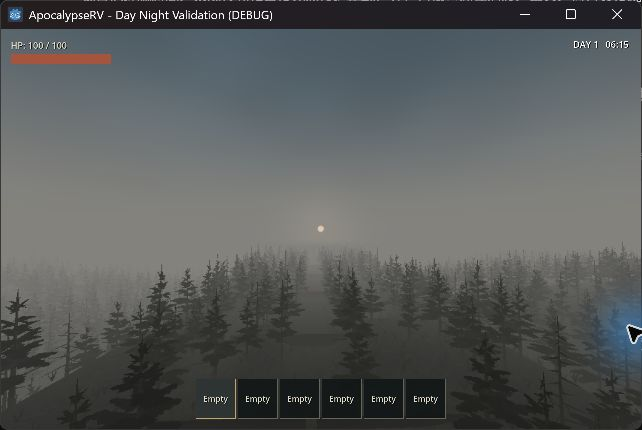

# 世界時間、太陽與日夜霧效 — 2026-09-17

## 已實作

- 正式世界從第 1 天 08:00 開始，現實 30 分鐘一天（1 秒 = 48 遊戲秒）。HUD 右上顯示天數／時間。
- 06:00 日出、18:00 日落，+X 升起、-X 落下，最高仰角約 58°。陰影由實際 DirectionalLight3D 移動，天空日輪共用同一方向。
- 保留陰天雲層；清晨／黃昏暖色、白天灰青、夜晚冷暗。日落後太陽光逐漸歸零，天空、環境光與霧色共同變化。
- 沿用 18–380 m 的平滑距離霧，日夜不突然更換能見度。夜間不沿用白天的亮灰霧，近景仍保留最低環境光。
- 室內 POI 使用獨立 World3D 照明，戶外時間持續；SceneTree 暫停停止時間。背包和設備 UI 不暫停世界。
- 檢查點 v3 增加可選 clock 狀態，保存累積秒數和一天長度。舊檢查點缺少此欄位使用第 1 天 08:00；資料只在記憶體相容處理，不覆寫來源檔案。沒有離線時間累積。

沒有加入月相、季節、睡眠跳時、動態天候或時間驅動的怪物生成。

## 實機畫面

Godot 4.7.2 / GL Compatibility / RTX 4060 Laptop，正式生成 seed 42、1280 × 800 視窗、約 540p 的 3D 渲染。四張使用同一林路鏡位；都是遊戲視窗擷取，沒有 AI 生成或後製。角落游標光暈來自桌面驗收工具。

| 清晨 06:15 | 正午 12:00 |
|---|---|
|  |  |

| 黃昏 17:45 | 夜晚 22:00 |
|---|---|
|  |  |

觀察：近景沒有重新被均勻灰霧蓋住；中遠樹群仍有深度。夜間路面和樹影可辨，物件細節較難看清，入口燈更有辨識作用。清晨和黃昏的整體光色相近，但光線從相反方向照入。

| 清晨入口與低空太陽 | 夜間入口燈 |
|---|---|
|  |  |

| 車內有電 | 車內沒電 |
|---|---|
|  |  |

另用測試鏡頭從公路上方 30 m 朝向太陽，確認日輪位置和霧中樹群層次；此圖不是玩家站立視角：



## 自動與實機驗證

新增 `test_world_clock.gd`：30 分鐘跨日、午夜連續性、分秒狀態恢復、不合法數值、SceneTree 暫停／繼續、日輪與光源方向一致、夜間太陽歸零及霧色同步。

擴充正式檢查點測試：落盤／讀回天數和時間、載入第一幀 HUD、舊存檔預設時間、NaN 拒絕。擴充正式室外搬運測試：進入 POI 後時間前進，改變戶外時段不更改室內光照，返回後保持夜晚。

實機加速日夜觀察：同一入口鏡位看到 06:31、12:58、19:51 和次日 08:10；日輪位置、建築受光面、投影和天空／霧色隨時間改變，跨日後時間持續。F8 原生／低解析度切換正常，測後恢復既有低解析度偏好。已關閉本次兩個測試視窗，保留使用者原有編輯器。

完整 `scripts/test.ps1`：exit 0；匯入、33 組行為測試與正式主場景啟動全部通過。正式搬運測試記錄約 97.08 秒，進入／離開同一 63 房副本成功，新加入的室內時間及存檔檢查均通過。實機日誌沒有 script／shader 錯誤；headless 的既有 Windows 根憑證讀取診斷仍由 runner 單獨排除。

未驗證：Godot 4.6.1 實機、多種顯示器暗部表現、整夜手動徒步／夜駕、獨立 GPU 效能量測。沒有宣稱距離霧已成為會遮擋燈光的體積霧。夜晚目前沒有隨身手電筒，長途徒步的可讀性仍值得後續玩家試玩。

## 重現

```powershell
godot --path . --log-file .godot/day-night.log res://tests/day_night_playground.tscn
powershell -NoProfile -ExecutionPolicy Bypass -File scripts/test.ps1
```

F1 切換四時段並停住時間；F12 在測試場景加速到 1 分鐘一天；Home 停住／繼續。F2 換鏡位，5 檢查日輪，F6 RV／駕駛室，F7 測試電池，F8 原生／低解析度，F11 隱藏測試文字。正式遊戲沒有調時快捷鍵。

日誌：`.godot/day-night-visual.log`、`.godot/day-night-final.log`、`.godot/clock-test.log`、`.godot/test-logs/`。

實作參考：[Godot 4.6 環境與光照](https://docs.godotengine.org/en/4.6/tutorials/3d/environment_and_post_processing.html)；具體太陽路徑與色彩曲線是本專案的美術設計，並非地理天文模擬。
