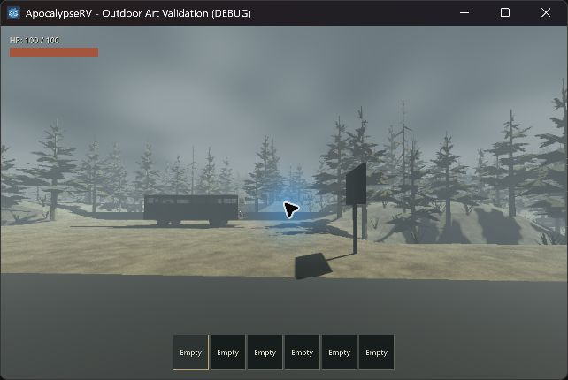
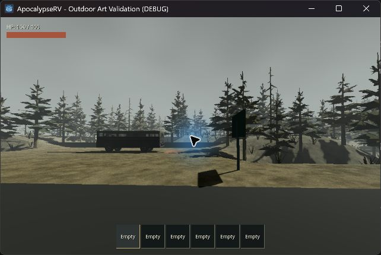
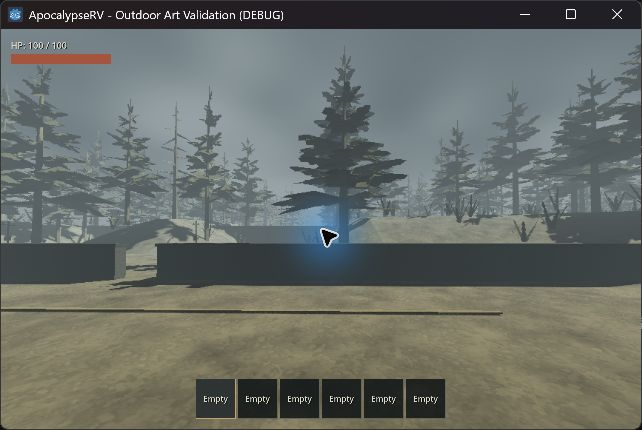
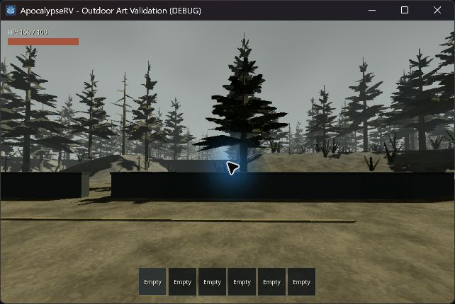
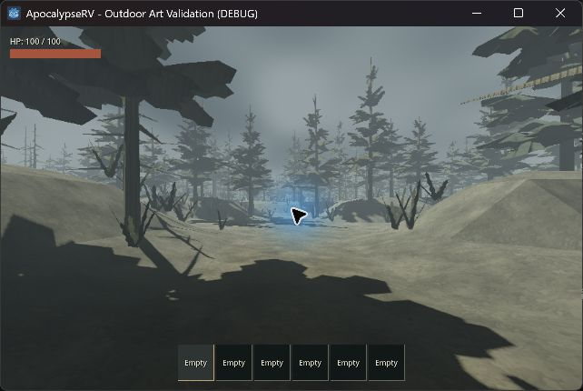
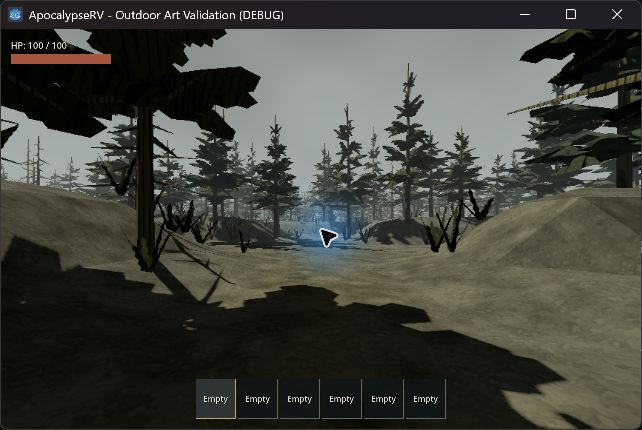
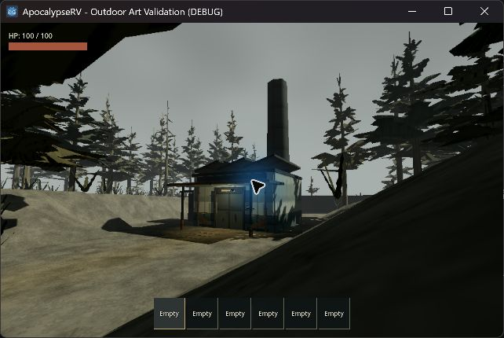

# 戶外霧效修正 — 2026-09-17

## 問題與調整

原 exponential fog density 0.011 在 35 m 已混入約 32% 霧色，90 m 約 63%，導致近處車體、樹幹和地形一起洗灰。天空使用另一組硬編碼色值與高對比雲噪聲，視覺上與地面霧層分離。

正式 WorldGenerator 改用原生 Depth fog：begin 18 m、end 380 m、curve 0.65、density 1。使用引擎的 smoothstep 距離曲線；約 35 m / 90 m / 180 m / 335 m 的霧混合量為 4% / 23% / 57% / 97%，近景保留明暗，遠方仍有濃霧。380 m 後完全融合；不是 18 m 突然出現一面霧牆。保留 335 m 建築的少量對比不等於每個停車角度都能看見建築，地形和樹仍可能遮住輪廓。

霧與天空共用 `a4aca9`，天空 uniform 標記 `source_color`。天際線不再疊加另一層均勻霧色，高處固定雲層的明暗差縮小。沒有新增體積霧、噪聲貼片或全螢幕霧濾鏡；照明強度、模型、路線、碰撞、生成及存檔沒有變更。

參考：[Godot 4.6 Environment](https://docs.godotengine.org/en/4.6/classes/class_environment.html#class-environment-property-fog-mode)、[Compatibility 霧混合實作](https://github.com/godotengine/godot/blob/4.6/drivers/gles3/shaders/scene.glsl)。百分比依此距離曲線計算，不代表現實能見度。

## 同視角實機對照

正式世界 seed 42，`tests/outdoor_horror_playground.tscn`，1280 × 800，約 540p 3D、原生 HUD。以下是遊戲視窗原始擷取，未經圖片生成或後製；中央藍色游標光暈來自桌面操作工具，不是霧或遊戲燈光。

| 視角 | 修改前 | 修改後 |
|---|---|---|
| 公路 |  |  |
| 停車處 |  |  |
| 林路 |  |  |

## 驗證

實機：Godot 4.7.2、GL Compatibility、RTX 4060 Laptop。公路、停車處、林路的近景洗灰明顯減少；遠樹仍淡入霧色，天際線色調一致。維修廠近處的門和煙囪可辨，F8 原生／低解析度切換正常，測後恢復低解析度偏好並關閉本次遊戲視窗。這是畫面觀察，主觀風格仍以玩家實際觀感為準。

自動驗證：`scripts/test.ps1` 完整 runner 結束、exit 0；資產匯入、32 組行為測試與正式主場景啟動全部通過。室外套件涵蓋 100 seed、導航、正式搬運／副本往返與顯示切換；沒有新增以參數等值為主的測試。日誌沒有腳本／shader／行為錯誤；headless 匯入仍有既有的 Windows 根憑證存取訊息，runner 僅排除該已知診斷。

本輪未量測 GPU 效能、未重新執行手動搬運／駕駛，未驗證 Godot 4.6.1 實機。仍是全場共用的距離霧，沒有山谷局部霧團、光柱或動態天候；那些需要另行設計，不宣稱已完成。

日誌：`.godot/fog-before.log`、`.godot/fog-final.log`、`.godot/fog-import.log`、`.godot/test-logs/`。F2 切換固定視角，F11 隱藏測試文字，F8 切換解析度效果。
