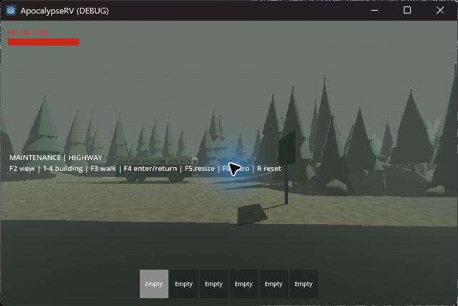
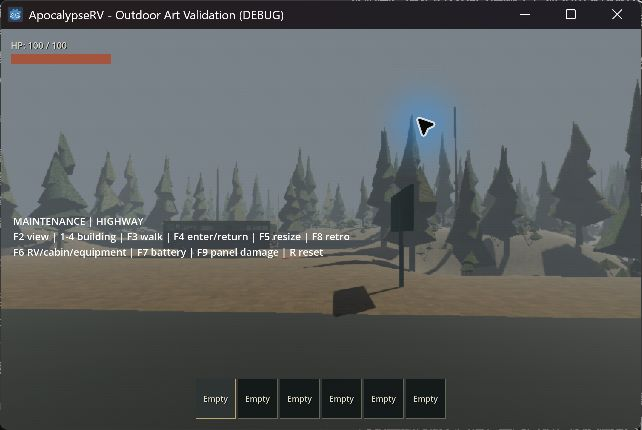

# 室外與 RV 工業恐怖美術驗收

日期：2026-09-17。Godot 4.7.2 Compatibility；專案／CI 目標仍為 4.6.1。

## 完成內容

- 原創掉漆金屬與落葉泥地紋理由內建 image_gen 生成，原檔保存於 `assets/materials/industrial`；匯入限制 512px 並產生 mipmap。完整提示詞及來源見 [材質說明](../../assets/materials/industrial/README.md)。樹皮與礦物材質使用 256px 程序紋理。
- 四款不對稱針葉樹、兩款枯樹、三款灌叢，九批 MultiMesh。模型只建立一次；外觀 RNG 與原樹位／碰撞 RNG 分開。簡化灌叢面數、使用 UV 取樣並讓小灌叢只接收陰影；樹冠和實體地形保留主要投影。
- 室外冷灰霧、冷色環境光、較明確的陰影；泥地使用兩個尺度的紋理取樣降低重複。維持原霧密度 0.009、FOV、世界尺度與路線。
- 四款建築增加外露管線、門框固定件、底部修補板、實體工業標牌與暖色入口燈。只修改室外材質覆寫，不污染室內共用資源。
- RV 深綠／奶油白外殼與現有設備使用共用掉漆材質，儀表加固定件。玻璃、發光狀態燈保持獨立；耐久損傷疊加於底材，修復保留正常老舊外觀。
- 車頂附屬暖燈由既有待機供電涵蓋，無新增開關或保存欄位；缺電、車頂失效、搬移或拆離時熄滅。
- 原生解析度的生命、背包、駕駛 HUD、平板及道具箱採暗底、方角框線、灰白字／暗黃強調；保留原字體中文 fallback、布局及操作。

## 驗證方法

- 新增 `test_art_presentation.gd`：正式 RV 的供電／缺電／拆頂照明、健康／損傷／修復底材、四款入口契約、室內資源不變，以及曾出現的反向樹冠法線回歸。
- 完整 runner 包含正式玩家搬運、怪物導航、RV 操作、引擎／存檔、100 seed 場址與復古顯示切換。
- 可見測試使用正式世界 `outdoor_horror_playground.tscn`、seed 42、相同啟動解析度參數及同一 F3 攜引擎路線；效能樣本期間不另跑 headless suites。

## 自動測試結果

完整 `scripts/test.ps1` 執行結束（exit 0）：資產匯入、**31 組 test_*.gd**、主場景啟動全部 PASS。另針對最後的植被材質微調重跑 `test_art_presentation.gd` 通過。`git diff --check` 通過。測試使用隔離的 `.godot/boarding-user` APPDATA，不覆寫使用者正式檢查點。

## 實機與截圖

改造前與改造後使用相同公路視角。

可見測試已確認：四款入口的量體、門燈與近景標牌，RV 外觀／側牆重傷、駕駛室有電／缺電、車內設備及走道；F8 原生／復古顯示及 960×720／1280×800 視窗切換，文字與比例正常。使用正式平板開啟流程、滑鼠頭燈按鈕和 Esc 關閉；正式玩家攜引擎 96.93 秒抵達門口，以 E 進入副本並返回，手持道具保留。

| 畫面 | 證據 |
|---|---|
| 林間路線 | [攜引擎穿越林帶](images/2026-09-17-art-carry-trail.jpg) |
| 四款入口 | [維修廠](images/2026-09-17-art-maintenance.jpg)、[倉庫](images/2026-09-17-art-warehouse.jpg)、[泵站](images/2026-09-17-art-pump.jpg)、[研究站](images/2026-09-17-art-research.jpg) |
| 車身與損傷 | [RV](images/2026-09-17-art-rv.jpg)、[重傷側牆](images/2026-09-17-art-rv-damaged.jpg) |
| 車內供電 | [有電](images/2026-09-17-art-cabin-powered.jpg)、[缺電](images/2026-09-17-art-cabin-no-power.jpg)、[設備與走道](images/2026-09-17-art-equipment.jpg) |
| 顯示與介面 | [平板](images/2026-09-17-art-tablet.jpg)、[原生解析度](images/2026-09-17-art-native-resolution.jpg) |
| 搬運與切換 | [抵達](images/2026-09-17-art-after-carry.jpg)、[進入副本](images/2026-09-17-art-interior-transition.jpg) |

截圖中的視角名稱／F 鍵文字為測試場提示，藍色游標光圈為桌面操作工具顯示，均非新增的正式 HUD。車身損傷、電量和外觀切換以測試場快捷鍵設置，沒有把這些按鍵加入正式遊戲。

## 效能

RTX 4060 Laptop GPU、Godot 4.7.2 OpenGL Compatibility；啟動參數 `--resolution 1280x800`，復古效果開啟。所有比較都是 seed 42 的同一條 96.93 秒攜引擎路線，樣本期間沒有另跑 headless suites，其他原已開啟視窗保持不動。以下 frame delta 受約 165 Hz 上限限制，並非未限幀 GPU 基準。

| 版本 | Render frames | Median | p95 |
|---|---:|---:|---:|
| 改造前 | 15923 | 6.06 ms | 6.06 ms |
| 初版美術（未採用） | 12310 | 6.69 ms | 10.0 ms |
| 定稿 | 15892 | 6.06 ms | 6.25 ms |

初版的高面數灌叢及三向紋理投影成本過高，已精簡為單一 UV 取樣、低面數分枝及葉團，小灌叢只接收陰影。最終 p95 約增加 **3.1%**，符合本機同條件下增加不超過 10% 的目標；前一輪優化樣本同樣為 6.25 ms。

最終初始三帶建立約 1.8–2.0 秒／帶，仍有同步啟動等待；補載帶的 build_ms 約 1676 ms，最大單片 max_slice_ms **82.2 ms**。這是生成尖峰，與穩態 p95 分開記錄，不代表已解決串流卡頓。原始樣本位於 `.godot/art-before.log`、`.godot/art-final.log`、`.godot/art-optimized.log`、`.godot/art-final-benchmark.log`（快取不提交）。

## 相容性與限制

- 檢查點格式及世界生成版本不變。既有存檔保留地形、樹位、碰撞、物資 RNG 與入口 ID；舊生成版本仍使用其原本的植物配置。
- 本輪不修改副本室內 3D 美術，不增加聲音、動態天候、怪物或玩法。沒有新增葉片／霧的 AI 潛行判定。
- 完整搬運的實機樣本為 seed 42；100 seed 是既有資料／地形測試，非 100 次完整可見遊玩。
- 初始生成及串流尖峰依然存在，不能將平均影格率當成無停頓保證。未本地執行 Godot 4.6.1，也沒有跨硬體效能保證。
- 保留使用者原有的 `world/test_world.tscn` 修改；本輪沒有提交 commit。
