# 正式戶外 D 風格驗收

日期：2026-09-17。目標依據：[D 修正版](../art_targets/outdoor/2026-09-17-d-revision.md)。本文件圖片為實際 Godot 畫面，AI 目標圖只用來確定美術方向。

## 正式實作

- 正式主世界使用不規則分叉低模樹冠、稜面樹幹與粗葉脈；不透明網格提供真實陰影，不使用細密透明針葉疊層。
- 地面保留原高度與碰撞，用三角面法線、大片泥土色塊及低頻污痕減少細碎貼圖噪點。
- 固定雲層、冷灰霧、較低環境填光與較明確的方向光，分離近景陰影、中景通道與遠景樹群。
- F8 保留約 540p 的 3D viewport 縮放，移除第二次像素格取樣及固定抖色；UI、背包與操作文字不縮放。
- 四款入口共用新的結構化面板／混凝土材質，保留入口與返回點；沒有併入舊樣板的高窗量體或改造副本室內。
- 樹與灌叢依 48m 空間格子繪製，裁切距離分別 340m／160m，16m 遲滯；保存生成版本、樹位、步道、碰撞及 RNG 不變。
- 原有獨立樣板仍可執行，F1 的基準是現在的正式外觀，不是歷史畫面的凍結副本。

## 截圖

| 修改前林路 | 正式 D 方向林路 |
|---|---|
| 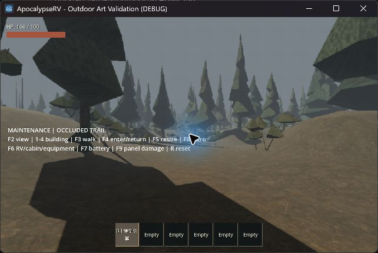 | 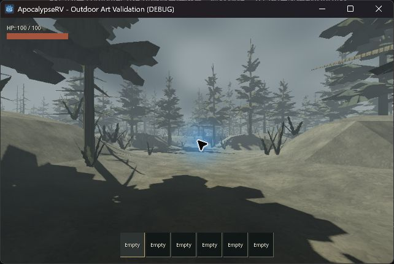 |

| 公路 | 停車區 | 原生解析度 |
|---|---|---|
| 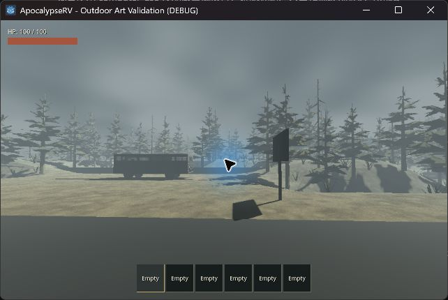 | 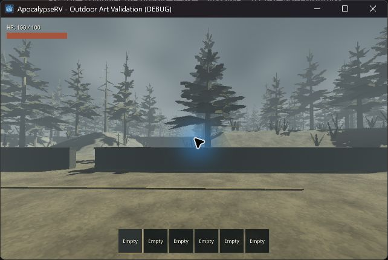 | 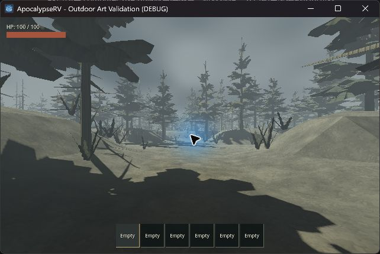 |

| 維修廠 | 倉庫 |
|---|---|
| 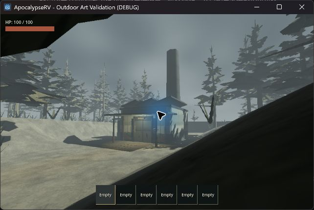 | 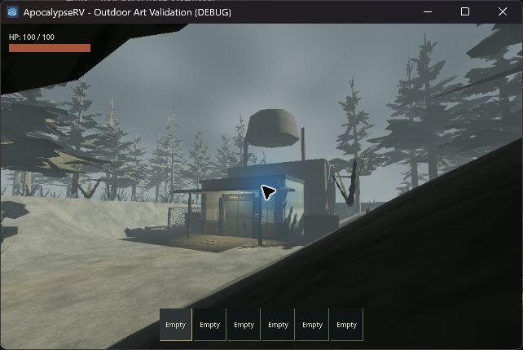 |
| 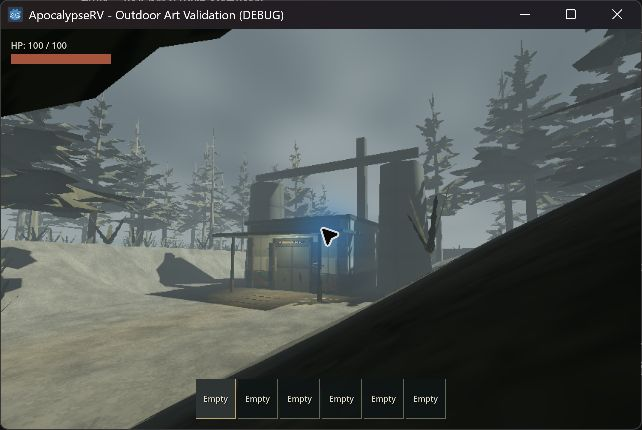 | 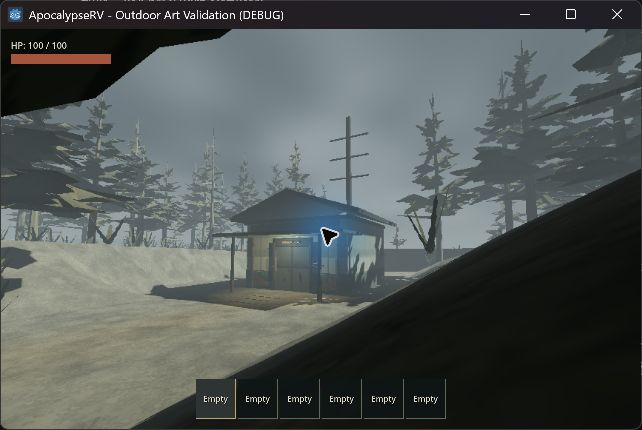 |

| RV | 駕駛室 |
|---|---|
| 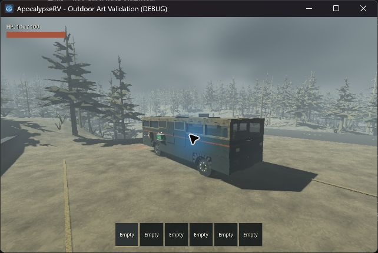 | 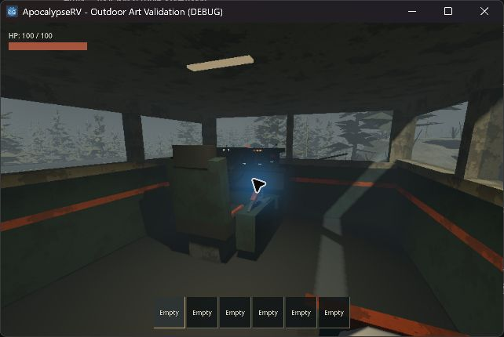 |

截圖由 computer-use 原樣保存，藍色滑鼠光圈是桌面工具的游標效果，不是遊戲燈光或 shader。前後圖使用相同 seed 42 與固定林路鏡位；前圖保留驗收文字，後圖 F11 隱藏驗收文字。

## 自動與實機驗證

### 自動檢查

完整 `scripts/test.ps1` 完成：import、32 組行為測試、main-scene 啟動全部 PASS，退出碼 0。最終 32 份測試 log 均有 PASS，未發現 SCRIPT ERROR／FAIL／崩潰。受限環境的 OS 憑證存取診斷由既有 runner 精確排除，未忽略其他錯誤。

包含 100 seed 場址重現、坡度／入口支撐、跨區導航、RV 停車與窄口拒絕、怪物追擊、正式角色引擎搬運、實際入口及副本返回、油桶回程、檢查點與引擎狀態、車輛設備及供電。新增檢查確認每個正式森林 chunk 的樹木實例數與碰撞數一致。完整測試是在最終程式修改後執行。

### 可見實機觀察

已查看正式公路、停車灣、林路、四款入口、RV 外觀及駕駛室；F8 原生／低解析度、F5 視窗尺寸切換後 UI 仍可辨認。靜態圖保留上述各視角。最後一輪正式搬運與效能結果記錄如下。

可見場景中，F3 以腳本持續輸入驅動正式玩家攜引擎走完 96.933 秒路線；門前 F4 送出正式 interact 輸入，成功進入 63 房副本。室內再按 F4 透過正式副本管理器返回，戶外霧與顯示恢復，引擎仍在手中。這是正式角色的腳本路線驗收，不是全程人工 WASD 自由探索。

| 已進入副本 | 已返回戶外 |
|---|---|
| 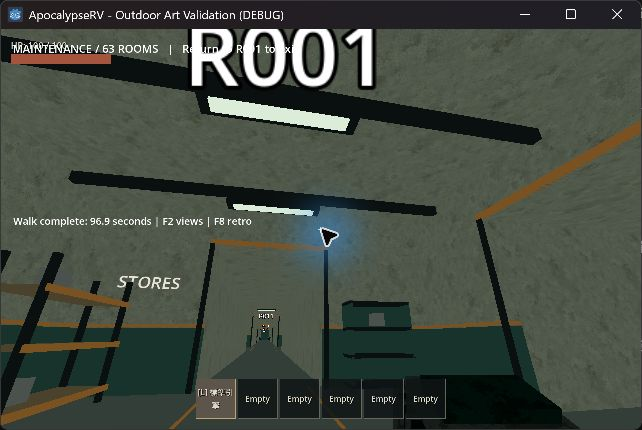 | 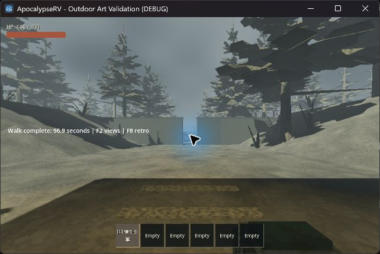 |

已在真實 GL Compatibility 渲染器核對 4,714 棵樹的 MultiMesh 變換，最大位置誤差 0.000000954m。Godot headless dummy renderer 的 get_instance_transform 回傳單位變換，因此 headless 測試只檢查實例與碰撞數量，GPU 座標另由可見測試場景驗證；最小獨立 probe 已重現這個限制。

### 固定路線效能

同一台 RTX 4060 Laptop、Godot 4.7.2、GL Compatibility、seed 42、1280 × 800 視窗、F8 開啟；正式角色攜引擎走同一條路，前後各一次。兩次量測時都沒有其他測試程序同時執行；遊戲有約 165Hz 的上限，因此數據不是無上限 GPU 效能測試。

| 版本 | 路程時間 | 渲染幀數 | 中位影格時間 | p95 |
|---|---:|---:|---:|---:|
| 修改前正式版 | 96.933s | 15,885 | 6.061ms | 6.061ms |
| 正式 D 方向 | 96.933s | 15,855 | 6.061ms | 6.250ms |

p95 增加約 3.1%（0.189ms）。此數字只代表上述單次固定路線，不是最低配置保證。串流仍有原有停頓：可見新版記錄的 band -2 建立為 1592.9ms 累計處理時間，最長切片 81.6ms；這次沒有消除地形／導航建立尖峰。

關鍵原始紀錄：

```text
VISIBLE FOREST ALIGN trees=4714 max_error_m=0.00000095367432
HORROR WALK complete seconds=96.9333333333291 frames=15855
HORROR FRAME median_ms=6.06060606060606 p95_ms=6.25
POI ENTER: v4:42:stop:0 rooms=63
POI EXIT: v4:42:stop:0
```

本機完整 logs：`.godot/outdoor-d-before.log`、`.godot/outdoor-d-verified.log`、`.godot/test-logs/`。快取不納入提交；上表及摘錄保存在本文件。

## 範圍與限制

- D 是美術方向而非逐物件施工圖。正式地形與遠距入口保持原配置，未把約 97 秒步道縮成目標圖的同框近距場景。
- 這輪沒有增加地形起伏、岩石碰撞或新的物件配置，因此程序世界仍有較開闊的停車區；不是每個鏡位都會重現 D 的粗樹幹構圖。
- 原生與低解析度可玩性需分別判斷；靜態截圖不證明移動中完全無鋸齒或裁切跳變。
- 未重新驗收輪驅操控、翻車、多人、其他硬體；本機是 Godot 4.7.2／RTX 4060 Laptop／GL Compatibility，未在專案目標 Godot 4.6.1 上另跑一次。
- 未新增天候、音效、怪物機制、VHS 干擾、鏡頭晃動或頭盔遮罩。

## 重現

```powershell
godot --path . --resolution 1280x800 --log-file .godot/outdoor-d.log res://tests/outdoor_horror_playground.tscn
```

F2 切換固定視角、1–4 切換入口外觀、F3 使用正式玩家攜引擎走完整路線、F4 門前互動／返回、F5 視窗尺寸、F6 RV／駕駛室／設備、F8 顯示模式、F11 隱藏驗收文字。這些是測試場景按鍵；正式世界入口與存檔操作沿用 README。
