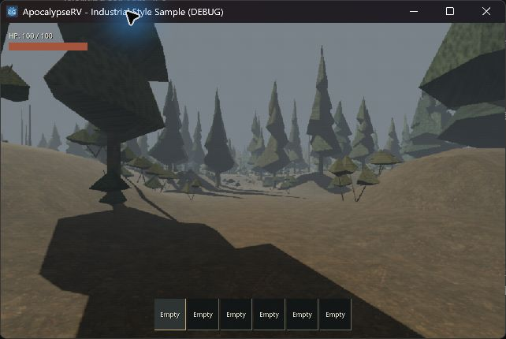
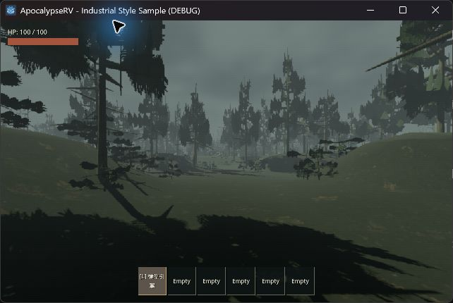
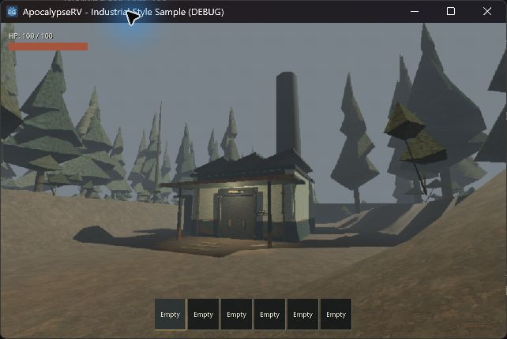
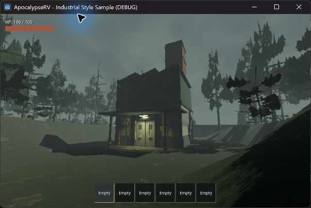
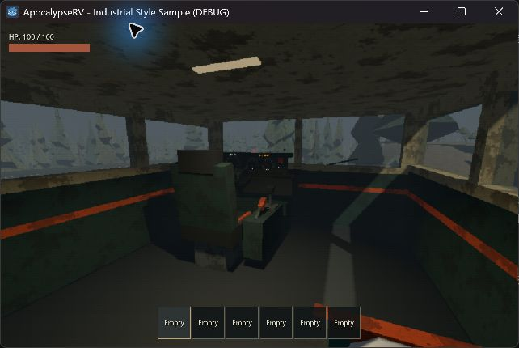
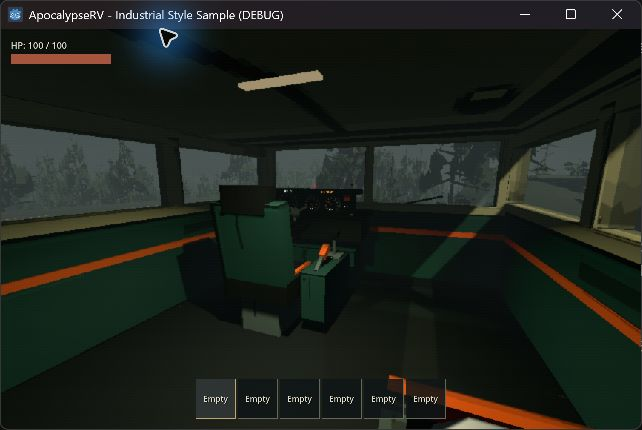

# 工業恐怖美術樣板驗收

日期：2026-09-17。Godot 4.7.2 Compatibility；目標／CI 仍為 4.6.1。

## 交付與範圍

新增 `tests/industrial_style_playground.tscn`：使用正式世界 seed 42、完整 RV、玩家、既有地形與步道、維修廠入口和副本管理器。以 F1 在相同視角切換上一輪美術與樣板，不修改主場景的預設外觀，不改生成版本或檢查點資料。

- 原創分枝樹幹、枯枝、透明裁切針葉與灌叢；沿用原 MultiMesh 位置、數量和樹幹碰撞。新舊資源分開持有。
- 原創 SVG 面板、混凝土、樹皮、針葉；面板強調結構接縫、螺栓、邊緣與底部磨耗。詳見 [資產來源](../../assets/materials/style_sample/README.md)。
- 維修廠增加高窗量體、鋸齒屋頂、煙囪束帶、外露管線、門框、警告標牌與門口燈光。
- 降低環境補光，使用較暗泥地與固定陰天雲層；霧密度仍為 0.009，FOV 與復古效果程式保持原設定。
- RV 使用局部結構材質與照明調整，保留 PanelWear 損傷／修復和車內燈的正式供電判定。

沒有新增密錄器晃動、魚眼、頭盔遮罩、動態噪聲、聲音或天候玩法。沒有把全螢幕描邊作為本次風格成立的前提。

## 對照畫面

兩組皆為相同樣板視角、seed、位置和視窗條件。前後比較的是整套造型／材質／光影，不是單獨一個 shader 的效果。

### 林路

| 原版 | 樣板 |
|---|---|
|  |  |

### 維修廠入口

| 原版 | 樣板 |
|---|---|
|  |  |

### RV 駕駛室

| 原版 | 樣板 |
|---|---|
|  |  |

另見 [RV 外觀](images/2026-09-17-style-rv.jpg)、[原生解析度入口](images/2026-09-17-style-native.jpg)。截圖保留正式 HUD；F11 只隱藏測試說明。藍色游標光圈是桌面操作工具顯示，不是遊戲特效。

## 驗證

獨立 `test_outdoor_style_sample.gd` 已通過：A/B 資源還原、碰撞數量與入口變換不變、真實牆板損傷與修復、正式角色攜引擎約 96.93 秒走完路線、真實 E 射線進入副本、返回點暢通且引擎 ID 保留。初次測試發現 headless 下直接 duplicate MultiMesh 的緩衝區錯誤，改為新建 MultiMesh 並逐個搬移 transform 後重跑通過；沒有忽略該錯誤。

完整 `scripts/test.ps1` 已完成（exit 0）：資產匯入、**32 組行為測試與主場景啟動全部通過**。包含樣板專屬測試、100 seed 場址檢查與原有 RV／怪物／存檔回歸。末尾另修正了樣板說明中無效的四建築選擇提示。測試使用隔離 `.godot/boarding-user` APPDATA，不寫入正式玩家檢查點。

實機已觀察固定視角的林路／建築／RV、F1 還原、F8 原生／復古，以及有電／缺電車內照明。初版針葉過稀，已擴大分枝與葉簇，保留不規則缺口。

最終分區版另以可見正式角色完成 96.93 秒搬運、門口 E 進入 63 房副本、攜同一引擎返回室外；[室內證據](images/2026-09-17-style-interior.jpg)。入口固定比較鏡位置於建築局部 `(8, 2.2, 19)`，避免鏡頭卡進近景樹枝；A/B 共用此鏡位，玩家行走視角不變。

## 效能與分區優化

RTX 4060 Laptop、Godot 4.7.2 OpenGL Compatibility；啟動參數 `--resolution 1280x800`，F8 開啟，seed 42，相同 96.93 秒實際攜引擎路線。量測時沒有同時跑自動測試。數據受約 165 Hz 上限影響，不是未限幀 GPU benchmark；各版只有單次樣本。

第一版將較複雜的針葉直接放進跨 900m 的整帶 MultiMesh，p95 從原版 6.06 ms 升到 17.31 ms。後續將**樣板外觀**依 48m 格子分批；樹木批次距離 300m、灌叢 110m，邊界保留 12m 遲滯。原始位置、數量與碰撞仍不變。這是距離裁切而非透明淡出，遠處植物仍可能看到切換；正式擴展前需要評估 LOD／更細的過渡。

分區優化在完整 runner 之後完成，已另重跑 `test_outdoor_style_sample.gd`：完整植物數量、A/B 還原、正式引擎搬運、門口 E 進入與返回皆 PASS，無新增腳本錯誤。完整 runner 的其他正式系統未因這次樣板分批而改動。

| 可見路線版本 | 渲染影格數 | Median | p95 |
|---|---:|---:|---:|
| 原版 | 15880 | 6.06 ms | 6.06 ms |
| 未分區樣板（未採用） | 8193 | 10.00 ms | 17.31 ms |
| 最終分區樣板 | 15644 | 6.06 ms | 6.94 ms |

最終 p95 比原版增加約 **14.6%（0.88 ms）**，比未分區樣板降低約 60%。這是可玩樣板的單機結果，仍高於上一輪曾採用的 10% 預算，不能宣稱完全無額外成本。最終補載一帶的生成 max_slice_ms 約 77.9 ms，原有串流尖峰仍存在。原始紀錄為 `.godot/style-final.log`（原版／未分區）、`.godot/style-cells-final.log`（最終分區）；未提交快取。

## 操作

```powershell
godot --path . --log-file .godot/style-sample.log res://tests/industrial_style_playground.tscn
```

- F1：整套新舊美術比較。
- F2：公路、停車處、林路、入口、回望五個固定視角。
- F3：正式玩家攜引擎自動走完整條既有路線；F2 停止。
- F4：路線終點使用實際 E 互動；室內返回。
- F5：切換視窗尺寸；F6：RV／駕駛室／設備視角。
- F7：測試電量；F8：復古效果；F9：測試側牆損傷；F10：平板。
- F11：隱藏樣板說明；R：重載。

## 限制與正式擴展前工作

- 本次是可玩的美術比較場景。新增上層建築量體尚未擴充碰撞與屋頂攀爬規則，不能當作可探索的二樓；正式套用前必須補做對應物理與導航設計。
- 僅維修廠使用新立面；其他三款入口及副本室內仍待後續風格統一。
- 樣板樹形更複雜且使用裁切葉片；不能沿用上一輪約 3.1% 的效能數字宣稱本輪成本。
- 未改動原始樹幹碰撞、地形與場址配置；樹冠／灌叢仍是視覺遮蔽，不新增 AI 潛行規則。
- 樣板未取代主場景。既有使用者 `world/test_world.tscn` 改動與上一輪未提交工作保留；本輪未提交 commit。
- 本機未執行 Godot 4.6.1，也未做跨硬體比較。
