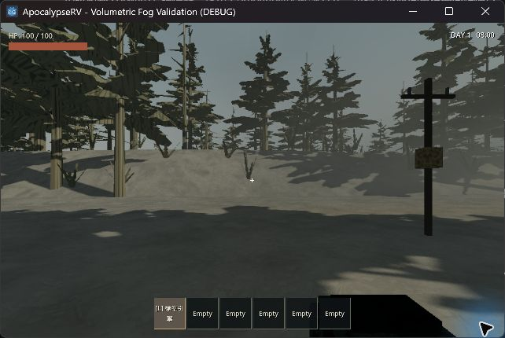
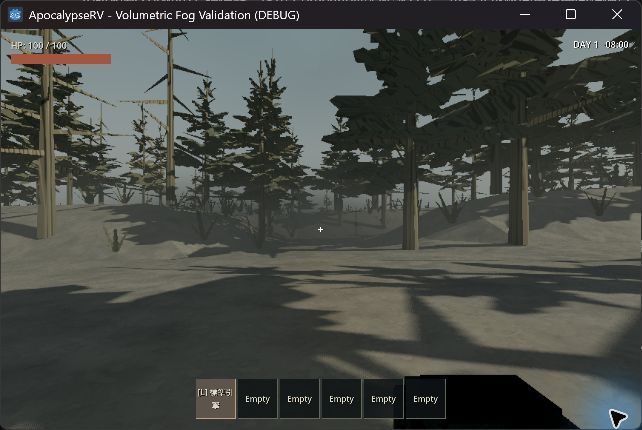
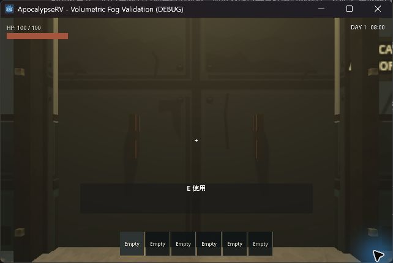
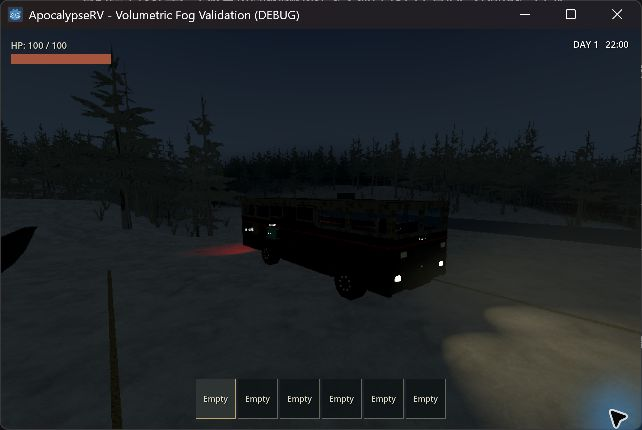
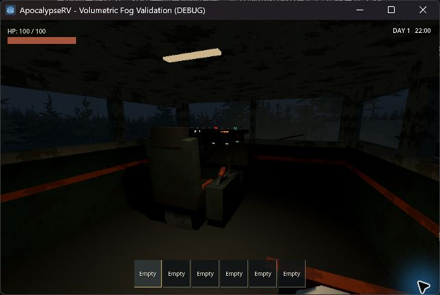
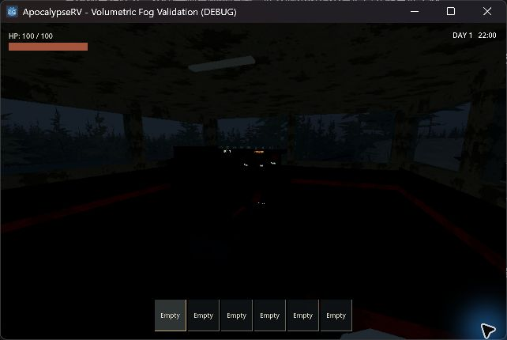
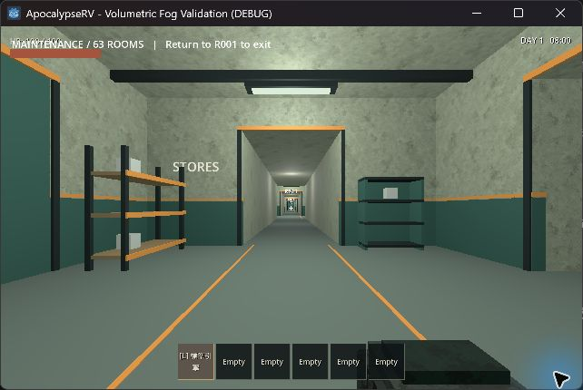

# 局部體積霧 — 2026-09-17

## 方向

使用 Godot 原生 Forward+ 體積霧與 FogVolume。林地／低處有固定於世界的霧團，步道霧依實際路線高度生成，邊緣、高度和密度以平滑函式與低頻 3D 噪聲變化。密度不再只由相機距離決定，光源和陰影能參與霧的照明。

遠景保留較弱的距離霧（160–420 m、curve 1.8），負責遠處融合與串流邊界。近中景用體積霧：全域薄霧 density 0.0015、局部 density 0.14、長度 160 m、detail spread 2.0、時間重投影 0.8。局部霧沒有自發光。試作 detail spread 0.6 讓近處門面出現霧光滲入；改為 2.0，把更多取樣集中於近景，並重啟實機檢查入口。

霧團以專用 RNG 生成，隨 terrain chunk 建立和回收，不參與導航／碰撞或物資抽取。抬高的人工步道另以 route 座標作霧團錨點，不把霧埋在周圍低地。舊世界生成版本不重排地形或設備。

完整安裝的車頂持有車廂排霧區，跟著車體移動；車頂拆下或失效則停用。室內副本仍使用獨立 World3D，不添加戶外霧。

Compatibility 路徑保留原有距離霧作降級顯示，不建立不支援的 FogVolume。這個降級不等同體積霧。

## 測試與畫面

實機環境：Godot 4.7.2、RTX 4060 Laptop、Vulkan Forward+、1280 × 800 視窗、約 540p 3D。使用正式 seed 42 的搬運路線和日夜時鐘，場景 `tests/volumetric_fog_playground.tscn`。

測試中使用者另有遊戲視窗運行，保留未關閉。因此效能結果只作同條件比較，不視為獨占 GPU 的上限或與先前日期效能直接相比。

### 自動驗證

`scripts/test.ps1` 全數通過：資產匯入、34 組行為測試及正式主場景啟動。新增測試檢查 20 seed 的霧位置重現、物資 RNG 獨立、chunk 所有權、抬高步道霧團位置與不支援渲染器的降級；既有測試涵蓋室內霧隔離與車頂安裝狀態。Headless runner 不驗證 GPU 畫面，Forward+ 由下列實機檢查補足。

### 實機觀察

- 正式玩家攜引擎走完 seed 42 路線；進入 63 房副本、返回戶外，攜帶物保留。室內沒有戶外霧。
- 22:00 頭燈照亮地面，駕駛室無明顯霧層；電池歸零後車內燈熄滅，恢復電量後重新亮起。
- 修正近景取樣後，貼近門面可讀；E 提示、背包格與時間 HUD 保持清楚。
- 本機 visible Vulkan 日誌沒有腳本或 shader 錯誤。

### 效能

相同 Forward+、seed 42、08:00、約 488 m 搬運路線，各次耗時 96.933 秒。測量取自既有回放的逐幀 delta，並非 GPU timer。測量時沒有同時執行測試 runner，但使用者原本的遊戲仍開著；顯示器約 165 Hz 限制中位數。下表保留試作紀錄，最終設定另列。

| 設定 | 中位數 ms | p95 ms | 日誌 |
|---|---:|---:|---|
| 舊距離霧（同 Forward+） | 6.06 | 6.25 | `.godot/volume-tuned.log` |
| 試作體積霧（spread 0.6） | 6.06 | 6.67 | `.godot/volume-final.log` |
| 最終體積霧（spread 2.0） | 6.06 | 6.06 | `.godot/volume-final2.log` |

最終回放共 15,949 幀，96.933 秒完成；未觀察到持續掉幀。各次資料受同步上限與其他視窗負載影響，不能由此宣稱新霧比舊霧更快，也不是所有硬體的效能保證。

### 最終設定實機截圖








副本隔離檢查（spread 0.6 階段，室內環境不受此參數影響）：



截圖為電腦操作工具直接擷取，藍色游標外框來自工具，不屬遊戲效果。

### 限制

未驗證低階／整合顯示卡、Godot 4.6.1 GPU 路徑、多車、快速駕駛時的時間重投影拖影及長時間串流。新的局部霧只改渲染，沒有宣稱改變怪物視線判定。仍有原有地形初次生成停頓，不把它視為此輪已解決的問題。

## 重現

```powershell
godot --path . --rendering-method forward_plus --rendering-driver vulkan --log-file .godot/volume.log res://tests/volumetric_fog_playground.tscn
```

專案桌面預設已切為 Forward+／Vulkan，重新啟動遊戲／重新載入編輯器後生效。Compatibility 降級：`godot --path . --rendering-method gl_compatibility --rendering-driver opengl3`。啟動測試場景末尾加 `-- --entry` 可直接站在入口檢查近景。

B 在同一 Forward+ 渲染器下切換新／舊霧，F1 四時段、F2 視角、F3 正式玩家搬引擎回放、F4 正式入口／返回、F6 車外／駕駛室、F7 電池，F8 解析度、F11 隱藏測試文字。數字 7／8 暫時調局部霧密度；這些霧調校鍵不進正式遊戲。

參考：[Godot 4.6 FogVolume](https://docs.godotengine.org/en/4.6/classes/class_fogvolume.html)、[Fog shader](https://docs.godotengine.org/en/4.6/tutorials/shaders/shader_reference/fog_shader.html)、[Environment](https://docs.godotengine.org/en/4.6/classes/class_environment.html#class-environment-property-volumetric-fog-enabled)。
