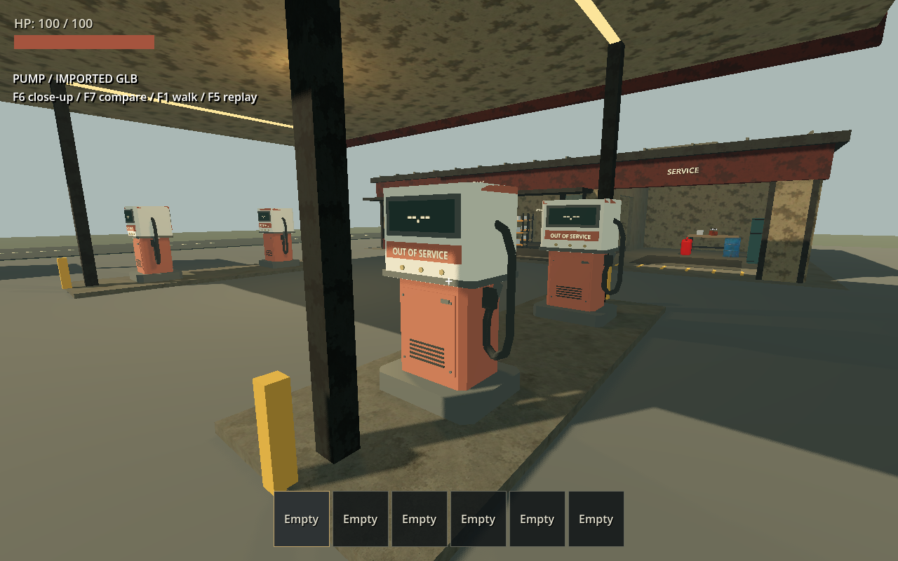
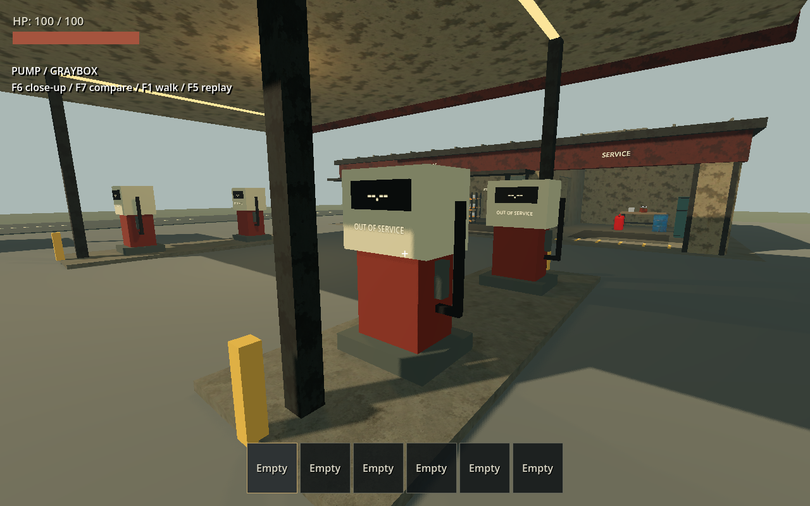

# 加油機 GLB 替換驗證

日期：2026-09-19，接續 [加油站灰盒](2026-09-19-gas-station.md)。本次保留先前未提交的加油站工作，在其上替換加油機外觀。

## 變更

- 專案自製 [fuel_pump.glb](../../assets/models/gas_station/fuel_pump.glb)，1400 三角形、六組內嵌 PBR 材質、104184 bytes；增加倒角、面板、通風孔、按鈕與油管。
- 來源為 [Python 建模腳本](../../scripts/build_fuel_pump_glb.py)，不需要額外 Python 套件。不含第三方素材，沒有下載／購買素材庫模型。
- [遊戲外層](../../world/poi_kit/furniture/fuel_pump.tscn) 保留原三塊碰撞與 Godot 文字，四座加油機共用 GLB。
- 保留原灰盒供測試場 F6 近看、F7 同位置 A/B 比較。比較只加上灰盒 Visuals，不新增碰撞。
- [模型規格與日後替換流程](../../assets/models/gas_station/README.md)。

## 自動檢查

Godot 4.7.2 stable／Windows／headless。專項 runner 通過匯入、加油站探索與主場景啟動；追加幾何尺寸驗證後，完整 runner 內的 `test_gas_station.gd` 也已通過。

- GLB 已被正式加油機場景引用，根節點無縮放／旋轉修正。
- 匯入幾何底面 Y=0、高 2.255 m，整體包圍範圍符合加油機尺度。
- GLB 無額外碰撞，外層三塊碰撞的位置與形狀尺寸和灰盒相同。
- A/B 往返保留同一物理物件並恢復 GLB 顯示。
- 正式玩家步行、導航、物資支撐及 E 拾取回歸通過。
- 模型腳本重建前後 SHA256 相同，輸出可重現；`git diff --check` 通過。

首次 A/B 檢查發現灰盒 Visuals 仍帶原場景 owner 的警告；轉移前已清除視覺樹 owner，重新執行最終專項回歸通過，退出碼 0，日誌 `.godot/fuel-pump-final-check.log` 無警告或錯誤。

完整 `powershell -NoProfile -ExecutionPolicy Bypass -File scripts/test.ps1` 通過匯入、37 個測試套件及主場景 WORLD_READY_FOR_PLAY，退出碼 0。日誌位於 `.godot/test-logs/`。A/B owner 警告修正晚於全套中的加油站測試，因此修正後另以 `.godot/fuel-pump-final-check.log` 的最終專項結果確認；沒有把初次警告隱藏為全程無警告。

## 實機畫面

Forward+／Vulkan／NVIDIA GeForce RTX 5070 Ti。以 computer-use 操作本次測試遊戲視窗，F6 檢查模型正面及油管側、F7 比較灰盒，再切回 GLB。可見底座接地、文字仍對齊顯示面，四座模型同步切換。

切回 GLB 後以 F5 啟動正式玩家的連續步行回放，觀察起始及完成 PASS 畫面，日誌 `.godot/fuel-pump-visible.log` 確認完整路線完成。這是可見回放，不是逐段人工 WASD 遊玩。測試視窗使用後關閉，原有遊戲與編輯器未操作。

## 範圍

此輪驗證可替換外觀與外部 GLB 匯入流程，不代表已接入第三方素材庫、製作 Blender 原始工程或驗收任意素材商店的模型。加油機仍為停用造景；不增加燃油交易、主世界生成、保存或專屬室內內容。建築物資點沿用原設定；加油機本身沒有物資點。
