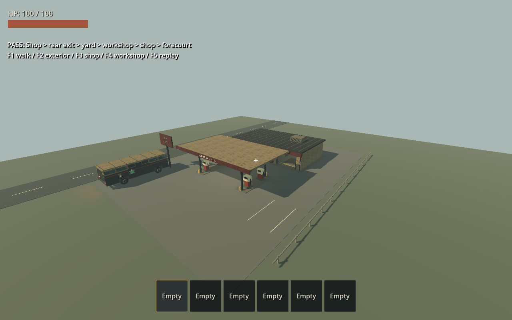
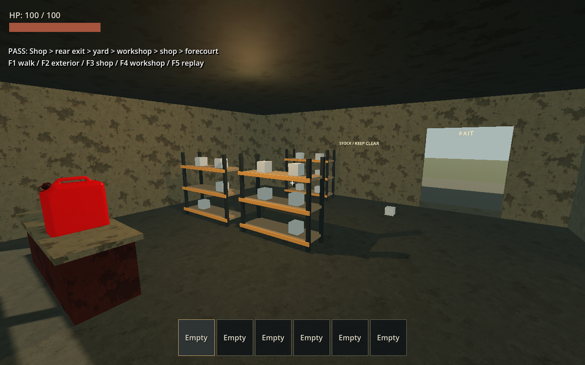
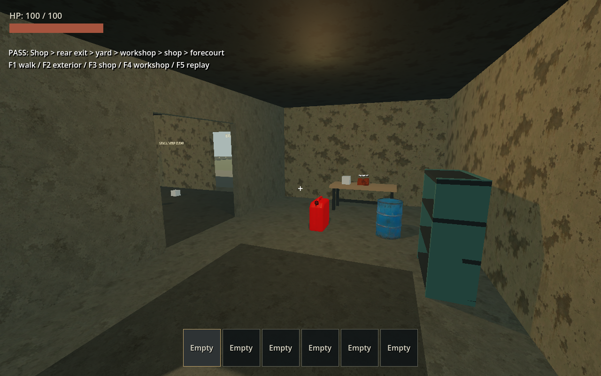

# 可直接探索的 NORTHLINE 加油站

日期：2026-09-19。基準 commit `eac3294811461f8552485ef86273cb6f739714f9` 加本次未提交變更。

## 交付範圍

- [建築資產](../../world/poi_kit/buildings/gas_station.tscn)：店面、相通維修間、前後門洞、雙島四座加油機、棚架、招牌、貨架與物資標記；外觀與碰撞分離。
- [測試場](../../tests/gas_station_playground.tscn)：同一室外世界、正式玩家／RV、一次性固定種子物資、靜態碰撞導航及 F1–F5 展示／回放。
- [規格與操作](../../world/poi_kit/buildings/README.md)。加油機為停用造景；本輪無加油交易、店門開關或敵人遭遇。

## 自動檢查

Godot 4.7.2 stable / Windows / headless。專項 runner（`-TestFilter test_gas_station.gd`）資源匯入、新測試與主場景啟動全部通過。

`test_gas_station.gd` 覆蓋：

- 玩家與建築共用 World3D，無副本入口；資產本身不產生道具。
- 物資標記有效、實際物件有支撐，導航由前院抵達店內、維修間與後院。
- 正式玩家持續輸入走完前門、後門、後院、維修間及內部通道，全程不依賴跳躍或沿途傳送。
- 正式射線與 E 輸入拾取櫃台汽油罐，背包增加一件。
- 刪除 Visuals 後，牆面射線碰撞及 AccessPoints 仍存在。

完整 `powershell -NoProfile -ExecutionPolicy Bypass -File scripts/test.ps1` 通過：匯入、37 個測試套件、主場景 WORLD_READY_FOR_PLAY；退出碼 0。日誌與環境清單位於 `.godot/test-logs/`。最後分開前院與建築地板以避免重疊後，另跑最終 `test_gas_station.gd`，步行、導航與拾取全部通過，退出碼 0；記錄為 `.godot/gas-station-final-check.log`。

## 可見畫面與回放

Forward+ / Vulkan，NVIDIA GeForce RTX 5070 Ti。使用 computer-use 選取本次遊戲視窗，檢查 F2 外觀、F3 商店、F4 維修間。修正測試 HUD 與血量列重疊，以及後門文字方向。

以 F5 觸發連續步行回放，觀察起始畫面與結束 PASS 畫面；完整路線完成由回放終點判斷及日誌證實，非逐段人工 WASD 遊玩。地板修正後再以 `-- --replay` 複驗，觀察店內途中與完成畫面，並重新擷取以下截圖。日誌 `.godot/gas-station-final-visible.log` 記錄 `PASS: gas station continuous walking route`，檢查時無 SCRIPT ERROR／ERROR／FAIL。本次測試視窗使用後關閉，未操作使用者原有遊戲與編輯器。

## 限制

未接主世界程序生成、地形安置、串流卸載或檢查點保存；測試場重新啟動會重建物資。未驗收 RV 實際駛過棚架、加油、群體怪物追擊、夜間／雨天、翻車或長局效能。本輪導航路徑通過不等於怪物群實戰驗收。未修改正式車輛物理或既有副本生成規則。
