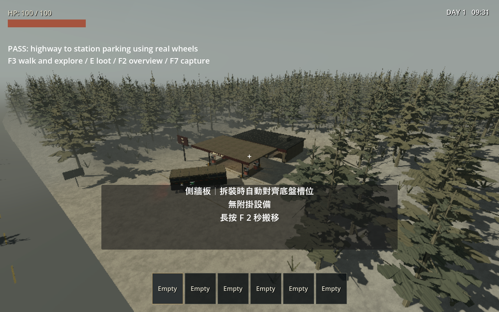

# 正式世界加油站整合

日期：2026-09-20。Godot 4.7.2 stable，Windows，基底 commit eac3294；工作樹含前輪 POI 規範與灰盒未提交修改。本頁只記錄本輪結果。

## 行為

新世界使用 generation v5；起點 0 保留林地維修廠，1、4、7…號停靠點為 NORTHLINE 加油站。道路旁約 49 m，使用定義 site_bounds 整地、預留後門／側面步行區、清除植被，公路車道保持可通行。商店／維修間與室外是同一 World3D。

v5 串流可往返。場址初次用獨立 RNG 產生物資；卸載保存場內剩餘 Prop、鬆散 Equipment、活怪，回訪還原，搬入丟下物品同樣保存。活動與休眠 actor 不重複保存。檢查點增加可選戶外狀態與已生成帶記錄，沿用檢查點 v3；content_version 不符拒絕載入。舊 v2／v3／v4 保留配置。

## 自動驗證

`tests/test_outdoor_gas_station.gd`：30 個 seed × 4 個加油站的占地支撐，正式主場景連續走過商店、後門、院子、維修間，導航抵達、真實 E 射線拾取、搬回 RV、場址卸載及磁碟重讀後原 ID／剩餘數量比對，並檢查活動與休眠所有權及不支援內容版本。

完整 `scripts/test.ps1` 已完成：import、39 組行為測試及主場景 `WORLD_READY_FOR_PLAY and production player movement` 全部通過；本輪最後主場景日誌時間為 2026-09-20 00:59。逐檔確認 39 份日誌均晚於本輪 import、含 PASS，且無腳本錯誤。`test_poi_definitions` 的 v2／v3／v4 相容性指紋維持不變，`test_rv_checkpoint` 的磁碟重建與電池／生產所有權亦通過。加油站拾取並搬回 RV 後，24 件場內剩餘物資（含測試搬入品）在卸載、磁碟還原與回訪後 ID 完全一致。測試使用正式生成器的前後各一帶窗口，減少反覆建立森林導航的成本；正常主遊戲的前 3／後 2 設定不變。測試為 headless／dummy；連續步行使用正式輸入，跨遠距離的串流測試以測試設定移動玩家，不當作長途駕駛證據。

## 可見視窗觀察

使用 computer-use 與 `production_gas_station_playground.tscn`（繼承正式主場景，seed 42）。Forward+／Vulkan。確認加油站前院與道路銜接、森林避開場址；F5 真實輪驅回放從公路轉入前院完成停車，畫面及日誌顯示 PASS。初始化設置車位，之後沒有逐幀傳送車輛；此測試移除怪物。未宣稱手動完整探索或所有種子駕駛皆已測過。

日誌：`.godot/production-station-visible.log`。只關閉本次測試視窗。

## 限制

- 加油泵仍是造景；燃料從場內可拾取物資取得。
- 其他建築仍為灰盒；未擴充專屬副本室內或素材庫。
- 搬離場址的普通散落物仍受既有遠距清理規則；未增加全世界所有物件永久保存。
- 目前內容版本不符會拒絕載入，尚未實作不同建築佈局間的自動遷移。
- 長途資源平衡、怪物群、所有曲路／坡度的 RV 停靠與翻車不在本輪完整驗收範圍。

文件檢查：本輪新增相對連結均可解析。根 README、GDD 與 docs 索引原有 `todo_for_ai` 連結所指檔案缺失，保留原始待辦相關內容，未當作本輪新增錯誤或擅自重建。
