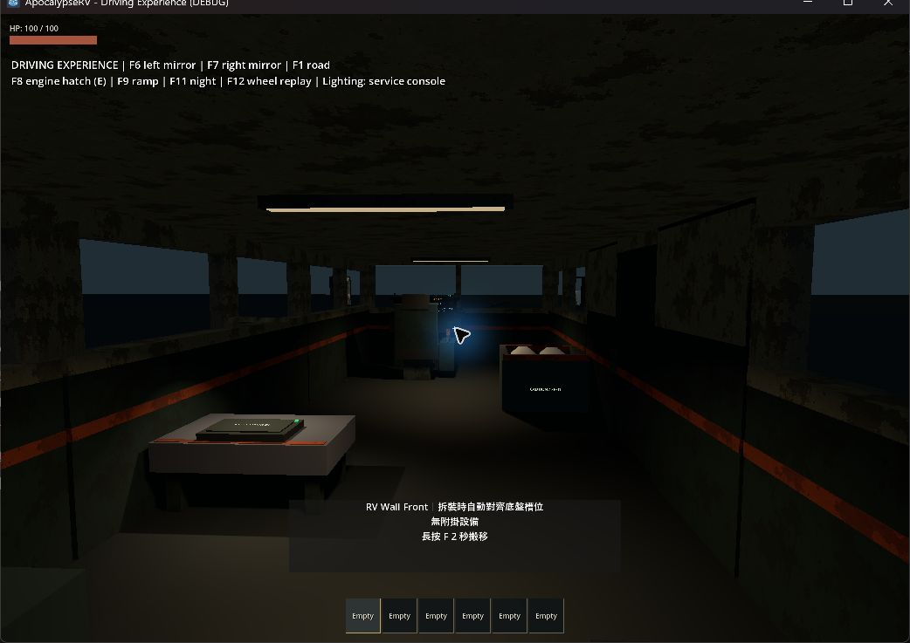

# 車內燈條設備與控制台驗收

2026-09-22，Godot 4.7.2.stable.official.ed1daf0bf。使用者要求車內燈條成為設備，照明只用控制台，不設實體按鈕；此修訂接續[駕駛體驗驗收](2026-09-22-driving-experience.md)。

## 行為

- 新車前後各一條 CabinLightStrip，使用既有 Equipment 拆裝、支撐、維修、設備列表和存檔規則。每條 1.5 kg、120 HP、有效照明負載 0.03/s；兩條總負載仍為 0.06/s。
- 控制台（平板）提供車內照明總開關及每條設備的停用／啟用。工作燈、維修燈與儀表亮度也由控制台控制。移除後門、工作台及車頭的照明按鈕與 J／K 快捷鍵；頭燈原有 L 控制保留。
- 燈條拆下、移動、損壞、停用或無電即熄滅；失去車頂支撐會作為真正設備掉落。CabinAir 排霧區仍屬車頂，不隨燈條移動。
- v3 增加 cabin_light_devices 標記。未有標記的舊存檔，將原車頂內建燈一次性轉成兩條設備，保留該車頂的姿態與支撐，使用穩定 ID；轉換後拆掉的燈條不會重新補發。其他物品不重排。

## 本次檢查

下列七套針對性行為回歸通過，日誌位於 `.godot/light-equipment-test_*.log`：

- cabin_light_equipment：觸發實際控制台按鈕訊號，驗證總開關、逐條停用、耗電、拆裝、保存身份／位置／支撐、舊檔轉換與不補回。
- art_presentation、rv_experience：照明、排霧、電力、設備失效與原機械互鎖。
- rv_handling、rv_engine：新增 3 kg 已安裝設備後的輪驅與引擎差異。強化引擎到 3 m/s 為 1.567 秒、標準為 1.800 秒；6 秒位移 24.267／22.157 m。原「位移必多 10%」是測試自訂門檻，改檢查更早達速、更遠位移及較高峰值；精確 1.25 倍力道仍由 engine 回歸驗證。
- rv_checkpoint、equipment_lifecycle：磁碟還原、設備身分及支撐生命週期。

另以 runner 通過匯入與主場景啟動。沒有將前一輪 43 套結果宣稱為本次重新執行全套。

## 畫面觀察

實際開啟駕駛體驗場，F3 檢查車內、F11 切夜間；前後燈條外殼與發光面清楚可見，走道及工作區仍可辨識，已無原照明按鈕。日誌 `.godot/cabin-light-equipment-visual.log` 無腳本錯誤。控制台行為由上述訊號回歸驗證，未聲稱實際滑鼠逐一點擊。

本輪未重新量測整車 GPU 幀時間或重跑完整日夜出車回放；前輪數值與截圖是當時版本的紀錄。
