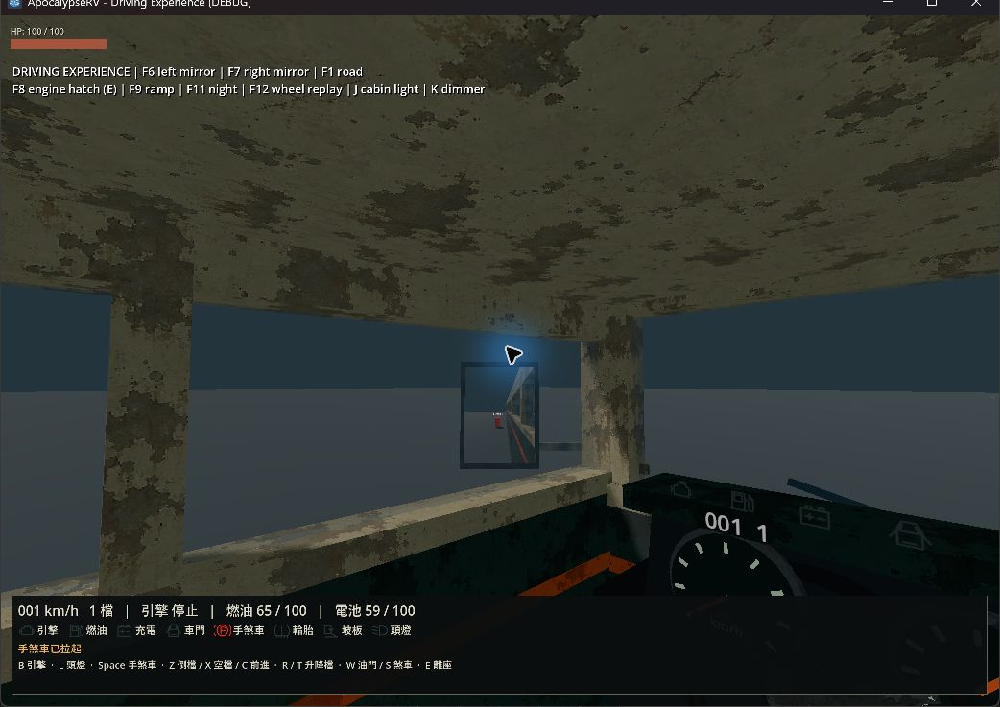
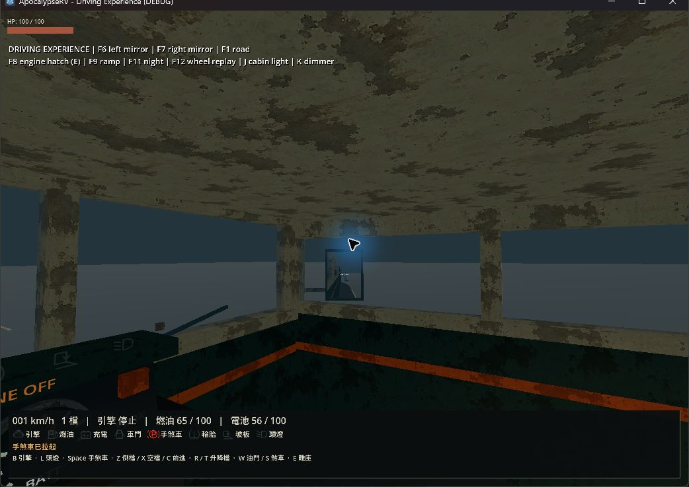
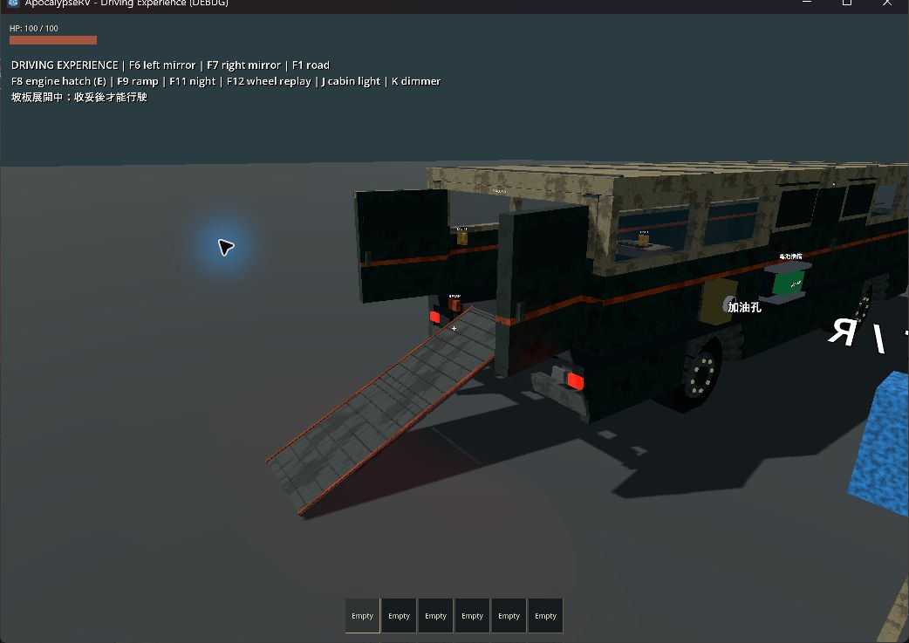
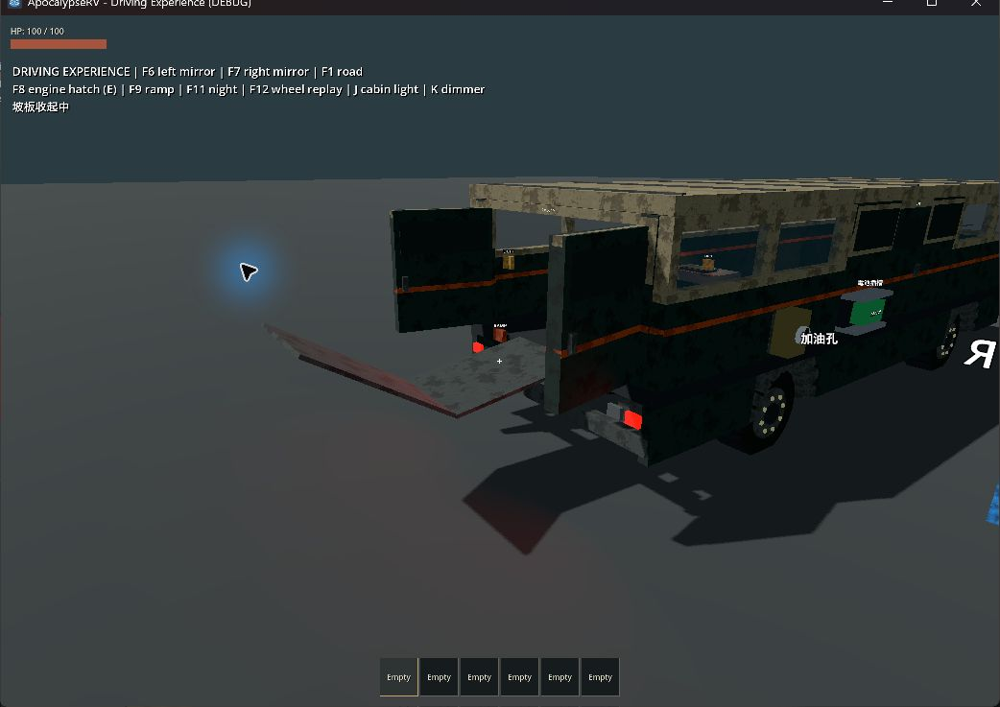
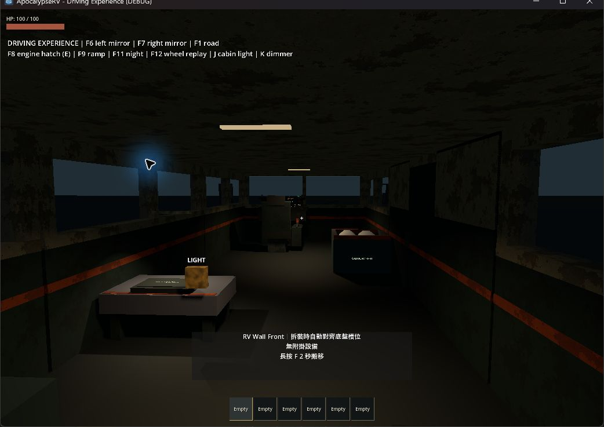
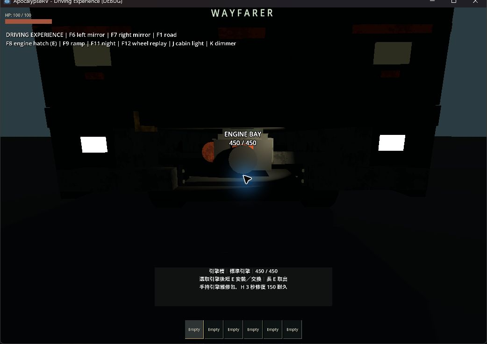
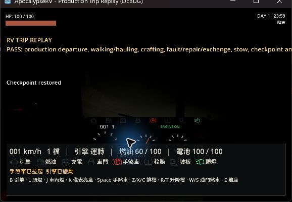
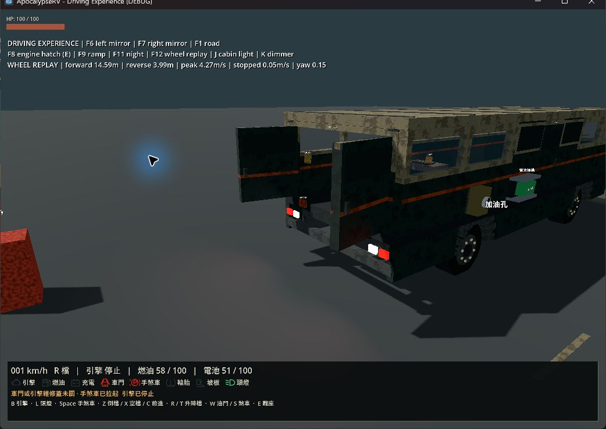
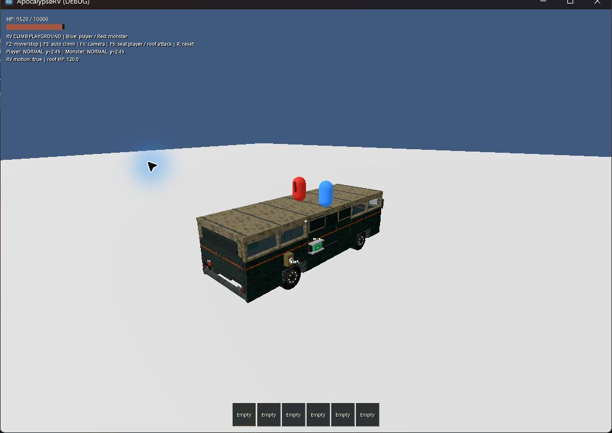
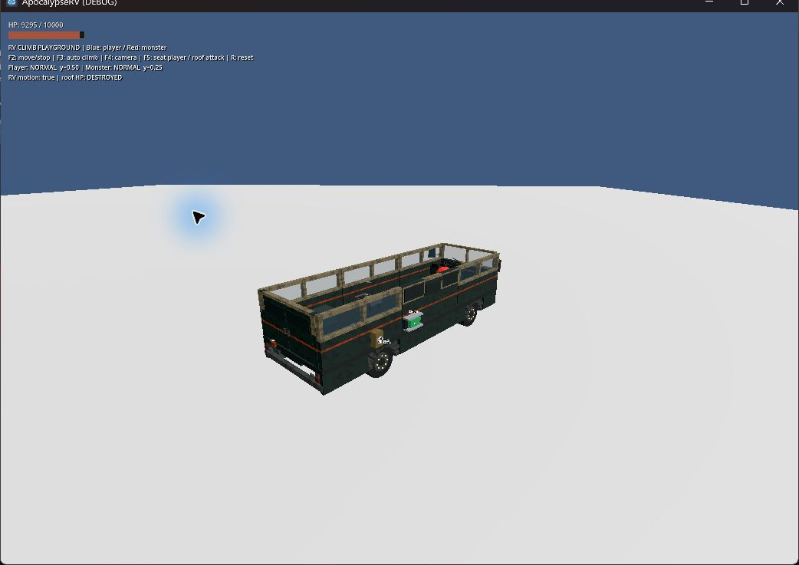

# RV 駕駛體驗增量驗收

後續規格修訂：車內燈改為獨立燈條設備，移除實體照明開關與 J／K 快捷鍵，統一由控制台控制。見[燈條設備驗收](2026-09-22-cabin-light-equipment.md)；以下保留原版本的測量與截圖。

2026-09-22，Godot 4.7.2.stable.official.ed1daf0bf，Windows／RTX 4060 Laptop GPU。延續[原計畫](../plans/2026-09-16-rv-driving-experience.md)及[前次煞車修正](2026-09-22-driving-performance-braking.md)。本紀錄區分實作、自動回歸、實機觀察；不把腳本回放寫成人工遊玩。

## 駕駛、視野與效能

所有操控參數由正式 Chassis 使用，測試場沒有另一套力道。油門由立即生效改為 0.45 秒加壓／0.20 秒釋放；轉向輸入響應由 5 改為 3.5，回正 5，使用與幀率無關的指數插值。高速比例由 0.30 改為 0.18，另依 6.75 m 軸距、4 m/s² 目標側向加速度限制角度，沒有額外抗翻或重量補強力。腳煞車維持前次 100、0.35／0.15 秒，手煞車 300。

座椅相機高度 1.50→1.62 m，FOV 75→80°，俯角 -0.18→-0.12 rad。車速表改看物理步實際位移：輪胎約束可能在停車時回報約 0.15 m/s 的瞬時速度，與實際每秒位移不一致；懸吊方向不列入儀表速度。此修正只影響顯示／聲音，不直接清除物理速度。

`test_rv_handling` 使用正式四輪車輛，在平地與 5° 坡測標準／強化引擎、磨損 20 HP、缺前輪、引擎故障，以及實際設備上附加 600 kg 的**測試配重**。起步、煞車、轉向回正、駐車及支撐離座都走正式邏輯。高速情境只在開始時注入 20 m/s，之後由輪胎處理。

| 平地情境，油門 6 秒 | 位移 m | 峰值 m/s | 到 3 m/s 秒 |
|---|---:|---:|---:|
| 標準 | 22.150 | 5.518 | 1.800 |
| 強化 | 24.899 | 5.991 | 1.467 |
| 設備加 600 kg | 19.968 | 5.167 | 2.150 |
| 四輪 20 HP | 21.427 | 5.490 | 1.917 |
| 缺前輪 | 9.154 | 2.386 | 未達到 |
| 倒車 | 9.310 | 2.638 | 未達到 |

5° 坡標準車 6 秒移動 13.289 m；強化 17.536 m、配重 11.900 m、磨損 13.296 m。缺輪僅 1.800 m，沒有保證損壞車能爬坡；引擎故障放開手煞車會溜車，但仍能踩煞車停止及正常離座。駐車 1 秒水平位移 0.017–0.131 m（包含缺輪），不是長時間駐車保證。

低速轉彎位移 18.972 m、航向改變 1.144 rad；20 m/s 情境位移 102.654 m、改變 0.890 rad。以起終點弦長／航向差估算的轉向尺度為 16.587／115.326 m，並非擬合完整圓周半徑。車位回放只施加油門／煞車／排檔，不搬移車身：14 m 停車目標誤差 0.248 m，倒回原道路目標誤差 0.234 m。

左右鏡各 192×256、最多 15 Hz，交錯更新；離座、非駕駛視角或對應側板不可運作即停用。共享本車 World3D，鏡面材質水平翻轉，鏡頭裁掉第 20 層鏡面避免遞迴。自動檢查涵蓋後方障礙投影、側板停用、離座、搬移座位與讀檔重連。

同 seed 42、正式主世界、1024×720、Forward+／Vulkan、08:00 陰天、VSync 關閉，4 秒停車後 24 秒正式輪驅。其他使用者應用仍在執行；兩次量測順序為開啟→關閉，屬局部 A/B，不是全面 FPS 保證。

| 鏡面 | 平均幀 ms | P95 ms | P99 ms | 最慢幀 ms |
|---|---:|---:|---:|---:|
| 關閉 | 7.05 | 9.53 | 12.54 | 64.39 |
| 開啟 | 7.40 | 10.14 | 14.05 | 63.34 |

命令：`godot --path . -s res://scripts/benchmark_driving.gd`；加 `-- --no-mirrors` 對照。原始日誌 `.godot/mirrors-on-benchmark.log`、`.godot/mirrors-off-benchmark.log`。此量測早於其後的聲音／工作燈整合，不當作最終整車所有效果效能保證。

## 動作、聲音與照明

維修蓋約 1 秒升降，完全開啟才授予維修權限；坡板約 3 秒完成「在地板下滑出→車外抬起→翻折→放下」。逐步檢查途中出現的障礙，受阻保留中間姿態；重複操作不跳過動畫，停止後可反向。坡板未收妥仍允許怠速但鎖住動力。非穩定姿態拒絕保存並顯示原因，保持既有穩定姿態存檔格式。

初次正式世界回放發現滑出時過早抬升會碰到站在走道的玩家，已改為滑出車外才抬起。末端保留接地坡度，最後 2% 動作容許與射線確認的支撐地面接觸；角色／道具仍參與掃掠，沒有全程排除地形。

`test_rv_experience` 在維修蓋與坡板開始後放入障礙，確認停止、權限／行駛鎖定、保存拒絕及反向恢復。`test_rv_boarding` 與 `test_monster_boarding` 等待正式動畫完成後，驗證攜引擎角色／怪物走坡板；未跳過動畫來取得通行結果。

音效是[原創程序 PCM](../../assets/audio/README.md)，不是引擎實錄。每車一個空間引擎迴圈，最多三個一次性聲源；啟動失敗不播放成功聲，耗油失效會停聲，完成交易／維修後才播放回饋。只有引擎外觀小幅震動，平板提供 0／50／100%；不改車身或鏡頭。自動測試檢查播放狀態及生命週期，尚未完成主觀聽感驗收。

車內燈每頂 0.06、工作燈每台 0.04、維修燈 0.04 電量／秒，均為既有 0.15/s 待機之外的獨立負載。維修燈需全開蓋；設備停用／移除或無電時停止照明與負載。按鍵 J、就近開關或平板控制，K／平板調整儀表亮度，HUD 警告不受調暗影響。v3 可選 comfort 保存請求、亮度、震動；拒絕非法／NaN 值，缺欄位舊檔可載入。

最終程式另做夜間多燈 A/B：同機、正式世界 seed 42、22:00 陰天、1024×720、鏡面及音效開啟；停車暖機 4 秒，駕駛座相機回望走道取樣 12 秒。車內／工作／維修三種供電狀態均確認切換；此視角主要看見走道及工作燈，不能代表所有車外視角。行為 runner 與本任務的其他測試場已結束，使用者原有應用仍開著。順序開→關，兩組各一次。

| 夜間照明 | 平均幀 ms | P95 ms | P99 ms | 最慢幀 ms | GPU ms |
|---|---:|---:|---:|---:|---:|
| 關閉 | 7.71 | 9.93 | 10.78 | 63.66 | 2.99 |
| 全部請求開啟 | 9.20 | 11.65 | 13.22 | 59.47 | 4.36 |

平均增加 1.49 ms；兩組仍有約 60 ms 尖峰，沒有宣稱消除全部卡頓。命令為 `godot --path . -s res://scripts/benchmark_driving.gd -- --night-lights`，對照加 `--lights-off`。日誌 `.godot/night-lights-on-benchmark.log`、`.godot/night-lights-off-benchmark.log`；兩次程序正常退出，無腳本錯誤。

## 正式世界出車流程

`scripts/replay_rv_trip.gd` 是獨立、可重播的正式主世界整合驗收，並非人工遊玩。車輛只用輪驅控制，玩家以持續移動輸入走過走道、坡板及車外；入座／離座使用正式服務。取放、製作、維修、交換呼叫正式互動入口，未逐一重播滑鼠瞄準及 UI 點擊。

設定固定 seed 42、08:00／22:00 陰天；準備一顆替換引擎與固定產量的廢料，廢料直接投入正式分解槽；引擎零耐久是測試故障注入。保存使用獨立 `user://driving_trip_validation.save`，不覆寫玩家正式檢查點。

白天 headless 及夜間圖形回放均已通過：出車／停車／離座→開後門及坡板→車外搬引擎上車入庫→分解及排隊製作汽油並取貨→故障後維修包救援→取回替換引擎、步行到車頭交換→收坡板／關門／關蓋→主世界存讀檔→再次起步。日誌 `.godot/trip-day.log`、`.godot/trip-night-visual.log`。夜間已實際查看 PASS 結果畫面；沒有把整段腳本流程宣稱為人工操作。

流程中發現原本固定出料高度使汽油罐與預裝平板碰撞，工作一直停在 Output blocked。已按產物實際碰撞 AABB 計算底部淨空，新增「真正阻擋不扣電、清除後在正式預裝車出料」回歸；不移動平板或跳過碰撞檢查。

## 實機觀察與回歸狀態

- 專用駕駛場：實際按 F6／F7 看見左右紅／藍障礙，按 E 看到維修蓋升起至引擎可維修；觀察坡板展開／折回、夜間走道／工作台與儀表。局部燈影與音效仍需更多場景主觀驗收。
- 輪驅回放：前進 14.59 m、倒車 3.99 m、最高 4.27 m/s、完成速度 0.05 m/s；前一輪同入口為 16.21／4.11 m，油門漸進後起步較柔和。觀察完成狀態並核對日誌，未逐幀觀察整段路線。
- 攀車回放：玩家／怪物在轉彎中同在屋頂 y≈2.45；F5 入座後屋頂 DESTROYED，怪物落至 y≈0.25。回放用腳本車身運動，只代表支撐／拆頂，未逐幀觀察最初攀爬，也不代表真實輪驅翻車／群體測試。
- 針對性 handling、experience、boarding、cockpit、monster_boarding 通過。完整 runner 揭露 checkpoint_failures 在行為 PASS 後退出逾時（原始記錄 `.godot/driving-plan-checkpoint-timeout.log`）：故障測試改用固定 seed 42、前後各 1 帶的真實地形、等待失敗 staging 退休及導航完成，並以固定 60 Hz 物理運行；原斷言保留，120 秒上限不變，正式主場景另驗完整範圍。修正後該套已正常通過。
- 舊 monster_boarding 假設坡板瞬間展開，已改為等待動畫；engine 測試原本連續兩幀比較力道，現改為同一油門爬升階段再比較 1.25 倍引擎倍率。resource_cycle／systems 原本另放懸空工作台，正確抬高產物後會碰車頂，已改用正式預裝工作台；產物缺失也會明確失敗而非存取空值。
- 最終 **43 套行為測試、匯入與主場景啟動通過**。完整 runner 遇上述失敗後修正，透過 `-TestFilter` 分段續跑，並非一輪未中斷的全綠執行。2026-09-22 02:37–02:56 的各套最終日誌均有 PASS、無 script/runtime error；清單核對保存在 `.godot/driving-plan-test-audit.json`。當前改動的 `git diff --check`、文件相對連結亦通過。

## 限制

濕地制動、更多坡度、長途及其他硬體、極端翻車／偏載／外掛力矩與怪物群仍未宣稱完成。完整流程是受控腳本整合與畫面觀察；自由操作手感、音效聽感及所有 UI 瞄準步驟需要獨立人工遊玩。新功能的實作完成與這些驗收限制分開追蹤。
