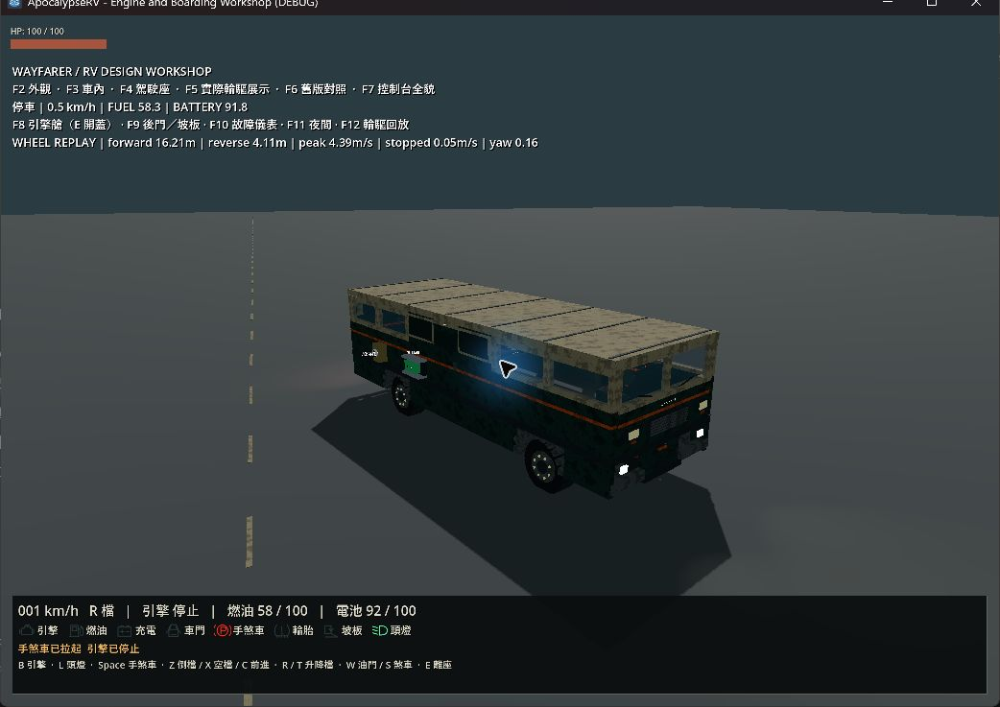
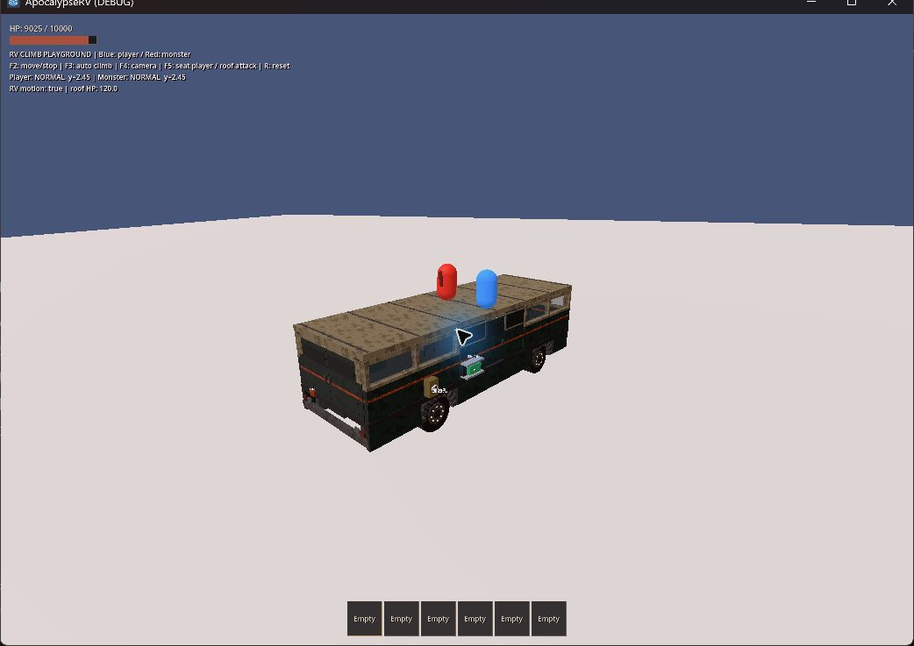
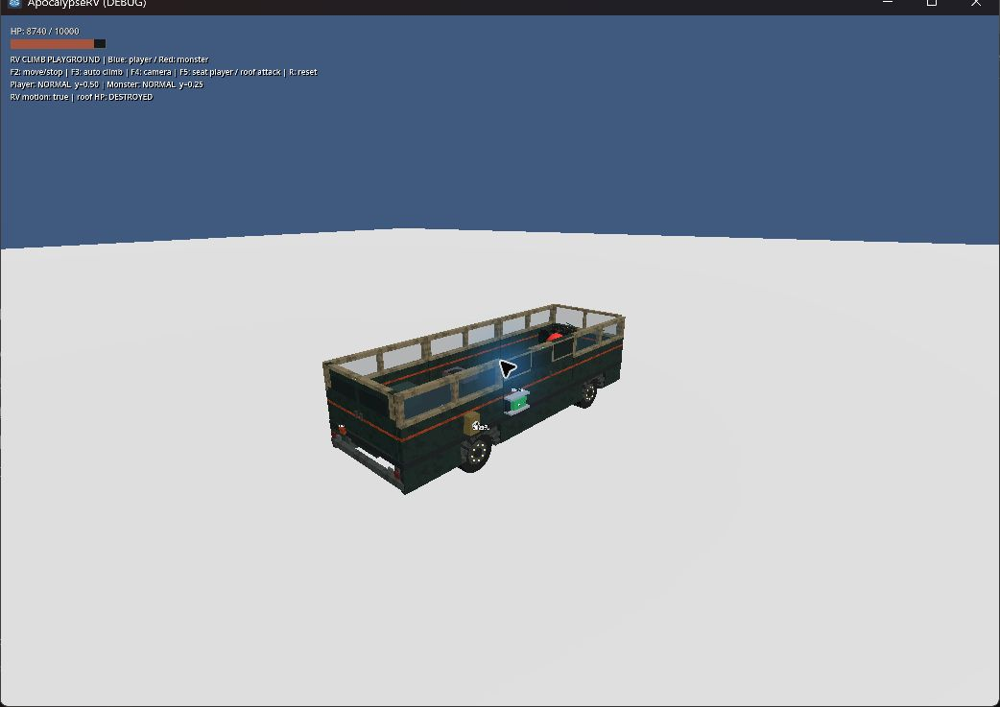

# 行駛卡頓與漸進煞車修正

日期：2026-09-22。Windows、Godot 4.7.2.stable.official.ed1daf0bf、RTX 4060 Laptop GPU。回應移動探索時嚴重卡頓，以及 S 一踩就停的問題。

## 原因與修正

- 戶外 chunk 的導航區域已發佈、整張 map 尚未同步時，readiness 每個物理步反覆做全圖最近點搜尋。數萬個 polygon 的搜尋拖慢物理更新，再觸發補跑物理步的連鎖延遲。現在只在 map RID 或 synchronization iteration 改變後重查；保留鄰近網格與跨 World3D 還原的判斷。
- 載重原本透過設備世界座標轉回底盤座標，在遠離原點時產生誤差，導致重複寫入未改變的重心。現在組合父層局部 transform，包含巢狀安裝設備。此問題也存在於簡化載重前；單獨修正並未消除主要卡頓。
- S 原本即刻施加 300；腳煞車改為最大 100，加壓 0.35 秒、釋放 0.15 秒。手煞車及坡板互鎖獨立保留 300，停止動力仍可煞車。不直接清空速度、不加入依重量補強制動的隱藏加成。
- 沒有降低森林密度、解析度設定、光影或天氣品質，沒有更改生成版本、導航幾何或存檔格式。

## 行駛幀時間

正式主世界／正式輪驅、seed 42、1024 × 720、Forward+／Vulkan、08:00 陰天；量測程序關閉 VSync。停車取樣 4 秒，接著以檔位 4、全油門直行 24 秒；起步、道路坡度與串流均由遊戲運作。量測期間未並行執行完整測試；其他使用者應用程式仍開啟。以下是局部重現量測，不是所有場景的 FPS 保證。

| 版本 | 平均幀 ms | P95 ms | P99 ms | 最慢幀 ms |
|---|---:|---:|---:|---:|
| 修正前，固定 seed 診斷 | 17.88 | 129.40 | 145.16 | 205.57 |
| 只修正重心座標 | 15.63 | 120.72 | 146.27 | 165.19 |
| 加入導航搜尋節制 | 5.98 | 8.90 | 11.50 | 64.82 |
| 最終程式獨立複驗 | 9.52 | 12.37 | 15.48 | 75.09 |

修正前另以停用串流及 headless 對照，仍出現大量慢幀，排除純 GPU／新地形載入為唯一來源。初期診斷腳本曾提前 free 世界，造成 pending navigation coroutine 退出錯誤；這些清理錯誤發生於取樣完成後，不是正式遊戲流程或通過的驗收。本次保留的 benchmark 讓引擎在結束時自行清理，最終日誌無該錯誤。

地形 mesh／碰撞建構仍可能造成單幀尖峰，未宣稱零卡頓。不同取樣的牆鐘排程、物理補步與背景負載會影響路程和數值；不將 24 秒取樣當作完全相同的逐幀回放。

重跑：`godot --path . --log-file .godot/driving-benchmark.log -s res://scripts/benchmark_driving.gd`。保留的入口為 [benchmark_driving.gd](../../scripts/benchmark_driving.gd)。診斷日誌在 `.godot/drive-profile-seed42.log`、`.godot/drive-profile-local-com.log`、`.godot/drive-profile-nav-gate.log`、`.godot/drive-profile-final.log`。

## 煞停量測與行為回歸

正式 RV／正常四輪、平地，60 Hz 物理。先靜置，再注入一次初始速度，之後全程由輪胎煞車減速；這是受控初始條件，不是人工加速操作。停止門檻為車身前後方向速度 < 0.1 m/s，距離使用水平位移。

| 初始速度 | 原煞停秒數／距離 | 新煞停秒數／距離 |
|---|---|---|
| 5 m/s（18 km/h） | 0.317 s／0.736 m | 0.967 s／2.744 m |
| 10 m/s（36 km/h） | 0.567 s／2.773 m | 1.700 s／8.955 m |
| 20 m/s（72 km/h） | 1.067 s／10.510 m | 3.017 s／29.911 m |
| 倒車 6 m/s | 0.350 s／1.035 m | 1.117 s／3.726 m |

10 m/s 半踩的煞停距離為 14.318 m，弱於全踩的 8.955 m。[test_rv_braking.gd](../../tests/test_rv_braking.gd) 驗證逐步加壓、上述速度的合理停止範圍、倒車／引擎熄火仍能煞車、放開完全釋放與獨立駐車保持。

`test_rv_extended.gd` 增加 5 km 世界座標下多次移動／旋轉重心完全不變的檢查，原本換電池／庫存／拆裝引擎／保存回歸仍保留。針對性 braking、extended、streaming_generation 均 PASS。完整 runner 重跑後 41 組測試及 main-scene 全部 PASS，退出碼 0；日誌位於 `.godot/test-logs/`。

首次完整 runner 在 `test_checkpoint_failures` 退出逾時（120 秒）；日誌已有行為 PASS，仍記為該次執行失敗，保留 `.godot/checkpoint-braking-timeout.log`。關閉實機視窗後重新執行完整 runner，未放寬測試時限或忽略錯誤。

## 實機觀察

`rv_rebuild_playground.tscn -- --drive`：觀察到起步、倒檔移動及完成後停車；F12 再回放完成，前進 16.21 m、倒車 4.11 m、最高 4.39 m/s、結束完整 3D 速度 0.05 m/s、航向變化 0.16 rad。這個回放沒有取代手動駕駛的主觀手感驗收。

`rv_climb_playground.tscn -- --replay`：兩次截圖確認玩家與怪物在持續轉彎的車頂上，相對高度約 2.45 m。F5 入座後，怪物把車頂破壞至 DESTROYED，落到車內約 0.25 m；未逐幀觀察最初攀爬動作。此回放為腳本車身運動，只驗證支撐與拆頂行為，不代表真實輪驅手感。

本次兩個實機日誌 `.godot/braking-visual.log`、`.godot/braking-climb-visual.log` 無 SCRIPT ERROR／ERROR／FAIL。已關閉本次遊戲視窗，保留使用者原有 Godot 編輯器。

## 尚未驗證

濕地制動、不同坡度／輪胎磨損／缺輪／載重、長途與不同硬體、完整白天／夜間出車流程、翻車及怪物群仍需後續驗收。此輪未加入 ABS、輪胎滑移率或真實煞車液壓模擬。

技術依據：[Godot NavigationServer3D map iteration](https://docs.godotengine.org/en/latest/classes/class_navigationserver3d.html#class-navigationserver3d-method-map-get-iteration-id)、[VehicleBody3D brake](https://docs.godotengine.org/en/latest/classes/class_vehiclebody3d.html#class-vehiclebody3d-property-brake)、[RenderingServer 幀時間量測](https://docs.godotengine.org/en/latest/classes/class_renderingserver.html#class-renderingserver-method-viewport-get-measured-render-time-gpu)。實際相容性以本次 4.7.2 執行結果為準。
