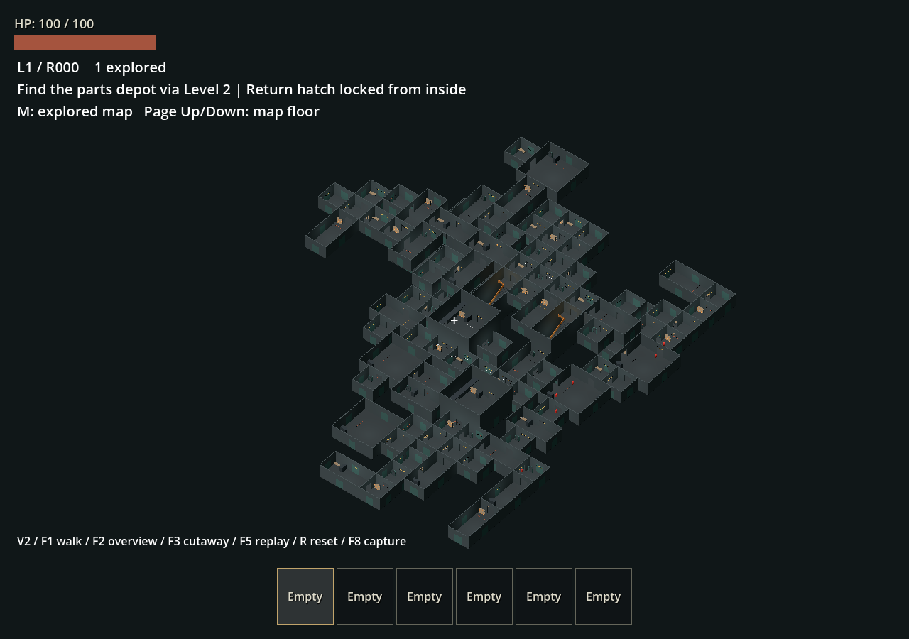

# 室內 v2 驗收（2026-09-22）

功能版本：`140f9b1`，分支 `codex/poi-interior-v2`。獨立 worktree 保留主工作區的駕駛與文件修改；不修改舊 archive／todo。製作規格見 [interior-v2](../guides/interior-v2.md)。

## 本輪交付

- 11 種可編輯灰盒房型，兩層、6 m 層距、不同尺寸／旋轉、挑高占用與實體樓梯。
- 12 房必要路線搭配隨機支路，正式 50–100 房；零件庫引擎／維修包、單側解鎖返程門、三區提示和分層已探索地圖。
- 固定物資／怪物總預算，導航就緒與開門重烘焙；布局／目標／捷徑／探索序列化，舊 actor-only 副本保留 v1。

## 自動化

引擎為本機 Godot 4.7.2.stable.official.ed1daf0bf，Windows 11；headless/dummy 與正式 Forward+ 視覺觀察分開。測試將 APPDATA 指向 worktree `.godot/test-user`，不覆寫平常遊玩的檢查點與編輯器設定。

新增四個 suite：

| Suite | 直接驗證 |
|---|---|
| test_interior_layout | 100 seeds、12／50／75／100 房、三維無重疊、旋轉門口對接、鎖門時全連通、捷徑縮短路程、隨機房數的 manifest 重播、版本拒絕 |
| test_interior_navigation | 50／75／100 房的每條連接均可用實際烘焙導航通行；固定 actor 預算；大型副本重返 |
| test_interior_traversal | 正式玩家持大型引擎連續上下兩座樓梯，殭屍實際爬坡與樓板遮擋；E 開零件庫／門閂；獎勵不重複；序列化重建後短路導航與探索一致 |
| test_interior_compatibility | actor-only 已訪副本仍為原 MazeLayout、空副本不補貨、新 profile 分派、錯誤版本回室外及原始記憶不被重置 |

正式 `test_poi_instances` 另外通過真實入口 E、World3D 隔離、室外油電／天氣持續、串流錨點、拾取／丟棄／死亡／重返與全部房間導航。測試增加重返失敗的明確 guard，避免空 interior 腳本錯誤後整個測試永久等待。

本輪實際抓到並修正：

1. 修理間／機房機台擋住側門。搬到角落後，50／75／100 房每條導航通過。
2. 導航烘焙結束不代表 map 已發佈。改用 immutable mesh、region iteration 與 map probe 等待。
3. 提升返程門視覺時，導航仍可能解析停用 collider。實際葉片碰撞一同移到門上方，再烘焙。
4. 角色原點低於腳底，探索判斷曾漏房；改用腳底位置且不擴張到其他樓層。
5. 自動房數與指定房數重建少消耗一次 RNG，導致正式重返被 manifest 驗證拒絕。統一消耗並增加 production-seed 回歸；正式主場景重返已再次通過。

本輪總計覆蓋此 worktree 全部 45 個 `test_*.gd`，均有 PASS 且沒有腳本錯誤，主場景啟動亦通過。這是分批累積的覆蓋，不是一次完整 runner 無中斷通過：最初 120 秒限制在 checkpoint suite 結束階段逾時，改為明確 240 秒重跑；完整批次其後抓到上述正式重返 RNG 問題。修正並提交 `140f9b1` 後，依序重新執行 `test_interior_*.gd`、`test_poi_*.gd`、`test_r*.gd`、`test_s*.gd`、`test_w*.gd`，全部成功；每批均重新 import 並檢查 main-scene。其他 suite 沿用本輪先前通過的結果。

原始日誌位於 `.godot/test-logs/`；逐一核對 45 份日誌的 PASS 與錯誤標記。只有既有 runner 明確排除的系統憑證讀取診斷不作為腳本失敗。

## 量測

功能提交 `140f9b1` 的 `test_interior_navigation` 實際單次量測如下，單位 ms；每組均有 44 個初始 actors。static memory 是 Godot allocator 統計，不是 OS RSS 或 GPU 記憶體；單次建置不代表長時間無洩漏。

| 房數 | 建置 | 導航 | 重返建置 | 重返導航 | static memory（bytes） |
|---|---:|---:|---:|---:|---:|
| 50 | 324 | 158 | 281 | 163 | 177,209,616 |
| 75 | 382 | 203 | 426 | 249 | 186,354,216 |
| 100 | 563 | 287 | 545 | 275 | 195,812,468 |

## Computer Use 實際觀察

使用安裝的 computer-use／sky 工具，從 list_windows 選擇唯一 `POI Interior V2 - Test`，沒有向編輯器或既有主遊戲傳送遊戲按鍵。以 F5 啟動正式玩家持續輸入回放；觀察不同樓層、搬運引擎、零件庫／捷徑完成與探索地圖的上下層視圖。最後的 12 房路線日誌為 150.7 m／約 42 秒；HUD 曾與生命條重疊，已移到分開位置並實際複查。

可見回放測試怪物使用零傷害、並控制其他怪物；怪物上樓與隔板攻擊阻擋有行為斷言，但這不是多人群戰或完整遭遇平衡驗收。觀察結果不能替代每個 seed 的完整實機探索。

同提交的 100 房／seed 1800 已在 NVIDIA RTX 4060 Laptop、Forward+ 載入並檢查第一人稱、總覽和去頂視圖；日誌建置 624 ms、導航 251 ms，沒有腳本錯誤。F2 的檢視專用方向光不影響 F1 正式室內照明。以下由測試場 F8 直接擷取，並非每房巡視或 FPS 壓力測試。

另依 repository 指引執行 RV climb playground：畫面確認玩家與怪物都在移動轉彎的車頂上；按 F5 入座後，屋頂 HP 到 `DESTROYED`，怪物由車頂高度降至車內。日誌沒有腳本錯誤，僅關閉本輪測試視窗。此為腳本驅動車體回放，不涵蓋輪胎驅動、翻覆或群怪壓力。

## 保留限制

兩層與灰盒是本輪明確範圍。第三層、任意形狀占用、轉折樓梯／電梯、可走上層環廊、四種入口專屬主題、房型相鄰去重、遭遇導演、推車、正式模型與長局經濟尚未提供。必要主路固定，seed 改變支路配置；不宣稱全主路隨機。

每次重返仍完整重建與烘焙；未完成 100 房長時間 FPS／群體壓力／記憶體穩定性測試，也沒有背景休眠或分區載入。現有回放不代表已實測整條公路停車到室內目標再返回 RV 的長途經濟。
