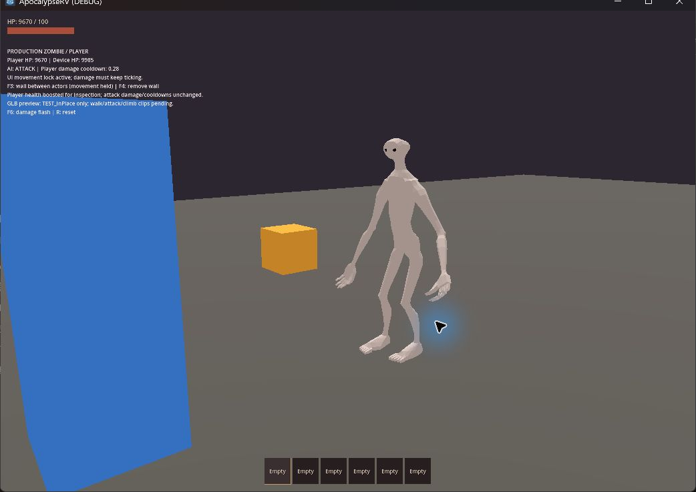

# 怪物 GLB 試接 — 2026-09-22

基準 commit：`de238c49605ac3b895ab72df7b22065a15bb6b3b`，本次未提交工作樹。Godot 4.7.2 stable，Windows，實機 Forward+ / Vulkan / RTX 4060 Laptop GPU。

## 接入內容

[正式 Zombie](../../enemies/zombie.tscn) 已使用來源 `C:/Users/evan4/Projects/3d/exports/godot/monster_export_test.glb` 的原樣副本；來源與專案檔 SHA-256 相同。主世界、串流生成、副本及既有測試場使用相同 Zombie 場景。

保留原始 2.18 m 資產，場景內等比例縮至 1.5 m 並轉向 -Z，腳底對齊原膠囊底端 0.25 m。AI、碰撞、攀爬幾何、攻擊數值與存檔格式均未調整。外觀循環播放 `TEST_InPlace`，受傷改用每個實例獨立的 overlay；移除模型上的舊假手臂，保留掛車音效。[資產設定](../../assets/models/monster/README.md)。

## 自動檢查

- 匯入得到 1 個蒙皮網格、45 根骨、2 個材質及兩段具名動畫，無模型匯入／腳本錯誤。
- `test_monster_model.gd` 通過：來源尺寸、腳底、朝向、超過三次原地循環不漂移、1 m root-motion 位置資料、連續受傷效果不污染其他怪物、閃白恢復、死亡回收。
- 專用檢查 runner 的主場景啟動與正式玩家移動通過。
- 全部 50 個 `test_*.gd` 套件本次均已執行：49 通過、1 失敗（`test_monster_cabin.gd`，見下方對照）。原 runner 在該失敗停止後，用 `.godot/run-model-remaining.ps1` 沿用同一 runner 的版本／退出碼／錯誤／PASS 檢查，篩選排序在其後的 36 個套件繼續，全部通過；未略過或放寬失敗斷言。第一批日誌與 manifest 在 `.godot/test-logs/`，續跑在 `.godot/test-logs/model-remaining/`。

命令：`scripts/test.ps1 -Godot 'C:/Users/evan4/AppData/Local/Programs/Godot/Godot_console.exe'`。執行時把 `APPDATA` 指向 `.godot/test-appdata`，不碰使用者存檔或編輯器設定。Windows 沙箱憑證庫讀取診斷依既有 runner 規則排除，並未忽略腳本錯誤。

## 實機觀察

使用正式場景的 `rv_climb_playground.tscn -- --replay --climb-debug`，透過 computer-use 選取遊戲視窗，R 重播後看到玩家與怪物 CLIMBING，再看到兩者登頂、轉彎期間留在車頂。F5 入座後看到 roof HP 從 120 變為 `DESTROYED`，怪物高度從約 2.45 降為 0.25、掉入車內並繼續追擊。日誌：`.godot/climb-playground-visible.log`，無腳本錯誤。

近距離 [模型預覽場](../../tests/monster_model_playground.tscn) 可見灰白身體、黑眼窩、四肢與手指；動畫在不同取樣時刻有姿態變化，未見骨架爆開、倒置或材質遺失。怪物面向玩家並持續造成傷害。F6 扣血 5 HP，日誌正常；0.15 秒閃白恢復與實例隔離以自動檢查為準。日誌：`.godot/monster-model-preview.log`。本次開啟的遊戲視窗已關閉。

## 問題與限制

- 目前只有 `TEST_InPlace` 和 `TEST_RootMotion`，沒有正式走路、攻擊或攀爬動畫，因此追逐會滑步，攻擊／攀爬姿態與行為不匹配。這是此次試接的主要外觀缺口。
- 遊戲中未播放 `TEST_RootMotion`；只驗證匯入的 1 m 位移資料，未驗證 AnimationTree 的 root-motion 提取與消耗。
- 原模型縮為約 68.8%，碰撞沿用膠囊；細長肢體不是精準逐部位碰撞，近牆／攀爬時可能穿插。未進行逐幀全蒙皮數值比對、怪物群效能、翻車或輪驅操控的視覺驗收。
- 完整回歸的 `test_monster_cabin.gd` 未通過：工作台落地繞出走道、繞過真實車內障礙追擊駕駛兩項失敗。將 `HEAD` 的原始 `zombie.tscn` 保存到 `.godot/baseline_zombie.tscn`，只替換暫存測試的載入路徑重跑，也出現相同兩項失敗，另有屋頂破口後追擊／移除障礙後恢復追擊失敗。對照仍使用目前行為程式，原外觀走原假手臂分支；本次唯一的行為檔改動是受傷外觀分派，沒有改車內導航。證據指向既有車內追擊的不穩定性，本次未修改該系統。原測試日誌 `.godot/test-logs/test_monster_cabin.log`；對照 `.godot/baseline-monster-cabin.log`。
