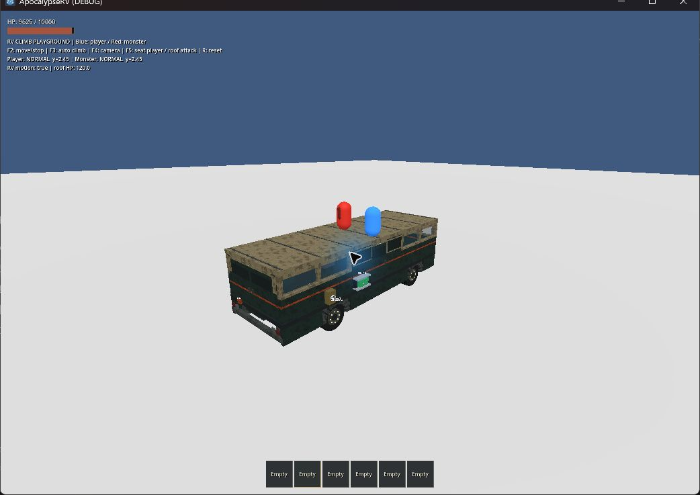
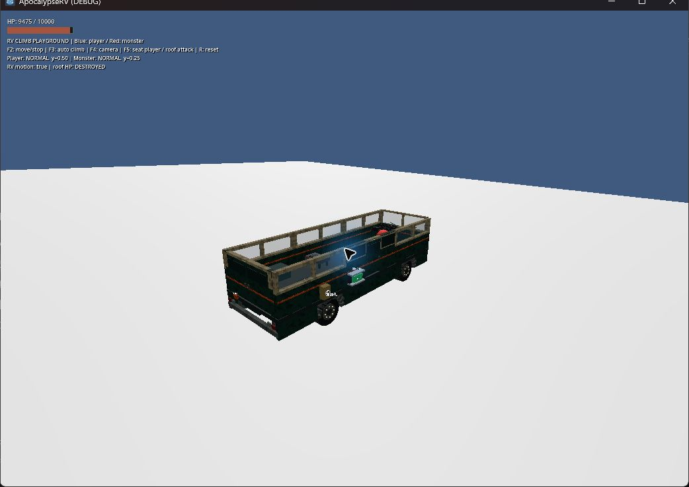
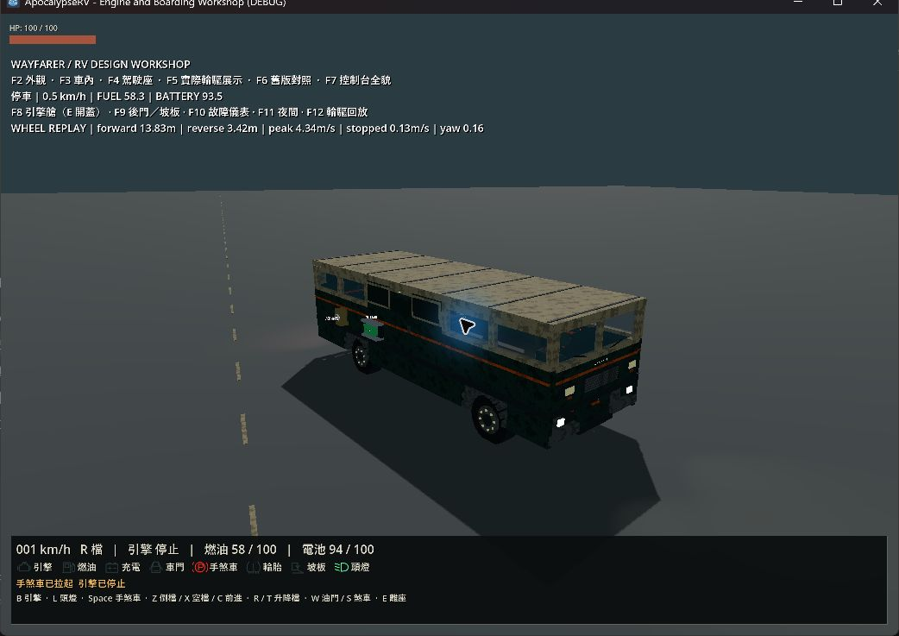

# RV 簡化載重驗收

日期：2026-09-22。Windows、Godot 4.7.2.stable.official.ed1daf0bf；實機 Forward+／Vulkan、RTX 4060 Laptop GPU，自動測試 headless／dummy。

## 變更

- 車輛總重量與重心只計底盤、已安裝引擎及有效的已安裝設備；移除插槽內電池的質量與重心貢獻。
- 電池本體、素材、庫存道具與燃油不計入車重。插槽、倉庫設備本體仍計重；引擎作為道具時不計重，安裝後才計重。
- 保留 BatteryState.weight、既有存檔格式與地面道具剛體行為；充放電、交換及物品身分不變。
- 本次只完成[駕駛體驗計畫](../plans/2026-09-16-rv-driving-experience.md)的簡化載重規則，其他駕駛調校、後照鏡、動畫、音效與照明仍待實作。

## 自動檢查

`test_rv_extended.gd` 新增正式車輛回歸，驗證普通／大容量／空槽不改變車重與重心、容量與扣電維持正常、素材及燃油量不影響載重、引擎取出／入庫／取回／重新安裝的重量與重心，以及帶有舊電池重量欄位的 v3 保存資料還原後仍遵守新規則。原有拆卸設備重量測試保留。

針對性 runner（`-TestFilter test_rv_extended.gd`）資源匯入、行為測試與主世界就緒檢查全部 PASS，退出碼 0。之後執行完整 runner，資源匯入、全部 40 組 `tests/test_*.gd` 與主世界就緒／玩家移動檢查全部 PASS，退出碼 0；包含 RV 物理、移動攀爬、保存、引擎、能源、共用倉庫及新增載重回歸。

命令：`powershell -NoProfile -ExecutionPolicy Bypass -File scripts/test.ps1 -Godot 'C:/Users/evan4/AppData/Local/Programs/Godot/Godot_console.exe'`。日誌與 manifest 位於 `.godot/test-logs/`，記錄基準 commit `7ea76e217eef13882de2b170459dc320c038bd1c` 及本次未提交修改。

變更檔案的 `git diff --check` 通過；計畫與本驗收紀錄的相對連結、三張截圖路徑均有效。擴大檢查既有文件時，GDD／README／docs 索引原有的 `todo_for_ai` 連結指向不存在檔案；此為既有問題，本次未改動原始待辦文件。

## 實機觀察

透過 computer-use 操作本次新開的遊戲視窗；以下與 headless 測試分開記錄。

### 攀爬／支撐／拆頂

`tests/rv_climb_playground.tscn -- --replay`：觀察到玩家與怪物均在車頂、相對高度約 2.45 m，持續前進及轉彎時仍留在車上。按 F5 入座後，屋頂 HP 由 120 降至 DESTROYED，怪物高度降到約 0.25 m，落入車內，沒有懸停在原屋頂位置。未逐幀觀察最初的攀爬過程。

此場景凍結底盤，以腳本移動車身；只作角色支撐與拆頂回歸，不能當作新重量下輪胎物理的驗收。

### 正式輪驅回放

`tests/rv_rebuild_playground.tscn -- --drive` 使用正式 RV 的控制輸入與 VehicleBody3D 輪胎物理。啟動回放及 F12 再回放各完成一次；觀察到起步及完成後停靠畫面，過程數值由回放日誌提供，並非人工逐段駕駛。

| 回放 | 前進位移 | 倒車位移 | 最高速度 | 結束速度 | 航向變化 |
|---|---:|---:|---:|---:|---:|
| 啟動 | 12.42 m | 3.42 m | 4.17 m/s | 0.13 m/s | 0.14 rad |
| F12 | 13.83 m | 3.42 m | 4.34 m/s | 0.13 m/s | 0.16 rad |

F12 沿用上一輪停車位置，未重置為相同初始姿態；這兩次不是控制變因的前後效能比較。結束速度為完整 3D 速度，包含懸吊的垂直分量。沒有據此宣稱駕駛手感已調校完成。

兩個實機日誌 `.godot/simple-load-climb.log`、`.godot/simple-load-driving.log` 無 SCRIPT ERROR／ERROR／FAIL。完成後關閉本次兩個遊戲視窗。

## 未驗證

不同設備配置的駕駛比較、斜坡起步／駐車、輪胎磨損／缺輪、極端偏載／翻車、外掛撞擊力矩、怪物群及長途油電平衡不由本次實機檢查涵蓋。
