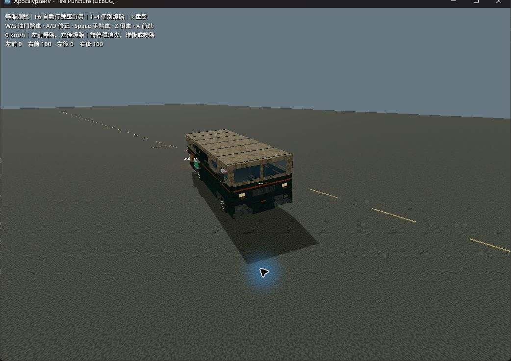
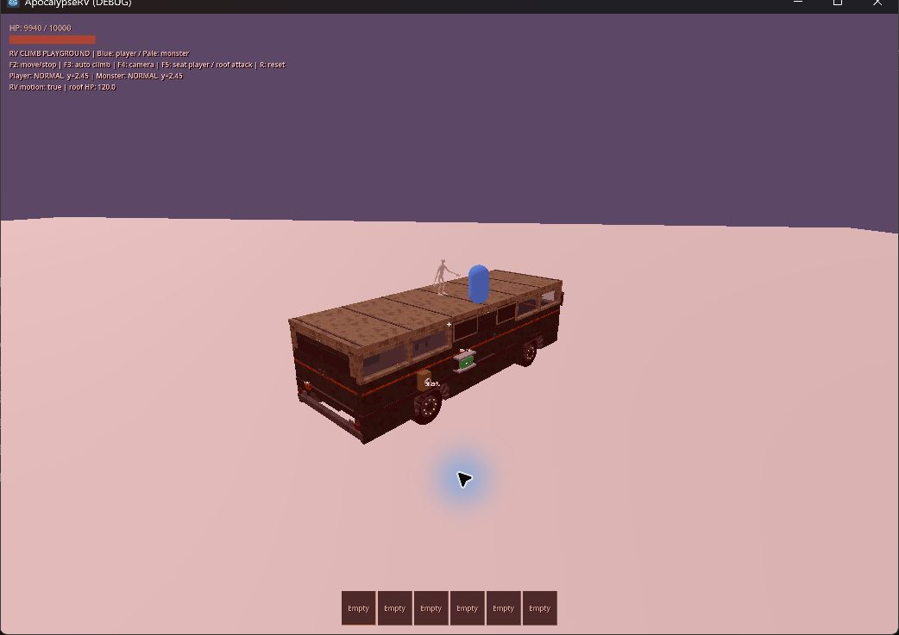
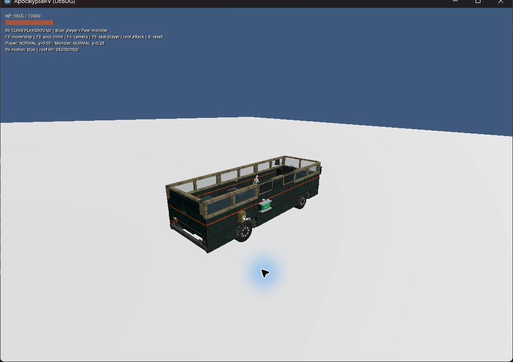

# 四輪爆胎與路邊釘帶

日期：2026-09-22。Godot 4.7.2 stable / Windows；本次工作樹驗證。8 套相關自動化與下述受控目視完成，未宣稱全套測試或所有主觀操控情境完成。

## 行為

- 四輪 health 各自保存，0 為爆胎。單側壞胎引起朝該側偏移；前輪降低轉向效率、後輪降低驅動力；多顆阻力累加，左右對稱配置較少偏移但仍損失抓地與速度。
- 輪胎半徑縮為 80%、橫向外觀加寬 15%、抓地係數 0.5；前輪轉向輸入 55%、後輪驅動力 35%。接地後每顆最大增加 0.38 m/s² 等效阻力，低速平滑歸零；左右轉向偏差權重為前輪 0.065、後輪 0.04 rad，4 m/s 達完整作用，離地輪不施加偏移。
- 一次既有維修消耗 2 Metal Parts、持續 H 2 秒並回復 60 HP；須停穩熄火。長按 E 拆裝輪胎。拆下、拾取、裝回及保存不會治好壞胎；舊 health = 0 輪胎現在也使用爆胎表現。
- 每 150 m 區段以獨立 RNG 抽取 8% 路障，起點前 450 m 排除，接近同區段停靠點也排除。釘帶靠路肩，路中央可避讓；不是滿路寬封鎖。seed 42 的 300 個區段得到 24 處。
- Area 只啟動附近車輛檢測，再用實際接地輪胎的跨幀接觸點線段判定。車身重疊不會直接傷害全部輪胎。路障隨 chunk 釋放，再載入會出現在相同位置，目前不能拆除。

## 本次自動化

正式 runner：

```powershell
powershell -NoProfile -ExecutionPolicy Bypass -File scripts/test.ps1 -TestFilter 'test_tire_*.gd'
```

通過 `test_tire_puncture` 與 `test_tire_handling`，並由 runner 檢查匯入及主世界啟動。測試內容：

- 16 種組合全部可移動、保持直立、煞車停下；左右偏移反向、同側雙胎加重、成對抵銷、四胎比兩胎更慢，後輪成對爆胎比前輪成對爆胎更難維持速度。
- 反打可減少偏移，倒車仍可用，22 m/s 起始速度爆前胎仍保持直立。
- 30 m/s 起始速度通過真實 Area 釘帶，左前先爆、左後後爆，右側保持正常。另驗證幾何判定的高速線段、側方閃過、離地高度與旋轉路障。
- 維修實際扣料、空輪槽不受損／不維修、拆下拾取再裝回保留 ID 與爆胎、四輪讀檔恢復物理狀態、世界種子與重新生成一致、路障 RNG 不改物資、無車路障不執行物理處理。

相關回歸通過：`test_rv_handling`、`test_rv_braking`、`test_rv_systems`、`test_rv_checkpoint`、`test_world_generation`、`test_moving_rv_climbing`。共 8 套相關測試；既有駕駛測試的標準車距離 22.157 m、最高速度 5.516 m/s，與改動前紀錄一致。移動攀爬自動化有玩家／怪物登頂及屋頂破壞。

世界生成測試第一次自行加上 `--fixed-fps 60` 時在跨區導航同步失敗；改回正式 runner 原有正常時間步後通過。沒有修改該測試或放寬斷言。正式 runner 僅將新 `test_tire_handling` 加入原有加速清單。

本次日誌在 `.godot/test-logs/test_tire_*.log`、`.godot/test-logs/main-scene.log`、`.godot/tire-regression-*.log` 及 `.godot/tire-test_*.log`，不提交快取。

## 目視與限制

已建立 [爆胎測試場](../../tests/tire_puncture_playground.tscn)，控制見 [測試場指南](../guides/playgrounds.md#輪胎爆胎與釘帶)。首次因 Windows 鎖定而未能目視；使用者解鎖後，以 Computer Use 重新完成以下檢查（Forward+ / RTX 4060 Laptop GPU）：

- 目視黃色釘帶及初始四輪 100 HP，按 F6 啟動正式輪驅回放。通過後左前、左後顯示爆胎，右側仍約 99.92 HP；車身向受損側偏離原路線，最後煞停至儀表 0 km/h。日誌終點 x = 4.42 m、z = -33.92 m。外觀可見壞胎收縮及車身傾斜；未做音效聽感驗收。
- 以 `rv_climb_playground.tscn -- --replay` 冷啟動，目視玩家與怪物都已登頂，RV 持續移動／轉彎時仍留在屋頂。按 F5 入座，屋頂耐久逐次降至 0，畫面顯示 `DESTROYED`，怪物由屋頂落入車內（相對底盤高度由 2.45 m 降至 0.28 m）。此回放為腳本移動，與前述輪驅爆胎回放分開。
- 初次在無 `--replay` 的場景停留後才按 F3，角色未成功登頂且怪物接觸到地面阻擋；該次不列為通過。冷啟動回放通過，不代表延後啟動 F3 的情況已修正。

圖形回放日誌 `.godot/tire-visual-unlocked.log`、`.godot/tire-climb-replay.log` 無腳本錯誤。只關閉本次測試遊戲，未操作其他應用程式。本次僅補目視與文件，未修改遊戲程式，也未重跑前述 8 套自動化。







這是 VehicleBody3D 上的遊戲用模型，無胎壓、胎溫、輪圈受損或更換專用備胎機制。未測定本次 GPU 幀時間，亦未完成爆胎斜坡、極端翻車或長途世界串流壓力驗收。既有正常胎斜坡、倒車、煞車回歸不等於上述情境均已驗收。
