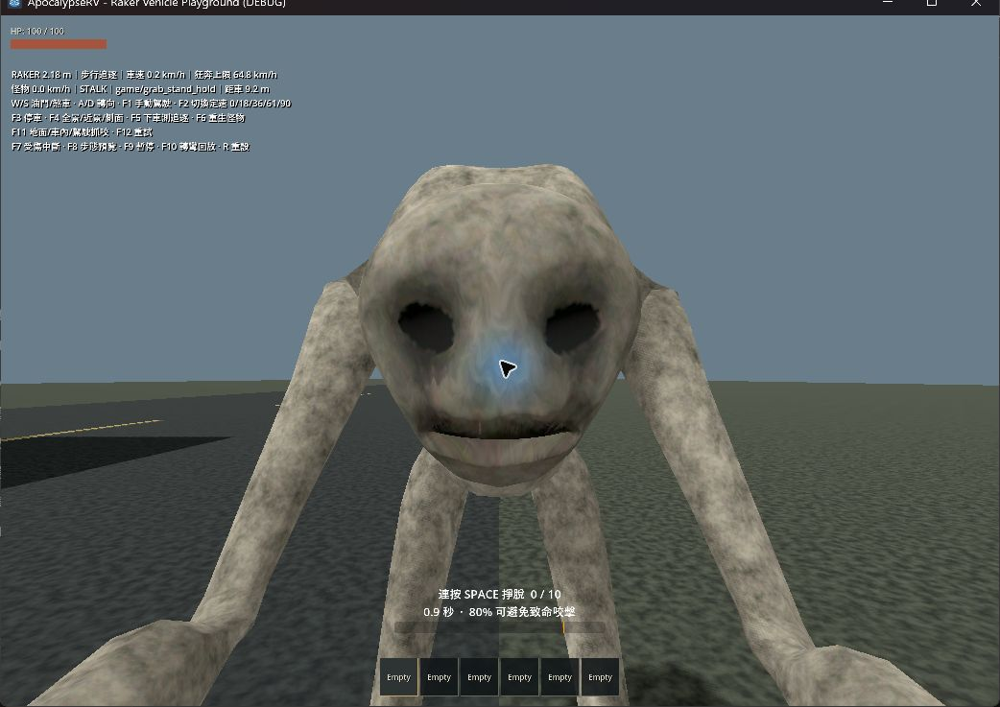
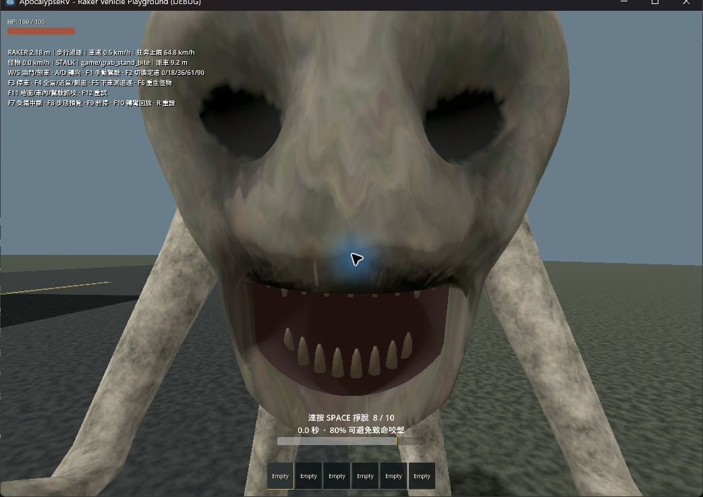
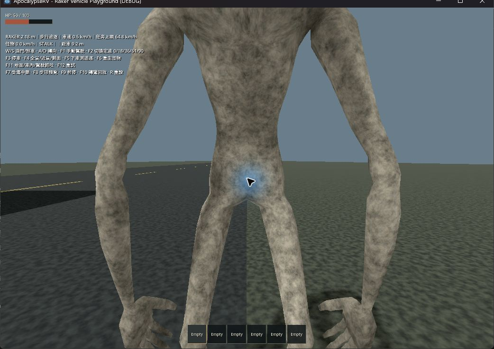

# Raker 站立抓咬、掌向與即時解除

日期：2026-09-23。延續 v018 模型；本次只修改執行期骨架姿勢、抓取流程及測試，未重新匯出 Blender 模型。

## 修正

- 站立伸手／抓握時以三節脊椎俯身配合玩家眼高，避免只靠頸部下壓而碰到 25° 上限。追視、貼臉與鎖定鏡頭改取眼嘴間的可見臉部中心，消除頭骨關節位於臉後方造成的近距離偏差。
- 雙臂接觸 IK 後，透過前臂軸向旋轉和手腕修正，讓左右手掌朝肩、手指朝玩家胸前。伸手階段平滑混入，骨骼位置及原有 root 不改；本次掌向修正限於抓握，行走／待機沿用原動畫。
- 第 0.38 秒咬合結算傷害後，同一 tick 解除玩家硬控及 HUD；怪物自行播放 0.35 秒收手。非致命咬擊不再多鎖至 0.65 秒。死亡回呼可重入清理，避免重啟或重複傷害。
- Playground 新增 `--grab-wounded`，自動提交剛好達到最低 80% 的掙扎次數，供非致命咬擊檢查。

## 本次自動驗證

執行 `scripts/test.ps1 -TestFilter 'test_raker*.gd'`：匯入、12 組 Raker 測試及主場景啟動全部 PASS。

- 新增 `test_raker_attack_alignment.gd`：站立 reach／hold／bite、三種眼高及三種角色朝向，共 27 組；檢查可見臉向、左右掌心／手指方向、關節位置及 root 不移動。
- `test_raker_bite_pose.gd`：正式地面／車內／駕駛咬擊的臉向與鏡頭方向點積均超過 0.97，保留口部距離、頸部限角、前拉上限及牆面阻擋檢查。
- `test_raker_grab.gd`：咬合當幀 HP 50、解除所有者／鏡頭／HUD，重複 tick 不再扣血；死亡、掙脫與既有流程通過。
- `test_raker_grab_vehicle.gd`：新增行駛駕駛 80% 結果，咬合當幀留在原座位並解除駕駛輸入鎖。原有抓取、滑行、Space 不觸發手煞車和強制離座檢查通過。
- 其餘追逐、轉向、步態、狂奔、攀車、車廂、頸部及 playground 測試通過。

## 第一人稱實機觀察

使用已安裝 computer-use 工具選取獨立遊戲視窗，未操作 Godot 編輯器或使用者的 Blender 視窗。

1. 地面、種子 218、慢速抓握：臉部位於視線中央，雙臂向玩家伸出。
2. 正常速度搭配 `--grab-ground --grab-seed=218 --grab-wounded --bite-review`：咬合前暫停，HUD 8／10 次、80%，可見雙眼及張嘴後的內部牙齒。
3. F9 繼續：HP 100→50，掙扎 HUD 消失，鏡頭回到原錨點。日誌記錄 `GRAB_RELEASE reason=bitten`，無腳本錯誤。停留期間再次抓咬可正常死亡及重生，未永久鎖住。
4. 完成後關閉本次測試視窗。

本次實機目視涵蓋地面第一人稱；雙手部分位於畫面下緣，完整掌向依骨架測試驗證。車內與駕駛恢復由自動測試驗證，本次未重新做實機駕駛操控或多人群測試。模型幾何與來源動畫未變，未重新執行 Blender 穿插掃描；前次模型驗收見 [v018 紀錄](2026-09-23-raker-v018.md)。
