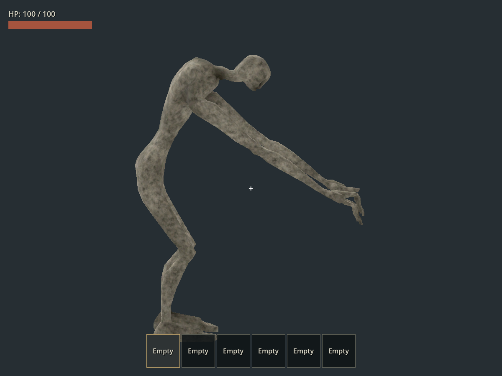
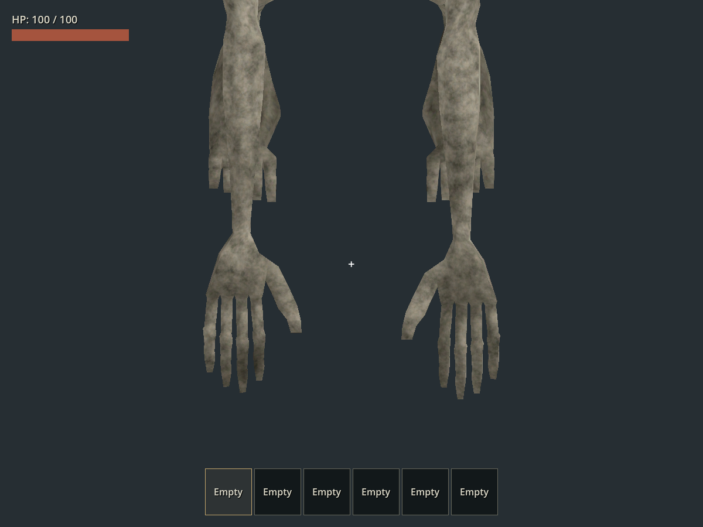
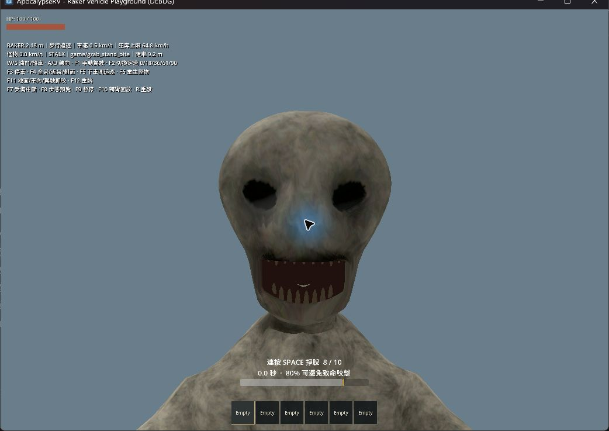
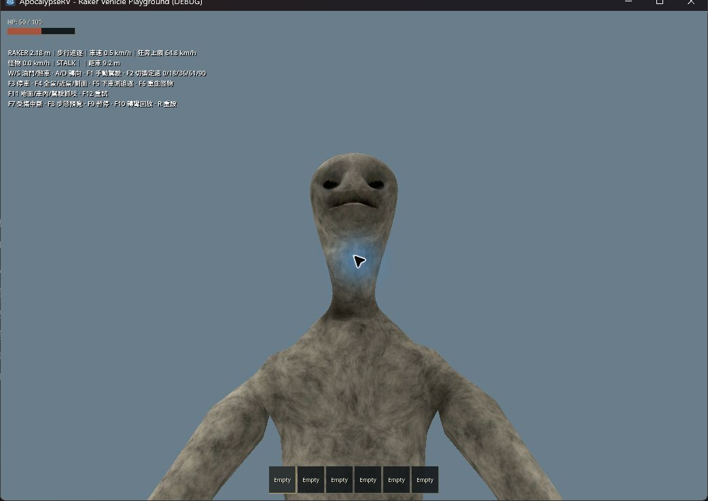

# Raker：只低頭、正確抓握及咬後輸入

日期：2026-09-23。本次取代前次「站立額外俯身」及掌向方案。保留 v018 模型、2.18 m 中立身高、原有駝背；本次修改執行期關節與控制解除，不修改 Blender／GLB 資產。

## 逐項修正

1. **站立只低頭。** 移除站立 reach／hold／bite 的脊椎求解，三節脊椎保持動畫輸入。為了在近距離看向較低的玩家，站立抓咬的頸部下壓可至 65°，一般狀態仍為 25°；上抬與左右限制保留。先求解頸部旋轉造成的臉部位置偏移，再還原姿勢並依 180°/s 轉動。低姿態／座位咬擊保留原前探；站立不再為了貼臉強迫彎腰。
2. **重新校正實際手掌與手指。** 前次掌面符號相反，且指根方向指回怪物；側面渲染看到手腕反折與明顯變形。改為正確掌面，指根越過玩家肩膀、末節朝下、拇指朝頸部。保留前臂與手腕分攤旋轉。測試改看獨立手指／拇指骨骼位置，不再用求解器自己的掌面函式證明自己正確。
3. **解除真正的輸入路徑。** 第 0.38 秒的咬合解除時機保留，補上存活玩家當前視角的滑鼠捕捉、地面輸入回呼與物理更新恢復。座位保留原有輸入所有權，轉場／死亡不搶回鏡頭。原始正常存活案例的身體移動可恢復；額外重現抓取期間滑鼠捕捉遺失後視角無法轉動的路徑，修正後通过。未收到使用者對卡住時血量的補充，因此不能將所有現場症狀斷言為同一原因。

## 本次自動檢查

- `scripts/test.ps1 -TestFilter 'test_raker*.gd'`：匯入、13 組測試及主場景啟動全部 PASS。
- 站立姿勢：三種眼高、三種朝向、reach／hold／bite，共 27 組；檢查眼神方向、脊椎旋轉不變、原關節位置、雙手指根前伸、拇指向內、指尖朝下。
- 正式地面／車內／駕駛咬擊：臉向點積分別約 0.995／0.986／1.000。站立咬擊嘴部與鏡頭約 0.236 m；站立驗收改為只低頭，不再要求彎腰達到 0.22 m 內。低姿態／座位仍驗證貼臉距離、限角、鏡頭掃掠與前拉上限。
- 新增 `test_raker_release_input.gd`：正式 AI、自然倒數與咬合時鐘，存活解除後送入實際鍵盤／滑鼠事件，檢查身體位移和座位油門，不直接呼叫玩家 `_unhandled_input()` 代替事件路由。

## 真實圖形視窗的輸入驗證

執行 `godot --path . --log-file .godot/release-input-visible.log --script res://tests/test_raker_release_input.gd`，三種情境全部 PASS：

| 情境 | 咬後水平／垂直視角變化 | 15 個物理幀內的輸入結果 |
| --- | --- | --- |
| 地面 | −0.18／−0.05 rad | 後退 1.167 m |
| 車內步行 | −0.18／−0.05 rad | 後退 1.167 m |
| 行駛駕駛 | −0.18／−0.05 rad | 原座位油門恢復，駕駛鎖解除 |

以上是圖形視窗中的自動事件回放，不是人工持續按鍵。Headless 的 dummy display 無法捕捉作業系統滑鼠，因此該模式明確跳過視角變化檢查；不能用 headless PASS 取代上述圖形驗證。

## 畫面觀察

另用 computer-use 選取獨立測試遊戲視窗，地面、固定種子 218、`--grab-wounded --bite-review`：咬擊前可見怪物正面看向玩家，8／10 次；F9 繼續後為 50 HP，掙扎 HUD 消失。沒有操作使用者的 Godot 編輯器或 Blender，驗收後關閉測試視窗。

以下前兩張是以正式模型、動畫與姿勢修正器渲染的側面／手部檢查圖；後兩張為實機第一人稱截图。

致命／扣血至 0 的案例仍沿用原先死亡與約 2 秒重生流程；死亡期間不恢復身體行走。此規則本次未改動。原模型的完整穿插掃描未重跑；本次檢查抓握手部和站姿，車內／駕駛外觀沿用姿勢測試，未重做其人工目視驗收。
