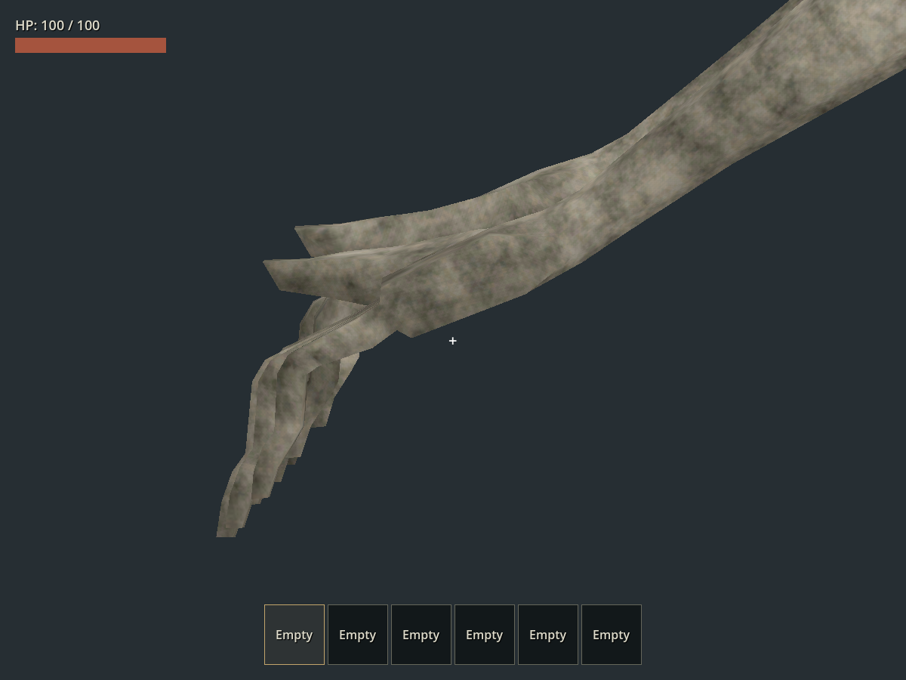

# Raker v020：四指反折

日期：2026-09-23。保留使用者已確認正確的 v019 拇指方向；本輪修正四指關節及其網格，不再旋轉整隻手來掩蓋反折。

## 原因與變更

Blender v019 的 REST、idle、walk、chase、crouch_idle 兩側四指第二節均向手背反折，量測為 −20.22° 至 −23.59°。抓握片段的第二節原本已朝掌心；攀爬、掛牆等片段也含向手背的屈曲。這與先前拇指／掌向錯誤是不同層級的問題。

v020 同步修正四指的 bind 骨架與蒙皮網格，並重定向全部 41 段動畫。每根指骨長度不變、局部平移不拉伸；食／中／無名／小指均朝各自掌面彎曲。逐幀比較 v019 與 v020 的手腕及兩節拇指世界矩陣，誤差 <1e-5。頂點及面數、2.18 m 中立尺寸、材質、頸部、牙齒與嘴部动画保留。

遊戲抓握修正改以當前手掌及近節指骨建立彎曲平面，第二節朝掌心屈曲 45°，再按原抓握權重混合；不再將末節一律指向世界下方。GLB 已替換正式 `assets/models/raker/raker.glb`。

## 本次實際執行

- Blender `audit_fingers.py`：REST 及全 41 段逐幀屈曲檢查、拇指／手掌保存檢查，全數通過。
- Blender `audit.py`：41 段逐幀掃描非相鄰身體面與牙齒穿插均 0 幀、root 平移 0；中立身高 2.17999984 m，9,129 頂點、18,182 三角面。嘴縫／口腔／牙根接觸区沿用既有排除規則。
- 新 `test_raker_finger_flexion.gd`：REST、41 段來源各 17 時間點、站立／低姿態／座位三組 reach／hold／bite 執行期各 13 時間點，共 6,520 個手指取樣。以實際 thumb／middle／wrist 幾何判斷掌面；舊 GLB 可重現 6,520 失敗，新版全部通過。
- `scripts/test.ps1 -TestFilter 'test_raker*.gd'`：匯入、15 組怪物回歸、主場景啟動全部 PASS，包含步態循環、追車、轉向、攀車、抓咬與解除輸入。
- `test_main_world_monsters.gd`：生成 2 個有材質、2.18 m Raker，無舊怪物混入，PASS。
- Blender 固定相機對比 REST／idle／walk／hold 與正面全身；目視確認垂手四指向身體內側彎、拇指位置保留。Godot Forward+ 固定抓握側面與關節近照確認朝掌側彎曲；渲染使用正常動畫更新及啟用的 SkeletonModifier3D。
- 另開 v020 Blender 檔案，視窗列表確認最新路徑。原有 v017 未儲存視窗及 v019 視窗保留。

本輪未重做人工駕駛、持續攀爬和全部跨動畫混合的目視回放；自動化取樣及固定姿勢渲染不能代表所有動態接觸情境。

| 舊四指反折 | 新四指向掌心彎 |
| --- | --- |
|  |  |

[來源與重建](../../art_source/monster_refined_v020/README.md) · [逐幀手指量測](../../art_source/monster_refined_v020/finger_validation.json)
