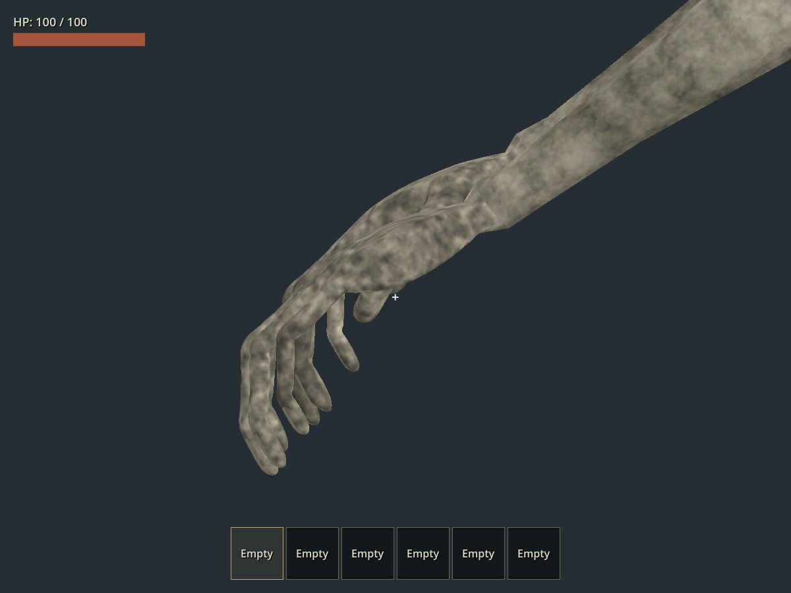

# Raker v021：整隻手重建

日期：2026-09-23。依使用者要求，將上一版手指改角度的修補，改為從手腕接縫開始重建左右手網格、骨節、蒙皮及動畫。

## 完成內容

移除舊掌部、拇指及四指 392 頂點，新建每手 3,211 頂點。新手包含掌肉厚度、拇指根部、連續指縫、三節四指、指腹和指甲面；手腕以新接縫及漸變權重接回前臂。四指增加末節骨，由 46 升為 54 根變形骨，所有 41 動畫重新製作手指張合。新手有獨立 UV 與 1024² 污垢圖集，指甲以粗糙角質材質區分掌背。

全身 15,159 頂點、30,242 三角面、6 材質，中立高度 2.17999984 m。手外的 8,737 原頂點位置差為 0，既有頭頸、身體及口腔不因重建手部而移位。GLB 已替換主世界與 playground 共用的正式模型。

## 本輪驗證

- Blender `audit_hands.py`：確認舊手頂點移除、新手 6,422 頂點、權重總和誤差 <1e-5、手部非流形邊 0、四指三節連續骨，以及 41 動畫逐幀屈曲通過。
- Blender `audit.py`：41 動畫逐幀身體／牙齒非相鄰面穿插均 0 幀，root 平移 0，閉嘴五方向藏齒通過。嘴縫、口腔及牙根嵌合區仍按既有規則排除。
- 固定鏡位素模與材質近照：检查掌面、掌背、側面、自然垂手和抓握，修正初版拇指根部穿插及腕部混合權重反摺，再重跑完整掃描。
- Godot `test_raker_finger_flexion.gd`：REST／41 來源片段／9 執行期抓握階段，6,520 個三節手指取樣通過；測試同時要求第三節骨存在，不能讓旧兩節模型誤通過。
- Godot `test_main_world_monsters.gd`：正式生成 2 個有材質、2.18 m、54 骨與左右末節指骨的 Raker，無舊怪物混入，PASS。
- Godot Forward+：正式模型與姿勢修正器產生抓握近照；現有車輛 playground 自動進入正常抓取，第一人稱鎖視角及掙扎 HUD 出現。第一人稱鏡頭主要看到怪物臉與手臂，手指接觸細節由另外的側面近照檢查，未宣稱該第一人稱截圖能看清全部手指。
- 匯入材質檢查包含新手圖集、指甲粗糙度及線性轉 sRGB 後的正確色值；原皮膚、眼睛、牙齒貼圖及暗口腔仍單獨核對。

`scripts/test.ps1 -TestFilter 'test_raker*.gd'`：匯入、15 組怪物回歸及主場景啟動全部 PASS，包含掌向、三節屈指、頸部、抓咬、解除輸入、步態、追車、轉向及攀車。最新版 v021 已另開 Blender 視窗供檢查。

未重新人工駕駛、回放全部攀爬路線或窮舉跨動畫混合；本次以模型逐幀掃描、正式遊戲自動回歸及固定近照核對為主。

[來源與重建](../../art_source/monster_refined_v021/README.md) · [模型量測](../../art_source/monster_refined_v021/rebuild.json) · [逐幀手部稽核](../../art_source/monster_refined_v021/hand_validation.json)
