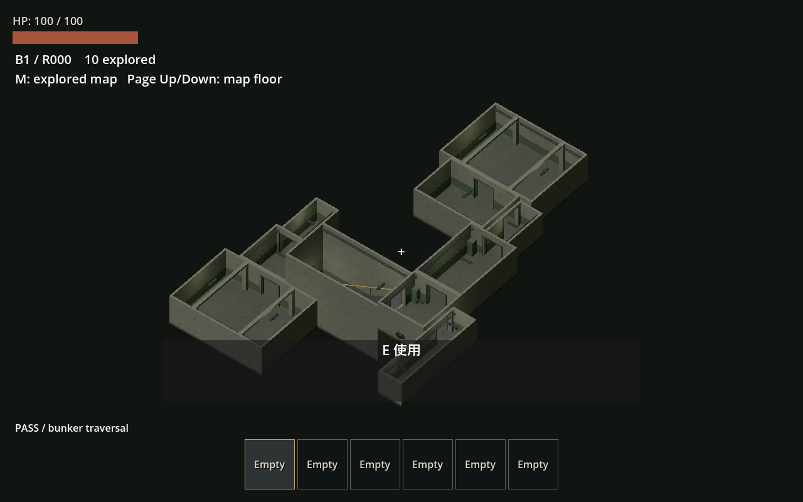
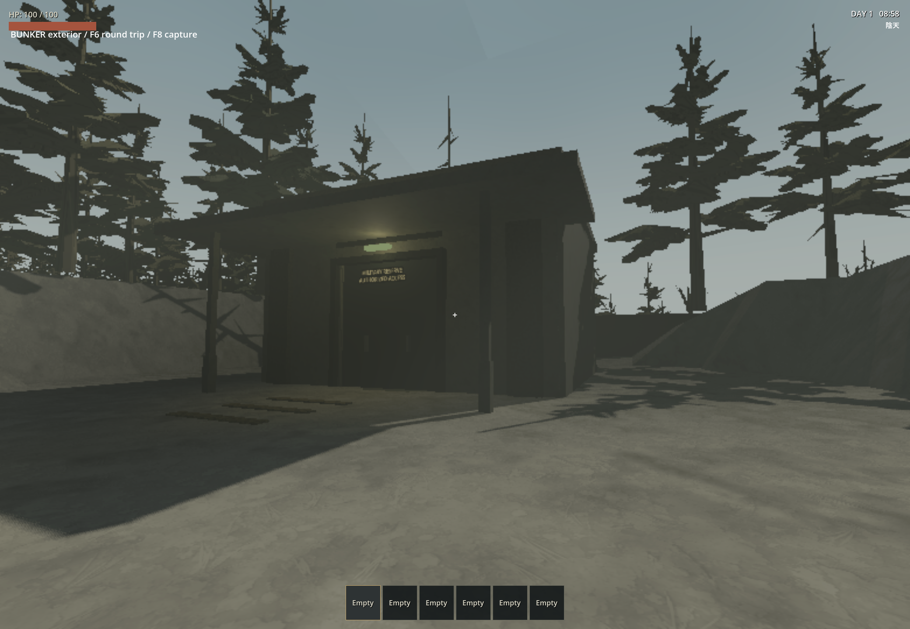

# 隨機軍事地堡驗收

2026-09-24，Godot 4.7.2 stable／Windows 11。此紀錄只適用本輪地堡重作，不替代既有 RV／怪物美術驗收。實作依據：[可擴充房型計畫](../plans/2026-09-24-random-bunker.md)。

## 交付範圍

16 個模組、六種普通尺寸、14 個普通變體，目標 10–30 模組與隨機 1–3 層，沒有固定主路或分層房型池。候選／接口耗盡正常少房，樓梯與下一層首房原子加入。混凝土／灰綠塗裝、鋼框、管線、穩定燈光與基本陳設；所有舊入口接入新版並使用簡單軍事地堡立面。

未接通接口填牆並移除門框。牆板全在本房占用內，避免相鄰可見面重合；逐門測試曾發現偏置門旁櫃子侵入通行區，已保留全門寬與 2 m 進出區。樓梯測試以正式玩家膠囊腳底核對高度，而非將低於腳底 0.25 m 的角色原點當地板。

不生成物資／怪物，不做目標、捷徑或特色事件。玩家帶入掉落物、已探索地圖、主世界進出與磁碟保存仍可用。v1／v2 專用生成器、房間、目標／捷徑、展示場和工具已刪除；室外加油站共用家具／材質與歷史記錄保留。

## 自動驗證

- `test_interior_layout.gd`：1,000 seeds 重現、10–30 目標預算、1–3 層、占用排斥、接口對齊與全部連通；入口孤立時以 1 間正常結束、死接口不影響其他接口、巨大房被擋後嘗試小房、無樓梯時保留單層；樓梯上層占用被房間擋住時整筆拒絕，仍可擴展其他普通接口。
- 同套測試只載入 `tests/fixtures/bunker_extension/expansion.tscn`／`.tres`，加入 7.5×15 m、同牆偏置雙門與新分類，通過正式作者驗證並參與生成；生成器零修改。修改 Profile 權重／加入房型後已存 manifest 仍有效且不重排；缺房型版本、移動接口拒絕。
- `test_interior_doorways.gd`：四組 seed／10、20、30、隨機 19 房，450 次正式玩家膠囊雙向門洞掃掠；檢查封牆沒有競爭可見面，注入障礙能偵測，不能靠繞路冒充該門可通。
- `test_interior_navigation.gd`：10／20／30 房每條連接的烘焙導航、完整 manifest 重返、零自動生成物件及導航錨點失敗時取消建置。
- `test_interior_traversal.gd`：seed 42、12 房、3 層，正式玩家持續 WASD 輸入攜帶大型引擎走訪所有房間並返回，序列化後用不同 caller seed 還原相同布局、探索與掉落物。
- `test_interior_compatibility.gd`：已知舊紀錄清除、新版狀態保存、未知版本拒絕及室外控制復原。
- `test_poi_instances.gd`：主世界 E 入口、獨立物理世界、室外天氣／電量／串流、探索與地圖輸入、玩家拾取／掉落／重返、逐連接導航；實際磁碟檢查點載入與舊副本遷移，原檔 bytes 不變，RV／玩家／戶外／新版地堡內容不變。
- `test_rv_shared_storage.gd`：v1 材料／油箱遷移仍只轉換一次，舊 POI 紀錄依新契約刪除；重複讀取不重複加材料。
- `test_rv_checkpoint.gd`：既有 RV／背包／引擎身分與生產進度磁碟還原測試，POI fixture 更新成新版 manifest，驗證探索與布局完整保存。
- `test_poi_asset_kit.gd`：全目錄作者契約、不同尺寸和轉向、錯接口拒絕、保留共用家具與正式玩家跨兩道接縫；門口父層位移後生成／封牆座標一致，缺少外觀層回報作者錯誤。

完整回歸涵蓋 68 suites、資產匯入與主場景啟動，全部通過。執行 `scripts/test.ps1 -TimeoutSeconds 240` 通過前 58 套後，舊 shared-storage 測試仍存取本輪應移除的 POI 紀錄而中斷；修正預期後，以同一 runner 的執行／錯誤檢查流程續跑末 10 套及主場景通過。續跑只限縮測試清單並另寫 manifest，沒有變更 timeout、PASS 要求或錯誤排除規則。導航失敗、父層門口 transform、實際擴充場景及新版檢查點均包含在這些通過結果。所有測試使用專用 `.godot/*-user` APPDATA，未讀寫使用者正式存檔。runner 僅排除既有沙箱憑證訊息，未排除 SCRIPT ERROR／其他 ERROR。

### 建置量測

最後一輪針對導航錯誤取消的測試（headless，同機同時有其他回歸／可見遊戲程序）；build 包含 nav，不應相加。這是單次量測，非穩定性能上限。

| 模組 | 實際層數 | 建置總計 ms | 其中導航 ms | 重返建置 ms |
|---:|---:|---:|---:|---:|
| 10 | 2 | 123 | 88 | 111 |
| 20 | 2 | 155 | 118 | 122 |
| 30 | 2 | 157 | 95 | 146 |

## 實機觀察

使用 computer-use 技能，選取測試遊戲視窗而非 Godot 編輯器；Forward+／Vulkan／RTX 4060 Laptop GPU。

| 場景 | 實際觀察／回放結果 |
|---|---|
| seed 1775／10 房／1 層 | 可見連續搬運回放走訪全部房間後返回，PASS，190.5 m；更新後混凝土材質及封牆可見 |
| seed 42／10 房／2 層 | 可見回放走訪所有房間、樓梯及返回，PASS，207.9 m；觀察通道、轉角、總覽／掀頂 |
| seed 42／12 房／3 層 | 可見回放完成全房間上下樓與大型搬運，PASS，432.7 m；這次三層觀察在後續純視覺封牆去門框／材質修訂之前，最終版本另由自動三層測試覆蓋 |
| 正式世界 seed 42 | E 進入實際 19 房／2 層地堡，沿真正導航走入相鄰房並返回，E 回到戶外，畫面與日誌顯示 PASS |

觀察到的移動視角未出現之前的門板閃爍；自動表面檢查也通過。這不是所有 seed、所有視角的 GPU 保證。樓梯連續通行由整段輸入回放與日誌驗證；離散截圖不代表逐幀人工審閱。

入口另外實機檢查並修正標牌被立柱遮住的位置；保留基本入口殼與原有返回點。

## 限制與後續

- 外觀為基本地堡套件，未製作完整地表軍事設施、細緻破損、搜刮／怪物／目標內容。
- 非矩形房以外接 AABB 保守占用；不支援利用凹角塞房。電梯／攀爬等新通行機制未做。
- 預設正常目錄通常能達到目標房數；少於 10 間的耗盡行為以受限目錄情境驗證。
- 沒有測全部 1,000 seeds 的 GPU 畫面或長局群體敵人性能；本輪不生成敵人。
- 舊 v1／v2 副本內容依使用者決定清除；此策略不適用未來單純新增地堡房型。
- 日誌：`.godot/bunker-full-run.txt`、`.godot/test-logs/`、`.godot/bunker-visible-{1,2,3}.log`、`.godot/bunker-visible-main.log`。快取與測試存檔不提交。
