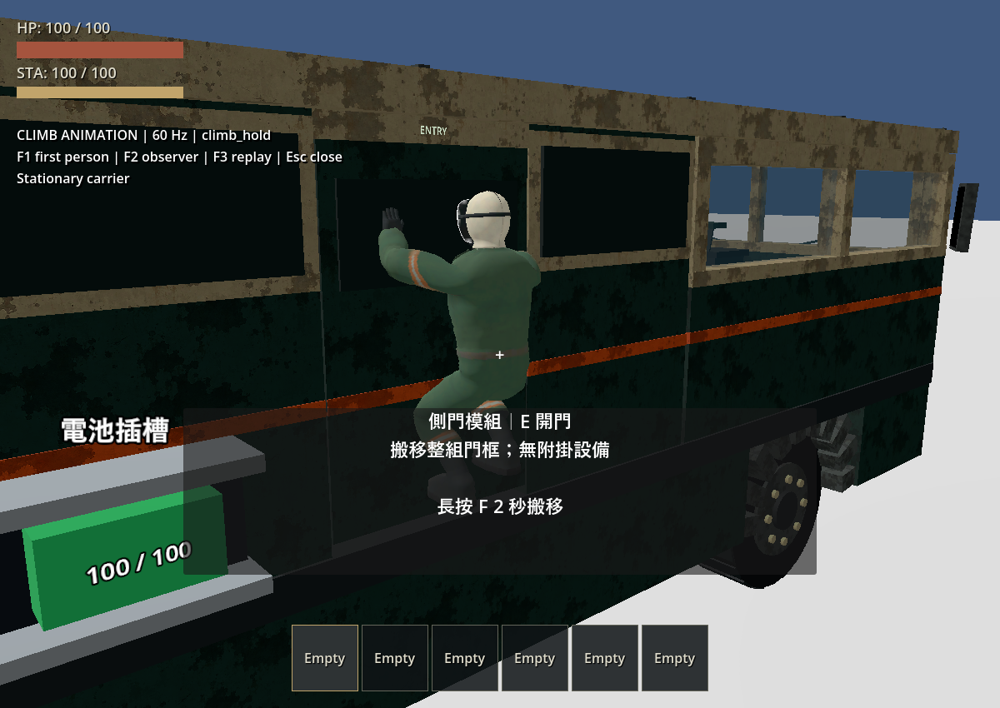
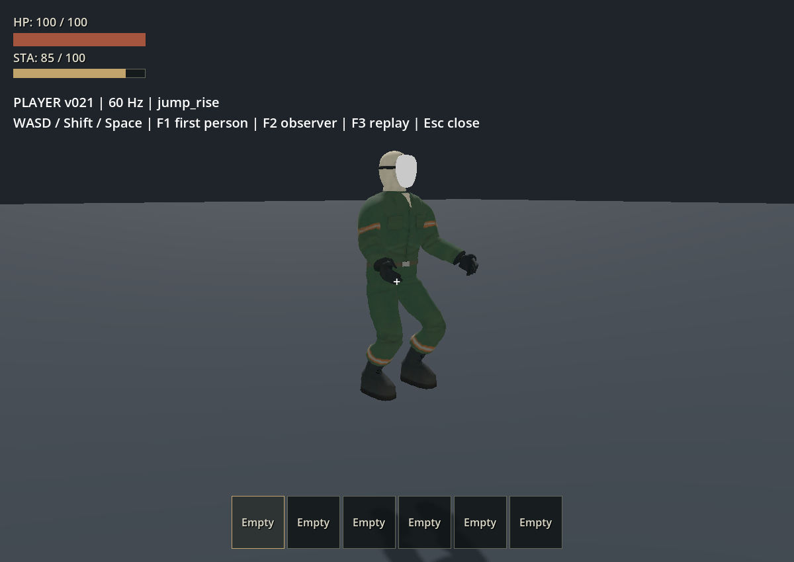
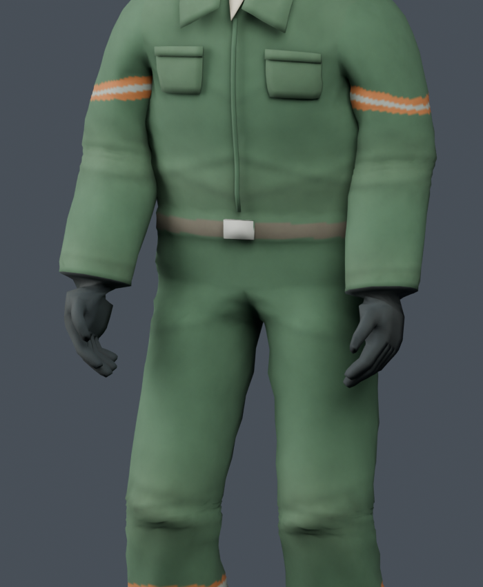
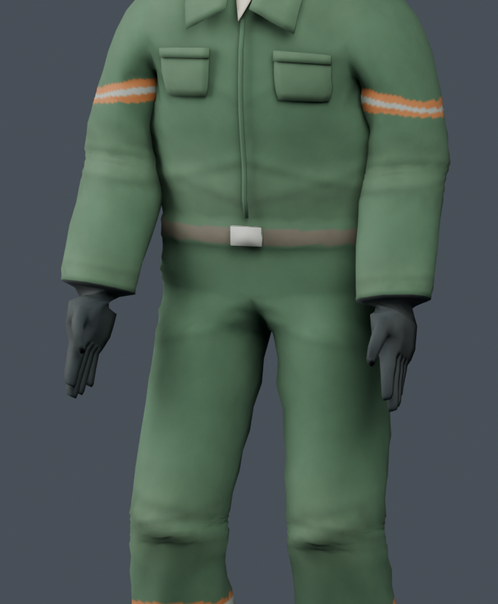
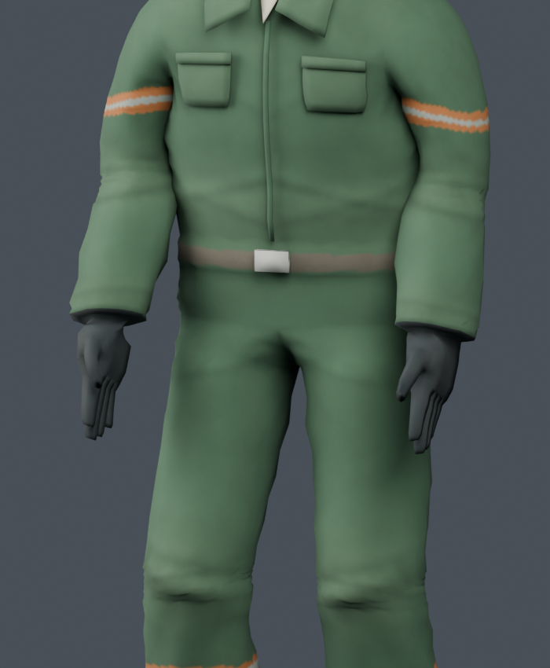
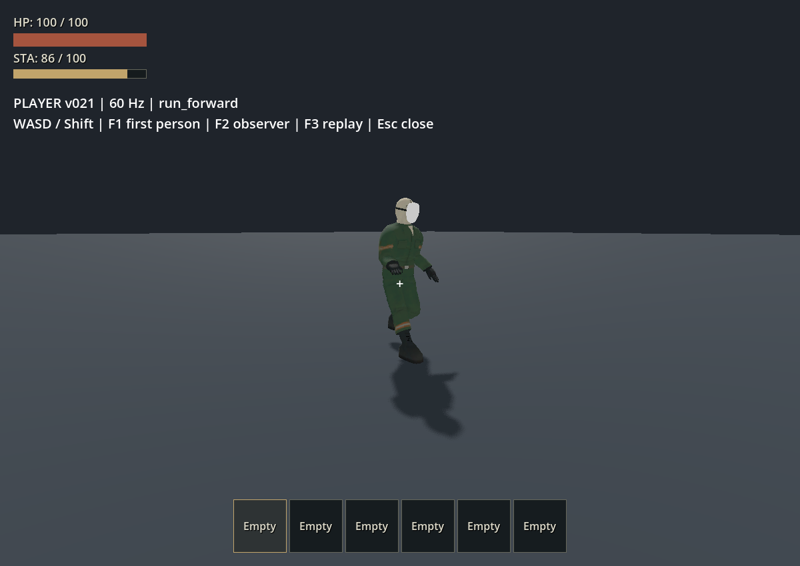
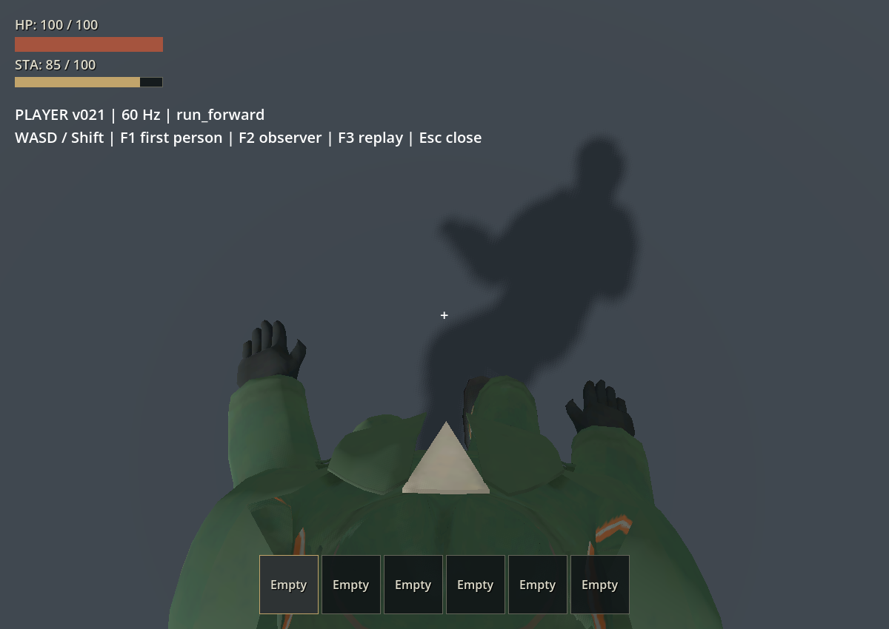

# 玩家正式移動動作 v021

## 攀爬鏡頭同步修正（最新）

使用者指出上一版攀爬時鏡頭與身體分離。已修正只移動骨架、未同步視點的問題；鏡頭現在跟隨相同貼牆位移，登頂／脫離時一起回復，保留滑鼠視角。17 段動畫資產與 60 Hz 設定不變，詳見 [修正驗收](2026-09-27-player-climb-camera.md)。

## 前一版：攀爬姿勢（鏡頭同步修正前）

新增五段動作並接入正式玩家：`climb_hold` 抓牆停留、`climb_up` 交替攀升、`climb_left`／`climb_right` 橫移，以及 `climb_exit` 登頂後 0.3 秒收手。現在共 17 段動作。攀爬時掌心朝牆、手指微彎；離開後回到原本只轉手腕及放鬆手指的動作。既有 12 段曲線逐值一致，原模型、41 根 Rest Transform、11 Mesh、蒙皮、UV、材質與四份原資產雜湊均保持不變。

動畫讀取角色相對 RV 的實際位移，車輛行進或轉彎本身不會讓停留姿勢空轉。骨架以有限的顯示位移靠近壁面，切換混合前移除上一幀補償，避免累加；玩家碰撞體、鏡頭、控制器和主世界場景未修改。維持 **60 Hz／Jolt 32／32**、地面 5／8 m/s、攀升 2.6 m/s、橫移 1.2 m/s。登頂仍採既有向內站位轉移，收手動畫容許接地旗標晚一幀；S／Space 脫離接落下姿勢，UI 暫停與死亡接管正常。

- **已實測通過：** 統一 runner `test_player*.gd` 的 12／12 組玩家測試、匯入及主場景啟動／移動，另跑 `test_moving_rv_climbing.gd` 通過，合計 13 組行為套件；退出碼 0。涵蓋相對車體停留／攀升／橫移、三種起始高度的登頂、脫離、UI、重生，以及 605 個逐幀蒙皮樣本。合併執行期間死亡套件出現一次 Jolt 工作佇列容量警告；關閉其他測試後单獨複驗死亡套件通過、未再出現警告。兩份原始日誌均保留，未更改任何物理參數。
- **已實測通過：** 三次實際攀爬死亡交接並恢復控制，最大關節間隙 20.98 mm，低於 25 mm；既有 20 個地面及 15 個真實跳躍死亡案例也通過。
- **已桌面觀察：** Godot 4.7.2、Forward+／Vulkan、RTX 4060 Laptop GPU。近照回放顯示抬手、掌心朝牆、交替屈膝、左右橫移、收手和回到待機；第一人稱雙手可見、頭套未遮鏡頭。沒有觀察到尖刺、肩膀塌陷或配件脫離。另在雙角色場觀察到兩者攀牆／登頂、隨車轉彎仍留在頂上；F5 入座後屋頂 HP 變成 `DESTROYED`，怪物落入車內。此場為腳本驅动车輛；自動整合測試另含 VehicleBody 支撐，未將其等同完整輪驅操控驗收。
- **需要修正（既有限制）：** 上一輪三個額外高處跳躍死亡壓力案例仍超過 25 mm，最大 29.12 mm；原始紀錄保留於下方跳躍章節。本輪未修改物理設定以處理它們。
- **尚未驗收：** 使用者對攀爬動作外觀的確認；斜向壁面、轉角、逐手逐腳接觸 IK、多人體系、輪驅操控及所有非相關 suite。手腳目前為動畫姿勢，可能沿牆滑動，沒有固定抓點 IK。登頂不是有 root motion 的完整翻越動作，仍可見既有站位轉移。

[驗證結果與雜湊](player-animations-v021/climb/verification.json) · [回歸日誌](player-animations-v021/climb/regression_logs.zip) · [攀爬軌跡](player-animations-v021/climb/climb_traces.json) · [死亡交接](player-animations-v021/climb/climb_handoffs.json) · [原 12 段曲線比對](player-animations-v021/climb/existing_clips_comparison.json) · [資產檢查](player-animations-v021/climb/asset_audit.json)

| 姿勢 | Blender | Godot |
|---|---|---|
| 抓牆停留 | [正面](player-animations-v021/climb/blender_climb_hold_0.png) | [側面](player-animations-v021/climb/godot_hold_side.png)／[第一人稱](player-animations-v021/climb/godot_hold_first_person.png) |
| 交替攀升 | [側面](player-animations-v021/climb/blender_climb_up_0_side.png) | [實際車壁](player-animations-v021/climb/godot_up.png) |
| 登頂收手 | [中段](player-animations-v021/climb/blender_climb_exit_9.png) | [收手](player-animations-v021/climb/godot_roof_exit.png)／[待機](player-animations-v021/climb/godot_roof_idle.png) |
| 隨車與拆頂 | — | [兩者在車頂](player-animations-v021/climb/rv_both_aboard.png)／[屋頂破壞](player-animations-v021/climb/rv_roof_destroyed.png) |

交付：[v021 工作 .blend](../../art_source/player_animations_v021/player_animations_v021.blend)、[17 段動畫 GLB](../../assets/models/player_animations_v021/player_animations_v021.glb)、[動畫驅動](../../player/player_locomotion_visual.gd)、[近照場景](../../tests/player_climb_animation_playground.tscn)／[場景腳本](../../tests/player_climb_animation_playground.gd)、[攀爬回歸測試](../../tests/test_player_climb_animation.gd)。近照場啟動加 `-- --animation-review`，F1 第一人稱、F2 外部、F3 重播、Esc 關閉。原 `player_textured_v019.blend` 與 `player_godot_export_v020.blend` 未覆寫。

以下為先前版本的驗收證據；目前工作檔與 GLB 以本節的 17 段動作為準。

## 前一版：跳躍姿勢

新增 `jump_rise`、`jump_fall`、`jump_land` 三段各 0.2 秒的非循環姿勢，接入正式玩家：上升稍收腿、下降伸腿準備接地、落地屈膝回穩後返回待機或移動。上升／下降片段播完停在末姿，依實際垂直速度與接地狀態切換；落地期間按跳躍可立即再次起跳，不延遲控制器輸入。UI 於空中暫停時，姿勢跟隨原本的控制器暫停，不額外計時。

目前共 12 段動作。原九段地面動畫的所有關鍵值逐值一致，保留只轉手腕與放鬆手指；41 根變形骨、11 Mesh、原資產雜湊與 Rest Transform 檢查通過。物理 **60 Hz**、Jolt 32／32、跳速 4.5 m/s、15 點跳躍耐力消耗、水平 5／8 m/s、鏡頭及布娃娃設定均未修改。新姿勢只驅動蒙皮骨骼，沒有 root motion。

- **已實測通過：** 統一 runner 篩選 `test_player*.gd`，11／11 組玩家測試、匯入及主場景啟動／移動通過，退出碼 0，無 Jolt 警告。站立、慢跑、快跑實際跳高約 1.071 m；含耐力不足不跳、連續起跳中斷落地、走出平台、碰到天花板及空中 UI 暫停／恢復。
- **已實測通過：** 15 個沿真實輸入跳躍軌跡的死亡交接／恢复控制，最大關節間隙 21.65 mm（門檻 25 mm）；既有 20 個地面動作死亡交接及獨立布娃娃套件也通過。這些通過結果與下列高處壓力案例分開記錄。
- **已檢查：** 十二段動作逐幀蒙皮、Blender 正面／側面姿勢及 Godot Forward+ 桌面回放。站立、慢跑、快跑皆顯示上升／下降／落地；第一人稱可見身體與手部，角色回到原本地面動作。
- **需要修正：** 額外的高處死亡壓力測試，root 高度 1.8 m、向前 3 m/s，並另給上升 +4 或下降 -4 m/s。三個跳躍姿勢／相位的關節間隙超過 25 mm，最大 29.12 mm；原始失敗日誌與數值保留。這不是上述真實平地跳躍軌跡，不能把一般跳躍通過延伸為所有高處落下皆通過。本次未更動物理參數或骨架／權重來處理此限制。
- **尚未測試：** 其他非玩家 suite 未於本次重跑；移動 RV 上跳躍的完整視覺驗收、坡面腳掌 IK、多人與極端高處墜落尚未涵蓋。動作外觀等待使用者確認。

[結果與檔案雜湊](player-animations-v021/jump/verification.json) · [11 組測試日誌](player-animations-v021/jump/regression_logs.zip) · [實際跳躍軌跡](player-animations-v021/jump/jump_traces.json) · [15 次跳躍死亡](player-animations-v021/jump/jump_handoffs.json) · [原地面動作一致性](player-animations-v021/jump/existing_clips_comparison.json) · [資產檢查](player-animations-v021/jump/asset_audit.json) · [高處壓力失敗紀錄](player-animations-v021/jump/high_drop_initial.log)

| 階段 | Blender | Godot |
|---|---|---|
| 上升 | [姿勢](player-animations-v021/jump/blender_jump_rise.png) | [遊戲](player-animations-v021/jump/standing_jump_rise.png) |
| 下降 | [姿勢](player-animations-v021/jump/blender_jump_fall.png) | [第一人稱](player-animations-v021/jump/run_jump_fall_first_person.png) |
| 落地 | [側面](player-animations-v021/jump/blender_jump_land_side.png) | [遊戲](player-animations-v021/jump/standing_jump_land.png) |

交付仍使用 [v021 工作 .blend](../../art_source/player_animations_v021/player_animations_v021.blend)、[動畫 GLB](../../assets/models/player_animations_v021/player_animations_v021.glb)、[動作驅動](../../player/player_locomotion_visual.gd)、[測試場景](../../tests/player_animation_playground.tscn)及[跳躍驗證腳本](../../tests/test_player_jump_animation.gd)。測試場加 `-- --jump`，Space 手動跳躍、F3 回放；加 `-- --jump --replay` 自動驗收並結束。

以下為先前版本的驗收證據；工作 .blend 與 GLB 以本節的十二段動作為準。

## 前一版：放鬆手指

將手指由偏直、向手背伸展的姿勢改成朝掌心的自然弧度。食指到小指逐漸增加微彎，拇指輕微彎曲，九段動作共用此放鬆姿勢。保留只轉手腕的掌向、原前臂屈肘、擺臂與步態；模型、權重、Rest Pose 及 60 Hz 設定未變。目前 v021 工作 .blend 與動畫 GLB 已更新成這版。

比對上一版只有 20 根手指骨的旋轉曲線改變（九段動作合計 180 個 channel）；其他曲線最大浮點差約 0.00000036。手腕與前臂的旋轉曲線保持一致。原袖口下方的手腕收束仍保留。

- **已實測通過：** 統一 runner 篩選 `test_player_animation*.gd`，2／2 組、資產匯入及主場景啟動／移動通過，退出碼 0，無新增錯誤或警告。涵蓋循環／切換、394 個蒙皮樣本及 20 個死亡交接與恢復案例。
- **已檢查：** Blender 待機、慢跑與快跑近照，手指朝掌心放鬆；Godot Forward+ 桌面回放完成，第一人稱雙手可見，倒地後恢復控制。四份原資產雜湊、41 根 Rest Transform 與 11 Mesh 保持一致。
- **尚未重跑：** 其他玩家與非玩家 suite；前述 10 組／79 組結果僅屬各自的歷史版本。手指放鬆幅度等待使用者確認。

[本版結果與雜湊](player-animations-v021/relaxed-fingers/verification.json) · [測試日誌](player-animations-v021/relaxed-fingers/regression_logs.zip) · [手指曲線比較](player-animations-v021/relaxed-fingers/channel_comparison.json) · [資產檢查](player-animations-v021/relaxed-fingers/asset_audit.json)

[Blender 快跑](player-animations-v021/relaxed-fingers/blender_run_forward.png) · [Godot 快跑第一人稱](player-animations-v021/relaxed-fingers/run_first_person.png) · [恢復控制](player-animations-v021/relaxed-fingers/recovered_idle.png)

以下保留上一版手指較直時的證據，工作 .blend 與 GLB 以本節版本為準。

## 前一版：只轉手腕（手指較直）

依使用者要求取消前臂的軸向轉向修正，保留原本屈肘與擺臂，只讓 `hand_L`／`hand_R` 各繞自身長軸轉 90°（左右相反）。待機仍為掌心朝身體、拇指側朝前，九段動作均已更新。v021 工作 .blend 與 GLB 為這個版本；原始模型、權重、Rest Pose、步態、移動速度及 60 Hz 物理設定未變。

與最初未改掌向的動畫相比，只有兩根 hand 骨的旋轉曲線改變，共 18 個 channel；其他曲線最大浮點差約 0.00000048。前臂不再分攤轉向。袖口下方的手腕收束比上一版明顯，保留原權重與幾何供外觀確認。

- **已實測通過：** 統一 runner 篩選 `test_player*.gd`，10／10 組玩家測試、資產匯入及主場景啟動／移動，退出碼 0，沒有 Jolt 警告。20 個動畫死亡交接與恢復通過，最大關節間隙約 22.73 mm。
- **已實測通過：** 394 個蒙皮樣本、41 根相同 Rest Transform、11 Mesh、原資產雜湊與掌向檢查；Blender 近照及 Godot Forward+ 第一人稱／移動／倒地恢復回放已檢查。
- **尚未重跑：** 其他非玩家 suite；原 79 組完整回歸仍屬最初版本。手腕交界外觀等待使用者確認，未新增模型或物理修改。

[本版結果與雜湊](player-animations-v021/wrist-only/verification.json) · [測試日誌](player-animations-v021/wrist-only/regression_logs.zip) · [只有手腕曲線改變的比對](player-animations-v021/wrist-only/channel_comparison.json) · [資產檢查](player-animations-v021/wrist-only/asset_audit.json)

[Godot 快跑第一人稱](player-animations-v021/wrist-only/run_first_person.png) · [Blender 快跑](player-animations-v021/wrist-only/blender_run_forward.png) · [倒地](player-animations-v021/wrist-only/run_death_external.png) · [恢復控制](player-animations-v021/wrist-only/recovered_idle.png)

## 前一版：前臂與手腕分攤轉向（歷史記錄）

依使用者「掌心朝身體、拇指朝前」調整九段正式動作。左右前臂與手腕分攤軸向旋轉，待機時掌心朝內、拇指側朝前；跑動時維持掌心朝內，拇指隨屈肘與擺臂自然轉動。沒有改動原模型、權重或 Rest Pose。

匯出前後比較只有左右 forearm／hand 的旋轉曲線改變，共 36 個 channel；其餘曲線最大浮點差約 0.00000042，步態、擺臂幅度、移動速度及 60 Hz 物理設定保持不變。41 根變形骨、11 Mesh 與四份原始資產雜湊仍通過檢查。以下證據屬前臂分攤版；目前工作 .blend 與 GLB 已改為上方「只轉手腕」版本。

- **已實測通過：** 使用統一 runner 的 `-TestFilter 'test_player*.gd'`，10／10 組玩家測試、匯入及主場景啟動／移動通過，退出碼 0。本次日誌沒有 Jolt 警告。包含 20 個動畫死亡交接與恢復，最大關節間隙約 22.73 mm，仍低於 25 mm 門檻。
- **已實測通過：** 394 個蒙皮樣本、九段動作雙掌朝內檢查、Blender 預覽及 Godot Forward+ 桌面回放。第一人稱低頭雙手可見，倒地後恢復待機與控制。
- **尚未重跑：** 其他非玩家 suite；下方 79／79 完整回歸及攀車桌面證據屬手掌修正前的版本，保留原始記錄。本次不宣稱完整 79 組重新通過。
- **等待確認：** 手掌方向與動作外觀。無新增模型或物理設定修正需求。

[本次結果與雜湊](player-animations-v021/hands/verification.json) · [測試日誌](player-animations-v021/hands/regression_logs.zip) · [曲線比較](player-animations-v021/hands/channel_comparison.json) · [資產檢查](player-animations-v021/hands/asset_audit.json) · [手掌方向量測](player-animations-v021/hands/hand_orientation.json)

[Godot 慢跑第一人稱](player-animations-v021/hands/jog_first_person.png) · [快跑第一人稱](player-animations-v021/hands/run_first_person.png) · [Blender 快跑](player-animations-v021/hands/blender_run_forward.png) · [倒地](player-animations-v021/hands/run_death_external.png) · [恢復控制](player-animations-v021/hands/recovered_idle.png)

以下為首次動作接入時的驗收紀錄與限制；截圖及完整回歸封存未覆寫。

## 本輪範圍

使用者確認製作第一批待機／走跑並接入遊戲，隨後選擇保留一般移動 5 m/s、衝刺 8 m/s，改採慢跑與快跑步態。物理維持 60 Hz、Jolt 32／32，沒有更動 project.godot、控制器速度、模型比例、肩部拓撲、Rest Pose、UV、材質或權重。

- [Blender 動作工作副本](../../art_source/player_animations_v021/player_animations_v021.blend)
- [動畫 GLB](../../assets/models/player_animations_v021/player_animations_v021.glb) 與 [片段清單](../../assets/models/player_animations_v021/clips.json)
- [可重建製作腳本](../../scripts/build_player_animations.py)
- [正式動畫驅動](../../player/player_locomotion_visual.gd)
- [獨立遊戲測試場](../../tests/player_animation_playground.tscn)
- [行為與動畫交接測試](../../tests/test_player_animation.gd)
- [逐幀蒙皮測試](../../tests/test_player_animation_skin.gd)
- [來源雜湊與骨架一致性](player-animations-v021/asset_audit.json)

## 接入方式

9 段循環：idle 2.4 秒，jog／run 各四方向，每段 0.5 秒。Blender 以每秒 60 個動畫樣本烘焙至 41 根變形骨；動畫採樣率不會修改物理 tick。單一正式場景、11 Mesh、41 根骨骼匯出，10 根控制骨與 TEST Action 排除。新舊 GLB 的 41 根骨骼初始節點變換逐值一致。

正式場景仍載入原 v020 Mesh、Skin 與材質，只把新動畫資源加入本體 AnimationPlayer。每位角色獨立播放、共享不變的 AnimationLibrary。驅動在控制器物理移動之後讀取局部速度，使用 0.16 秒切換混合；無 root motion、沒有寫入玩家位置、碰撞或攝影機。車輛承載速度不當成自行跑動。死亡暫停動畫並保留目前姿勢；恢復後重新播放待機或移動。

布娃娃首次建立原先會把動畫姿勢當成關節參考。現在先在不可見的同一次呼叫中以既有 rest pose 建立物理節點，再恢復可見姿勢後啟動物理；没有修改 rest 資料。新增高處跑動死亡發現腳部接觸衝量造成踝關節瞬間間隙超標，因此兩隻腳的剛體質量由各 1.25 kg 改為 2.5 kg，總質量由 67 kg 成為 69.5 kg。碰撞形狀、關節限制、慣量倍率、阻尼及全域求解設定保持不變；獨立 fixture 同步使用此質量。

## 已實測

- Godot 動畫取樣 60 fps、曲線最佳化與壓縮關閉；預設最佳化曾使鞋底最低點偏移約 6 cm。以原 v020 Skin 對所有匯入動畫逐幀計算蒙皮座標，校正後最低点誤差約 0.024 mm，2 mm 門檻通過。見 [逐幀蒙皮結果](player-animations-v021/skinned_bounds.json)。
- 新動畫：正確骨名映射、循環首尾連續、實際 WASD／Shift 選片、控制器 5／8 m/s 不變、停止回待機。
- 20 個動作死亡交接：四種地面動作各四個相位，以及後退慢跑從高處死亡四相位。關節間隙最大約 22.73 mm，原門檻仍為 25 mm；重生後動畫與控制恢復。
- 原有獨立布娃娃 10 情境通過，包括斜坡、階梯、側向落地、微小外力及恢復控制。新資料另存 [本輪物理檢查](player-animations-v021/physics_audit_60hz.json)，保留前階段報告。
- 完整統一 runner：79／79 組、匯入與主場景啟動／玩家移動通過，退出碼 0。新增 UI 待機修正亦有定向回歸通過。見 [結果清單與檔案雜湊](player-animations-v021/verification.json)、[完整日誌封存](player-animations-v021/regression_logs.zip)。
- 桌面 Forward+／Vulkan、RTX 4060 Laptop GPU：已觀察低頭身體與手部、外部模型、連續動作與死亡／恢復；最終版回放完成，日誌無腳本錯誤。攀車測試已觀察雙方攀上車頂、轉彎支撐，以及 F5 拆頂後 roof HP=DESTROYED、怪物降至底盤；車輛為腳本回放，不代表輪驅或翻車驗收。

## 日誌與待確認項目

完整回歸的室內遍歷與車輛操控各出現一則 Jolt job-pool 警告，兩項測試都通過；結束其他測試後分別單獨重跑亦通過且無警告，車輛重跑退出碼 0。見 [室內重跑](player-animations-v021/interior_recheck.log)與 [車輛重跑](player-animations-v021/handling_recheck.log)。這是前階段亦出現過的暫發訊息，根因尚未確認，沒有調整全域 job pool、tick 或求解設定。Windows 沙箱無法讀取憑證存放區的既有訊息由 runner 明確排除，未忽略其他錯誤。

本輪功能檢查已通過；動作美術節奏與擺臂幅度等待使用者確認。專用跳躍／攀爬／坐姿／持物動畫尚未製作。低速受阻時仍採固定週期，斜向採主方向選片；後續可補播放速度對應、連續方向混合及坡面腳掌 IK。

## 外觀與限制

| 動作 | Blender 工作副本 | Godot 正式玩家 |
|---|---|---|
| 待機 | [Blender](player-animations-v021/blender_idle.png) | [Godot](player-animations-v021/idle.png) |
| 慢跑 | [Blender](player-animations-v021/blender_jog_forward.png) | [Godot](player-animations-v021/jog_forward.png) |
| 快跑 | [Blender](player-animations-v021/blender_run_forward.png) | [Godot](player-animations-v021/run_forward.png) |

Blender 預覽使用 Cycles 工作室照明，Godot 使用測試場 Forward+ 照明；截圖取樣相位與視角不同，骨架／蒙皮一致性另由資料與逐幀檢查驗證。[Blender 預覽腳本](../../scripts/render_player_animation_review.py) 不保存或改動工作檔。

[跑動中倒地外部視角](player-animations-v021/run_death_external.png) · [恢復控制](player-animations-v021/recovered_idle.png) · [車頂支撐](player-animations-v021/climb_roof.jpg) · [拆頂後落下](player-animations-v021/roof_destroyed.jpg)

這批是原創烘焙動作，不是動作捕捉。方向以最大速度分量選擇，斜向不是連續二維混合；沒有坡面腳掌 IK、持物上身分層或轉身動畫。極慢移動、斜坡與快速變向的腳掌鎖地尚未完整驗收。跳躍、攀爬、抓取暫停於最後姿勢，坐姿沿用隱藏全身；專用動作留待後續批次。多人、多具同時布娃娃及極端翻車尚未測試。

最後另更新獨立布娃娃測試場的 69.5 kg 顯示文字與 v021 截圖輸出路徑，避免覆寫前階段證據；這兩項顯示／路徑更動以差異檢查驗證，沒有再次修改物理行為。

外觀節奏仍需使用者確認；本輪不擴充攻擊、蹲下或正式攀爬動畫。
