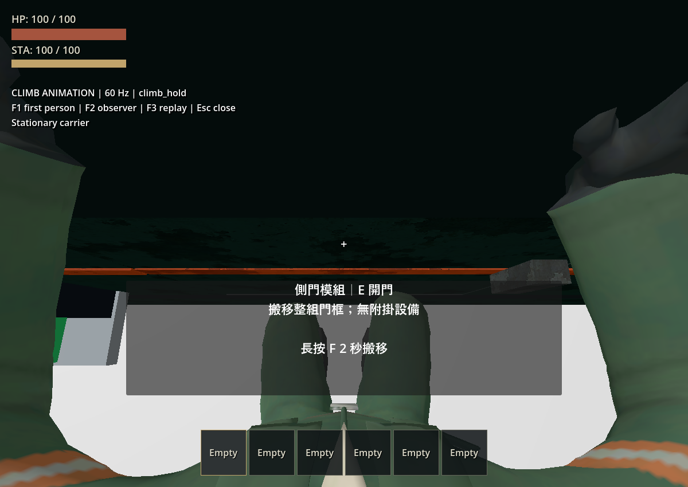

# 攀爬鏡頭與身體同步修正

上一版依牆距將角色顯示骨架向前移，鏡頭仍停在控制器原眼位，造成視點與身體分离。新增真實 RV 攀爬回歸檢查後，舊版重現最大 **0.221667 m** 的相對位移誤差。

現在骨架與鏡頭共用同一個世界座標貼牆位移，依各自父節點轉成局部座標；不累加位置、不修改鏡頭旋轉。登頂及脫離時，兩者一起收回貼牆位移。死亡接管保留當下視點，布娃娃重生還原原站立眼位，避免把暫時的攀爬位移存成新的常態位置。入座時還原玩家眼位，抓取與死亡期間由既有鏡頭系統接管。

模型、17 段動畫 GLB／Blender 工作檔、骨架、權重、UV、材質、碰撞膠囊、移動速度、攀爬控制器及 **60 Hz／Jolt 32／32** 均未改動。

- **已實測通過：** 舊程式在新增同步檢查下失敗；修正後相對位移誤差最大約 0.0000004 m，低於 1 mm 門檻。涵蓋開始攀爬、停留、車輛轉彎、左右橫移、登頂、S／Space 脫離、UI 暫停、視角轉動及死亡重生；鏡頭位於牆外，抬頭／低頭角度不被動畫覆寫。
- **已實測通過：** 統一 runner 的 12 組玩家套件、匯入與主場景啟動／移動，含攀爬／跳躍／地面動作、布娃娃、座位死亡與 World3D 生命週期。三次真實攀爬死亡交接最大關節間隙仍為 20.98 mm，恢復控制後眼位回到 `(0, 1.78, -0.20)`。
- **已桌面檢查：** Godot 4.7.2、Forward+／Vulkan。攀牆低頭時可見身體與雙臂；平視時面向牆面，沒有看穿車壁或頭套遮鏡頭。回放完整完成橫移、隨車轉彎停留、登頂收手及待機，無腳本錯誤。只關閉這輪專用驗收視窗，使用者原有遊戲／編輯器保留。
- **未在本輪重跑：** 完整非玩家套件、輪驅操控與拆頂桌面回歸。上一版逐手逐腳 IK 尚未實作，以及三個高處死亡壓力案例超過 25 mm 的限制仍有效；本輪未調整物理來處理它們。

[驗證數據與雜湊](player-animations-v021/climb-camera/verification.json) · [修正前失敗](player-animations-v021/climb-camera/before.log) · [修正後測試日誌](player-animations-v021/climb-camera/regression_logs.zip) · [桌面回放](player-animations-v021/climb-camera/desktop.log)

[平視](player-animations-v021/climb-camera/godot_hold_look_level.png) · [身體側面](player-animations-v021/climb-camera/godot_hold_side.png) · [登頂](player-animations-v021/climb-camera/godot_roof_exit.png)

修正檔案：[動作顯示與鏡頭同步](../../player/player_locomotion_visual.gd)、[死亡鏡頭恢復](../../player/player_ragdoll.gd)、[同步回歸檢查](../../tests/test_player_climb_animation.gd)。使用 [專用場景](../../tests/player_climb_animation_playground.tscn) 加 `-- --animation-review --camera-review` 重播；F1 第一人稱、F2 外部、F3 重播、Esc 關閉。
