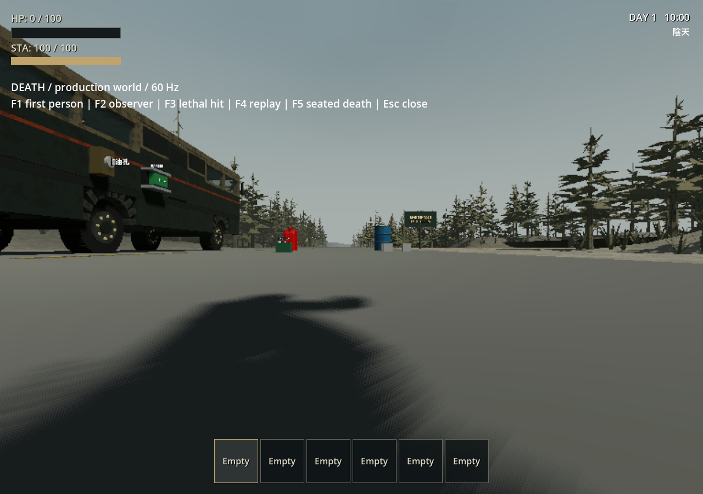
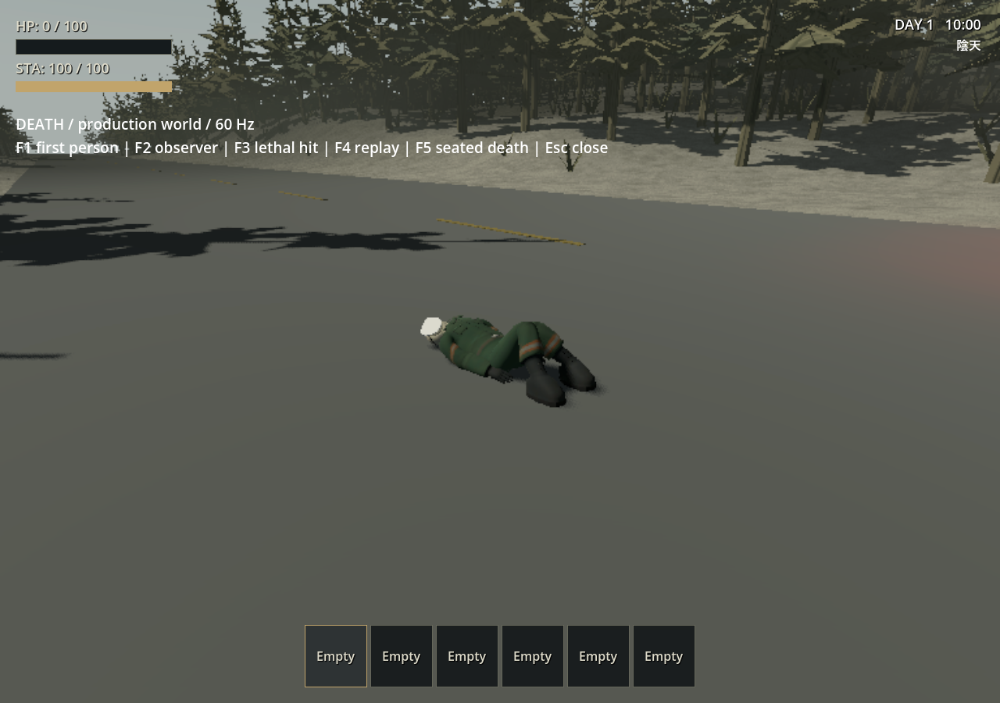
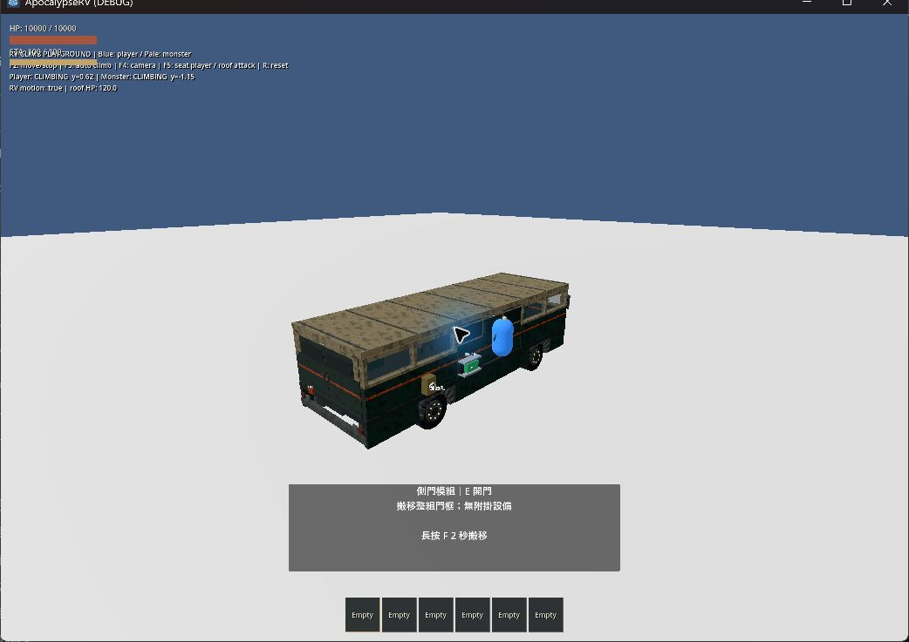
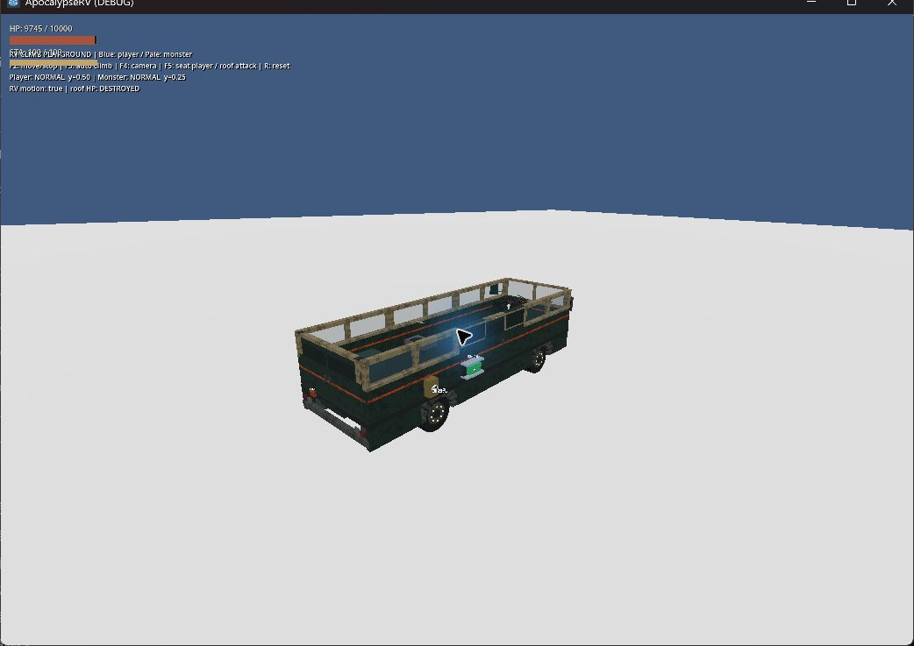
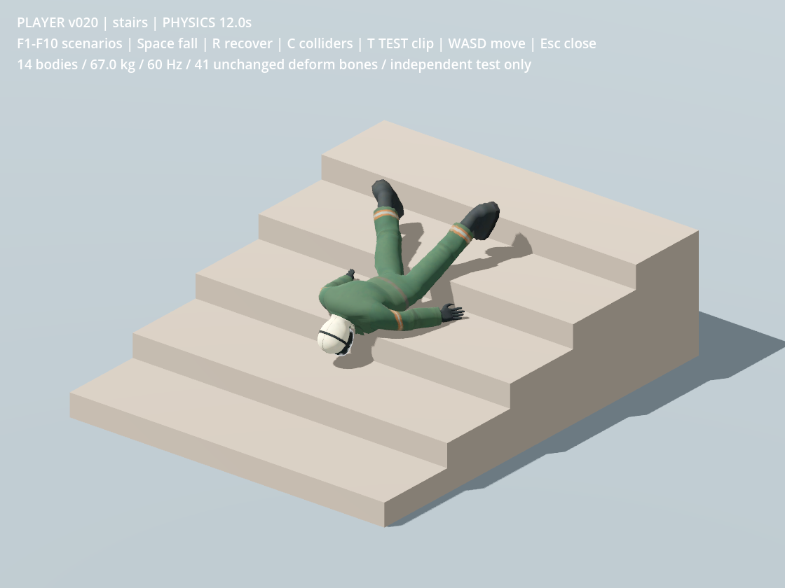
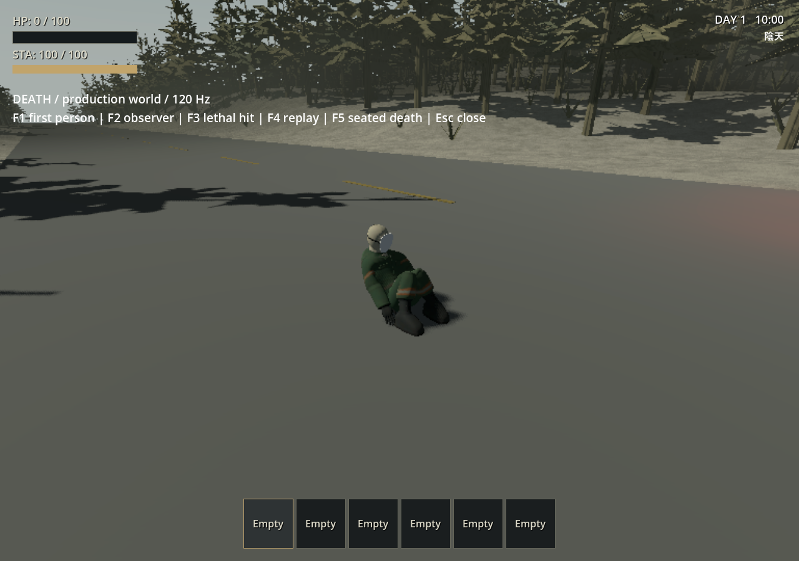
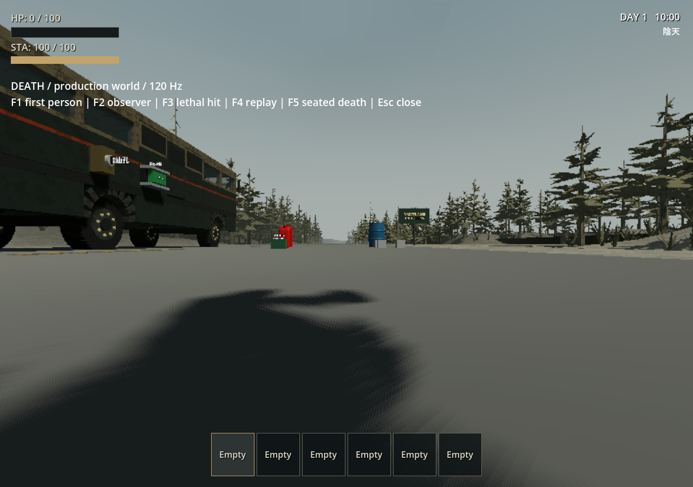
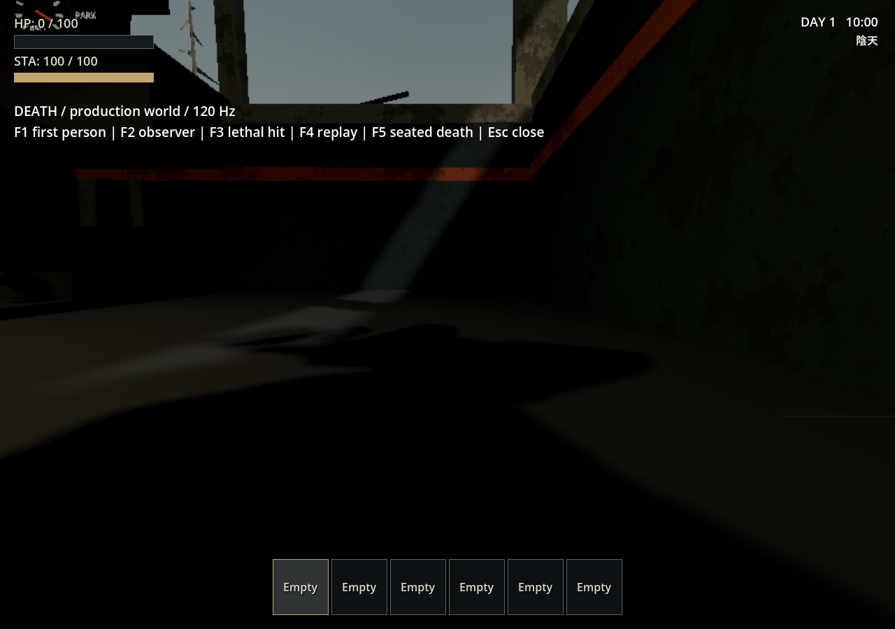
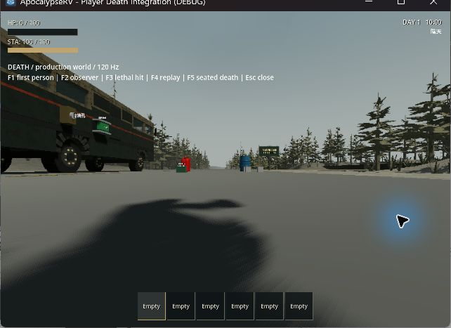
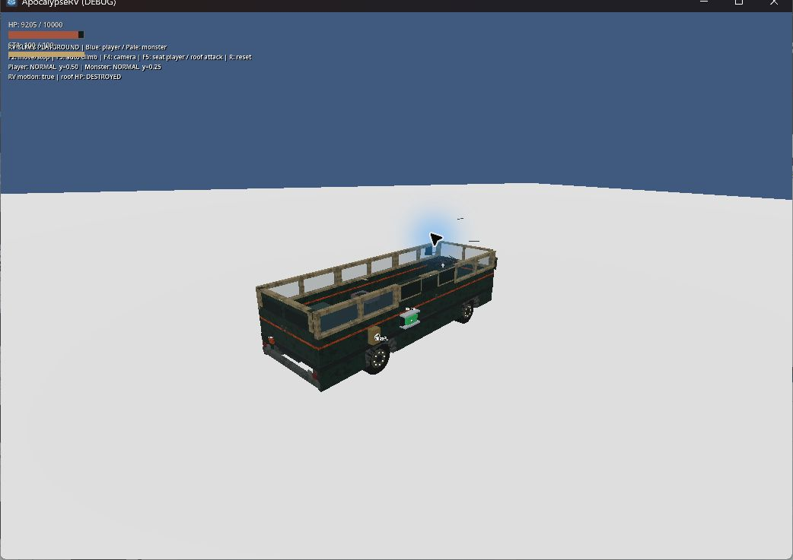

# 玩家死亡布娃娃接入

日期：2026-09-27。本輪依使用者要求固定 **60 Hz**，未修改 tick、時間縮放或全域 Jolt 求解設定。使用者選定第一人稱死亡鏡頭：隨倒地下移、保持觀看方向、不翻滾。

## 本輪 60 Hz 驗收

已實測通過：布娃娃 10 個完整物理案例、正式玩家死亡／恢復控制，以及桌面死亡與攀車／拆頂觀察。單次完整 runner **77／77 通過**，資產匯入與主場景啟動／移動也通過。下方標示 120 Hz 的數據與截圖是歷史紀錄。

回退初次檢查中空中死亡腳踝接點偏差 42.49 mm，超過 25 mm 門檻；見 [原始回退紀錄](player-death-integration/rollback_60hz.json)。本輪修正 [局部轉動慣量](../../player/ragdoll_mass_properties.gd)：以碰撞形狀包圍盒的均勻質量慣量為基準，身體乘 3、腳部乘 4，降低細小肢體在接觸衝量下的過快旋轉；角阻尼為腳／前臂 2.4，其餘 1.2。仍為 14 個盒體／膠囊、67 kg，碰撞形狀、關節軸及角度限制不變。這是剛體參數，不改 Mesh、Rest Pose 或蒙皮，也不採用額外物理子步。

Jolt 的慣量控制原理見 [官方架構文件](https://jrouwe.github.io/JoltPhysics/index.html)，引擎使用 `PhysicsServer3D.BODY_PARAM_INERTIA`。這組數值是本角色簡化碰撞體的實測配置，不能推論任何初始姿勢都穩定。

[60 Hz audit](player-death-integration/physics_audit_60hz.json) 在每個物理步檢查碰撞接觸，涵蓋站立前／後／側倒、面朝下／上／側向落地、20° 斜坡、階梯、TEST 動畫／蹲姿切換、輕微外力及每項恢復控制；保留所有原始門檻。測試另比對正式 Player 與獨立 fixture 的骨骼映射、碰撞／關節框架、質量、慣量、阻尼及限制。獨立測試場已移除原有 120 Hz 與全域 solver 覆寫，runner 只用 `--fixed-fps 60` 同步渲染取樣，不改 physics tick。

正式死亡測試覆蓋站立、UI／持物、空中、跳離載具慣性、真實 RV 車頂支撐、座位解除、跨 World3D、重複致命傷害、死亡時鎖住控制、天花板阻擋延後重生，以及恢復後移動。桌面回放三種情境均回復生命並停止物理；站立／空中恢復後後退約 2.42 m，駕駛座在車殼碰撞限制下約 0.39 m。見 [本輪回放](player-death-integration/current-60hz/replay.json)。

Godot 4.7.2 stable／Jolt／60 Hz，桌面 Forward+／Vulkan／RTX 4060 Laptop GPU。所有測試使用 `.godot/test-appdata`，不讀寫日常存檔。





依 AGENTS 透過 computer-use 操作：F3 觸發實際致命傷害，HP 0 後恢復 100；F4 啟動連續死亡回放。攀爬場重設後兩角色顯示 CLIMBING，再於車頂保持支撐與轉彎；F5 入座觸發拆頂，HUD 顯示 DESTROYED，怪物由車頂局部 y≈2.45 m 落至底盤 y≈0.25 m。攀爬回放採腳本移動車輛，輪驅由自動測試另驗。






[實際渲染回放](player-death-integration/current-60hz/ragdoll/visual_run.json) 的 10 個案例在 12 秒時速度均為 0，全部恢復控制並移動 1.20–1.23 m。[渲染版正式死亡測試](player-death-integration/current-60hz/death_rendered_test.log) 退出碼 0，實際輸入事件在重生後產生 yaw −0.18 rad、pitch −0.05 rad，確認視角輸入恢復。



## 完整回歸

單次執行 [scripts/test.ps1](../../scripts/test.ps1)，未使用 StartAt 或 TestFilter；77 個 suite、import、主場景 ready_for_play 及正式玩家移動全部通過，runner 退出碼 0。涵蓋模型／蒙皮／481 姿勢取樣、死亡、布娃娃、攀爬、Raker 抓咬／脫離、RV 輪驅／煞車／輪胎、室內外穿越、設備、資源與保存。

[本輪驗證摘要](player-death-integration/current-60hz/verification.json)｜[runner 輸出](player-death-integration/current-60hz/full_suite.log)｜[全部原始日誌與 manifest](player-death-integration/current-60hz/regression_logs.zip)。沙盒無法讀取 Windows 根憑證存放區的特定診斷依既有 runner 規則排除；其餘腳本／執行錯誤不予忽略。

完整 runner 中 `test_interior_traversal` 與 `test_player_ragdoll_v020` 各出現一次 Jolt job pool 容量警告，原始日誌完整保留。兩項在桌面回放結束後[單獨重跑室內穿越](player-death-integration/current-60hz/isolated_interior_traversal.log)及[布娃娃](player-death-integration/current-60hz/isolated_ragdoll.log)，退出碼均 0 且未再出現警告；暫發原因尚未定位，沒有修改工作池、tick 或 solver 來壓掉訊息。

## 本輪量測門檻

| 檢查 | 60 Hz 最大值 | 原門檻 | 結果 |
|---|---:|---:|---|
| 獨立 10 案例關節間距 | 15.60 mm | <25 mm | 通過 |
| 環境接觸穿入 | 18.29 mm | <30 mm | 通過 |
| 關節角超出限制 | 3.18° | <6° | 通過 |
| 末段線／角速度 | 0／0 | <0.10 m/s／0.8 rad/s | 通過 |
| 正式死亡渲染測試關節間距 | 19.62 mm | <25 mm | 通過 |

數值只代表列出的案例；不將有限案例的通過當作所有姿勢及速度的保證。

## 正式接入實作

- [player.gd](../../player/player.gd) 的實際致命傷害及 Raker 致命咬擊進入同一死亡流程。立即鎖住 DEAD 模式，解除抓取、攀爬、座位、UI 與放置，隱藏手持預覽但保留庫存。碰撞切換延後到安全階段，重複死亡呼叫不會疊加計時器。
- [player_ragdoll.gd](../../player/player_ragdoll.gd) 首次死亡才建立 14 個 PhysicalBone3D，使用已驗收的盒體／膠囊、67 kg 質量、相鄰碰撞排除、關節方向和限制。骨架仍為原本 41 根變形骨，沒有逐指剛體。繼承死亡前世界速度；車上包含既有支撐速度，攀爬使用車身附著速度，跳離載具後補入控制器另外保存的水平慣性；離座已帶完整世界速度，不重複疊加。靜止死亡另施加 3 N·s 前向胸部推力，使中性姿勢失衡。
- 物理骨使用第 8 碰撞層（128），與實體環境及遠端肢體碰撞，排除自身控制膠囊。重生時停止 simulator、清空速度及碰撞層／遮罩、恢復中性姿勢。
- 相機平移跟隨物理頭部，保留死亡起始觀看方向；半徑 6 cm 的球體掃掠限制向牆內偏移。鏡頭沒有跟隨頭骨翻滾。
- 身體翻倒可能蓋住方向固定的相機，因此 [PlayerModelVisual](../../player/player_model_visual.gd) 在死亡期間只對本地相機隱藏身體與貼近鏡頭的配件。完整模型仍提供外部視角，11 個原始 Mesh 的完整陰影保留；重生立即恢復一般低頭身體顯示。沒有刪除任何頭部／身體網格或更改來源材質。
- 沿用兩秒重生延遲，改為在骨盆附近找有地面支撐、能容納正式站立膠囊的位置。上方被封住時保持死亡並每 0.25 秒重試，不會直接穿進牆內或跳到天花板頂。成功後恢復生命、體力、移動、滑鼠視角、手持外觀與控制膠囊，沒有起身動畫。
- [project.godot](../../project.godot) 目前固定 60 Hz、Jolt velocity/position steps 各 32、penetration slop 0.003 m、CCD max penetration 0.10。這些是全世界設定，會作用於 RV、道具及敵人；沒有以臨時修改骨架或權重掩蓋求解問題。

Godot API 依 [PhysicalBoneSimulator3D](https://docs.godotengine.org/en/4.7/classes/class_physicalbonesimulator3d.html) 與 [PhysicalBone3D](https://docs.godotengine.org/en/4.7/classes/class_physicalbone3d.html) 官方文件核對，行為由本機 Godot 4.7.2 實測。

## 來源保全

v019 Blender、v020 匯出工作副本、原交付 GLB 與專案 GLB 沿用前階段。11 Mesh／41 變形骨／5 材質／16,222 三角面／1.60 m；面具線性 RGB 0.9、512×512 Base Color、權重、骨長、Rest Pose、肩膀拓撲、UV 不變。未製作或播放正式 Idle／Walk／Attack，TEST clip 仍不在正式玩家中播放。

來源路徑與雜湊見 [artifact_manifest.json](player-death-integration/artifact_manifest.json)，四個交付資產再次核對相同。原工作檔為 `C:/Users/evan4/Projects/3d/player_godot_export_v020.blend`，交付 GLB 為 `C:/Users/evan4/Projects/3d/exports/godot/player_export_test_v020.glb`。

工作開始前已有上輪整合修改，以及使用者工作區的 `todo` 和貼圖 `.import` 修改；保留原狀，不將它們描述為本輪調整。

歷史比較（局部慣量修正前）：在獨立臨時場景以 60 Hz 執行原 10 個布娃娃案例，按實際秒數取樣，沒有修改正式專案就先取得比較：原 solver 在站立前倒案例的接點偏差約 40.2 mm、cone 短暫超限約 17.0°。16／8、32／32、64／64 求解，以及僅改質量／阻尼的比較，仍有接觸量、關節限制或末段收斂未達原驗收門檻的案例，詳見 [比較資料](player-death-integration/physics_comparison.json)。這些失敗不宣稱為「模型損壞」，也沒有放寬門檻充作通過。當時曾採用使用者同意的 120 Hz／32／32 配置；本輪已固定 60 Hz 並完成上述局部慣量修正。

## 回退前 120 Hz 已實測通過

環境：Godot 4.7.2 stable、Jolt、120 Hz。桌面為 Forward+／Vulkan／RTX 4060 Laptop GPU；headless 使用 dummy renderer。測試 user:// 位於 `.godot/test-appdata`，未讀寫日常存檔。

[test_player_death.gd](../../tests/test_player_death.gd) 使用正式 Player、真實地面和實際傷害入口，涵蓋：站立／UI／持物死亡、空中死亡、重複致命呼叫、死亡期間輸入禁止、無翻滾視角、14 個物理骨的有限變換、關節接點、兩秒恢復、受阻延後重生、駕駛座所有權解除、獨立 World3D 往返及再次死亡、恢復後持續移動。

專項快速試跑中，站立相機下降約 1.37 m，空中案例下降約 3.41 m；四個量測案例（包含空中載具慣性）最大關節接點偏差 20.91 mm、峰值剛體速度 6.66 m/s，未出現骨架縮放或爆炸。恢復後半秒後退約 2.50 m。另以正式 RV 的實際屋頂支撐移動玩家，死亡時骨盆繼承 3 m/s 車速一次，持續移動的車輛離開後仍能在有支撐處恢復。完整 runner 的本輪結果另記，不把快速試跑當成完整回歸。

真實 Forward+ 視窗執行同一死亡測試，重生後透過 InputEventMouseMotion 驗證 yaw −0.18 rad、pitch −0.05 rad，確認滑鼠視角與移動都恢復。這是引擎輸入事件回歸，與 computer-use 桌面觀察分開記錄。

[正式世界驗收場](../../tests/player_death_playground.tscn) 繼承主世界與正式 Player，固定 seed 42、上午 10 點光照。三種回放都是經 `take_damage` 進入正式死亡流程，沒有測試專用布娃娃控制器。每種保存死亡前、第一人稱倒下、外部倒下、地面第一人稱與重生後五張圖。

[回放數值](player-death-integration/replay.json) 記錄三種情境均恢復存活並停止物理；站立／空中回復後後退約 2.46 m，駕駛座案例在車廂碰撞限制下約 0.50 m。沒有以忽略車殼碰撞的方式取得同樣距離。







透過 computer-use 桌面操作 F3 實際造成致命傷害，觀察 HP=0、鏡頭落向地面、無胸口遮擋，之後恢復 HP=100 與眼高。下圖是原始桌面截圖，與上方引擎 PNG 分開記錄。



依 AGENTS 執行原 RV climbing playground 連續回放：玩家與 Zombie 均實際爬上 RV，在轉彎期間保留車頂支撐；按 F5 入座後，車頂 HP 到 DESTROYED，怪物落到較低的車內支撐。這個回放以腳本移動 RV；真實輪驅由自動 handling 測試另驗，不能把回放當成輪驅證據。



## 既有回歸修正與歷史 120 Hz 紀錄

物理頻率變更使原本按固定 60 幀計秒的 fixture 等待時間減半，手動 `_physics_process(1/60)` 也會與 move_and_slide 的實際 1/120 秒不同步。Monster boarding／cabin／pursuit、moving RV climbing／其 Raker 子類、Raker cabin／sprint／vehicle grab、RV handling／braking／boarding／machinery／doors、輪胎、戶外搬運／穿越及 POI 入口 改為按 Engine 的頻率保留原本時間、速度及轉向角速度；沒有放寬距離或傷害驗收門檻。

支撐測試的目標保留足量 HP 並使用既有抓取免疫，避免無關的致命抓咬取代長時間支撐流程；獨立抓咬／死亡測試仍驗證致命結果。車內追擊測試透過既有掙脫 API 達到 80% 存活結果，保留真實咬擊扣血，讓同一駕駛能接著驗證門、車頂和出車追擊。原 Raker reset fixture 也停止前一案例的物理狀態。

回歸也找出一項正式行為差異：120 Hz 原輸出使 RV 高速煞停距離縮短。依 [Godot 4.7.2 車輛實作](https://github.com/godotengine/godot/blob/4.7.2-stable/scene/3d/physics/vehicle_body_3d.cpp#L729)，brake 是每步衝量上限，與已乘 step 的 engine force 不同。因此 [Chassis](../../rv/chassis.gd) 將既有 100／300 調校值乘以 `60 × delta` 後輸出；保留踏板加壓／釋放、引擎力與轉向設定。修正後專項實測 10 m/s 全踩約 8.98 m、20 m/s 約 29.99 m、10 m/s 半踩約 14.35 m，恢復原 60 Hz 驗收的距離範圍，沒有放寬測試門檻。完整 runner 另驗輪驅、駐車與輪胎情境。

布娃娃獨立 audit 的每次取樣同時等待 physics/process callback；runner 明確使用 `--fixed-fps 120`，使姿勢準備和取樣各對應固定物理步，與原交付 audit 的排程一致。一般非固定 render 排程曾使三項末段速度檢查失敗；固定後原 10 項門檻全部通過。這不代表任意初始姿勢或多具屍體都已驗證；正式死亡另由實際 Player 測試與桌面回放覆蓋。

本輪 [120 Hz 物理 audit](player-death-integration/physics_audit_120hz.json) 分別記錄前／後／側向倒下、三向落地、20° 斜坡、跨階梯、TEST 動畫／蹲姿切換、輕微外力及每項恢復控制，保留原階段證據檔不覆寫。

120 Hz runner 已依使用者回退要求中止，未完成全部回歸；不能宣稱 77／77 通過。下述 120 Hz 結果與截圖保留作歷史比較，不能當作目前 60 Hz 的驗收。

## 重現

```powershell
$env:APPDATA = Join-Path $PWD '.godot/test-appdata'
godot --path . --log-file .godot/player-death.log res://tests/player_death_playground.tscn
godot --path . --log-file .godot/player-death-replay.log res://tests/player_death_playground.tscn -- --replay --quit-replay
powershell -NoProfile -ExecutionPolicy Bypass -File scripts/test.ps1
```

驗收場 F1 第一人稱、F2 外部、F3 致命傷害、F4 回放、F5 入座死亡、Esc 關閉。快捷鍵僅存在驗收場。

## 尚未測試／限制

- 正式移動／坐姿／攀爬／持物動畫與起身動畫尚未製作。存活時仍使用中性靜態姿勢。
- 兩秒後恢復同一角色，不留下持久屍體，不修改檢查點格式，不加入掉落背包或死亡代價。永久堵住所有候選站位時會等待淨空。
- 死亡時仍依既有強制離座規則找可用位置，沒有新增坐姿骨架或車椅內屍體。
- 多具布娃娃、多人、活體肢解、極高速撞車、翻車與長時間 CPU／低階硬體效能尚未驗收；目前全域 60 Hz／32／32 的成本不能僅由本次功能回歸推論。
- 本階段完成後停在驗收點，等待使用者確認，再做下一項角色功能。
