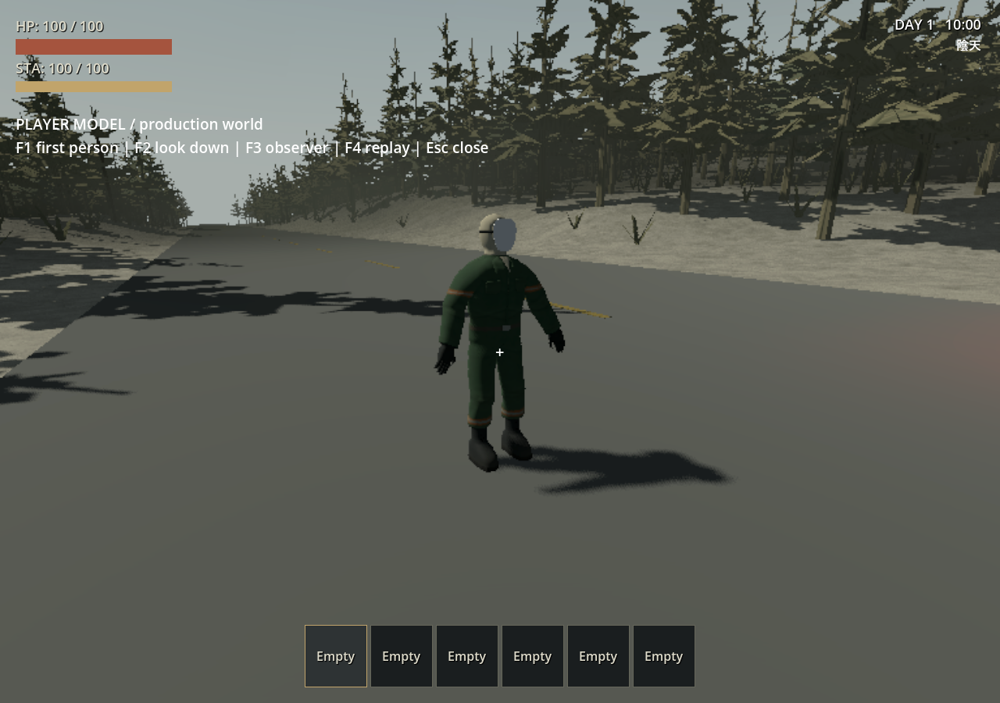
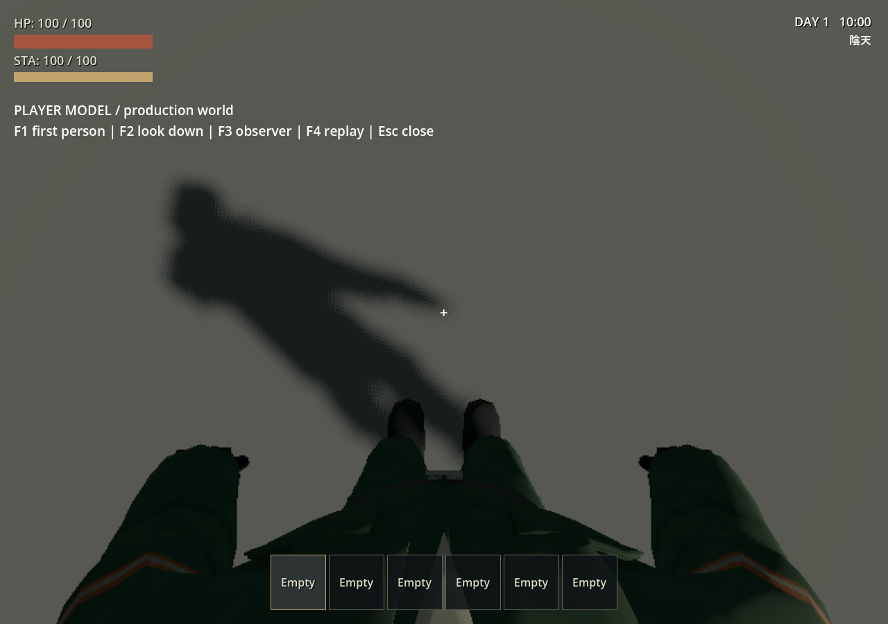
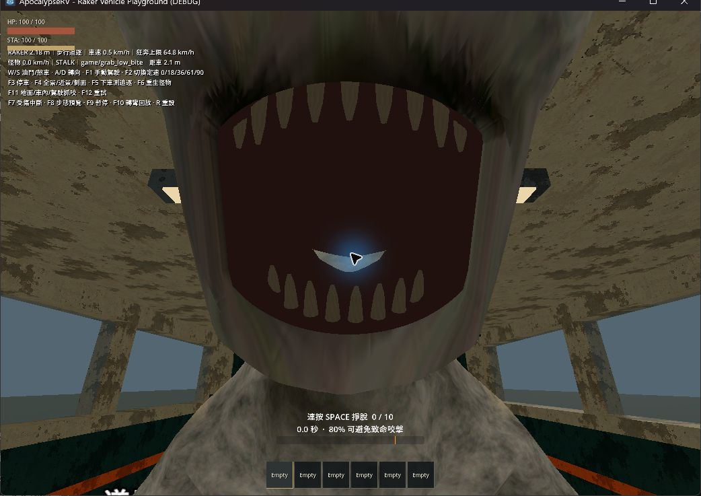

# 玩家 v020：正式遊戲模型接入

日期：2026-09-27。使用者要求「把角色模型接入遊戲」後，將已驗收 GLB 接到正式 [player.tscn](../../player/player.tscn)。主世界與室內玩家沿用同一玩家場景，現在具有完整身體、本地第一人稱顯示與影子。角色仍是中性靜態姿勢；沒有製作 Idle／Walk／Attack，沒有把 TEST 動作當作正式動畫。

## 變更與保全

- [player_model_visual.tscn](../../player/player_model_visual.tscn) 實例化同一份 [v020 GLB](../../assets/models/player_test_v020/player_export_test_v020.glb)，由 [player_model_visual.gd](../../player/player_model_visual.gd) 管理顯示。
- 11 個原始 Mesh、41 根變形骨、5 個材質、16,222 三角面、512×512 貼圖、面具線性 RGB 0.9 全數保留。沒有更動來源模型、肩膀拓撲、UV、權重、Rest Pose 或材質取樣。
- Visuals 保持 Scale 1，Y=0.25 對齊既有高度 1.5 m／中心 Y=1 的控制膠囊底部；角色模型高度仍為 1.60 m。繞 Y 180° 對齊 GLB 的 +Z 正面與控制器 -Z 行進方向，沒有再做 glTF 軸轉換。
- 相機根座標從 (0, 1.4146006, 0) 改為 (0, 1.78, -0.20)，眼高約在腳底上方 1.53 m，前移避免穿入領口；near=0.025，FOV 與 ±80° 俯仰限制沿用。既有碰撞體、root、攀爬探針、移動程式與存檔格式不變。
- [player_interact.gd](../../player/player_interact.gd) 的 RayCast 明確排除玩家自身膠囊，避免較高眼位斜向低頭時先命中自己。實際運行中的原 3 m 射程不變；沒有藉延長射程掩蓋問題。
- [player_grab.gd](../../player/player_grab.gd) 讓蹲姿 Raker 抓住站立玩家時也沿用原本駕駛座的向下 0.17 m 拉頭分量；前拉仍 0.18 m，合計小於 0.25 m，保留球體掃掠與固定觀看角。沒有改 Raker 動畫、骨架、權重或怪物狀態機。
- 正式實例停止 AnimationPlayer、移除其 TEST library 參照並重設中性姿勢；沒有修改共享 AnimationLibrary 或 GLB，因此原匯入／布娃娃驗收場仍能播放 TEST。
- Blender 原檔、v020 工作副本、交付 GLB 與專案 GLB 的 SHA256 均與前階段相同，詳見 [本輪來源清單](player-model-integration/artifact_manifest.json)。

## 第一人稱與外部視角

完整 PLAYER_Mesh 與五個頭套／面具物件位於第 18 顯示層，本地相機排除該層。單獨的本地身體副本只省略 224 個頭部三角形，留下 11,078 個身體三角形；頂點、UV、骨索引和權重均逐項檢查相同。ArrayMesh 上傳會再次封裝法線，最大向量差 0.00012902（約 0.0074°）；測試容差為 0.012°，並非重新計算法線或改變來源資產。

本地身體與六個共用完整 Mesh／Skin 的 shadow-only 副本放在腳本專用第 21 層；本地相機納入此層。五個非頭部配件仍在第 1 層。預設外部、座位與後照鏡相機只納入前 20 層，因此看到完整原模型而不重複繪製本地副本。第 20 層仍保留給既有後照鏡表面；未修改車輛鏡頭。

Godot 的 [Camera3D 文件](https://docs.godotengine.org/en/4.7/classes/class_camera3d.html#class-camera3d-property-cull-mask)說明腳本可使用 32 位元遮罩；第 21 層不在一般編輯器的 20 個勾選框中。本專案將它保留給本地身體顯示。[Light3D](https://docs.godotengine.org/en/4.7/classes/class_light3d.html#class-light3d-property-light-cull-mask) 預設涵蓋全部 32 層；未來若自訂燈的 light_cull_mask，需涵蓋該層。本地副本停用 GI。





## 本輪驗證

環境：Godot 4.7.2 stable、Jolt、正式世界 60 Hz；桌面 Forward+／Vulkan／RTX 4060 Laptop GPU。沒有套用獨立布娃娃測試的 120 Hz 或 Jolt solver 設定。

[新增回歸](../../tests/test_player_model.gd)涵蓋完整資產、相機圖層、完整影子副本、來源屬性不變、真實地板上的腳底／眼高、移動和跳躍、上下座位、checkpoint 變換，以及將同一 Player 移至獨立 World3D 後模型與 Skin 的歸屬。原始 GLB 的 TEST library 仍存在，正式實例中不可播放。

首次完整 runner 在 18 個路邊 POI 的 E 拾取檢查失敗。重現後確認 collider 是 Player，加入自身排除後命中 GasolineCan，18 組原測試重新通過；新增測試也使用真實 E 輸入拾取斜向下方物品。後續抓咬回歸發現新眼高超出蹲姿咬合的原目標範圍；加入上述既有拉頭分量後，站立／車內／駕駛座三種實際咬合距離分別約 7.0／7.1／9.7 cm，嘴部保持於固定視野中。

既有 `test_raker_bite_pose.gd` 與 `test_raker_attack_alignment.gd` 的靜態舊眼位 fixture 改成指定完整 (x, y, z)，避免混用舊 y 和新版前移 z；bite pose 後段的 live scenarios 仍使用新的正式相機。牆面測試改為檢查牆法向位移並增加完整 9 cm 球體的無重疊查詢，適用斜向下拉。沒有放宽原本 <10 cm 咬合、<25 cm 鏡頭位移或固定視角限制。

桌面依專案 computer-use 流程選取本次遊戲視窗，實際切換外部、平視、低頭並啟動連續回放，離座後再次確認本地身體恢復。只關閉本次測試視窗。觀察到完整外觀／面具、腳底貼地、平視無面具遮擋、低頭身體與頭部影子，以及離座後模型重新顯示。

另在原 Raker 測試場以 `--grab-cabin --bite-review` 觀察較高眼位的車內接觸幀，嘴部位於畫面中央，沒有本地面具遮擋；F9 繼續後完成既有死亡／兩秒復活流程。下圖是 computer-use 保存的原始桌面截圖，與引擎回放 PNG 分開標示。



[主世界回放場](../../tests/player_model_playground.tscn)繼承正式世界與控制器，固定 seed 42／上午 10 點；保留正式光照、天氣、美術解析度與模型材質。回放實際透過 Input 移動 3.667 m、跳躍離地，接著使用既有庫存與座位 API 持物、入座、離座。未以滑鼠拾取證明互動射線；相關契約另由專案回歸檢查。結果見 [replay.json](player-model-integration/replay.json)。

共九張原始引擎截圖：完整角色、平視、低頭、行走低頭、跳躍低頭、持物、座位、離座低頭、離座外觀。持物仍使用既有 Camera/HandMarker，沒有手指握持動畫。離座外部視角可受 RV 車殼遮擋，沒有關閉深度測試或移除車殼來美化證據。

快速 headless 的 `test_raker_release_input` 通過後回報兩個 ObjectDB instance 清理警告；不能把這項快速試跑描述成完全沒有診斷。最終正常 runner 的結果與診斷另列，不以警告取代測試通過標記。Windows 沙箱 root certificate store 診斷依既有 runner 的精確排除規則處理。

另以實際 Forward+ 顯示執行同一 `test_raker_release_input`，三種咬後存活情境均通過；真正的 InputEventMouseMotion 讓 yaw 改變約 −0.18 rad、pitch 約 −0.05 rad，站立／車內玩家後退約 1.17 m，駕駛油門恢復。此次退出碼 0，沒有 ObjectDB 警告，補足 headless 無法驗證滑鼠捕捉的限制；屬引擎輸入事件回歸，與上方 computer-use 桌面觀察分開記錄。日誌：`.godot/player-model-release-rendered.log`。

**本輪最終 76／76 suites 全部通過，asset import 與主場景啟動／正式玩家移動通過。** 詳見 [suite_result.json](player-model-integration/suite_result.json)。這是分段完成的結果：正式程式最後修正後，完整 runner 的 a–p 共 39 組通過；接著舊相機 fixture 的 attack alignment 測試失敗，修正該測試的完整座標後，以同一 `scripts/test.ps1` 的 `test_r*.gd`／`test_s*.gd`／`test_t*.gd`／`test_w*.gd` 完成其餘 30／1／2／4 組，四段退出碼皆 0，各段均再做 import 與主場景檢查。後續只有測試 fixture 和文件修正，沒有再改正式程式。**不宣稱單次不間斷完整 runner 退出碼 0**；歷史報告的 74／75 組也不混入本輪計數。

最終 76 份 suite 日誌均有 PASS、沒有腳本／引擎錯誤（前述既有 certificate store 診斷除外）或 WARNING。相對連結、十張圖檔可讀性與 `git diff --check` 已核對；前階段布娃娃 audit 因重跑產生的單一取樣時序差異另存 `.godot/player-model-ragdoll-audit.json`，原驗收檔保留當時數值。未改 `project.godot`、runner、原資產或正式玩家移動程式。

重現：

```powershell
godot --path . --log-file .godot/player-model.log res://tests/player_model_playground.tscn
godot --path . --log-file .godot/player-model-replay.log res://tests/player_model_playground.tscn -- --replay --quit-replay
powershell -NoProfile -ExecutionPolicy Bypass -File scripts/test.ps1
```

F1 平視、F2 低頭、F3 外部觀察、F4 回放、Esc 關閉測試視窗。一般主世界按原有操作即可看到身體，沒有加入正式遊戲的測試快捷鍵。本次測試使用 `.godot/test-appdata` 隔離 user://，不讀寫使用者日常存檔。

## 範圍與未完成項目

- 已接入：完整模型、本地身體與影子、現有控制器與座位／世界生命週期。
- 尚未接入：正式走跑／攀爬／坐姿／持物動畫、死亡布娃娃、起身、肢解、多人。入座沿用原本隱藏整個玩家的行為，沒有新增坐姿駕駛員。
- 抓咬時仍使用既有鏡頭拉動，玩家骨架尚無對應受抓／轉頭姿勢；外部視角會看到中性身體隨控制器移動。此階段不將它宣稱為完整的角色動畫整合。
- 正式死亡仍沿用既有約兩秒後原地回滿血。獨立布娃娃的落地與恢復結果見 [前階段報告](2026-09-27-player-v020-ragdoll.md)，不能視為已在主世界死亡流程使用。
- 主體控制膠囊高 1.5 m，模型高 1.6 m；極窄空間的頭部／手臂外觀與碰撞包絡不完全一致。多人所有權、多玩家畫面和長時間效能未驗收；目前專案是單人。
- 沒有需要回 Blender 修改已核可資產的問題。後續動畫／布娃娃應在這個顯示節點上銜接，不能為掩蓋引擎配置問題改骨架或權重。
