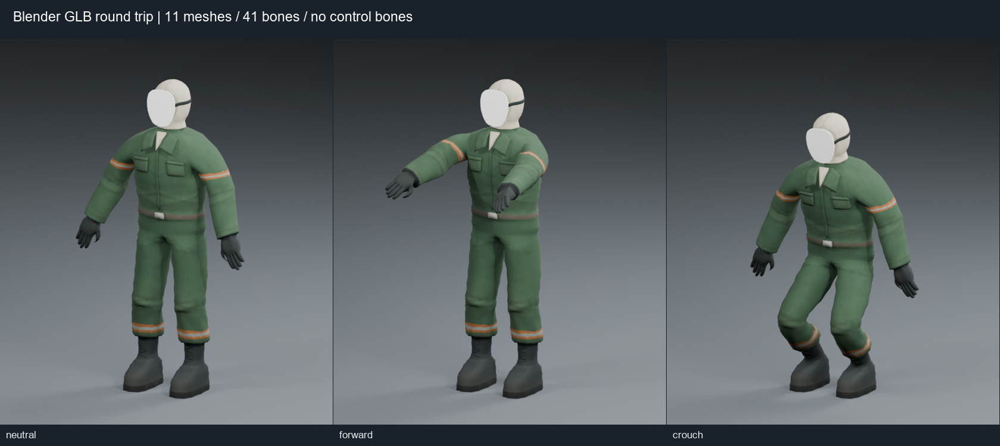
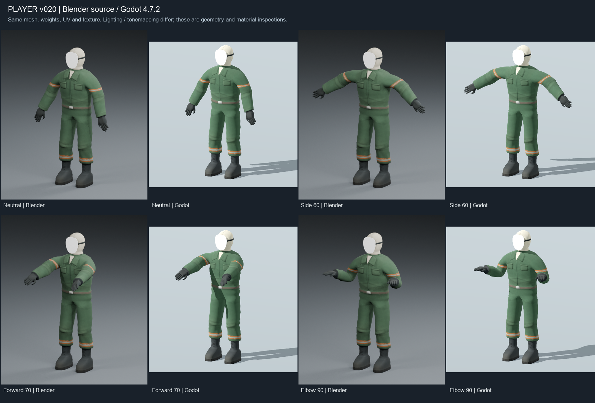
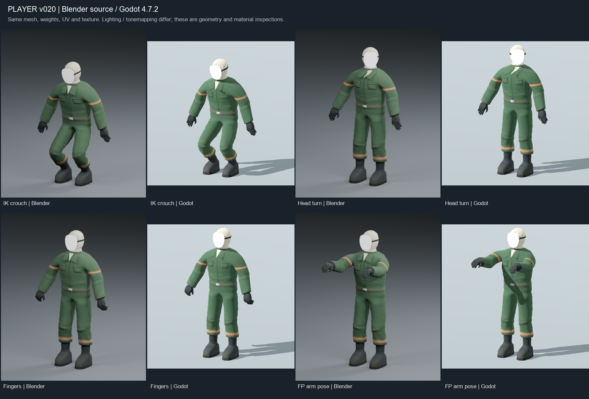
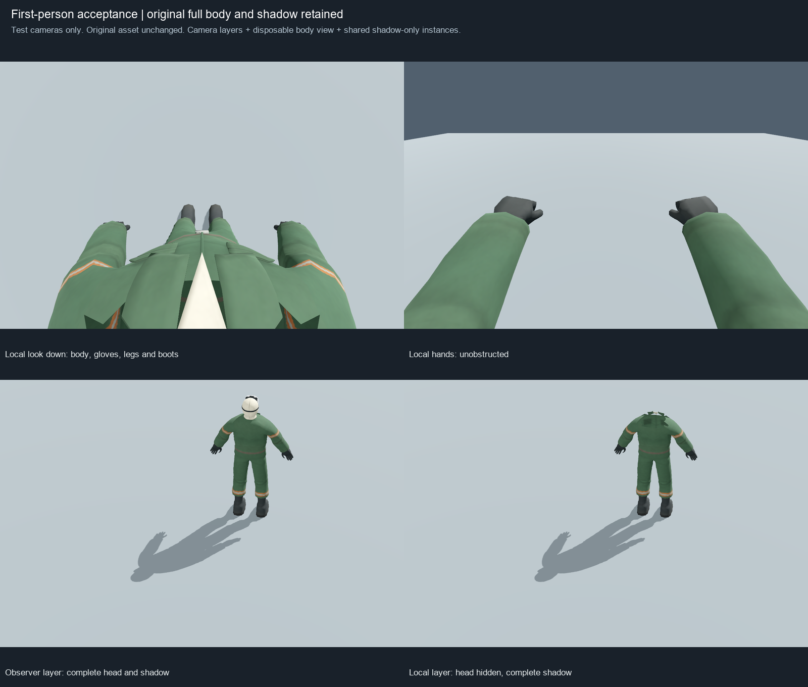

# 玩家 v020：GLB／Godot 匯入驗收

日期：2026-09-27。完成第五階段的匯出、回匯與獨立 Godot 煙霧測試，停在使用者確認點；布娃娃尚未建立。正式玩家場景、控制系統、模型比例、肩膀拓撲、UV、貼圖與權重均未修改。

後續確認（同日）：使用者回覆「0.9隨便看你要不要改 可以繼續了」。保留已核可的 0.9 常數材質，繼續獨立布娃娃驗證；結果另見 [布娃娃驗收](2026-09-27-player-v020-ragdoll.md)。下方的 74 suites 與停止點保留為匯入階段當時紀錄。

## 檔案

| 用途 | 路徑 |
|---|---|
| 原始交付，未覆寫 | [player_textured_v019.blend](../../../3d/player_textured_v019.blend) |
| 匯出工作副本 | [player_godot_export_v020.blend](../../../3d/player_godot_export_v020.blend) |
| GLB 交付 | [player_export_test_v020.glb](../../../3d/exports/godot/player_export_test_v020.glb) |
| 專案測試用同一份 GLB | [assets/models/player_test_v020/player_export_test_v020.glb](../../assets/models/player_test_v020/player_export_test_v020.glb) |
| 獨立場景 | [playground.tscn](../../tests/player_import_v020/playground.tscn) |
| 場景腳本／本地視角測試 | [playground.gd](../../tests/player_import_v020/playground.gd)、[local_view.gd](../../tests/player_import_v020/local_view.gd) |
| 自動檢查 | [test_player_import_v020.gd](../../tests/test_player_import_v020.gd)、[audit_glb.py](../../tests/player_import_v020/audit_glb.py) |
| 實測資料 | [Blender](player-v020/blender_audit.json)、[GLB](player-v020/glb_audit.json)、[Godot](player-v020/godot_audit.json)、[影子像素比較](player-v020/visual_evidence.json) |

原 v019 SHA256 在工作前後相同：
`dc5062e81b10e6a6e849d8915e5d7b6eb85607e48f602e59aa7bb45f6c06c421`。

工作副本保留完整 51 骨控制 Rig、原始驗證 Action，保存於中性第 1 幀。另保留僅供匯出的 `TEST_v020_POSE_SAMPLES` Action。原控制約束未刪除；此 TEST Action 匯出時暫時停用約束、使用 quaternion 取樣，匯出後恢復原約束、旋轉模式與原驗證 Action。直接在控制 Rig 上切換至 TEST Action 時也需先停用控制約束，它不是正式遊戲動畫。

## 正式集合與保全

`PLAYER_GAME` 的唯一骨架為 `PLAYER_Rig`。實際 11 個 Mesh：

1. PLAYER_Mesh
2. PLAYER_Skin_Mask
3. PLAYER_Skin_Collar
4. PLAYER_Skin_Undershirt
5. PLAYER_Skin_Pockets
6. PLAYER_Skin_Fasteners
7. PLAYER_Skin_MaskStrap
8. PLAYER_Skin_Hood
9. PLAYER_Skin_Hood_Seams
10. PLAYER_Skin_Hood_Lining
11. PLAYER_Skin_BootLaces

逐值比較工作副本匯出前後的頂點位置、拓撲、權重、UV 與骨骼 Rest 矩陣：一致。全部 Mesh／Armature Scale 為 1,1,1；未 Apply Transform、未手動旋轉 90°、未變更 Rest Pose。中性評估高度 1.599999 m，腳底 Z 約 +0.00000148 m；Root 在原點。一般線性蒙皮，Preserve Volume 關閉。

匯出選取僅上述 12 個物件；來源備份、TMP 驗證物件、控制形狀、相機、燈光與地板均未包含。工作副本原有備份／預覽場景保留。

## 實際匯出設定

Blender 5.2.2 LTS 內建 glTF exporter；完整機器可讀設定見 [blender_audit.json](player-v020/blender_audit.json)。

| 設定 | 值 |
|---|---|
| 格式／範圍 | GLB；Selected Objects；Active Scene |
| 座標／修改器 | +Y Up；Apply Modifiers 關閉；Rest Position Armature 開啟 |
| Mesh | UV、法線、材質開啟；無 morph；未新增頂點色 |
| 材質／影像 | EXPORT；AUTO；PNG 內嵌 |
| Skin | 開啟；最多 4 influences；Only Deform Bones 開啟 |
| 額外骨骼 | Leaf Bone 關閉；不扁平化原變形骨階層 |
| 動畫 | ACTIVE_ACTIONS；Only active TEST action；Force Sampling；24 fps；每幀取樣 |
| 時間範圍 | Blender frame 1–193；Slide to Zero 開啟；GLB 0–8 秒 |
| 最佳化／額外資料 | 動畫曲線最佳化關閉；相機／燈光關閉；無 NLA 匯出 |

匯出器對 Rig 上既有約束列出 baking 提示；約束在匯出期间已暫停，實際輸出只含 41 個變形骨節點的 position／rotation／scale channels。回匯及 Godot 的姿勢量測驗證結果如下，未因提示改動 Rig。

TEST 每秒取樣：中性（原 frame 1）、側抬手（11）、雙手前抬（231）、彎肘（31）、IK 蹲姿（271）、轉頭（131）、手指（71）、第一人稱手部（291）、回中性（1）。中間為線性插值，這只是匯入檢查片段。完整 `PLAYER_RIG_VALIDATION`、TMP Action、Idle／Walk／Attack 都不在 GLB 中。

## Blender 回匯與 GLB 實測

在新建空白 `PLAYER_GLB_ROUNDTRIP_v020` 場景匯入最終 GLB：NORMALS、Blender bone heuristic、merge vertices 關閉、guess original bind pose 關閉、disable bone shape 開啟。最終片段回匯幀為 0–192。回匯場景只含 11 Mesh 與一個 Armature；檢查完成後才額外連結預覽燈／攝影機進行渲染，未重新匯出這些物件。該臨時場景已移除，沒有覆寫工作檔。

| 項目 | 已實測結果 |
|---|---|
| 變形骨／控制骨 | 41／0；10 個 CTRL／POLE 均未匯出 |
| Mesh／Skin | 11 Mesh、1 glTF Skin；Godot 各 Mesh 均取得 41 bind 的 Skin |
| 頂點／三角面 | 10,930／16,222 |
| 材質／surface | 5 種材質；21 個 glTF primitive／Godot surface |
| 回匯中性高度／腳底 | 1.6000013 m／Z -0.00000140 m |
| 姿勢比對 | 九個取樣，逐 Mesh 頂點至原姿勢最近頂點距離最大 0.0000461 m（0.0461 mm） |
| 頭部配件 | 面具、帶子、頭套、縫線、內襯只受 head 影響 |
| Scale／階層 | 無負值或非均勻物件 Scale；原變形骨父子關係保留，無控制骨或 leaf bone |
| 貼圖 | 1 張 512×512 PNG；內嵌 bytes 的 SHA256 與交付 PNG 完全一致 |

8,159 → 10,930 頂點是 UV 接縫、法線及材質分區在 glTF 頂點屬性組合上的拆分。原拓撲與 16,222 三角面保持一致，不是模型損壞；Mesh 物件仍為 11 個。



## Godot 設定與已實測結果

專案：`C:/Users/evan4/Projects/ApocalypseRV`。Godot 4.7.2 stable official `ed1daf0bf`；實機 Forward+／Vulkan 1.3.289／NVIDIA RTX 4060 Laptop GPU；專案物理後端 Jolt Physics。本階段沒有動態骨骼物理，因此記錄後端不代表布娃娃通過。

獨立 GLB 的匯入設定：root scale 1、named skins 開啟、不做 Humanoid retarget 或 Rest Pose 替換；LOD 與 Mesh compression 關閉以利逐值比較；24 fps、不移除 immutable tracks；AnimationPlayer 的 optimizer 與 compression 關閉。所有設定只影響此測試 GLB。

兩個已修正的設定問題：

- Blender 正幀起點造成 GLB 首鍵為 1/24 秒；改用 exporter 的 Slide to Zero，最後首鍵 0 秒、尾鍵 8 秒。
- Godot 預設 Animation Optimizer 簡化曲線，九個姿勢比對出現最多約 15.6 mm 的邊界差；僅停用該測試資產的 optimizer 後，全部姿勢的 CPU 蒙皮邊界與 Blender 回匯差異小於 0.0061 mm。設定用途另參考 [Godot 官方匯入說明](https://docs.godotengine.org/en/4.4/tutorials/assets_pipeline/importing_3d_scenes/import_configuration.html)。

已測：11 Mesh、Skeleton3D、骨架階層與所有 Skin bindings；每頂點四個權重、正規化與非負值；法線有限且單位化；9 個靜態姿勢的蒙皮外框；8 秒 TEST 片段以 60 Hz 取 481 個樣本，無非有限值／負縮放／跳位，最大骨骼位置步進約 13.22 mm，最大全域骨骼 Scale 向量偏差約 0.0000403。這些資料檢查不代表正式動作、布娃娃或所有極端姿势已驗收。

角色站立直立，腳底約 -0.00145 mm，模型高度約 1.60 m。Blender -Y 正面經 exporter 轉為 glTF／Godot +Z 正面；Root 不旋轉、不縮放，沒有側躺或倒置。本階段未將它接入正式玩家 -Z 控制方向。

五材質粗糙度分別為 cloth 0.94／leather 0.82／rubber 0.91／hardware 0.78／mask 0.80；Metallic 0、Opaque、雙面，無額外 Normal／AO／Displacement 貼圖。前四材質使用同一張 sRGB Base Color，Linear with Mipmaps（非 nearest）；沒有改成像素風。截圖使用不同照明與色調映射，亮度不同不代表貼圖或材質被改寫。

**待使用者確認的規格文字差異：**來源材質雖命名 PureWhite，實際 Principled Base Color 是線性 RGB **0.9,0.9,0.9**，不是 1,1,1。GLB 精確保留 0.9，Godot 顯示屬性轉為 sRGB 約 0.954687。面具仍為無圖像／無五官的常數單色。為保留已核可外觀，本次沒有擅自改成數值 1.0；若「純白」驗收要求必須等於 1.0，這一項仍待確認／修正。





實際桌面視窗已用 computer-use 檢查中性、前抬、蹲姿、第一人稱、旁觀者及 TEST 播放切換；另外逐張查看上述八組來源／Godot 姿勢截圖。肩膀、腋下、胯部、膝蓋及配件未見匯入新增的尖刺、塌陷或偏移。播放觀察為離散畫面，逐幀數值檢查與目視結果分開記錄。只關閉了本次驗收遊戲視窗；Blender 工作副本保留開啟。

## 第一人稱的獨立測試策略

原 11 個 Mesh 全部保留。五個頭部配件放在旁觀層；主身體還含有 head 權重的幾何，測試程式另建立只供本地攝影機的臨時 MeshInstance。它複製原頂點／法線／UV／權重／Skin，只在副本的索引清單略過 224 個頭部三角面，保留 11,078 個身體三角面；原主身體的 11,302 三角面未動。該副本不投影。

層 1 為共用配件／地面，層 2 為完整身體／頭部，層 3 為本地視角副本。本地 Camera cull mask=5，旁觀者=3。因 Godot 的攝影機層排除亦影響影子收集，另建立 6 個共用原 Mesh／Skin 的 Shadows Only 實例在本地層；這些不顯示表面，保留完整身體與頭部影子。沒有把任何頭部從原 GLB 刪掉，也沒有為本地顯示改骨骼權重。

檢查相機高度 1.53 m；低頭鏡頭 Z=0.20 m、俯角 82°，前伸鏡頭 Z=0.12 m、俯角 25°，FOV 90°、near 0.025 m。這是獨立驗收鏡頭的衣領淨空設定，並非正式遊戲攝影機整合或動態頭部追蹤的完成證據。

已實測：低頭可見身體、手套、腿與靴子；前伸手部可見；頭套／面具不擋本地視線；旁觀者看到完整頭部；本地層雖隱藏頭部，地面仍有完整頭部影子。兩個同鏡頭影子區域（pixels 300,480–770,730）逐像素一致。



## 本輪驗證與重現

資產檢查、單獨 Godot 契約測試均已通過。**本輪完整專案 runner：74／74 suites、import 與 main-scene 全部通過，退出碼 0**；清單見 [suite_result.json](player-v020/suite_result.json)。最終報告增加 display_server 欄位後也單獨重跑角色契約測試通過。桌面與自動截圖日誌無腳本錯誤。日誌位於 `.godot/player-v020-*.log` 與 `.godot/test-logs/`，不提交快取。沙箱 headless 執行沿用既有 runner 規則排除 Windows root certificate store 診斷；不是忽略腳本／匯入錯誤。

```powershell
godot --path . --log-file .godot/player-v020-visual.log res://tests/player_import_v020/playground.tscn
godot --headless --path . -s res://tests/test_player_import_v020.gd
python tests/player_import_v020/audit_glb.py
powershell -NoProfile -ExecutionPolicy Bypass -File scripts/test.ps1
```

F1–F8：八個驗證姿勢；F9：低頭；F10：手部；F11：旁觀者與影子；Space：播放／停止 TEST；P：重拍對照圖；Esc：關閉此測試視窗。自動截圖可加 `-- --capture`。本機不在 PATH 時，使用 `C:/Users/evan4/AppData/Local/Programs/Godot/Godot_console.exe`。

## 停止點與尚未測試

等待使用者確認匯入外觀／姿勢／第一人稱證據，以及是否維持面具已核可的 0.9 常數。**沒有建立 PhysicalBone／Simulator 或其他布娃娃节点。**

尚未測試：站立倒地、多方向落地、斜坡、階梯、輕微外力、關節限制／質量／相鄰碰撞排除、抖動／穿地／反折、動畫或控制切換至布娃娃、停止物理恢復控制；正式玩家移動、多人同步、動態第一人稱攝影機與正式動畫也未整合。這些不應從本次 GLB／Godot 匯入通過推論為已完成。
