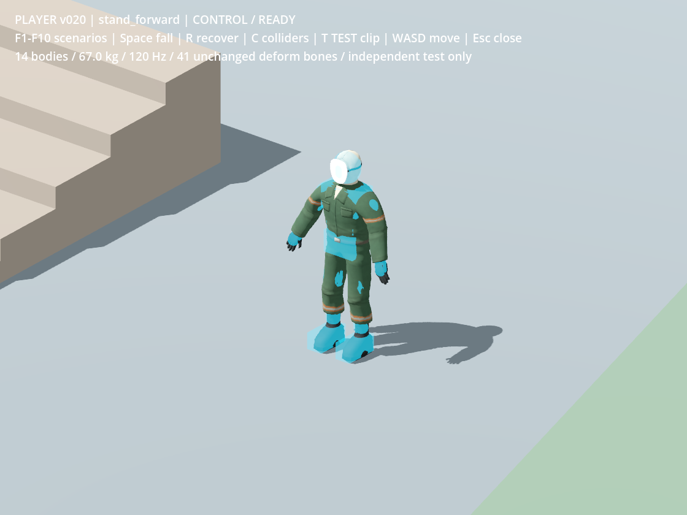
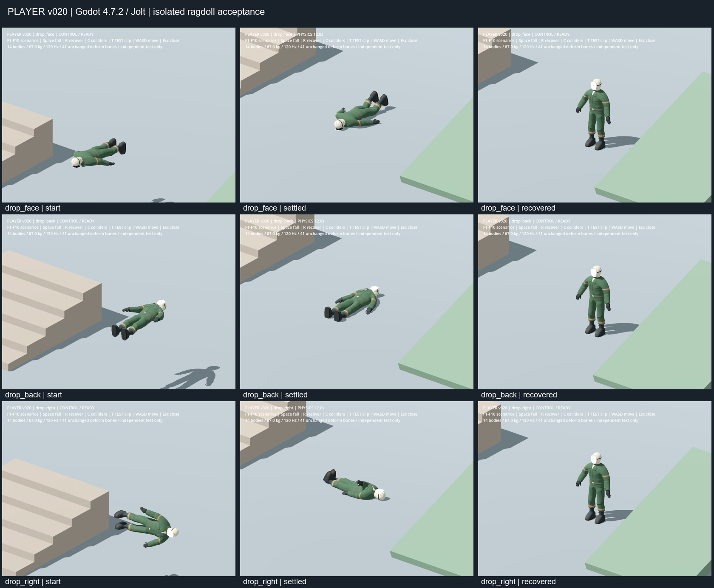
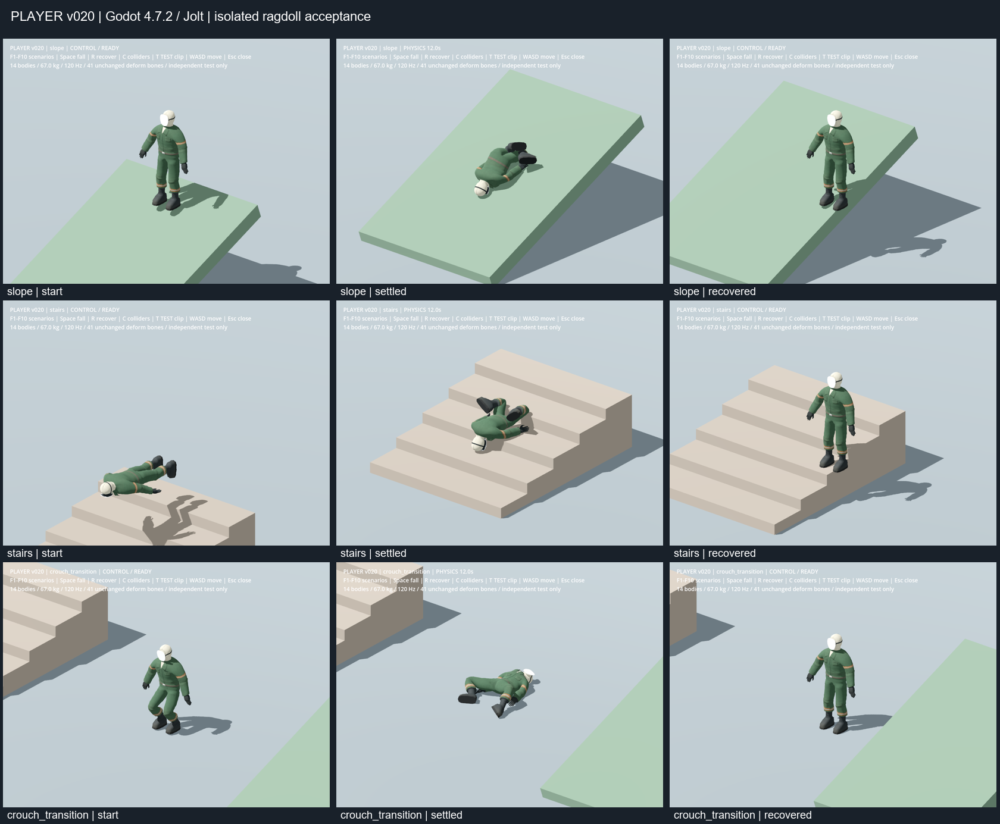
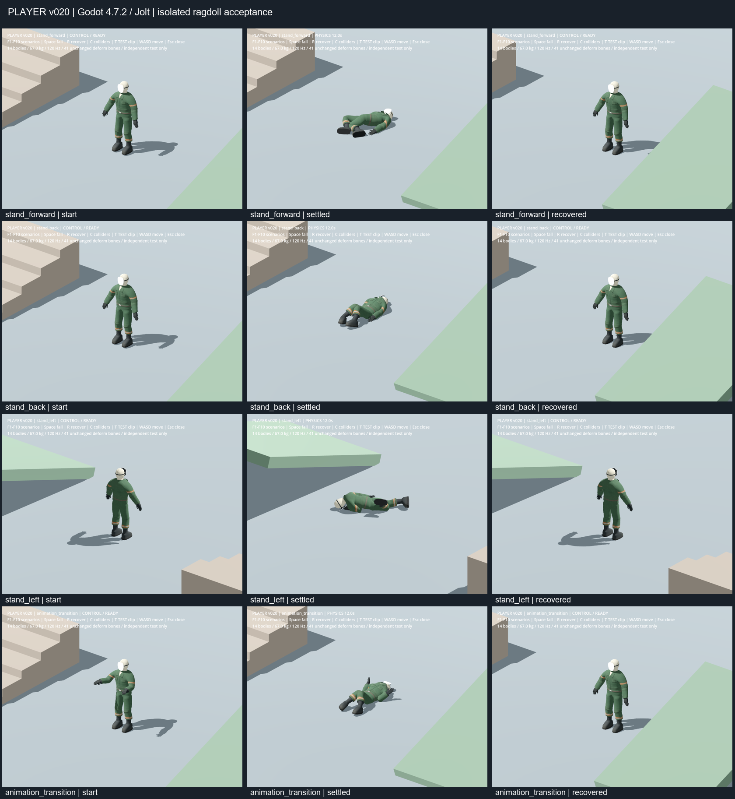

# 玩家 v020：獨立布娃娃驗收

日期：2026-09-27。使用者確認匯入結果並同意繼續後，保留面具的 0.9 線性 RGB，完成獨立布娃娃測試。所有變更限於測試與驗收文件；未改正式玩家、41 根變形骨、蒙皮權重、肩膀拓撲、Rest Pose、比例、UV、材質或貼圖。没有製作正式動畫或起身動畫。

## 檔案與來源保全

| 用途 | 檔案 |
|---|---|
| 未覆寫的 Blender 原檔 | [player_textured_v019.blend](../../../3d/player_textured_v019.blend) |
| 已交付的完整控制 Rig 工作副本 | [player_godot_export_v020.blend](../../../3d/player_godot_export_v020.blend) |
| 已交付 GLB | [player_export_test_v020.glb](../../../3d/exports/godot/player_export_test_v020.glb) |
| 專案內相同 GLB | [player_export_test_v020.glb](../../assets/models/player_test_v020/player_export_test_v020.glb) |
| 布娃娃場景／場景腳本 | [playground.tscn](../../tests/player_ragdoll_v020/playground.tscn)、[playground.gd](../../tests/player_ragdoll_v020/playground.gd) |
| 物理骨／獨立控制器 | [actor.gd](../../tests/player_ragdoll_v020/actor.gd) |
| 自動物理驗證 | [test_player_ragdoll_v020.gd](../../tests/test_player_ragdoll_v020.gd) |
| 實測資料 | [physics_audit.json](player-v020-ragdoll/physics_audit.json)、[visual_run.json](player-v020-ragdoll/visual_run.json)、[資產雜湊](player-v020-ragdoll/artifact_manifest.json) |
| 前階段 Blender／Godot 外觀對照 | [匯入驗收](2026-09-27-player-v020-import.md) |

GLB 沿用同一資產，仍為 **11 Mesh／41 變形骨／5 材質／16,222 三角面**；各 Skin 都有完整的 41 個 named binds，每頂點四個權重槽且權重正規化，單張 512×512 Base Color。匯出設定與回匯誤差見前階段報告。此階段無 Blender 修正或重新匯出。

## 物理配置

Godot **4.7.2 stable**、**Jolt Physics**。實際桌面使用 **Forward+／Vulkan 1.3.289／NVIDIA RTX 4060 Laptop GPU**；headless 契約檢查使用 dummy renderer，兩種結果分開記錄。

使用 `PhysicalBoneSimulator3D` 與 14 個 `PhysicalBone3D`：5 個盒體、9 個膠囊，總質量 **67 kg**。未使用三角網格動態碰撞。根骨 `root` 不建立物理剛體，骨盆自由運動；手掌、手指、鎖骨及頸骨保留原骨架，由原階層跟隨最近的物理骨。没有為手指建立剛體。

| 區域 | 數量／單體質量 | 關節限制（相對中性姿勢） |
|---|---|---|
| 骨盆 | 1 × 12 kg | 自由根 |
| 下軀幹 spine_01 | 1 × 8 kg | Cone：swing 20°、twist ±15° |
| 胸腔 spine_02 | 1 × 14 kg | Cone：25°／±20° |
| 頭部 | 1 × 4.5 kg | Cone：35°／±45° |
| 上臂 | 2 × 2 kg | Cone：75°／±45° |
| 前臂／手部碰撞包絡 | 2 × 1.5 kg | Hinge：−3°～135° |
| 大腿 | 2 × 6 kg | Cone：80°／±30° |
| 小腿 | 2 × 3.5 kg | Hinge：−3°～125° |
| 靴子 | 2 × 1.25 kg | Cone：40°／±20° |

肘、膝 hinge 軸依原骨骼的局部 X 方向設定，核對 Godot 角度正負號；cone 的 X 軸對準骨骼縱軸。Godot PhysicalBone 的動態 joint constraint 屬性使用角度，`joint_rotation` 使用弧度。尺寸、偏移、質量、限制與碰撞排除完整列於 physics_audit.json／actor.gd。

直接相鄰與隔一節的物理骨互相排除碰撞；髖與鄰近軀幹另外排除重疊。較遠肢體仍會互撞。角色控制膠囊排除在布娃娃碰撞外，啟動物理時停用。摩擦 0.8、反彈 0、線性阻尼 0.15；角阻尼 0.8，前臂／腳部 1.6；全部啟用 CCD。

測試場使用獨立 `World3D`，在建立該物理空間時採用 **120 Hz、32 velocity iterations／32 position iterations、penetration slop 3 mm、CCD max penetration 0.10**。Jolt 建立空間時取樣設定，因此程式建立專用空間後立即還原全域設定；離場也還原原 World3D 與物理 tick rate。未儲存到 project.godot。這是本次驗收配置，尚未驗證正式世界的 60 Hz／預設 solver 或多具布娃娃效能。

引擎 API 依 [PhysicalBoneSimulator3D 官方文件](https://docs.godotengine.org/en/stable/classes/class_physicalbonesimulator3d.html) 與 [Jolt 設定說明](https://docs.godotengine.org/en/stable/classes/class_projectsettings.html#class-projectsettings-property-physics-jolt-physics-3d-simulation-position-steps)核對，並在本機 4.7.2 實測。



## 已實測通過

自動測試逐物理步執行 10 組情境，每組 8 秒、階梯 12 秒；最後兩秒檢查持續抖動。總計 **10,080 個落地物理取樣**，另外包含恢復控制、動畫恢復與小外力取樣。

- 中性站立受到 +Z／−Z／+X 的 12 N·s 胸部推力後倒地；案例名稱標示施力方向，最終倒向取決於重心及接觸。
- 臉朝下、背朝下、側向三種約 85° 初始落地姿態；骨盆起始約 1.6 m。
- 20° 斜坡碰撞並穩定；階梯高 18 cm、踏面深 65 cm，已確認接觸 Step1／Step2／Step3 三個階面。
- 正在播放 TEST 動作時切入物理；先由測試控制器橫移再切入物理；已核可蹲姿切入物理。
- 靜止後施加 3 N·s 小推力，身體有可量測反應，沒有爆炸速度。
- 10 組均能停止物理、恢復中性姿勢、重新啟用控制膠囊，持續移動約 0.75 m，再恢復 TEST 動作。
- 所有物理骨有限值、正向單位 Scale；模型骨骼與對應剛體保持一致，原骨架與 Skin 資源未改寫。

完整 runner 中的本輪物理測試已通過，峰值如下（原始資料見 physics_audit.json）：

| 量測 | 本輪最大值 |
|---|---:|
| 關節接點距離 | 11.67 mm |
| 骨骼／物理骨綁定位置誤差 | 0.00204 mm |
| 剛體線速度 | 5.76 m/s |
| 地形接觸重疊／最低穿入地板量 | 20.07 mm（瞬間） |
| Hinge／Cone swing／twist 短暫越界 | 2.73°／3.48°／5.03° |
| 最後兩秒的線速度／角速度 | 0.053 m/s／0.502 rad/s，發生於斜坡腳部 |
| 最後兩秒扭轉越界 | 0.053° |
| Scale 向量偏差 | 0.000000506 |

8 秒自動案例末段並非每個部位都完全不動；斜坡腳部仍有小幅收斂，12 秒桌面回放的 10 組則全部速度為零。接觸採有限容差，碰撞瞬間允許少量重疊及短暫角度越界，不宣稱幾何絕對零穿插。檢查門檻：關節接點距離 <25 mm、地形接觸重疊 <30 mm、角度越界 <6°、末段扭轉越界 <1°；骨骼與物理綁定位置誤差 <2 mm；末兩秒速度 <0.1 m/s、角速度 <0.8 rad/s。不存在整具穿過地板、關節脫開、異常縮放或爆炸。







## 控制恢復的範圍

測試 actor 使用獨立 CharacterBody3D。切入物理時停止 TEST 動作寫入、停用控制膠囊並將目前速度交給物理骨；模擬期間不執行角色 move_and_slide。恢复時在骨盆附近向下查找地面，使用站立膠囊做淨空查詢，找到合格位置後停止物理、清除速度、重設中性姿勢並恢復控制。沒有合格位置就返回失敗，不強制穿進地形。

恢復是直接回到可站立姿勢，沒有起身動畫或平滑混合。這驗證所有權切換及控制恢復，未接入正式 Player 的死亡、攝影機、裝備、存檔或多人邏輯。現有第一人稱圖層策略仍在匯入測試場；本場以完整第三人稱身體驗證布娃娃。

## 重現與驗證記錄

```powershell
godot --path . --log-file .godot/player-ragdoll-manual.log res://tests/player_ragdoll_v020/playground.tscn
godot --path . --log-file .godot/player-ragdoll-replay.log res://tests/player_ragdoll_v020/playground.tscn -- --replay --quit-replay
godot --headless --fixed-fps 120 --path . -s res://tests/test_player_ragdoll_v020.gd
powershell -NoProfile -ExecutionPolicy Bypass -File scripts/test.ps1
```

F1–F10：重設對應案例；Space：倒地；R：恢復；C：碰撞形狀；T：播放／停止 TEST；WASD：測試控制器移動；Esc：關閉此測試視窗。選案例先凍結於驗收起始位置，按 T 或恢復後可移動。自動回放每組观察 12 秒並保存開始、撞擊、穩定與恢復畫面；其最後位置／速度及恢復距離另列 visual_run.json。組圖由 [compose_evidence.py](../../tests/player_ragdoll_v020/compose_evidence.py)排列原始畫面，無修圖。

自動物理測試通過。實際桌面透過 computer-use 觀察倒地、長時間靜止、R 恢復、T 動作播放、播放中再次切入物理、C 碰撞體對照與第二次恢復；操作後只關閉本次遊戲視窗。完整回放保存 41 張原始截圖；10 組在 12 秒時全部速度歸零，恢復後連續移動約 1.2 m。每組組圖均已查看，未見肩部／胯部新增尖刺、配件脫離或異常伸長。桌面觀察為離散畫面，逐步物理數值驗證另列。

最終桌面與回放日誌沒有腳本／引擎錯誤或警告。開發時高速 headless 試跑曾觸發 Jolt job pool 暫候警告，最終獨立試跑未再出現；未以忽略腳本錯誤方式取得通過。沙箱的 Windows root certificate store 診斷沿用既有 runner 的精確排除規則。

**本輪完整專案 runner：75／75 suites、asset import 與 main-scene startup 全部通過，退出碼 0。** 清單見 [suite_result.json](player-v020-ragdoll/suite_result.json)。包含重新執行的 v020 匯入契約與本次布娃娃測試；前階段的 74 suites 仍保留為當時紀錄。文件相對連結、44 張 PNG（41 原始截圖＋3 組圖）可讀性、`git diff --check` 與四個原交付檔案的雜湊再次核對通過。日誌保留於 `.godot/player-ragdoll-*.log` 與 `.godot/test-logs/`，不提交快取。

完整 runner 通過後，僅調整側向案例的驗收鏡頭及回放恢復後的移動方向，避開旁邊斜坡對角色的遮擋。使用相同物理配置重新補拍該案例，確認穩定、恢復與退出碼 0；未因此重跑全部 suites。物理設定、actor 與自動測試均未更動。

## 尚未測試／停止點

尚未測試正式世界 60 Hz 配置、多具布娃娃／效能、極高速車撞、薄牆、小碎石、不同身形、正式動畫、第一人稱死亡鏡頭、多人同步、存檔或與正式 Player 整合。以上不應由這個獨立場景推論為已完成。

本階段完成後停止，等待使用者確認布娃娃外觀與行為。既有 0.9 面具保留，沒有需要回 Blender 修正的已知問題。
