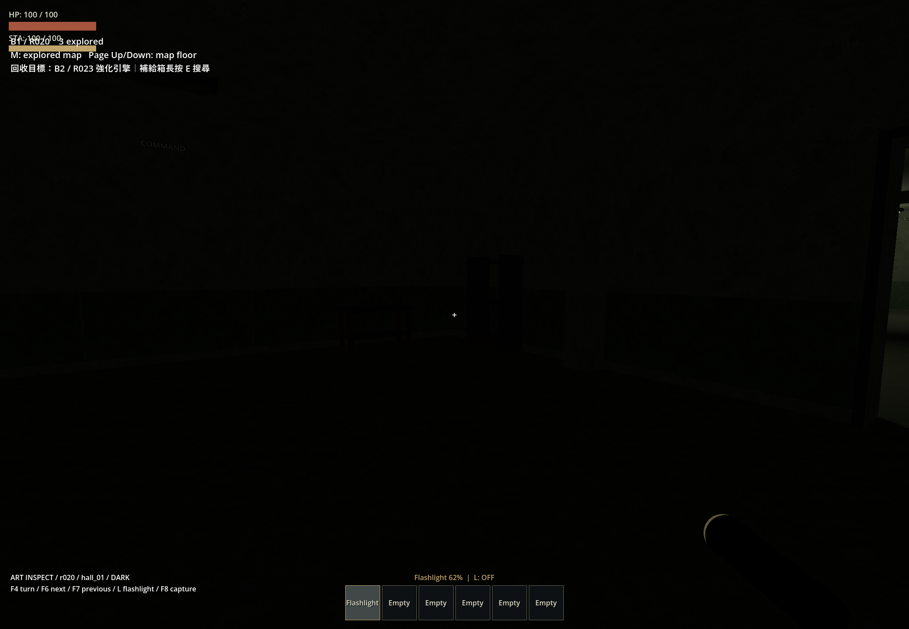
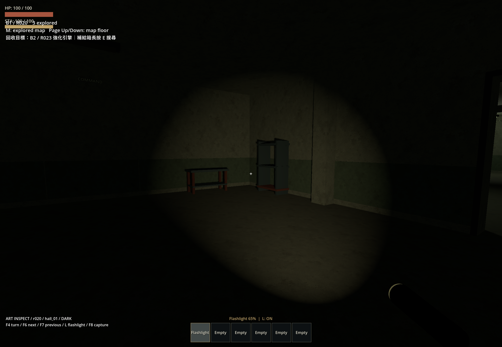
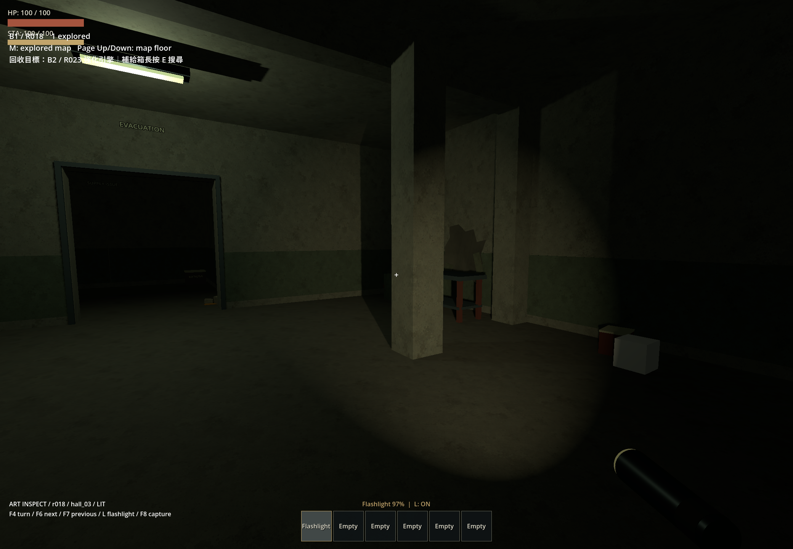
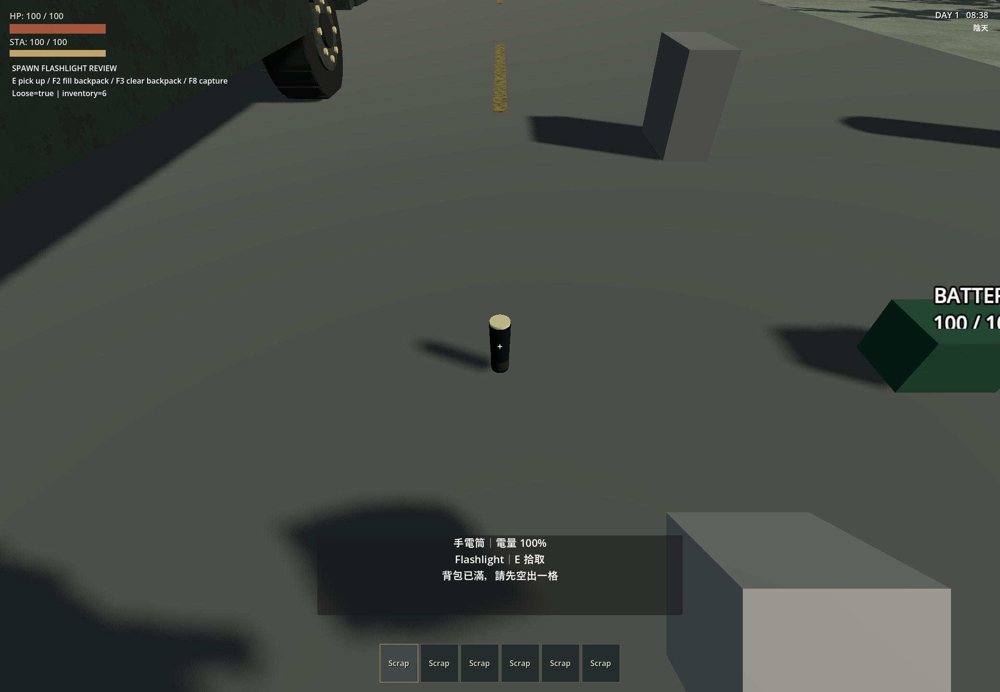
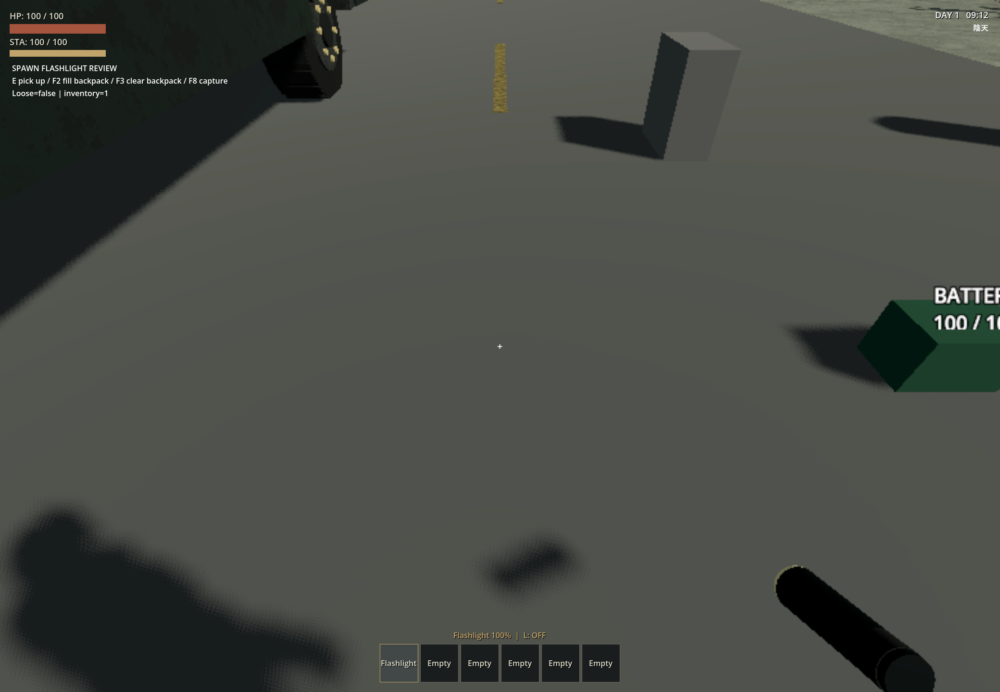

# 廢棄地堡與手電筒驗收

2026-09-29–30；Godot 4.7.2.stable.official.ed1daf0bf，Windows。Headless 使用 dummy renderer，實機使用 Forward+／Vulkan／RTX 4060 Laptop。此紀錄只列本次執行結果；先前物資與敵人功能見 [內容驗收](2026-09-29-bunker-content.md)。

## 已實作

- 保留 16 個 v1 房間與 definition，新增 16 個 `content_version=2` 房間及 definition。新生成使用 v2，保存的 v1 布局、家具和照明沿用原資源。
- 小房為警衛／物資／醫療儲藏，中房為寢室／處置室，大房為軍需倉庫／維修工場，大廳為指揮／機電過濾／撤離生活區。原尺寸、接口、導航錨點和隨機布局架構保留。
- 新增 14 個家具場景、15 個 v2 材質；補管線、電纜槽、排水溝、標示、混凝土表面、鏽蝕及水痕。最後補入 169 個純視覺節點，包括不規則混凝土剝落、三角碎塊、頂板下垂、散落紙張、毯子，以及依保存布局標示 B 樓層的上下樓梯標示。牆面使用兩個共用簡單 OBJ 外觀網格，破損不改碰撞，頂板最低處仍高於 2.87 m。
- 九份個別模型 request 位於 `docs/modeling/requests/bunker-*/`，記錄尺寸、原點、朝向、替換節點和交付路徑。軍用櫃、上下舖、醫療床、控制台、機電設備、防爆門等目前為可替換灰盒；補給箱保留原 `Visuals/LidPivot` 與搜索接口。精細 GLB 尚未交付。
- 普通 v2 模組包括通道，按實際數量四捨五入取 60% 熄燈；入口／樓梯除外。固定 `bunker-lights-v1` SHA-256 排序僅使用保存 seed 與房間 ID，不消耗布局／內容 RNG。暗房燈管無發光材質；亮房和手電筒啟用陰影。
- `world/test_world.tscn` 直接放置一個手電筒在 `(0, 1, 3)`，無開局背包發放。E 拾取、選取後 L 開關，滿電實際照明 300 秒，無充電。剩餘電量由背包 item state 保存，切換／收起／丟棄關燈，UI／轉場／死亡／被抓／入座期間停止照明和耗電。

## 自動檢查

統一 runner 執行當時列出的 **83 個測試、資產匯入及主場景啟動均通過**。之後新增的 `test_flashlight_world.gd` 另以 headless 執行，exit code 0。最後追加的純視覺破損通過重新匯入、16 場景載入及門洞測試；回放修正後另重跑 12／30／45／60 房連續搬運。沒有為最後的純視覺節點再次重跑整套 83 項。

| 範圍 | 本次結果 |
|---|---|
| 照明 | 1／12／30／45／60 模組、多 seed 的精確 60% 取整、序列化後一致、入口／樓梯排除、材質隔離、陰影設定、v1 照明保留通過 |
| 版本與布局 | 16 個啟用 v2＋16 個保留 v1、舊快照解析、布局／接口／相容性測試通過 |
| 門洞與導航 | 30／45／60 房共 1,146 次玩家膠囊穿越通過；每條連接導航與回訪重建通過，包含多樓層 |
| 手電筒 | 滿包拒收、300 秒耗盡、空電拒開、模式暫停、切換／大型物品鎖定、丟棄拾回、倉庫存取、欄位位移、非法電量／開關狀態拒絕通過 |
| 正式世界與磁碟保存 | 實際地形落地、互動射線＋E action 拾取、約 70% 電量存檔、持有／移動後掉落的完整讀檔通過；沒有重複生成；不含手電筒的舊快照不補發 |
| 內容與敵人 | 既有物資、補給箱搜索、敵人、引擎提取、跨副本持久化、Raker 和導航測試通過 |
| 模型 request | 九份 UTF-8 文件、替換节点、灰盒尺寸、補給箱實測箱體／箱蓋／轉軸核對通過；v2 資源引用均存在 |

### 連續搬運回放

使用 seed 42、三層目標、實際玩家的連續移動輸入，搬大型引擎遍歷每個房間後返回入口，再丟下引擎；沒有用定位代替路線通過。

| 模組 | 實際行走距離 | 結果 |
|---|---:|---|
| 12 | 433.4 m | PASS |
| 30 | 1,484.2 m | PASS |
| 45 | 2,568.4 m | PASS |
| 60 | 3,809.9 m | PASS |

60 房第一次回放撞到生成在路上的可拾取廢料，並非家具或門洞阻塞。回放現在遇到持續小型 Prop 碰撞時停止行走，對準該物件，確認射線命中後送出正常 E action；確認物件進背包、引擎仍為手持大物件，再繼續。拾取遭拒就明確失敗，沒有刪除障礙或穿牆。最終重播拾取 `bunker:seed:42:supply:10` 後完成返程。

## Computer Use 實際觀察

依 computer-use 流程列出視窗、選取 `ApocalypseRV (DEBUG)` 遊戲視窗，每次操作後重新截圖；沒有操作 Godot 編輯器。

- seed 42／30 房：入口、樓梯、物資庫、通道、寢室、維修工場。可見入口／樓梯照明，暗房燈管熄滅，亮暗房交界由門洞透光。
- seed 34／30 房／三層：撤離生活區與暗指揮中心。可見破損牆面、桌架、散落紙張、灰盒家具；L 開關改變照明，光束隨視角轉向，柱體與牆角擋住光束。在抽查畫面未見明顯穿牆漏光。
- 正式出生世界：手電筒在備用電池旁穩定落地，實測中心 `(0, 0.217, 3.000006)`、速度為零，出生背包為空。滿包按 E 顯示拒絕並留在原地；清出空間後 E 拾取，地面物件消失，背包得到 100% 且關閉的手電筒。
- 出生區檢查使用一次性測試包裝定位視角、填滿／清空背包，並為自動按鍵工具註冊測試用 logical E alias。正式 E physical binding、Prop 互動、碰撞及拾取程式未替換；正式世界自動測試另走正常 interact action。
- `--art-inspect` 定位各房僅作美術抽查，不能作為行走驗證。持續照明完整 300 秒和模式切換由自動測試驗證；實機觀察了百分比下降與開關，沒有另以碼表等待五分鐘。

實機連續暗房搬運返程：seed 42／12 房／三層，以 `--fixed-fps 60 --disable-vsync` 啟動後按 F5。觀察到持有引擎進入樓梯，最後返回亮著燈的入口、將引擎丟下，畫面顯示 `PASS / bunker traversal`，日誌記錄 433.4 m 且無腳本錯誤。此回放未帶手電筒、使用連續輸入；30／45／60 房的完整路線另由上述 headless 回放驗證。

| 暗房，手電筒關閉 | 同一視角，手電筒開啟 |
|---|---|
|  |  |



| 出生區地面道具、滿包提示 | E 拾取後，100% 且關閉 |
|---|---|
|  |  |

## 重跑與界線

```powershell
powershell -NoProfile -ExecutionPolicy Bypass -File scripts/test.ps1 -Godot 'C:\Users\evan4\AppData\Local\Programs\Godot\Godot.exe' -TimeoutSeconds 240
godot --headless --path . --fixed-fps 60 --log-file .godot/flashlight-world.log -s res://tests/test_flashlight_world.gd
godot --headless --path . --fixed-fps 60 --log-file .godot/bunker-cargo-60.log res://tests/bunker_playground.tscn -- --seed=42 --rooms=60 --floors=3 --replay --quit-after-replay
godot --path . --log-file .godot/bunker-art.log res://tests/bunker_playground.tscn -- --seed=34 --rooms=30 --art-inspect --inspect-room=hall_03
```

完整 runner 日誌在 `.godot/test-logs/`，額外搬運在 `.godot/bunker-cargo-*.log`，實機在 `.godot/bunker-art-final.log`、`.godot/flashlight-spawn-review.log`、`.godot/bunker-visible-return.log`。Windows headless 的憑證存放區訊息沿用 runner 的既有精確排除規則，沒有忽略腳本或遊戲錯誤。八份更新文件的相對連結及 `git diff --check` 均通過。

未逐一實機探索所有 seed 或進行長局多人／群怪壓力測試。精細 GLB 的比例、材質及替換後外觀須待模型交付再次驗證。本次保留工作樹既有功能與美術來源修改，沒有提交 commit 或重跑初版 kit 產生腳本。
