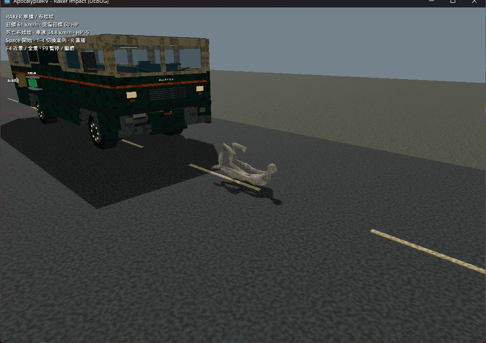

# Raker 車撞效果與布娃娃

2026-10-02，Godot 4.7.2 stable／Jolt／原專案 60 Hz，Windows、Forward+／RTX 4060 Laptop。保留開始時已有的 VehicleImpact、Chassis、樹木撞擊及文件修改；功能驗收階段接續怪物受撞表現，當時尚未提交 Git commit。後續 Git 整合與重新驗證見末節。

## 行為

- 有效碰撞沿用 Monster 相對速度、接近方向、傷害及冷卻，只在新接受的事件後產生擊退、短粒子、合成撞擊聲。攀爬與同車支撐仍排除；致命碰撞仍先通知底盤結算。
- 法向接近速度 ≥6 m/s 切換布娃娃，輕撞保留 0.55 秒擊退；死亡一律布娃娃。15 個物理骨共約 99 kg，沿用原模型、蒙皮及動畫資產；物理碰撞為 scale=1，手腳不在交接時陷進車頭。
- 暫停動畫、頭手 IK、AI、抓咬、控制膠囊；身體接收撞擊方向、向上速度與轉動，並與地面／車體碰撞。至少倒地 2.5 秒，所有物理骨低於 1 m/s 持續 0.35 秒、下方有支撐且完整站立膠囊無阻擋後，以 0.8 秒混合起身。
- 死亡屍體物理持續 18 秒後回收，掉落只產生一次；支撐移除後仍可墜落。離開 RV 後死亡只額外加入尚未包含的水平車速。
- 戶外存活倒地怪物的可選 snapshot 保存 54 骨局部姿勢、外觀世界座標及骨盆速度；讀檔與場址恢復重新啟動物理，避免把倒地根位置誤當站立位置。舊檔不需新欄位，屍體不保存。

## 自動檢查

最後統一 runner：`.godot/test-logs/20261002-131934-708-selected-34812/`。資產匯入、12 項測試與正式主世界 smoke 全部 PASS，約 122 秒。

`test_monster_navigation`、`test_moving_rv_climbing`、`test_player_death`、`test_raker`、`test_raker_cabin`、`test_raker_gaits`、`test_raker_grab`、`test_raker_ragdoll`、`test_raker_sprint`、`test_raker_turning`、`test_vehicle_impact`、`test_vehicle_monster_impact`。

新增 `test_raker_ragdoll` 列入 integration：確認方向／上拋、可見骨姿勢與物理一致、scale=1、關節連接、地面接觸、存活恢復、低頂阻擋、致命速度交接、輕撞動量、攀爬／支撐排除、重複碰撞、死亡清理及倒地存讀檔。使用正式輪驅 RV 實際接觸，四個案例結果如下（速度是碰撞發生時實測，並非巡航目標）：

| 案例 | RV 實測速度 | 首次碰撞後 HP | 結果 |
| --- | ---: | ---: | --- |
| 正面、140 HP | 8.91 m/s | 95.00 | 撞飛、落地並起身 |
| 致命、初始 60 HP | 12.99 m/s | -5.25 | 死亡布娃娃持續物理 |
| 偏側、140 HP | 8.91 m/s | 95.00 | 撞飛並起身 |
| 輕撞、140 HP | 3.74 m/s | 121.26 | 受擊位移，未切換布娃娃 |

四個輪驅案例最大關節接點誤差約 0.080 m；隔離落地測試約 0.006 m，沒有非有限 transform、爆飛或穿地。額外使用正式 CheckpointFiles／Checkpoint 驗證 v3 檔案寫入與讀回的 54 個 Transform3D（`.godot/audit-raker-snapshot-disk.log`）通過。

首次最後匯入曾因截圖實際為 JPEG 卻命名 `.png` 失敗；已改回正確 `.jpg` 副檔名，上述完整重跑已通過，並非略過匯入。

## 實機觀察

以 computer-use 操作自己啟動的遊戲視窗，未操作 Godot 編輯器。車撞場使用實際車輪加速；F4 切換近景、F9 繼續暫停畫面。看見 Raker 離開車頭、四肢翻倒落地，存活案例重新站立；致命案例落地後仍為屍體，最後清除。可見日誌 `.godot/raker-impact-visual-final.log` 無腳本錯誤；音效已接入但未做聽感驗收。



[離開車頭](raker-impact/fatal-launch.jpg) · [存活案例翻倒](raker-impact/falling.jpg)

另跑 `rv_climb_playground --replay`，觀察玩家與 Raker 已攀上轉彎車頂。手動 F5 太晚時被既有抓咬打斷，因此修正僅測試場 `--seat-after-climb`：改成兩者實際攀完才入座，避免固定 6 秒時玩家已被抓。最後重播觀察 roof HP `DESTROYED`；日誌記錄 120→96→72→48→24→0，Raker 支撐由 Ceiling、局部 y≈2.45 轉成 Chassis、y≈0.25。此回放為脚本移車，與上面的輪驅撞擊分開；`.godot/raker-climb-roof-final.log` 無腳本錯誤。所有本輪測試視窗均已關閉。

## 重播與限制

```powershell
godot --path . --log-file .godot/raker-impact.log res://tests/raker_impact_playground.tscn -- --replay
```

1–4 切案例、R 重播、Space 開始、F4 鏡頭、F9 暫停；`--review` 在碰撞後 0.3 秒暫停，`--case=0` 至 `--case=3` 指定初始案例。存活測試目標完成起身後停用 AI 供觀察，正式遊戲恢復 AI。致命案例刻意使用已受傷的 60 HP 目標，不代表 140 HP Raker 以此車速必死。

目前不做肢解、肢體自碰撞或布娃娃彼此碰撞；倒地期間車體能物理推動身體，但不重啟角色的車撞傷害事件。起身是從物理姿勢混合回待機，未新增手撑地起身動畫。存檔不保留每條肢體角速度或已經過的倒地時間。未驗收大量屍體、極端翻車、懸崖、高速連續輾壓或任意地形；不是 full suite 結果。

## 最新 main 整合後檢查

2026-10-02 23:00，在 `codex/raker-impact-ragdoll` 將功能提交接到 `main` 的 `852b06e`（v8 道路遭遇 PR #5），功能 commit 為 `80baaae`。Rebase 無衝突，保留雙方架構文件與測試分類；本機 main 同步快轉至該基底。匯入新 main 時產生的五份道路腳本 `.gd.uid` 一併保存，避免後續重新分配資源識別。

整合後獨立執行統一 runner，日誌 `.godot/test-logs/20261002-230033-598-selected-29680/`：資產匯入、16 項測試及正式主世界 smoke 全部 PASS，共 151.29 秒。Godot 4.7.2 stable、headless、固定 60 fps；工作樹在測試開始時乾淨。

- Raker／角色：`test_monster_navigation`、`test_moving_rv_climbing`、`test_player_death`、`test_raker`、`test_raker_cabin`、`test_raker_gaits`、`test_raker_grab`、`test_raker_ragdoll`、`test_raker_sprint`、`test_raker_turning`。
- 撞擊：`test_tree_impact`、`test_vehicle_impact`、`test_vehicle_monster_impact`。
- 最新 main：`test_road_spawns`、`test_road_spawn_lifecycle`、`test_road_spawn_checkpoint`，另加 main-scene smoke（22.26 秒）。

推送前再次 fetch 確認 main 未變，`git diff --check` 通過。上面的實機觀察與截圖仍屬整合前功能驗收；本節是整合後自動回歸，不代表重做實機或執行 full suite。
