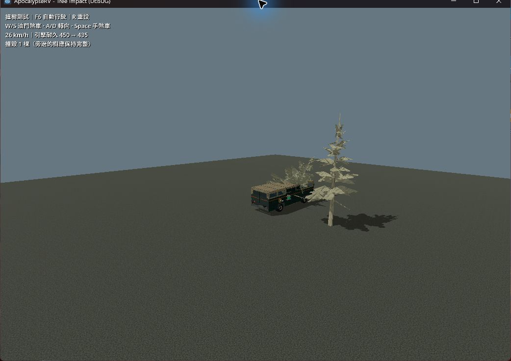
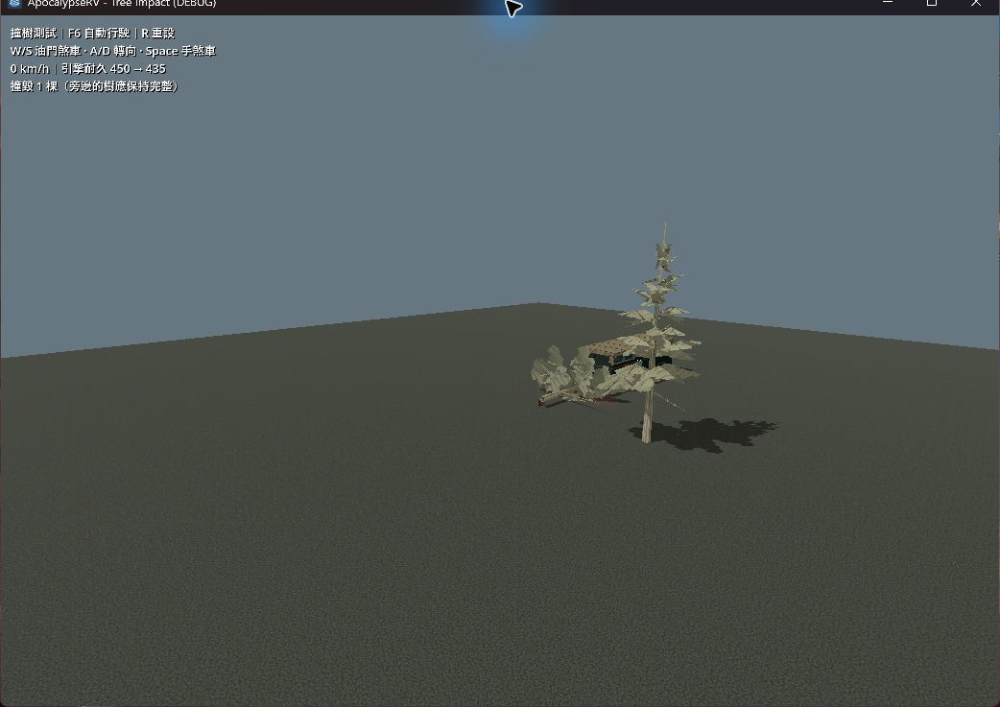

# 撞樹動量與倒塌效果驗收

日期：2026-10-02。Godot 4.7.2 stable／60 Hz／Jolt；實機 Forward+／Vulkan，RTX 4060 Laptop。本輪接續 [初版樹木撞毀](2026-10-02-tree-impact.md)，初版測試結果保留，不作為本輪重跑結果。

## 行為

每棵新撞毀樹保留 85% 的原水平行進速度，補回接觸解算器造成的硬停止；多接觸不重複減速／扣耐久。同時有反向實體阻擋或接觸報告達上限時不補速，垂直及角速度仍由物理控制。既有撞擊門檻、傷害、破壞保存及導航契約保留。

TreeFall 裁切原樹上部，在 0.75 m 處留下不規則斷樁，樹冠依撞擊方向加速傾倒、落地小幅回彈，並產生碎木及塵土。中央樹幹決定著地，枝葉 shader 貼合估算地面；約 18 秒後用 3 秒淡出，不再把完整樹沉入地下。每 chunk 最多 24 個效果，無殘骸碰撞、actor 或保存狀態。

## 自動檢查

- `.godot/test-logs/20261002-092645-762-selected-40124/`：test_tree_impact、test_rv_physics_regression、test_moving_rv_climbing 三項通過，共 24.17 秒。三個朝向的單樹撞擊後速度約 9.63–9.64 m/s（初始 12 m/s），2.5 秒位置約 23.4 m；雙樹約 8.20 m/s、20.89 m。倒樹方向、著地、斷樁與裁切網格斷言通過。
- `.godot/test-logs/20261002-093410-996-selected-11056/`：新增同幀牆／樹觀察後，test_tree_impact 通過，16.21 秒。測試子類讀取真實 production `_integrate_forces` 前後狀態：新毀樹及牆同在 frame 855 回報，32 個接觸低於測試設定 128，入射速度 11.3385 m/s；樹木處理前後均為 −0.001212 m/s，沒有補回向牆的速度。不是只檢查數秒後再被牆擋住。

- `.godot/test-logs/20261002-093551-513-selected-39504/`：最終 import、test_tree_impact 及 main-scene smoke 全部通過，分別約 8.5／14.8／54.1 秒，共 77.51 秒。先前一批因驗收截圖的 JPEG 資料誤用 PNG 副檔名而匯入失敗，已修正副檔名並以 `.gdignore` 排除驗收圖資，重新匯入通過。
- 非 headless、Forward+／Vulkan test_tree_impact：`.godot/tree-impact-gpu-v2.log` 有 PASS，沒有 script／shader error；涵蓋真實 GPU MultiMesh 單棵隱藏、倒樹 shader 與同幀牆／樹回歸。

本輪沒有執行 full。

## 實機觀察

使用 [輪驅撞樹測試場](../guides/playgrounds.md#tree-impact)，computer-use 選取唯一遊戲視窗，R 重設、F6 持續輪驅。撞擊後約 24 km/h，樹冠開始傾倒時車輛仍前進，後續畫面約 26 km/h；重播兩秒後才主動煞車。引擎 450 降至約 435.4，鄰樹保留。

觀察樹冠沿車輛行進方向旋倒，落地後保留水平倒木與斷樁，沒有整棵樹下沉。日誌 `.godot/tree-impact-playground-v2.log` 的 TREE_REPLAY 記錄撞後約 6.5 m/s；TREE_VISUAL 為 hidden=true／neighbour_solid=true，沒有 script 或 shader error。測試遊戲已關閉，原 Godot 編輯器保留。

## 限制

地面著地使用樹末端射線估算斜面，未逐枝處理崎嶇地形。未驗證大量連撞的幀時間、陡坡、翻車或外掛設備先撞樹的力矩。效果上限與消失避免殘骸持續累積，但不是密林效能驗收。
