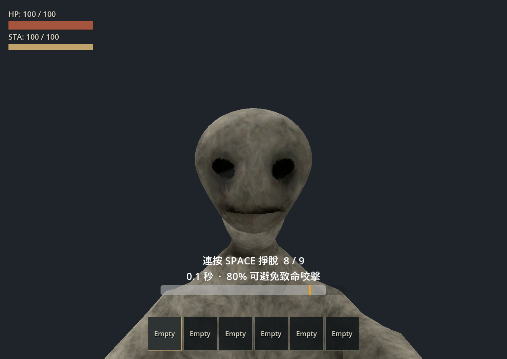
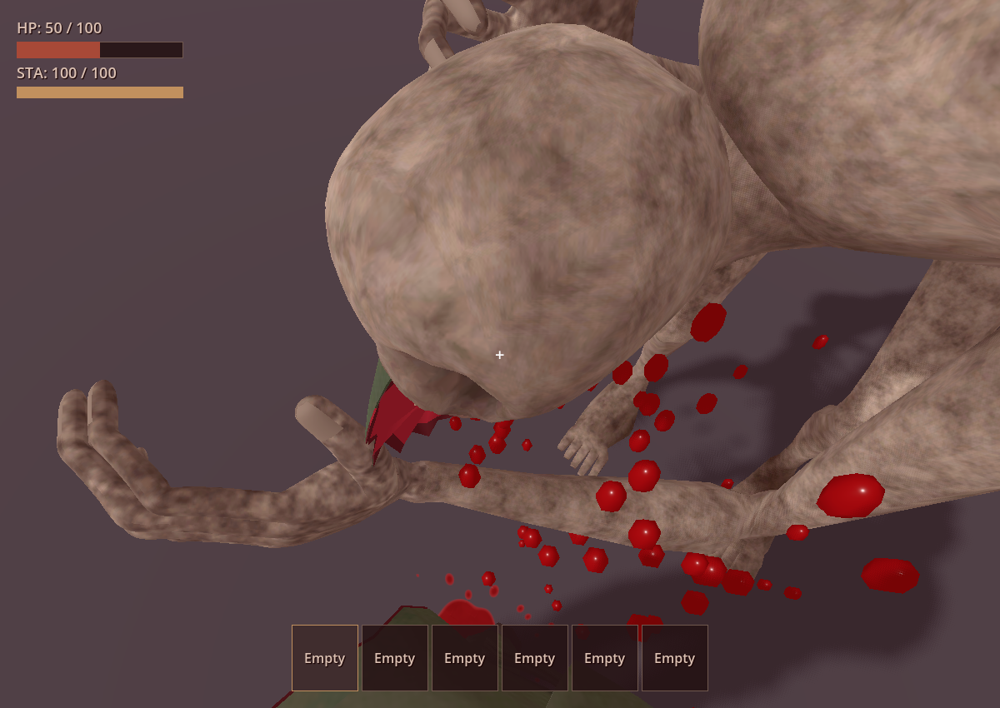
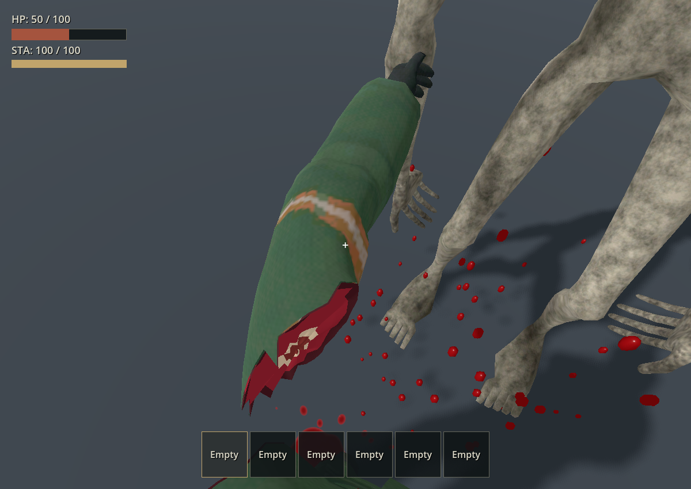
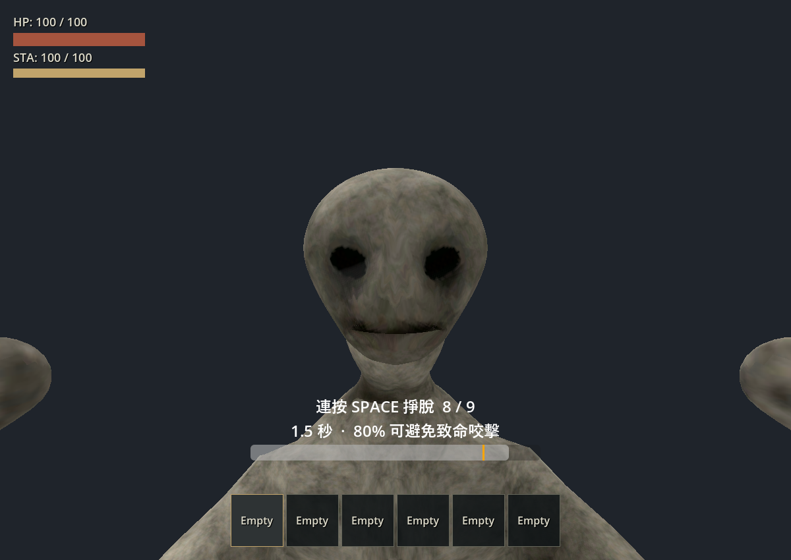
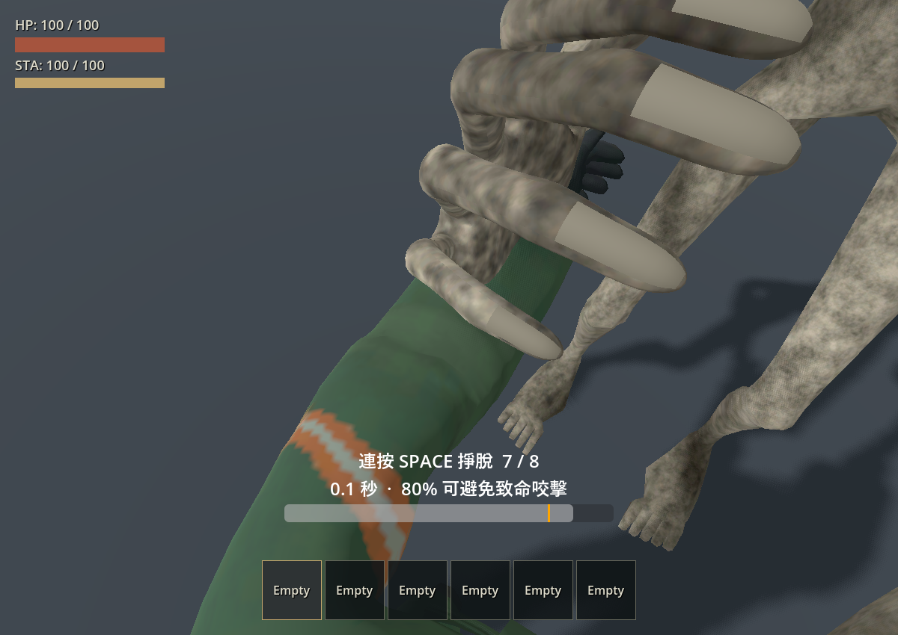

# 咬手第一人稱與轉向修正（2026-10-03）

本次處理咬手後強制轉身，以及第一人稱看不到手臂被咬斷的問題。模型與斷肢切口沿用既有資產。

## 原因與修正

- 舊的抓取解除會把鏡頭世界 yaw 寫進角色根節點。咬手改看肩膀後，這個取景角變成永久身體朝向。現在存活咬手保留身體朝向，當下交還輸入，再獨立移除暫態鏡頭偏移；新滑鼠輸入不會被回正覆蓋。
- 被抓的玩家原本停在待機手臂姿勢，肩膀切口位於視野邊緣。現在先抬臂掙扎並看向怪物臉部，實際咬中後才平滑轉向手臂。嘴部接近肩膀後向外撕扯，受傷紅幕降低遮蔽。
- 斷臂曾讀到 SkeletonModifier callback 外的原動畫嘴部位置，切斷後跳出實際咬合點。現在跟隨已求解並快取的嘴部，短暫銜住後交給物理掉落。
- 驗收場在加入 SceneTree 前設定怪物出生位置，避免先在玩家身上註冊碰撞、把玩家推出鏡頭驗收站位。

## 首輪自動驗證（18:09–18:12）

Godot 4.7.2，9 套相關測試通過：

| 測試 | 日誌目錄（`.godot/test-logs/`） |
|---|---|
| `test_raker_grab`、`test_raker_release_input` | `20261003-181202-210-selected-37800/` |
| `test_raker_bite_pose` | `20261003-180953-704-selected-39908/` |
| `test_flashlight_grab`、`test_player_carry`、`test_player_death`、`test_player_dismemberment`、`test_player_dismemberment_assets`、`test_raker_grab_vehicle` | `20261003-181222-452-selected-16784/` |

新增回歸覆蓋三個世界朝向的咬後 yaw、立即解除輸入與 HUD、鏡頭恢復後保留滑鼠輸入、接觸後立即轉場不污染新視角，以及地面／車內的肩膀與斷臂嘴部位置。地面／車內嘴到肩膀距離分別為 2.88／0.89 cm；銜住時斷臂與嘴部快取差異為 2.72／2.82 cm。這些是有限測試情境的量測，並非所有接近角度的保證。

非 headless 的 `test_raker_release_input` 亦通過，日誌為 `raker-release-input-display.log`；地面、車內及移動駕駛均執行真實輸入事件，並檢查咬後 mouse yaw／pitch 與移動／油門恢復。這次顯示測試早於最終取景位置微調；最後的邏輯回歸與渲染回放另列於上方。

## 首輪實機觀察

以正式第一人稱相機執行 `--replay --arm-pov`，連續記錄抬臂、接觸、斷開、撕扯與掉落。回放日誌 `.godot/arm-pov.log` 顯示身體 yaw 始終為 0，未出現 script／shader 錯誤。另透過 computer-use 操作驗收場 F1、F6：觀察到掙扎時抬臂、咬後 50 HP、HUD 解除並恢復朝向原來正前方；最後以 Escape 關閉測試視窗。

下列截圖已由最後的「咬中後才轉頭」回放更新；首輪日誌與手動操作結果保留如上。

這輪目視範圍為地面正面抓取；車內抓取、駕駛及手電筒有自動回歸。沒有重跑車頂攀爬、翻覆或群怪，也未驗收所有側後方接近角度。操作入口見[測試場指南](../guides/playgrounds.md#player-dismemberment)。

## 歷史調整：開場先看怪物的臉（23:40，已由下節時機取代）

抓取開場先維持臉部取景。即使立即按到 80%，2 秒 HOLD 階段的前 1.65 秒也不會提前轉向手臂；符合咬手條件時，最後 0.35 秒才開始平滑轉向。正式進入咬手 BITE 階段時仍會啟用手臂取景，咬後保留身體朝向的修正不變。

新增地面與車內的開場回歸：立即設定 80% 掙扎進度，於抓取開始後 0.3–1.4 秒持續驗證沒有手臂取景偏移、相機位置保持原位、朝向符合臉部目標，且實際怪物臉部位於鏡頭前方 20 度內。每個情境至少採樣 20 次。

此次重新執行 `test_raker_bite_pose`、`test_raker_grab`、`test_raker_release_input`，3 套全部通過（14.81 秒）；日誌位於 `.godot/test-logs/20261003-234014-210-selected-35156/`。此次為 headless 測試，真實顯示輸入事件的驗證沿用首輪紀錄，沒有在這輪重跑。

另執行 GPU 第一人稱回放 `--replay --arm-pov`，日誌 `.godot/arm-pov-face-first.log` 回報 PASS，沒有 script／shader 錯誤，身體 yaw 為 0。目視確認開場臉部在畫面中央、咬合前手臂進入視野，以及接觸時的咬合畫面。這輪未額外手動操作遊戲。

## 最終調整：怪物咬中後才轉頭（10 月 3 日 23:55–10 月 4 日 00:01）

整段 HOLD 及 BITE 接觸前都維持開場的看臉方向，不再因 80% 掙扎、倒數最後 0.35 秒或進入 BITE 就提前轉頭。怪物在 BITE 第 0.22 秒實際咬中、切斷左臂並交還操作後，才開始轉向受咬手臂：0.16 秒完成轉向、停留至 0.32 秒、0.85 秒時移除偏移。新滑鼠輸入持續有效，身體 yaw 不受效果改寫。怪物提前抓握手臂的動畫與鏡頭時機已分離。

4 套相關測試通過（26.51 秒）：`test_raker_bite_pose`、`test_raker_grab`、`test_raker_release_input`、`test_raker_grab_vehicle`。最終日誌位於 `.godot/test-logs/20261003-235954-353-selected-34740/`。新增覆蓋最後 0.35 秒及咬合前探不轉頭、接觸當下不瞬移視角、接觸後轉頭、不同世界朝向保留滑鼠 yaw／pitch、致死／中斷不啟動效果，以及離座後不污染重設鏡頭。另修正大幅滑鼠輸入後，效果完成或取消時仍須遵守俯仰 ±80 度及座位水平 ±120 度的限制。

另以真實顯示執行 `test_raker_release_input`，角度限制修正後重新執行仍為地面、車內與駕駛全部 PASS；最終日誌 `.godot/test-logs/raker-release-input-after-contact-final-display.log` 記錄滑鼠 yaw 約 -0.18 rad（車內輸出跨越 ±π 邊界，須按角差換算）、pitch 約 -0.05 rad，效果結束後仍保留輸入，步行與油門恢復正常。

GPU 回放 `.godot/arm-pov-after-contact.log` PASS，沒有 script／shader 錯誤，身體 yaw 為 0。截圖確認 `01b_before_bite` 仍看著臉、`03_contact` 前探時仍保持原角度、`05_pull_away` 才看見咬住斷臂的怪物及血噴。怪物前探低頭時會短暫移出開場構圖，鏡頭依要求等實際咬中才跟向肩部。回放早於最後的大幅滑鼠角度限制修正；該修正另由上述測試及真實顯示輸入回歸確認。本輪沒有額外手動操作，觀察範圍為地面正面抓取。
