# 玩家斷肢、爬行與抓咬驗收

日期：2026-10-03。Godot 4.7.2、Blender 5.2.2、Windows / RTX 4060 Laptop，物理 60 Hz。本頁記錄本次檢查，先前玩家模型／死亡／攀爬報告仍保留其當時範圍。

## 實作範圍

只改玩家。支援頭、左右整臂及左右整腿五切口，切口兩端有衣布／肌肉／骨頭／骨髓封口，分離部件繼承當下姿勢與移動速度。咬下部件短暫隨怪物嘴部再掉落，包含血滴、落地血泊及合成撕裂音效。

正式 Raker 抓咬維持 2 秒掙脫與 0.22 秒咬合結算：完全掙脫無傷；達 80% 的非致命咬擊扣固定 50 HP 並斷左臂；已無左臂時改咬斷頭。致命咬擊斷頭並進入既有兩秒死亡物理。右臂及雙腿目前由測試場／`sever_part` 觸發，不是普通爪擊的隨機結果。

一隻手可用小物品（含輪胎）、修理及雙腿完整時駕駛；大型持物、設備搬運及攀爬需雙手。無手仍可查看／選擇／丟棄／存入背包物品，不能取用物品或操作需要手的設備。斷任一腿即轉低姿態與水平碰撞體，禁止跳躍、衝刺、攀爬與駕駛；一腿爬行 0.8 m/s、無腿 0.55 m/s，僅一手 0.35 m/s，無手無法前進。爬行者遭 Raker 普通爪擊，不進入站姿抓咬。

缺肢隨檢查點及 POI 往返保存；舊檔無 `body` 時視為完整。成功復活恢復五部位。沒有持續失血、治療或接肢系統。離體件上限 16、24 秒清理；血泊上限 32、48 秒清理，皆不寫入存檔。

## 資產與動畫

透過 Blender MCP 實際分割既有 v020 身體與衣物，原始 16,222 三角面完整保留，正式 41 變形骨及正常 v021 動作不變。原始來源及重建入口見 [資產說明](../../assets/models/player_dismemberment/README.md)。

六組受傷循環包含低姿態待機、左右缺腿、無腿及左右單手爬行。0.45 秒混合完成倒地過渡，動作包含交替手掌接觸／抬手、重心移動和殘腿拖行。手掌朝下，第一人稱眼位降低；移動中的爬行收起持物姿勢，停下仍可單手使用小物品。

新增姿勢測試會在六組動畫各取四個相位，比對 Godot 重新映射後的實際關節與來源，容差 1 mm；也驗證手掌高度及位於胸前，避免遺失 glTF 固定通道而壓縮肢體。彎曲手臂分離時抽樣頂點的最大位置差約 0.00000040 m，低於 0.5 mm 門檻。

## 本次自動檢查

下列 15 套相關測試及主世界啟動 smoke 通過，未執行全套測試：

- `test_checkpoint_failures`、`test_player_carry`、`test_player_climbing`、`test_player_death`：紀錄 `.godot/test-logs/20261003-160859-180-selected-42388/` 中對應套件。
- `test_flashlight_grab`、`test_player_climb_animation`、`test_player_inventory`、`test_player_stamina`、`test_raker_grab`、`test_raker_grab_vehicle`：`.godot/test-logs/20261003-161556-358-selected-25888/`。
- 最終動畫修正後 `test_player_animation`、`test_player_dismemberment_assets`：`.godot/test-logs/20261003-163521-330-selected-37752/`。
- 最終輪胎能力修正後 `test_player_dismemberment`、`test_rv_systems`、`test_tire_puncture`：`.godot/test-logs/20261003-164022-077-selected-23036/`。
- 主世界啟動 smoke：`.godot/test-logs/20261003-161630-185-smoke-4328/`。此項早於最後受傷動畫轉換修正；後續變更已由上列定向檢查及實機重播驗證。

新測試已歸類至 `tests/suites.json`。檢查包含五部位、重複斷肢冪等、能力限制、低姿態碰撞、POI 返回、舊檔相容、壞檔拒絕、存檔恢復、二次咬頭、復活、分件完整性、切口配對、動作循環與缺肢物理骨排除。

## 本次畫面觀察

執行正式玩家測試場：

```powershell
godot --path . --log-file .godot/dismemberment-replay.log res://tests/player_dismemberment_playground.tscn -- --replay
```

重播檢視了單腿／無腿／單手爬行、左臂咬下、第一人稱缺臂、再次斷頭、缺頭布娃娃及復活；紀錄無 script error。血泊保留在地面，離體件為獨立物理，存活身體不拉出長條。

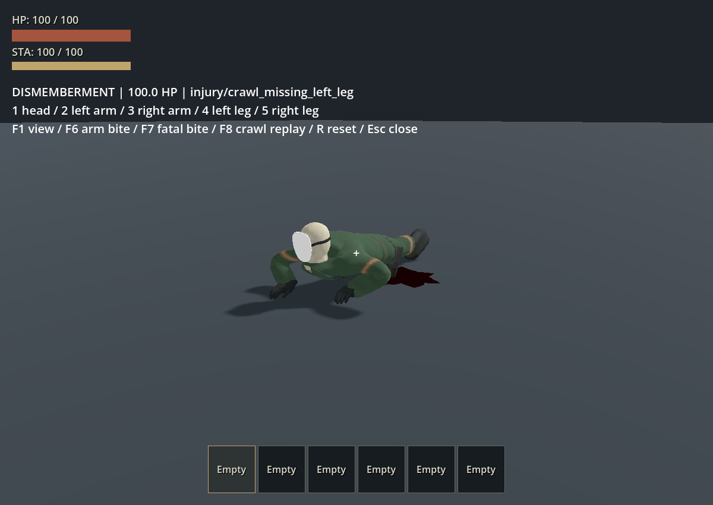
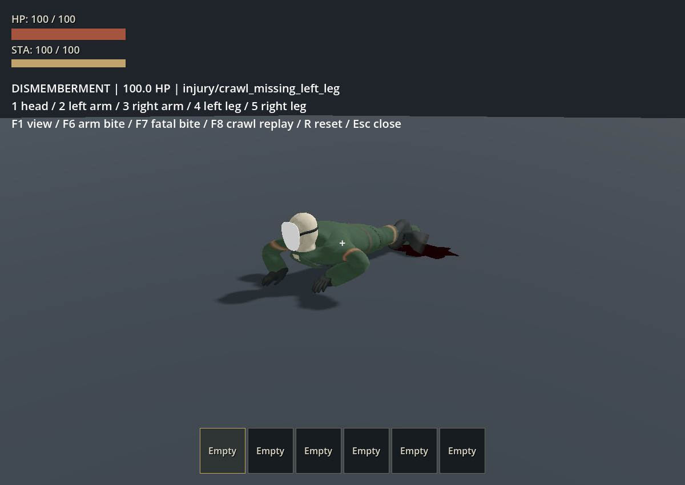
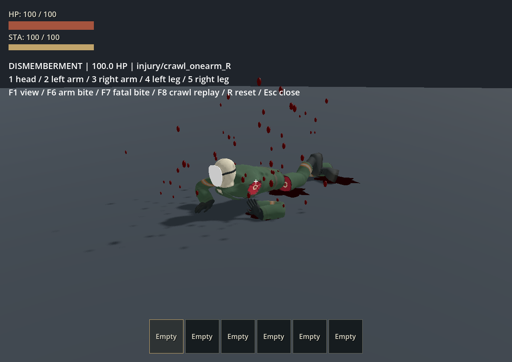
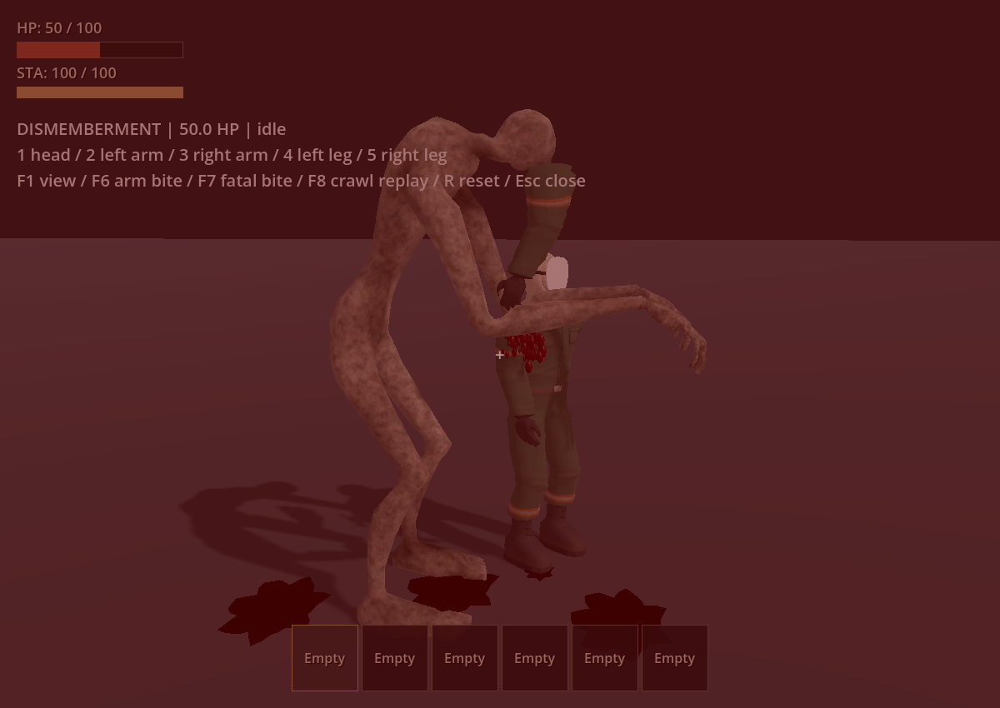
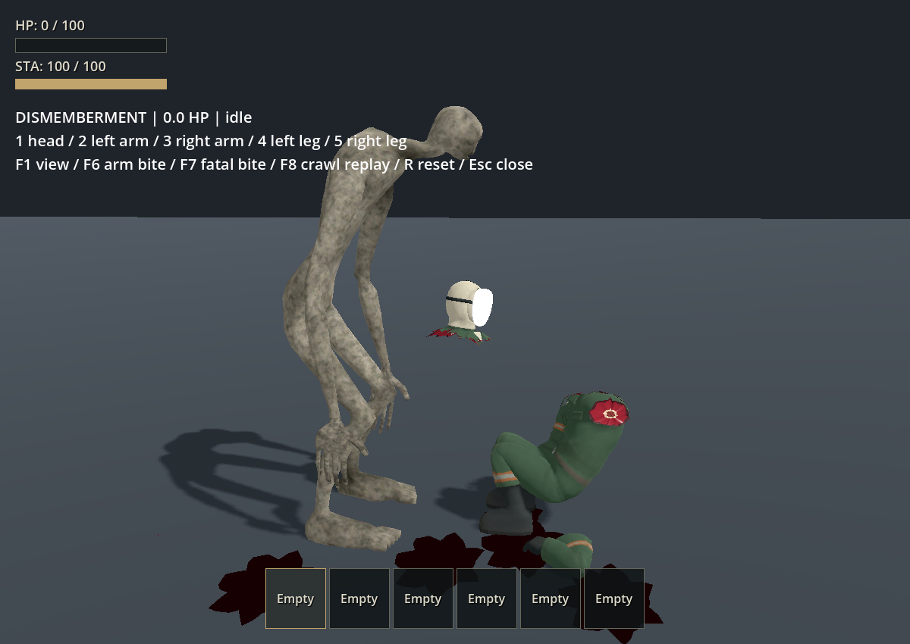
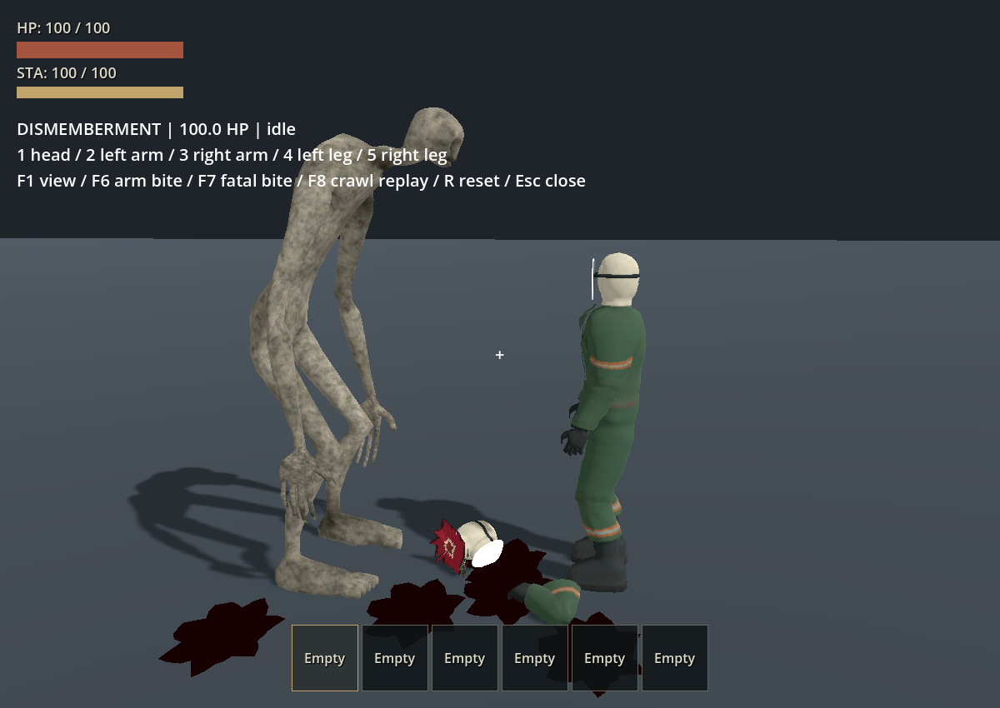

另以 computer-use 操作 `rv_climb_playground.tscn -- --replay --seat-after-climb --climb-debug`。日誌確認玩家與 Raker 都攀上車；目視確認轉彎中的 RV 上怪物保持支撐，按 F5 後車頂顯示 `DESTROYED`，怪物掉入車廂。此模式於兩者登頂後自動入座，避免抓咬先殺死玩家；初次未使用該模式時確實發生抓咬死亡，因此不能把初次畫面當成持續站在車頂的證據。最終日誌 `.godot/dismemberment-rv-climb-final.log` 無 script error，觀察後僅關閉本次測試遊戲視窗。

RV 重播是腳本移動，未重新驗證輪驅翻車、群怪、大量同時離體件或所有斜坡／階梯上的爬行接觸。這些不包含在本次畫面結論中。

## 2026-10-04 補記：抓取時依持物選擇抬手

沿用原本左手抓取高度，空手時右手採鏡像姿勢；有持物時保留握持手，只讓空手做掙扎姿勢。關閉的手電筒也算持物；大型物品暫停副手握持，解除抓取後恢復。缺失手臂不參與姿勢。

本輪 `test_player_carry` 通過（4.14 秒，`.godot/test-logs/20261004-003414-207-selected-21496/`），涵蓋空手、廢料、未開啟手電筒、大型物品、解除後恢復雙手握持及缺右臂時左手持物。`test_flashlight_grab`、`test_raker_bite_pose`、`test_raker_release_input` 亦通過（29.73 秒，`.godot/test-logs/20261004-003328-376-selected-11852/`）。

GPU 旁觀回放確認空手雙臂維持原高度；持廢料時右手握物、左手保持相同掙扎高度。兩次回放均完成，日誌 `.godot/grab-empty-hands-observer.log`、`.godot/grab-held-prop-observer.log` 無 script／shader 錯誤。此輪未重跑完整 suite 或主世界 smoke。

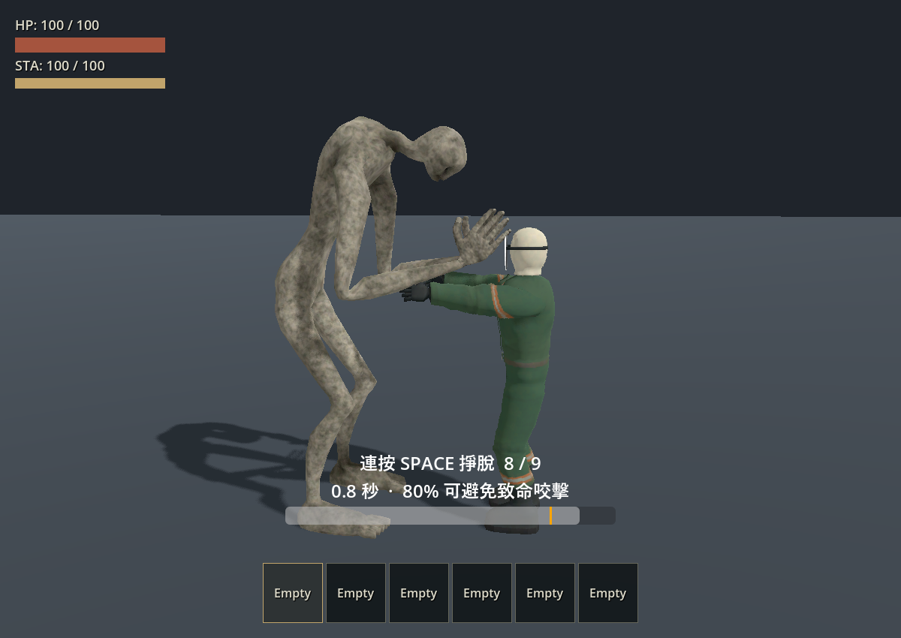
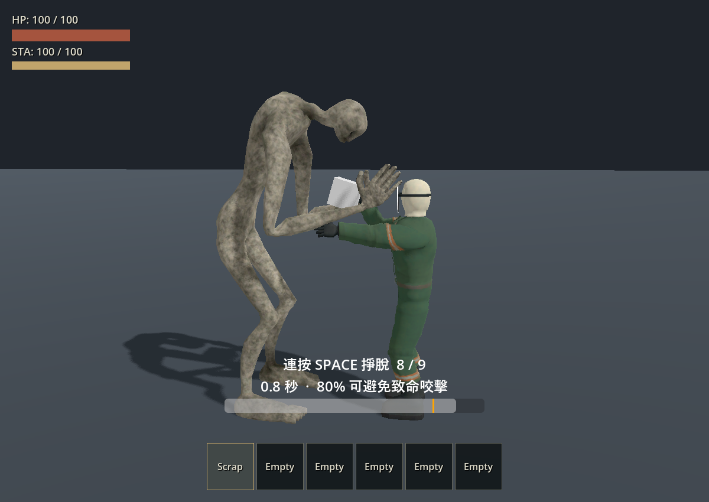

## 手動入口

開啟 [player_dismemberment_playground.tscn](../../tests/player_dismemberment_playground.tscn)：`1` 頭、`2/3` 左右臂、`4/5` 左右腿，`F1` 切換視角，`F6` 非致命咬擊，`F7` 致命咬擊，`F8` 連續爬行三秒，`R` 重置，`Esc` 關閉。

## 2026-10-04 補記：貼地匍匐

舊循環的胸腹衣料距地約 10–13 cm，手臂姿態偏向撐高身體。六段待機／爬行改為胸腹低貼、前臂交替向後拉動、剩餘腿部拖行；地面高度計入內襯、手套與靴子表面，四肢保持原骨段長度。播放速率依實際移速和手掌支撐行程換算，第一人稱眼高降至約 33 cm。

最終 `test_player_prone` 與 `test_player_dismemberment_assets` 通過（`.godot/test-logs/20261004-010333-347-selected-43180/`），`test_player_animation_skin` 通過（`.godot/test-logs/20261004-010338-204-selected-40864/`）。逐一檢查六段完整 60 Hz 循環：胸腹衣料距地 11–17 mm、其餘可見身體最低 4.5 mm、最高約 39.4 cm，骨段長度誤差小於 0.002 mm；實際移動保持接地，眼高約 0.330 m。新測試分類為 integration。`test_player_carry`、`test_player_dismemberment` 在最後衣料／靴子接地微調前通過（`.godot/test-logs/20261004-005910-281-selected-18304/`）；同輪皮膚穿地失敗已由上述最終重跑修正。

GPU `--replay --prone-review` 以低側面觀察缺左腿、缺右腿、無腿、單左臂及單右臂的待機與連續移動；畫面檢查前清除離體件，避免其遮住手臂與地面接觸。最終日誌 `.godot/prone-review-final.log`。另以 computer-use 在本次遊戲視窗按 4 進入缺腿待機、F8 連續爬行、F1 檢查低位第一人稱，確認移動後仍保持匍匐並返回低伏待機；最後只關閉該視窗。手動日誌 `.godot/prone-manual.log` 無 script 錯誤。

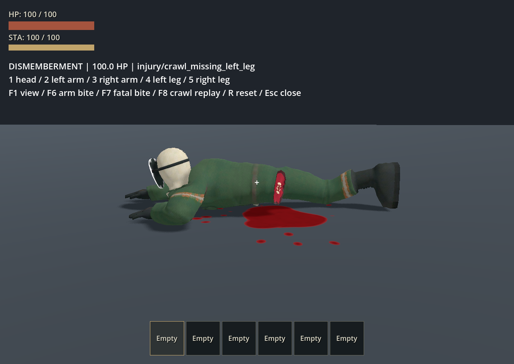
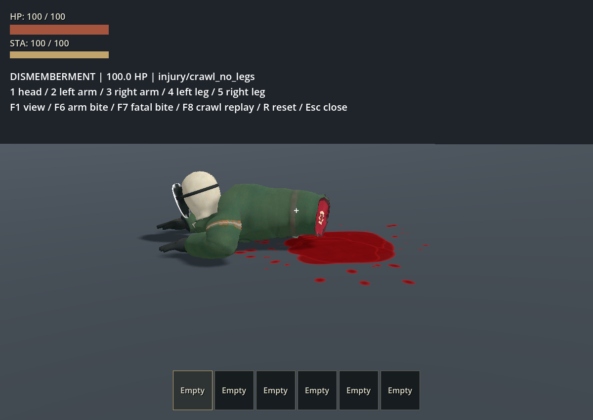
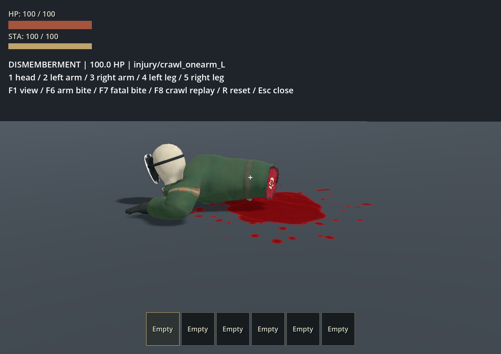

此輪驗收使用平面地板；斜坡、階梯及移動車頂未重新目視檢查，也未新增地形自適應 IK。未重跑完整 suite 或主世界 smoke。

<a id="head-camera-20261004"></a>

## 2026-10-04 補記：斷頭後的第一人稱

原本 `sever_part` 沒有保留離體頭顱，死亡鏡頭在頭骨缺失時改跟 `spine_02`，因此視點隨無頭軀幹倒下。抓取解除還會先重設眼位；駕駛座退出則會搬動角色。現在斷頭當下先保存正在使用的相機世界位置與方向，死亡鏡頭沿用這個視點，跟著獨立頭顱被銜住、釋放及落地，畫面方向保持穩定，不隨頭部翻滾。

物理準備前後使用同一頭部碰撞中心；被追蹤的頭顱只從本地第一人稱排除，保留外部顯示與陰影，復活或停止追蹤後恢復一般顯示。頭顱被清除或換世界時保持最後有效視點，避免突然跳回軀幹；玩家轉場與移除會清除追蹤。

本輪 5 套相關測試全部通過（23.33 秒）：`test_player_head_camera`、`test_player_death`、`test_player_dismemberment`、`test_raker_bite_pose`、`test_raker_grab`。日誌為 `.godot/test-logs/20261004-001130-934-selected-41104/`；新套件已分類為 integration，另一次單獨執行亦通過（`.godot/test-logs/20261004-001132-485-selected-33648/`）。涵蓋死亡前眼位保存、頭顱獨立掉落／翻滾、銜接物理不跳位、軀幹移動不牽動視點、座位交接、頭顱清除／跨世界及復活顯示恢復。未重跑完整測試或主世界 smoke；前文 15 套與 smoke 是原始功能驗收紀錄。

GPU `--replay --head-pov` 的修正前後日誌為 `.godot/head-pov-before.log`、`.godot/head-pov-after.log`，兩者回放完成且無 script／shader 錯誤。修正後落地畫面眼高約 0.16 m，跟隨頭顱而非軀幹；視角維持咬斷時朝向，不新增旋轉。頭顱被抬到嘴部時會暫時朝向上方空間，落地後可由低處看見怪物。

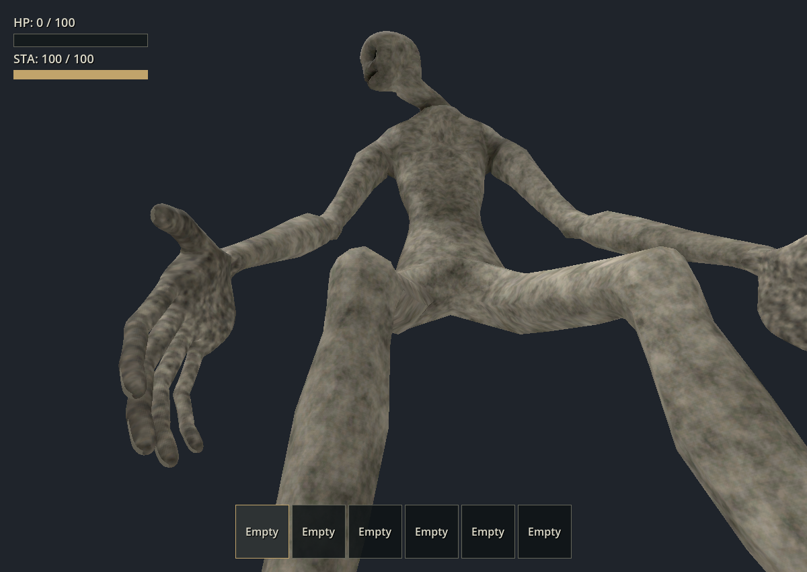

另使用 computer-use 操作專用驗收遊戲視窗：F1 進入第一人稱、F7 觸發致命抓咬，觀察到開場看臉與復活；再按 1 直接斷頭，觀察到 0 HP 的低位視角及其後恢复 100 HP。短暫銜住／落下的完整過程以上述連續 GPU 回放為依據，手動截圖未捕捉 F7 的每個死亡階段。日誌 `.godot/head-pov-manual.log` 無 script error；驗收後只關閉本次遊戲視窗。這輪沒有目視驗收移動駕駛中的斷頭或群怪場景。
