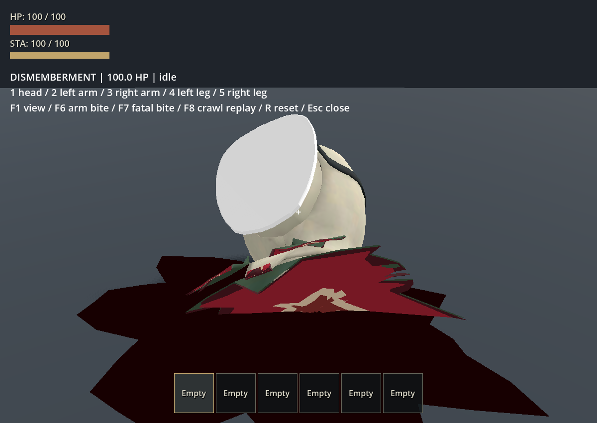
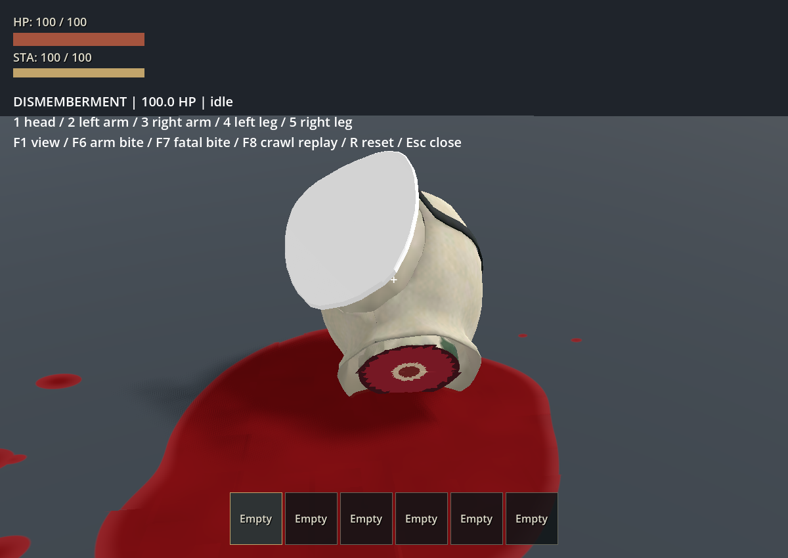
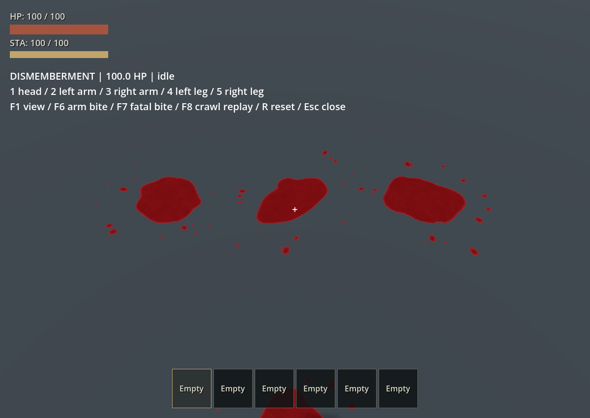
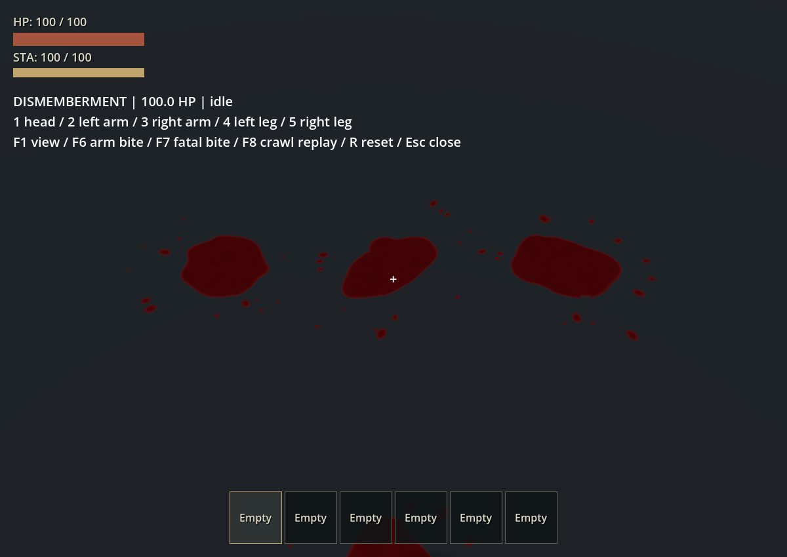

# 落地頭顱與血泊修正

2026-10-03，延續 [玩家斷肢](2026-10-03-player-dismemberment.md)；本頁為使用者指出落地頭顱破圖、血泊不自然且過黑之後的修正紀錄。

## 原因與修正

舊頭部按照三角面骨骼權重分件，頸口一路切到肩部，形成寬而凹陷的鋸齒邊。直接縮放這個邊界做封口會讓面互相穿插，另三片領口封口也擠在同一區域，頭顱翻倒後尤其明顯。

以 Blender MCP 從保留的 v020 GLB 重新切頸，在模型 Z=1.36 m 的頸部圓柱細分三角面，領口與內衣完整留在軀幹。頭部只留一組相配的頸口，邊界與原皮膚共位，肉／骨層只做 3 mm 以內的淺凹。原 16,222 面變成 16,366 面，總表面積差 0.00001021 m²，通過相對面積誤差小於 0.001% 的檢查；未替換既有骨架或動作。

舊血泊是固定 40 點尖角多邊形，底色 `Color(.12, .002, .007)` 在照明下近黑。現在以平滑液面輪廓和獨立濺滴遮罩呈現，每灘有不同形狀、旋轉及大小；紅色薄邊與較深的厚處、細微色差、低粗糙度和微法線讓它能回應光線。沒有自發光，所以暗處仍會變暗。血滴也同步改為較清楚的紅色。

血泊仍跟隨地面或 RV，維持最多 32 灘、48 秒淡出回收；以 shader opacity 淡出，已修正延遲建立 shader 屬性導致 Tween 找不到 opacity 的錯誤。

## 本次驗證

- `test_player_dismemberment` 通過：`.godot/test-logs/20261003-172850-520-selected-35692/` 中該套件；該次資產檢查的面積容差過於接近 glTF 累加精度，後續改用相對面積契約重新通過。
- `test_player_dismemberment_assets`、`test_raker_grab` 通過：`.godot/test-logs/20261003-173011-076-selected-31636/`。
- 資產檢查涵蓋單一淺頸口、表面積保存、41 骨與六動畫姿勢、手臂分離，以及頭顱落地 4 秒後的剛體形狀。落地頭顱抽樣點相對誤差約 0.000000123 m；48 秒後血泊全部清除。
- Godot Forward+ 實機執行 `--replay --gore-review`，近景檢視頭部兩側、明亮與昏暗血跡。最終 `.godot/gore-review-after.log` 無 script／shader／Tween 錯誤。
- 本次未重跑全套行為測試、輪驅或 RV 拆頂，這些結果仍屬前一驗收。

## 畫面對照

原本落地後的交疊封口：

重新切頸後，同角度落地近景：

明亮環境的三個獨立血泊：

昏暗環境仍可辨識暗紅色，沒有發光：

血泊屬貼地視覺效果，尚未做液體流體模擬或階梯邊緣的跨面流動。
