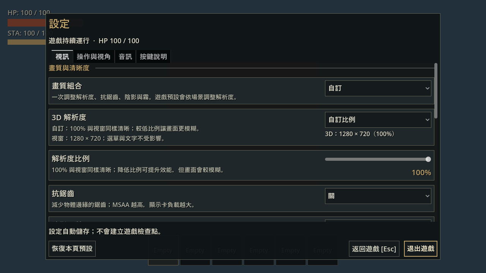
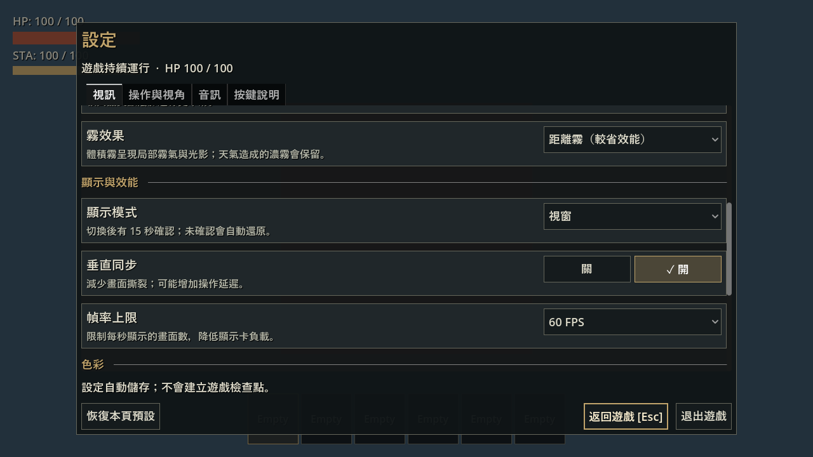

# 設定開關與解析度介面改進

日期：2026-10-03。接續 [設定選單初版](2026-10-03-settings-menu.md)；本輪處理使用者回報的「啟用開關與原始畫質、540p／720p 難理解」，不把初版驗收當作新版重新通過。

## 介面變更

- 開關改為互斥「關／開」按鈕，勾選及底色表示目前狀態；移除一直顯示「啟用」及重複的「目前」文字。滑鼠與鍵盤都可選取，重複按已選項不會取消選擇。
- 視訊分成畫質與清晰度、顯示與效能、色彩。畫質組合改稱遊戲預設、低（較流暢）、中（均衡）、高（較清晰）、自訂。
- 3D 解析度使用依場景自動／自訂比例。分開顯示視窗尺寸，以及實際 3D 尺寸和百分比，例如視窗 1280 × 720、3D 960 × 540（75%）。100% 代表與視窗同樣清晰；低比例更模糊但負載較低。
- 自動模式隱藏沒有使用的比例滑桿，並說明戶外降低解析度、室內完整解析度。摘要使用玩家所在 viewport，跟隨室內與視窗縮放。
- 沿用原本品質值、預設與保存格式；更改介面名稱不會重設既有顯示偏好。

## 自動檢查

執行 `scripts/test.ps1 -TestFilter 'test_game_settings.gd,test_settings_menu.gd' -Smoke -SkipImport -FailFast`，3/3 PASS，18.167 秒。日誌：`.godot/test-logs/20261003-162353-149-selected-25732/`。覆蓋真實滑鼠點擊、Enter 選取、互斥與重複選取、不支援的控制、比例列可見性、室內尺寸，以及主遊戲 Esc 開關。

新增滑鼠情境的首次失敗是 headless fixture 預設只有 64 × 64，按鈕位於視窗外；將 fixture 明確設為 1280 × 720，加入真實 mouse motion、局部座標及精確 hover 檢查後通過，沒有以直接發送按鈕 signal 取代輸入。

原生 `validate_settings_display.gd` 在 Forward+ 與 Compatibility 分別執行。涵蓋 1280 × 720／1024 × 600 布局、選單開啟中縮放、正式管理器建立的室內、自動完整解析度及手動 50% 標示，並保留原有後製／HUD、顯示模式確認與主音量 bus 檢查。日誌：`.godot/test-logs/settings-display/ui-native.log`、`ui-compatibility.log`；兩者 PASS。偏好均使用隔離檔。

匯入日誌 `.godot/settings-ui-import.log` 無 script error；文件相對連結及 `git diff --check` 通過。

## 桌面觀察

使用 computer-use skill，列出並選取本輪的原生遊戲視窗，未操作原本的 Godot editor。室內 fixture 的 1280 × 720 選單已實測：

- 分頁、區段、選項和底部操作正常顯示，解析度及滑桿數值清楚。
- 垂直同步從「✓ 開」點成「✓ 關」，隔離偏好檔確實變成 `vsync=false`；再選「開」恢復選取。
- 自動模式顯示室內 1280 × 720（100%），隱藏比例滑桿。
- 低畫質組合顯示 640 × 360（50%），比例滑桿重新出現，視窗尺寸仍為 1280 × 720。

人工 fixture 在 180 秒期限結束，之後確認只剩原本的 Godot editor。日誌：`.godot/test-logs/settings-display/ui-manual.log`。這是小型室內的 GUI 觀察；戶外與不同視窗尺寸的標示使用上述原生自動檢查，不混寫為人工走訪。

## PR 圖片

以下使用相同原生 GPU 驗證 fixture 擷取，僅在截圖時隱藏診斷色塊，不修改正式介面。截圖程序的原生檢查 PASS，日誌 `.godot/test-logs/settings-display/pr-capture.log`。這些圖片是自動擷取，人工操作證據另列於上方。

