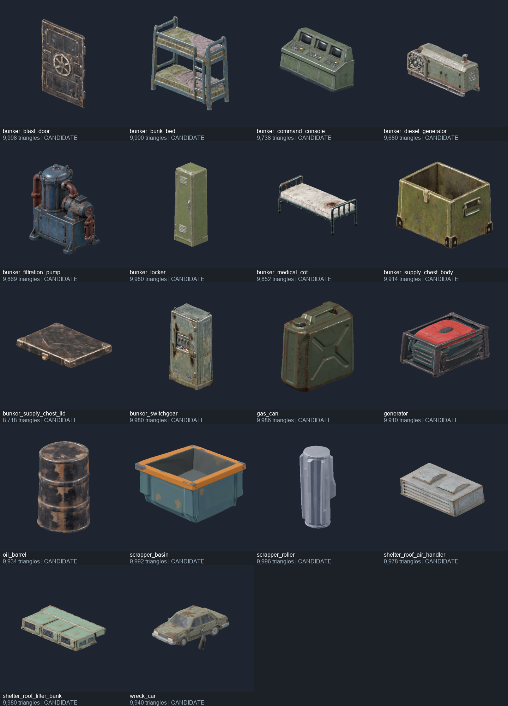

# Pixal3D API — modeling requests 試作

2026-10-04：先抓取遠端並將當前 RV 分支快轉至 `origin/main` 的 `25c69a3`，再執行本輪。原本兩個未追蹤的 settings PNG `.import` 原樣備份於 `.godot/sync-backup-20261004-pixal3d/`，SHA256 與同步後的遠端版本一致。

## 結果

本機 `http://127.0.0.1:8000` 的 Pixal3D wrapper 可處理 [現有 16 份需求](../modeling/requests/) 的參考圖。使用 `standard1024`、seed 42，共提交 18 項工作，全部成功，下載後逐檔核對 API SHA256。補給箱分為箱體／箱蓋；碎料機分為靜態盆體／可重複使用的滾輪，沒有將活動零件烘成同一個模型。

每個原始 GLB 均為 1 mesh、1 material、3 張內嵌貼圖。總原始 GLB 約 66.3 MB；每件 8,718–9,998 個三角形。API 工作從 started_at 到 updated_at 的耗時為 40.2–131.1 秒，合計約 19.5 分鐘，包含 wrapper 等待／檢查時間，不能視為純 GPU 推論時間。



## 交付與重現

每份 request 直接更新完成情況與來源連結，沒有另建進度 queue 或模型狀態 manifest。各 `art_source/<name>/` 保留原始 GLB、generation JSON、SHA256、候選變換資料與六方向渲染；`.gdignore` 避免將來源副本重複匯入。`assets/models/<name>/*_candidate.glb` 是尺寸／原點整理後的候選，保留 Godot 產生的貼圖與 `.import` 設定。

- [API 提交／收取腳本](../../scripts/generate_request_model.py)：multipart POST、idempotency key、保存各資產 metadata、收取並核對 SHA256；使用 Python 標準函式庫。現有 job 重送會復用，失敗後若要新版本須先保存舊 metadata。
- [候選整理腳本](../../scripts/prepare_request_model.py)：使用 NumPy，僅接受單節點、單靜態 triangle primitive；估計軸向、依 request 非等比縮放並烘入頂點，同步轉換 normal／tangent。保留 UV 和貼圖，不做拓撲修補、rig 或動畫。
- [Godot 檢查腳本](../../scripts/review_request_model.gd)：六方向渲染及讀取正式匯入 PackedScene，核對包圍盒尺寸／原點。各資產 README 有實際參數與參考圖。

```powershell
godot --headless --editor --path . --import --quit --log-file .godot/pixal3d-final-import.log
godot --headless --path . --log-file .godot/pixal3d-import-validation.log --script scripts/review_request_model.gd -- --validate-imports
godot --path . --rendering-method gl_compatibility --resolution 720x720 --log-file .godot/pixal3d-candidate-review.log --script scripts/review_request_model.gd -- --all
```

## 本輪檢查與觀察

- 本機 API／ComfyUI health、提交、狀態、result 及下載完成；18/18 成功，最後排隊數 0。
- Godot 4.7.2 正式匯入完成；18/18 PackedScene 成功載入，尺寸與原點符合候選整理紀錄。驗證日誌為 `IMPORTED_CANDIDATES_OK count=18`，無 script／資源錯誤。
- 18 個候選各保存正面、斜視、背面、側面、上面及下面渲染。已檢視全部斜視圖，另檢查油桶軸向、櫃子前後面、事故車底盤、盆體凹腔及分離的箱蓋／滾輪。貼圖與主要幾何能顯示。
- 原始油桶有傾斜，候選已整理為 Y 向上；櫃子偏航另調 90°，使門把面朝 +Z；RV 發電機另調 -90°，使通風面朝 +Z、風扇朝 -X。朝向估計及包圍盒配合不是逐面美術驗收，非等比縮放可能改變比例。
- 初次渲染遇到同步後的 Godot global class 快取未更新；重做 editor import 後消失。沙箱曾阻擋使用者快取／憑證讀取，無沙箱重跑的最終 import 與 validation 無該錯誤；不將初次結果當作最終通過紀錄。
- Python 腳本語法檢查通過；實際工作已驗證提交、復用既有油桶 job、下載校驗、候選整理與渲染路徑。

## 尚未驗收

API 能產出可匯入的候選，尚不能直接完成 request 的全部遊戲接口。正式 `.tscn`、碰撞、互動、導航與保存程式均未替換，所以沒有執行玩法回歸或手動遊戲測試；本輪渲染觀察只涉及模型。未使用 Blender，也未新增或改動本機 API 程式。

事故車側面生成了參考圖沒有的懸垂幾何；只有單一材質，未分離烤漆／玻璃／金屬／輪胎，不符合 `RoadsidePaint` 接口，需要清理及材質分區。箱蓋尚未掛到 `LidPivot`，沒有驗證鉸鏈、閉合間隙與搜尋動畫。碎料機開口／內高及兩滾輪配合未驗收，既有 CSG 節點型別與旋轉接口仍待整合。EXIT、編號等可讀文字需保留 wrapper 的 Label3D，不能依賴 diffuser 貼圖。

各資產的原始參考圖、生成來源與未核對的權重／輸出授權，記錄在該資產的 README。
