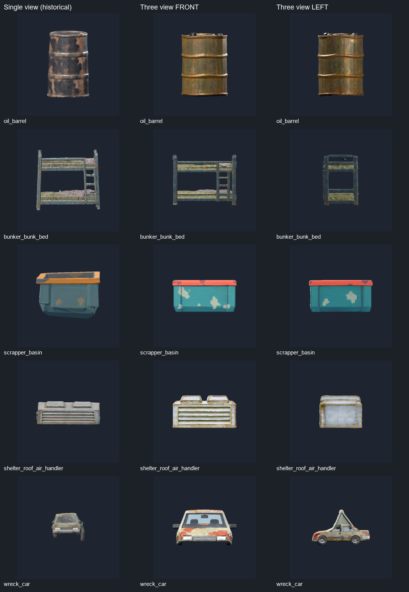

# Pixal3D 三視圖：五件重測（2026-10-04）

本輪依使用者縮小範圍，只重測油桶、雙層床、碎料機靜態盆體、屋頂空調及事故車，共 **5 個 API job**；使用本機 `threeview1024`、seed 42。5/5 生成與 Godot 匯入成功，**不代表 5/5 幾何合格**：盆體空腔消失、事故車尖頂與短車身明顯不合格。其餘三件沒有明顯整體傾斜，但仍有局部軟化及尺寸差異，尚未達正式交付要求。

修改前已 `git fetch origin`，確認 PR 分支與遠端同為 `c812174`，最新 main 為 `25c69a3`。本輪更新原 PR #22；保留 [18 件單視圖歷史結果](2026-10-04-pixal3d-requests.md)，沒有重做其他 13 件輸出，也沒有替換正式場景。

## 本次修正

- [提交工具](../../scripts/generate_request_model.py) 支援 `threeview512/1024`；`--variant threeview` 分開保存本次 metadata 與原始 GLB，不覆寫舊結果。新增 3:1 圖片比例檢查，仍須人工確認三格內容及 front → left → back 順序。
- [整理工具](../../scripts/prepare_request_model.py) 預設保留來源 +Y 向上、+Z 正面，使用單一比例包含於設計尺寸，不再用最小包圍盒猜軸向、逐軸拉伸。舊流程重現須明確指定 `--alignment estimated --fit stretch`。每份 preparation JSON 同時記錄設計尺寸、實际尺寸及比例差異。
- [渲染工具](../../scripts/review_request_model.gd) 的 front / side / back 改成零仰角正交相機，支援只選三視圖候選，並修正渲染失敗後可能被外層覆寫退出狀態的問題。
- 油桶採 API 專案現有三視圖輸入；另外四件以內建 imagegen 依現有設計產生 front / left / back。初版有物件跨格，經圖像工具縮小、重新定位後，確認各物件完整收在自己的三等分區域內才提交。最終 PNG 在各 request 旁，提示詞與來源紀錄在各 `art_source/<name>/threeview/`，沒有使用舊歪模型渲染當作新輸入。

## 本輪實際輸出

下表是 **等比整理後的實測 AABB**，不是宣稱已滿足 request 設計尺寸；耗時取 API `elapsed_seconds`，包含 wrapper 流程。

| 需求 | 實際 X × Y × Z（m） | 三角形 | API 耗時 |
|---|---|---:|---:|
| [oil-barrel](../../docs/modeling/requests/oil-barrel/oil-barrel.md) | 0.6592 × 0.9022 × 0.6565 | 9,966 | 74.2 s |
| [bunker-bunk-bed](../../docs/modeling/requests/bunker-bunk-bed/bunker-bunk-bed.md) | 1.5924 × 1.2682 × 0.9000 | 9,994 | 96.6 s |
| [scrapper](../../docs/modeling/requests/scrapper/scrapper.md) | 1.0500 × 0.5242 × 1.0461 | 10,000 | 62.4 s |
| [shelter-roof-air-handler](../../docs/modeling/requests/shelter-roof-air-handler/shelter-roof-air-handler.md) | 3.9452 × 2.0000 × 2.6398 | 9,996 | 76.3 s |
| [wreck-car](../../docs/modeling/requests/wreck-car/wreck-car.md) | 2.4400 × 1.3583 × 2.2200 | 9,986 | 88.4 s |



左欄是舊單視圖候選的歷史渲染（相機約 6.8° 仰角），中、右欄是本輪零仰角正面與左側。每件相機各自按最大包圍盒尺寸構圖，圖中大小不能直接比較公尺尺寸。所有新候選另存六方向圖，可由下面來源開啟；沒有以接近平視的正面圖掩蓋側面缺陷。

## 逐件觀察

| 資產／六方向證據 | 本輪觀察與判定 |
|---|---|
| [油桶](../../art_source/oil_barrel/threeview/README.md) | 桶身整體直立，側面沒有明顯整體斜倒；桶箍、桶蓋仍有局部波浪，頂部生成多個塞口。高度 0.9022 m，設計 1 m；標籤朝向與拾取接口未验收。 |
| [雙層床](../../art_source/bunker_bunk_bed/threeview/README.md) | 主柱大致直立、橫桿大致水平，兩層與梯架可讀；局部接點軟化，側面有凸起。高度僅 1.2682 m，設計 1.85 m，比例尚不合格，不能用拉伸掩蓋。 |
| [碎料機盆體](../../art_source/scrapper/threeview/README.md) | **不合格**：頂部被生成为封閉面，沒有需求的 0.91 m 開口及空腔；底部也不能證明正確內高／底板。水平相機看不到內部，純三視圖提供不足的內腔證據。滾輪未重做。 |
| [屋頂空調](../../art_source/shelter_roof_air_handler/threeview/README.md) | 主箱體底面與正面整體保持水平、兩個頂罩可辨；百葉與箱邊仍有局部變形。保持等比後寬 3.9452 m，設計 6 m，深 2.6398 m，設計 4 m，尚未滿足比例。 |
| [事故車](../../art_source/wreck_car/threeview/README.md) | **不合格**：側面車頂成三角尖峰、擋風玻璃伸高，車長被壓成 2.2200 m（設計 4.73 m）。車頭仍為 +Z、四輪及底盤有輸出，但不能接入場景；單材質也未符合 RoadsidePaint 分區接口。 |

正面、側面、背面及上下方向均已檢視。上述是實際渲染觀察，沒有做幾何平面角度量測，因此「大致直立／水平」不是工程精度證明；沒有宣稱所有模型已拉直。

## API 預處理的限制

本輪讀取 `C:/Users/evan4/Apps/Pixal3D-API/app.py`、`workflows/threeview1024.json` 及原生 `nodes_trellis2.py`、`nodes_images.py`，並核對 live OpenAPI。三視圖必須由呼叫方提供；API 只按 `floor(width/3)` 切圖，再各自去背景、以 mask 包圍盒裁切／正規化後送入三個 camera sockets。

原生多視圖要求各視角保持相同實體比例、相同 camera distance/FOV；目前每格各自依前景長邊縮放，長形物件的正面与側面會產生不同縮放倍率。官方保存 workflow 也採相同單圖 crop 正規化，因此不是只由 wrapper 新增的步驟。**據此推測**，事故車窄正面和長側面的尺度不一致是尖頂／短車身的重要原因；這尚未以替代預處理 A/B 實驗證明。原輸入留更多空白無法解決，因為 mask crop 會移除空白。

後續若要再測長形模型，應先讓多視圖前處理共享縮放尺度，保持不同投影的相對大小，再重新驗證。空腔另需提供能顯示內部的建模證據或可編輯幾何；不能把閉頂的盆體當作完成。這次未修改 Apps 內 API、重啟服務或提交第六個模型。

## 實際驗證

- API 5/5 工作 `succeeded`，每次下載 SHA256 與 API 驗證吻合；最後 health ready、queued=0。
- Godot 4.7.2 正式匯入成功，正式 PackedScene 載入與實際尺寸／原點核對為 `IMPORTED_CANDIDATES_OK count=5`；最終 import、validation、review 日誌沒有 script／資源錯誤。
- 5 份候選 rotation rows 都為 identity、XYZ scale 相等；逐頂點核對 `candidate = raw * scale - pivot + offset`，確認整理過程保留原比例，原始 GLB 與 metadata 不覆寫。渲染檔與候選 SHA256 一致。
- 單視圖 PNG 搭配三視圖 preset 被 CLI 拒絕（exit 2），没有建立新 job；參考圖排版仍需人眼檢查。
- 缺少模型的渲染負例正確以 exit 1 退出；Python 語法、467 個文件相對連結、`git diff --check` 檢查通過。只改動資產與建置工具，未進行玩法回歸、手動操作或 Blender 檢查。

重現檢查（每件生成／整理命令見來源 README；NumPy、Pillow）：

```powershell
godot --headless --editor --path . --import --quit --log-file .godot/pixal3d-threeview-import.log
godot --headless --path . --log-file .godot/pixal3d-threeview-validation.log --script scripts/review_request_model.gd -- --validate-imports threeview
godot --path . --rendering-method gl_compatibility --resolution 720x720 --log-file .godot/pixal3d-threeview-review.log --script scripts/review_request_model.gd -- --all threeview
```
